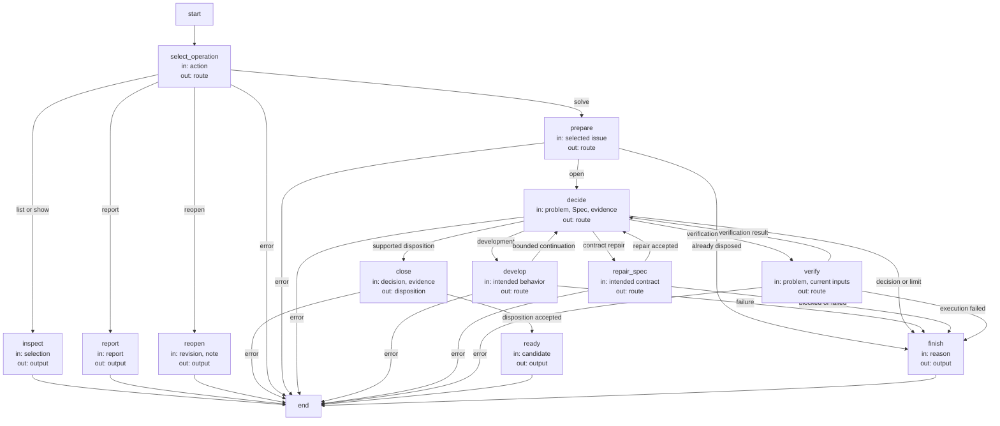
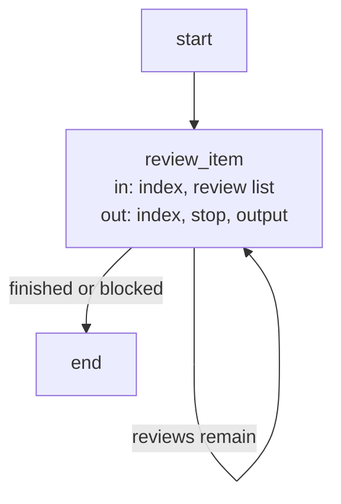

# Issues execution and record contracts

These are the precise implementation agreements and executable Graph specifications owned by the
[Issues Module](module.md). Explanatory topics introduce their purposes; exact identities, limits
and transitions are retained here as the single detailed contract.

## Terminology

| Term | Meaning / definition |
| --- | --- |
| [Issue](../concepts.md#terminology) | Defined in Concepts for reading Concorde. |
| [Blocker](../concepts.md#terminology) | Defined in Concepts for reading Concorde. |
| [Candidate](../concepts.md#terminology) | Defined in Concepts for reading Concorde. |
| [Evidence](../concepts.md#terminology) | Defined in Concepts for reading Concorde. |
| [Disposition](lifecycle.md#terminology) | Defined in Solving a recorded problem. |
| [Worker](../concepts.md#terminology) | Defined in Concepts for reading Concorde. |
| [Host](../concepts.md#terminology) | Defined in Concepts for reading Concorde. |
| [Grant](../concepts.md#terminology) | Defined in Concepts for reading Concorde. |
| [Spec context](../harness/context.md#terminology) | Defined in What information a worker receives. |
| [Spec](../concepts.md#terminology) | Defined in Concepts for reading Concorde. |
| [Ready](../concepts.md#terminology) | Defined in Concepts for reading Concorde. |
| [Delivery](../concepts.md#terminology) | Defined in Concepts for reading Concorde. |
| [Worktree](../concepts.md#terminology) | Defined in Concepts for reading Concorde. |
| [Graph](../concepts.md#terminology) | Defined in Concepts for reading Concorde. |

## Issue records and reporting {#issues-issue-records-and-reporting}

Issues are branch-local problem records, not implementation tasks or graph-control signals. A
reporter classifies a concrete observation as `bug`, `gap` or `limitation`. A bug is a defect,
vulnerability or failure; a gap is an implementation/Spec mismatch, a conflict between Specs, or
a missing necessary contract; a limitation is an internally consistent current behavior whose
operation or usability is insufficient. Prefer gap when an explicit consistency conflict is the
subject of the report. Only gap has a subtype: `implementation-spec-mismatch`, `spec-conflict` or
`missing-contract`. Classification may change with new evidence without replacing the issue.

The Issue store retains its stable document and entity identities through transfer to the Issues
Module; the legacy identity spelling does not preserve a triage API. It owns durable observations and disposition history under `.concorde/issues/`.
Reports contain a title, description, impact, basis, admitted evidence locations and the known
contract owner's Module identity, or null when unknown. The trusted caller supplies invocation,
agent, operation, phase, reporting target, context digest, optional change and HEAD. Reporting
context and contract ownership remain distinct. Creating a record does not require a managed change,
a reproduction verdict, an investigation plan, a repair proposal or human approval.

### Store boundary {#issues-store-boundary}

`concorde-issue-report@1` and `concorde-issue-receipt@1` publish the report and receipt shapes
below. `report_issue(root, report, source)` accepts the closed shapes in the issue model. The host, not a
worker parameter, supplies `source`. `report_key` is a reporter-local stable key for retrying the
same observation. `type`, nullable `subtype`, `title`, `description`, `impact`, `basis`, nullable
`owner_target_id`, and `evidence` are required; each evidence item has `path` and `description`.
Strings are nonblank and paths are canonical project-relative POSIX paths. `issue_id` and
`expected_revision` are either both absent for creation or both present for appending an observation.
The caller must separately enforce evidence visibility and reporting authority; a syntactically
safe path is not a grant. Repository validation parses every active Issue, rejects corrupted
records with `CONCORDE-ISSUE-001`, and includes record byte digests in its source identity. Historical
provenance does not require a former owner to remain in the current registry. Reports are limited
to 64 KiB of canonical JSON and records to 16 MiB.
Reference evidence instead of copying large logs or secrets.

An identity has the form `I-` followed by 32 lowercase hexadecimal characters. The host allocates
it from the trusted unique invocation identity and report key without a branch-local counter.
The returned receipt is `{issue_id, report_id, path}`. `report_id` binds the exact accepted report
and its host-issued provenance. The receipt refers to that immutable observation even if a later
report reclassifies the issue or its disposition changes. Repeating identical input returns the
same receipt; reusing a key with different input fails without replacing the earlier observation.
Similarity alone never merges reports. An explicit append targets one existing open issue and
requires its current exact-byte SHA-256 revision; a completed append's retry remains idempotent.

`read_issue(root, id)` returns the record and its current byte revision. `list_issues(root,
target_id=None, status=None)` returns metadata, optionally filtered by reporting target or current
known owner and by open/closed state. Reads of an absent collection return an empty list and create
nothing. Unknown identities, malformed records, mismatched digests and symlink paths are rejected.
`resolve_report(root, receipt)` retrieves the immutable observation rather than silently using the
latest issue description. These host library operations neither launch a model nor execute Git.

Each UTF-8 Markdown file has an identity heading and a single JSON fence containing the version-2
record: `id`, `status`, `reports`, `dispositions` and `schema_version`. The JSON is the sole record
content, not a duplicate prose projection. A report stores its id, timestamp, report payload and
source. Dispositions preserve reason, note, evidence references, actor, timestamp and nullable
duplicate target. Record status must agree with disposition history. Editing an immutable report
without reconciling its digest is invalid; append new observations instead.

Schema 2 uses `operation` in host-issued provenance. Historical schema-1 records retain the old
`capability` storage field and remain readable, with their exact bytes, identities and observation
digests unchanged. This is historical evidence support, not a current wire alias. Append,
disposition, rendering as current data and disposition recovery refuse schema 1 with
`unsupported_issue_version`. To continue work, explicitly create a new current Issue with evidence
referencing the historical record; do not rewrite old observations or claim they were resolved.
Unknown versions and corrupted historical records remain invalid.

### Worker reporting service {#issues-worker-reporting-service}

`IssueReporter` binds the project root, source identity, admitted contract owners, evidence paths
and explicitly selected issue identities before a worker starts. The `report_issue` worker tool
sends only a report and receives `{receipt, revision}`: the immutable observation receipt plus the
current record byte digest, so an admitted follow-up can supply `expected_revision`. The receipt
identity stays unchanged on an identical retry; the current revision may change after later reports
or dispositions. It cannot supply provenance, choose a
filesystem root or change issue disposition. An owner outside the admitted Spec context or an
evidence path outside the phase's admitted Spec/code/change locations is refused. Unknown ownership
is represented by null. A worker may append only to an explicitly admitted issue or one it already
reported in the same invocation. Helper children return observations to their parent for verification
and do not receive the reporting tool.

Reporting is nonterminating and has no implicit effect on the stage outcome. In particular, a
worker can report multiple nonblocking gaps and still complete its task. Final blockers and review judgments reference immutable receipts; their task-local effects remain
separate from the problem content and disposition. A pure question can explicitly report an Issue without receiving code or Spec write
authority; a query of stored Issue metadata and a policy preview do not create observations.
Already accepted reports survive malformed final results, process failure, cancellation and time
limits. The host emits `issue_reported` receipts even when the worker fails; these events do not
establish stage completion. The host never rolls back accepted reports merely because a later
`submit_result` fails.

### Persistence and concurrency {#issues-persistence-and-concurrency}

A host-local file lock under `.concorde/runs/` serializes read-modify-write transactions in the
current worktree. A staged file is flushed and atomically renamed, and the containing directory is
synced before success is acknowledged. A write failure is not reported as success; after an
uncertain acknowledgement the same key may be retried safely. Current-byte checks reject stale
appends and dispositions instead of overwriting concurrent changes. Query operations do not take
creation locks or create directories. Record writes do not set candidate phase, task outcome,
validation evidence, review results or gap resolution.

The issue files are ordinary Git-versioned project records. Separate worktrees or clones retain
independent records until changes are explicitly integrated. Reports from independent invocations
have distinct identities; no mutable high-water index creates a cross-branch allocation conflict.
Closing a record in a candidate means solved or disposed in that branch, not in primary. A success
receipt establishes persistence in the worktree, not a Git commit, backup or completed delivery.

### Disposition boundary {#issues-disposition-boundary}

`dispose_issue(root, id, expected_revision, reason=..., note=..., evidence=..., actor=...,
duplicate_of=None, duplicate_revision=None, created_at=None)` is a trusted host operation, not part
of the worker reporting authority. The optional timestamp is issued by the host when it prepares
exact transaction bytes; it is not a worker-supplied report field.
The caller must authorize disposition and assess the evidence before calling. The store validates
current record bytes, a nonempty note, at least one evidence reference, the actor and a valid
transition. Reasons `resolved`, `duplicate` and `not-actionable` close an open record; `reopened`
reopens a closed record. Duplicate requires another existing open canonical issue; a supplied duplicate revision is
rechecked inside the same lock as the disposition, and solving always supplies that revision. Other reasons
cannot carry a duplicate target. Closed records and all their observations remain present.

`disposition_record(record, ...)` prepares and validates a copied record without writing. The
solving host uses its exact timestamp/content for a write-ahead journal and subsequent publication.
`restore_issue(root, id, original_bytes, expected_revision)` is a separate trusted recovery
operation: under the same store lock it restores a valid open before-image only over the exact
expected closing revision, or does nothing when that before-image is already present. Other bytes
are stale, not permission to overwrite. The caller must bind both images and their digests to its
own pending transaction and invalidate any readiness receipt before restoring. Neither helper is
an agent tool or a general-purpose record editing grant. See [recovery](scenarios.md#scenario.issues.disposition-recovery).

The store cannot establish semantic truth from an evidence string. Merely not reproducing once,
using a workaround, writing code without validation or completing an unrelated task is not a
resolution. Disposition never substitutes for required review or final candidate verification.
An authorized solving graph may make evidence-grounded dispositions without mandatory human
approval; genuinely unresolved design or product decisions remain for the developer. Solving-graph
admission and verification are separate from this storage boundary.

### Precise specifications {#issues-precise-specifications}

The Issues Module owns the exact obligations and interface details in [scenarios](scenarios.md).
These companions are part of the same complete Module specification, not separate topic owners.

## Issue solving lifecycle {#lifecycle-issue-solving-lifecycle}

One solve request selects one Issue and freezes its exact byte revision before preparing work. A
new host-created candidate receives exactly that selected record, even if it is not yet committed;
other local changes are not copied or committed. The existing fresh-session handoff remains
mandatory. The owning session resumes in that candidate. Current-worktree bookkeeping operations
never create candidates. Repeating solve on an ordinarily closed Issue reports its existing
disposition, but a candidate-local pending disposition must be recovered before that fast path.

The solver receives the problem and impact plus its complete Module Spec. It chooses ordinary
development, a fresh Spec repair, Issue-specific verification, a reasoned disposition or a precise
need for a developer decision. No mandatory triage, reproduction pass or separate investigation
plan precedes every repair. A bug with enough information can go directly to development; a
code-free Spec gap can be repaired without an implementation investigation. Decisions do not
acquire another Module's context or permissions.

The first development intent is retained for the candidate. It becomes the `concorde-issue-intent`
stage artifact for ordinary authoring, assessment, planning, tasks and implementation; it contains
only intended behavior. A later incompatible intended change requires a new decision instead of
silently reusing old plans. An admitted `spec-repair` runs the ordinary owner-only author, then
returns to fresh development or Issue-specific verification. Decision actions map explicitly to
declared graph nodes; `spec-repair` selects `repair_spec`, not a name inferred by punctuation
replacement. Failed/incomplete child execution stays failed; a reported blocker
can select a bounded next decision. Six decision invocations is the limit per unchanged input
state, counted before launch, with history retained even after cancellation. A fresh external
Spec/code change permits a new bounded attempt. No unbounded nested Issue repair is implied.

Resolution requires fresh Issue-specific independent Spec review and, for a code-owning Module,
code review. A successful unrelated check, single non-reproduction or workaround is not enough.
`duplicate` requires an explicitly admitted current open candidate, with semantic equivalence
explained by the solver. `not-actionable` requires a contract-grounded rationale. These dispositions
need no mandatory human approval. Unsettled product/design choices use `needs-decision` and preserve
the open Issue; execution errors and iteration limits remain distinguishable.

A disposition is written before final ordinary validation. Before publishing that write, the host
saves and syncs a candidate-local write-ahead journal with the change/Issue identities, exact open
before-image, exact intended closed after-image and both byte digests. The prepared timestamp is
reused for publication so a lost write acknowledgement cannot make the after-image unknowable.
The journal remains pending until final validation and the completed checkpoint are saved together.
It is host bookkeeping, never worker input, an implementation grant or a second problem record.

A retry in the owning worktree checks the journal before considering an Issue already closed.
Only the journal's exact before- or after-image is admitted for recovery; the original frozen
selection may be retried across this own write. The host first invalidates any old ready receipt,
then restores its exact before-image under the Issue-store lock, clears stale verification and
continues through fresh solving and validation. Already-restored bytes are a no-op, so a second
interruption during rollback remains recoverable. Attempt counts are retained unless the normal
changed-input or explicit-clarification rule resets them. Recovery never creates another candidate
or moves into another worktree. An older unfinished solver close with no trustworthy journal is
rejected for explicit reconciliation rather than guessed complete or rolled back speculatively.

Ready evidence includes the disposition and all required candidate checks/reviews. On failed final
validation the runtime restores only its own unchanged Issue write, leaves implementation progress
inspectable and does not claim ready. A corrupt journal or a concurrent Issue edit prevents
restoration and is reported rather than overwritten, including an independent developer reopening.
A lost completion checkpoint after validation still requires recovery, not an already-closed success.
Candidate-local completion does not mean primary was changed; delivery remains separately authorized.

### Design {#lifecycle-design}

#### Issue Graph (`issue_graph`) {#lifecycle-issue-graph-issue-graph}

State: `route`, `output` and the guarded failure `result`. Selected record bytes, decision count, intended behavior and current
verification are bound by the host; durable attempt history belongs to the candidate.

| Node | Executes | in | out |
| --- | --- | --- | --- |
| `select_operation` | Deterministic action selection. | action | route |
| `inspect` | Deterministic record lookup. | selection | output |
| `report` | Deterministic scoped reporting. | report | output |
| `reopen` | Deterministic explicit reopening. | revision, note | output |
| `prepare` | Deterministic selection, pending-disposition recovery and attempt binding. | selected issue | route |
| `decide` | One fresh Issue solver invocation. | problem, Spec, evidence | route |
| `develop` | Ordinary [Development Graph](../dev-loop/module.md). | intended behavior | route |
| `repair_spec` | Ordinary owner-only [Spec Authoring](../spec-authoring/module.md). | intended contract | route |
| `verify` | Fresh Issue-specific reviews. | problem, current inputs | route |
| `close` | Deterministic write-ahead journaling and disposition with stale checks. | decision, evidence | disposition |
| `ready` | Final validation including disposition bytes. | candidate | output |
| `finish` | Deterministic stopped or already-completed response. | reason | output |

#### Issue verification Graph (`issue_verification_graph`) {#lifecycle-issue-verification-graph-issue-verification-graph}

Verification uses a bounded review list: Issue-specific Spec/code questions first, then the ordinary
candidate review intents required for final readiness. Code-free Modules need only Spec review.
The distinction preserves both targeted verification and the ordinary source/consumer freshness
gates; a private targeted review cannot replace another task's required review. Each item is a
separate [Review Module](../review/module.md) operation invocation, and a blocked or failed item prevents dependent items.

State: `index`, `stop` and `output`. The host owns the finite list and its review input bindings.

| Node | Executes | in | out |
| --- | --- | --- | --- |
| `review_item` | One ordinary Review operation for the selected mode and intent. | index, review list | index, stop, output |

### Precise specifications {#lifecycle-precise-specifications}

The Issues Module owns the exact obligations and interface details in [scenarios](scenarios.md).
These companions are part of the same complete Module specification, not separate topic owners.
