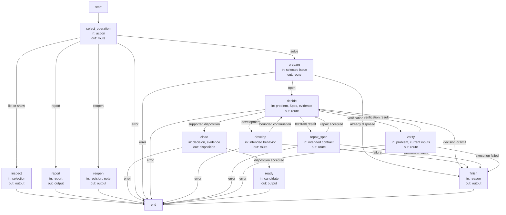
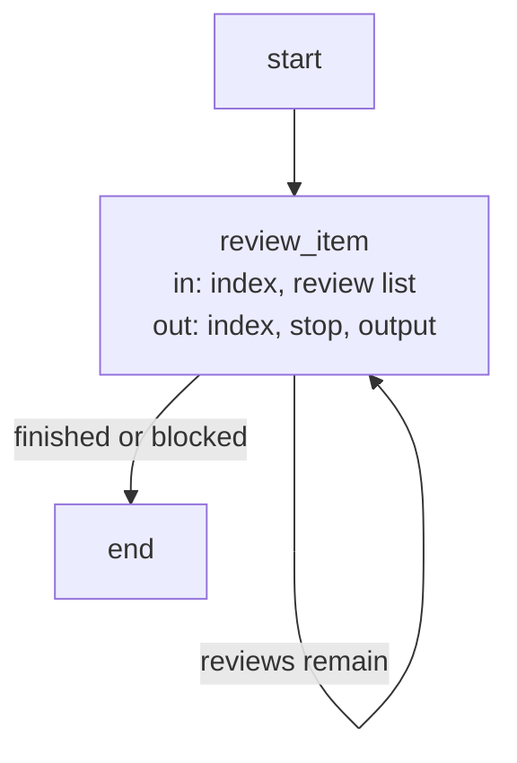

# Issue solving lifecycle

One solve request selects one Issue and freezes its exact byte revision before preparing work. A
new host-created candidate receives exactly that selected record, even if it is not yet committed;
other local changes are not copied or committed. The existing fresh-session handoff remains
mandatory. The owning session resumes in that candidate. Current-worktree bookkeeping operations
never create candidates. Repeating solve on an ordinarily closed Issue reports its existing
disposition, but a candidate-local pending disposition must be recovered before that fast path.

The solver receives the problem and impact plus its complete Module Spec. It chooses ordinary
development, a fresh Spec repair, Issue-specific verification, a reasoned disposition or a precise
need for a developer decision. No mandatory triage, reproduction pass or separate investigation
plan precedes every repair. A bug with enough information can go directly to development; a
code-free Spec gap can be repaired without an implementation investigation. Decisions do not
acquire another Module's context or permissions.

The first development intent is retained for the candidate. It becomes the `concorde-issue-intent`
stage artifact for ordinary authoring, assessment, planning, tasks and implementation; it contains
only intended behavior. A later incompatible intended change requires a new decision instead of
silently reusing old plans. An admitted `spec-repair` runs the ordinary owner-only author, then
returns to fresh development or Issue-specific verification. Decision actions map explicitly to
declared graph nodes; `spec-repair` selects `repair_spec`, not a name inferred by punctuation
replacement. Failed/incomplete child execution stays failed; a reported blocker
can select a bounded next decision. Six decision invocations is the limit per unchanged input
state, counted before launch, with history retained even after cancellation. A fresh external
Spec/code change permits a new bounded attempt. No unbounded nested Issue repair is implied.

Resolution requires fresh Issue-specific independent Spec review and, for a code-owning Module,
code review. A successful unrelated check, single non-reproduction or workaround is not enough.
`duplicate` requires an explicitly admitted current open candidate, with semantic equivalence
explained by the solver. `not-actionable` requires a contract-grounded rationale. These dispositions
need no mandatory human approval. Unsettled product/design choices use `needs-decision` and preserve
the open Issue; execution errors and iteration limits remain distinguishable.

A disposition is written before final ordinary validation. Before publishing that write, the host
saves and syncs a candidate-local write-ahead journal with the change/Issue identities, exact open
before-image, exact intended closed after-image and both byte digests. The prepared timestamp is
reused for publication so a lost write acknowledgement cannot make the after-image unknowable.
The journal remains pending until final validation and the completed checkpoint are saved together.
It is host bookkeeping, never worker input, an implementation grant or a second problem record.

A retry in the owning worktree checks the journal before considering an Issue already closed.
Only the journal's exact before- or after-image is admitted for recovery; the original frozen
selection may be retried across this own write. The host first invalidates any old ready receipt,
then restores its exact before-image under the Issue-store lock, clears stale verification and
continues through fresh solving and validation. Already-restored bytes are a no-op, so a second
interruption during rollback remains recoverable. Attempt counts are retained unless the normal
changed-input or explicit-clarification rule resets them. Recovery never creates another candidate
or moves into another worktree. An older unfinished solver close with no trustworthy journal is
rejected for explicit reconciliation rather than guessed complete or rolled back speculatively.

Ready evidence includes the disposition and all required candidate checks/reviews. On failed final
validation the runtime restores only its own unchanged Issue write, leaves implementation progress
inspectable and does not claim ready. A corrupt journal or a concurrent Issue edit prevents
restoration and is reported rather than overwritten, including an independent developer reopening.
A lost completion checkpoint after validation still requires recovery, not an already-closed success.
Candidate-local completion does not mean primary was changed; delivery remains separately authorized.

## Design

### Issue Flow (`issue_flow`)

State: `route`, `output` and the guarded failure `result`. Selected record bytes, decision count, intended behavior and current
verification are bound by the host; durable attempt history belongs to the candidate.

| Node | Executes | in | out |
| --- | --- | --- | --- |
| `select_operation` | Deterministic action selection. | action | route |
| `inspect` | Deterministic record lookup. | selection | output |
| `report` | Deterministic scoped reporting. | report | output |
| `reopen` | Deterministic explicit reopening. | revision, note | output |
| `prepare` | Deterministic selection, pending-disposition recovery and attempt binding. | selected issue | route |
| `decide` | One fresh Issue solver invocation. | problem, Spec, evidence | route |
| `develop` | Ordinary Development Flow. | intended behavior | route |
| `repair_spec` | Ordinary owner-only Spec Authoring. | intended contract | route |
| `verify` | Fresh Issue-specific reviews. | problem, current inputs | route |
| `close` | Deterministic write-ahead journaling and disposition with stale checks. | decision, evidence | disposition |
| `ready` | Final validation including disposition bytes. | candidate | output |
| `finish` | Deterministic stopped or already-completed response. | reason | output |

### Issue verification Flow (`issue_verification_flow`)

Verification uses a bounded review list: Issue-specific Spec/code questions first, then the ordinary
candidate review intents required for final readiness. Code-free Modules need only Spec review.
The distinction preserves both targeted verification and the ordinary source/consumer freshness
gates; a private targeted review cannot replace another task's required review. Each item is a
separate Review capability invocation, and a blocked or failed item prevents dependent items.

State: `index`, `stop` and `output`. The host owns the finite list and its review input bindings.

| Node | Executes | in | out |
| --- | --- | --- | --- |
| `review_item` | One ordinary Review capability for the selected mode and intent. | index, review list | index, stop, output |

## Precise specifications

The Issues Module owns the exact obligations and interface details in [scenarios](scenarios.md).
These companions are part of the same complete Module specification, not separate topic owners.
