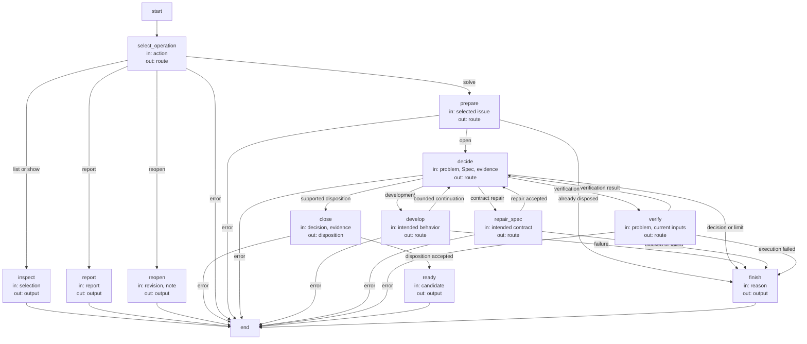
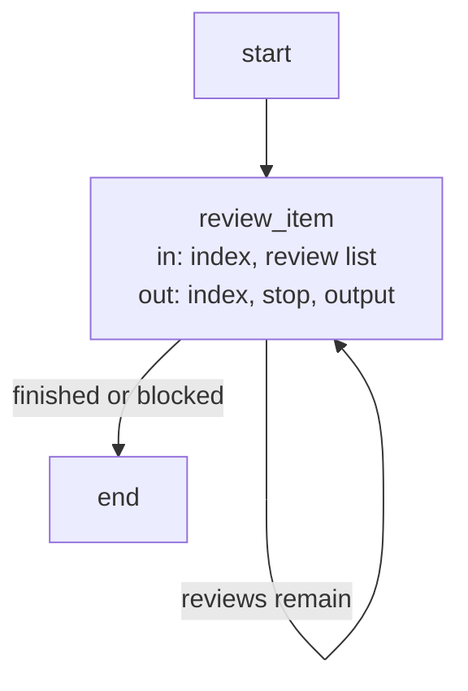

# Issue solving lifecycle

One solve request selects one Issue and freezes its exact byte revision before preparing work. A
new host-created candidate receives exactly that selected record, even if it is not yet committed;
other local changes are not copied or committed. The existing fresh-session handoff remains
mandatory. The owning session resumes in that candidate. Current-worktree bookkeeping operations
never create candidates. Repeating solve on a closed Issue reports its existing disposition.

The solver receives the problem and impact plus its complete Module Spec. It chooses ordinary
development, a fresh Spec repair, Issue-specific verification, a reasoned disposition or a precise
need for a developer decision. No mandatory triage, reproduction pass or separate investigation
plan precedes every repair. A bug with enough information can go directly to development; a
code-free Spec gap can be repaired without an implementation investigation. Decisions do not
acquire another Module's context or permissions.

The first development intent is retained for the candidate. It becomes the `concorde-issue-intent`
stage artifact for ordinary authoring, assessment, planning, tasks and implementation; it contains
only intended behavior. A later incompatible intended change requires a new decision instead of
silently reusing old plans. An admitted `spec-repair` runs the ordinary owner-only author, then
returns to fresh development or Issue-specific verification. Decision actions map explicitly to
declared graph nodes; `spec-repair` selects `repair_spec`, not a name inferred by punctuation
replacement. Failed/incomplete child execution stays failed; a reported blocker
can select a bounded next decision. Six decision invocations is the limit per unchanged input
state, counted before launch, with history retained even after cancellation. A fresh external
Spec/code change permits a new bounded attempt. No unbounded nested Issue repair is implied.

Resolution requires fresh Issue-specific independent Spec review and, for a code-owning Module,
code review. A successful unrelated check, single non-reproduction or workaround is not enough.
`duplicate` requires an explicitly admitted current open candidate, with semantic equivalence
explained by the solver. `not-actionable` requires a contract-grounded rationale. These dispositions
need no mandatory human approval. Unsettled product/design choices use `needs-decision` and preserve
the open Issue; execution errors and iteration limits remain distinguishable.

A disposition is written before final ordinary validation. Ready evidence includes that write and
all required candidate checks/reviews. On failure the runtime restores only its own unchanged Issue
write, leaves implementation progress inspectable and does not claim ready. A concurrent Issue edit
prevents restoration and is reported rather than overwritten. Candidate-local completion does not
mean primary was changed; delivery is a separately authorized action.

### scenario.issues.solve-ready — Resolve and verify the candidate

- GIVEN an explicitly selected open Issue with current evidence
- WHEN bounded development and Issue-specific verification succeed
- THEN the authorized solver can resolve the Issue and final checks bind the disposition bytes
- AND the result is a ready candidate without automatic delivery or primary merge

### scenario.issues.solve-spec-repair — Route contract repair to the ordinary author

- GIVEN an admitted solver decision with action spec-repair
- WHEN the flow selects the next operation
- THEN it enters the declared repair_spec node and invokes the owner-only Spec author
- AND the author receives intended behavior without the solver's selection or prior transcript
- AND accepted repair can continue to development or, for a code-free Module, Spec-only verification

### scenario.issues.solve-decision — Ask only for genuinely unsettled decisions

- GIVEN a selected Issue whose required product or design choice cannot be determined from its context
- WHEN the solver returns needs-decision
- THEN the Issue remains open and the precise question is returned without inventing a fix
- AND an explicit solve note supplies developer clarification and permits a fresh bounded attempt

### scenario.issues.solve-stale — Refuse changed selections and retain failed work

- GIVEN selected Issue bytes or verification inputs that change during solving
- WHEN a dependent solve or disposition step is attempted
- THEN stale evidence is rejected and unrelated work is preserved
- AND failed final candidate verification cannot leave the runtime's unchanged disposition presented as completed

### scenario.issues.solve-handoff — Carry an uncommitted selected report

- GIVEN an open report not yet present in the committed base
- WHEN the host prepares a candidate for its explicit solve request
- THEN that record's exact selected bytes are copied to the candidate before the session handoff
- AND unrelated local edits and the source worktree's index are preserved

## Design

### Issue Flow (`issue_flow`)

State: `route`, `output` and the guarded failure `result`. Selected record bytes, decision count, intended behavior and current
verification are bound by the host; durable attempt history belongs to the candidate.

| Node | Executes | in | out |
| --- | --- | --- | --- |
| `select_operation` | Deterministic action selection. | action | route |
| `inspect` | Deterministic record lookup. | selection | output |
| `report` | Deterministic scoped reporting. | report | output |
| `reopen` | Deterministic explicit reopening. | revision, note | output |
| `prepare` | Deterministic selection and attempt binding. | selected issue | route |
| `decide` | One fresh Issue solver invocation. | problem, Spec, evidence | route |
| `develop` | Ordinary Development Flow. | intended behavior | route |
| `repair_spec` | Ordinary owner-only Spec Authoring. | intended contract | route |
| `verify` | Fresh Issue-specific reviews. | problem, current inputs | route |
| `close` | Deterministic disposition with stale checks. | decision, evidence | disposition |
| `ready` | Final validation including disposition bytes. | candidate | output |
| `finish` | Deterministic stopped or already-completed response. | reason | output |

### Issue verification Flow (`issue_verification_flow`)

Verification uses a bounded review list: Issue-specific Spec/code questions first, then the ordinary
candidate review intents required for final readiness. Code-free Modules need only Spec review.
The distinction preserves both targeted verification and the ordinary source/consumer freshness
gates; a private targeted review cannot replace another task's required review. Each item is a
separate Review capability invocation, and a blocked or failed item prevents dependent items.

State: `index`, `stop` and `output`. The host owns the finite list and its review input bindings.

| Node | Executes | in | out |
| --- | --- | --- | --- |
| `review_item` | One ordinary Review capability for the selected mode and intent. | index, review list | index, stop, output |

