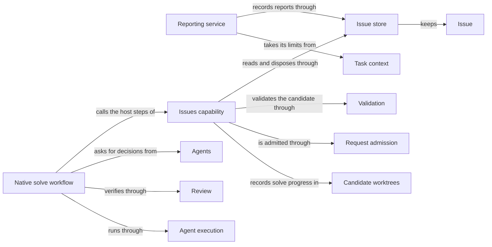

# Issues

## Purpose

Issues keeps a durable record of concrete problems found while working on a project, so that a
problem outlives the conversation or worker run that found it. Workers and the developer report
problems; the user session lists, shows and reopens them; and an explicit solve request drives one
Issue towards a verified disposition in a candidate worktree. Recording a problem never stops a
worker, never starts a repair and never grants anyone new read or write access. Issues does not
implement fixes, write Specs or deliver candidates: a solve that needs code or Spec changes hands
that work back to the user session, and a solved Issue ends in a ready candidate that is delivered
separately.

## Terminology

| Term | Definition |
| --- | --- |
| Issue | A durable, branch-local record of one concrete problem, holding every report made about it and its disposition history. |
| Issue report | One immutable observation inside an Issue: what was seen, why it matters, the basis for the claim, evidence locations and who reported it. |
| Blocker | A task-local reference from a stage result to one Issue report, naming the step of the task that the problem stops. |
| Disposition | A recorded decision that closes an Issue as resolved, duplicate or not actionable, or reopens a closed one, with a note, evidence and the actor. |
| [Developer](../vocabulary.md#concept.concorde.developer) | |
| [User session](../vocabulary.md#concept.concorde.user-session) | |
| [Capability](../vocabulary.md#concept.concorde.capability) | |
| [Host](../vocabulary.md#concept.concorde.host) | |
| [Worker](../vocabulary.md#concept.concorde.worker) | |
| [Evidence](../vocabulary.md#concept.concorde.evidence) | |
| [Module](../vocabulary.md#concept.concorde.module) | |
| [Spec](../vocabulary.md#concept.concorde.spec) | |
| [Context](../vocabulary.md#concept.concorde.context) | |
| [Registry](../spec/module.md#concept.spec.registry) | |
| [Candidate](../harness/worktrees/module.md#concept.worktrees.candidate) | |
| [Worktree](../harness/worktrees/module.md#concept.worktrees.worktree) | |
| [Grant](../harness/context/module.md#concept.context.grant) | |
| [Workflow](../harness/execution/module.md#concept.execution.workflow) | |
| [Agent](../agents/module.md#concept.agents.agent) | |
| [Finding](../review/module.md#concept.review.finding) | |
| [Ready](../validation/module.md#concept.validation.ready) | |

An Issue is the problem; an Issue report is one observation of it; a Blocker is one task's
statement that the problem stops it; a Disposition is the decision that the problem is settled or
needs attention again. Keeping these four apart is the main idea of the Module. The solve flow adds
two more words, the solve decision and the closing journal, explained in
[Solving an Issue](solving.md).

## Usage

**What an Issue is.** Each Issue is one file, `.concorde/issues/I-<32 hex digits>.md`, committed
with the branch like any other project file. It holds a list of Issue reports and a list of
dispositions, and its status is `open` or `closed`. A reporter classifies each report as a `bug`
(a defect or failure), a `gap` (an implementation/Spec mismatch, a conflict between Specs, or a
missing necessary promise) or a `limitation` (behaviour that is consistent but insufficient). A
report also names the Module that owns the broken promise when the reporter knows it, and `null`
when it does not. For example, a worker planning a payment retry finds that no Spec says how often
to retry; it reports a `gap` of subtype `missing-contract`, owner `module.payments`, and cites the
Spec file it read as evidence.

Reports are never edited. A later observation about the same problem is appended as a new report,
and it may classify the problem differently; the first report stays exactly as it was accepted.
Because the files travel with Git, a candidate worktree and the primary worktree each have their
own copy: closing an Issue in a candidate says nothing about the primary branch until the candidate
is delivered.

**How workers report.** Every worker the Host launches for a Module, whether a native terminal
Agent or a diagnostic Pi RPC worker, receives a `report_issue` tool. It sends only
the report; the Host adds who reported it (invocation, Agent, capability, phase, Module, context
identity, change and Git HEAD) and saves the record before answering with a receipt and the
record's current revision. The worker then keeps working. Reporting is limited to what the worker
may already see: the owner it names must be a Module in its context, and every evidence path must
be a file it was given. A worker may append to an existing Issue only when that Issue was selected
for its task or it reported that Issue itself in the same run.

**Blockers and review findings.** When a problem stops a worker's task, the worker's final result
lists a Blocker: the receipt of the report plus the `blocked_step` it cannot do. A reviewer's
Finding refers to Issue reports in the same way, with a `severity` of `blocking` or `advisory` and
the affected task; the Host turns blocking ones into Blockers. A result may reference only reports
the worker made in this run or was explicitly given; anything else is rejected. The candidate
keeps each Blocker as a dependency of that Module's phase until a fresh, successful assessment of
the phase releases it. Releasing a Blocker does not close the Issue, and closing an Issue does not
release a Blocker: a workaround can let work continue while the problem stays open.

**The `concorde-issues` capability.** The user session calls it with one `action`:

| Action | Needs | What happens |
| --- | --- | --- |
| `list` | nothing; optional `target_id` filter | Returns the Issues in the current worktree. No model runs, nothing changes. |
| `show` | `issue_id` | Returns one Issue. No model runs, nothing changes. |
| `report` | `target_id` and a `report` | Saves the developer's report through the same reporting service workers use. |
| `reopen` | `issue_id` and a `note` | Appends a `reopened` disposition to a closed Issue. |
| `solve` | `issue_id`, optional `note` | Runs the bounded solving workflow in a candidate worktree. |

The first four are bookkeeping in the current worktree and never create a candidate. `solve` is
explained in [Solving an Issue](solving.md). In short: the Host copies the selected Issue into a
new candidate, and a native Workflow alternates between the Issue solver Agent, which picks the
next step, and independent reviewers, which verify the problem. If code or Spec changes are needed,
solve stops and returns the intended change to the user session. If the solver settles the Issue
with sufficient evidence, the Host writes the disposition, validates the whole candidate and
returns a ready candidate. It never delivers or merges.

For inspection outside a Pi session, `python3 scripts/issues.py list|show <id>` prints the same
records without launching anything.

**Closing and reopening.** A disposition has a reason (`resolved`, `duplicate`, `not-actionable`
or `reopened`), a note, at least one evidence reference and the actor. `duplicate` names another
open Issue. Only an open Issue can be closed and only a closed Issue can be reopened. Closed
Issues stay in the directory with all their reports. The solve workflow is the only automatic path
that closes an Issue; reopening is an explicit user-session action with a written reason.

**Errors.** A request that names an unknown Issue, supplies an `expected_revision` that no longer
matches the file, appends to a closed Issue, reuses a report key for different content, or names an
owner or evidence path outside the reporter's context is refused, and nothing is written. Repeating
an identical report returns the same receipt instead of a second copy.

**Older records.** Records written with schema version 1 remain readable byte for byte, but they
cannot be appended to, disposed or solved; continuing such a problem means reporting a new Issue
that cites the old record as evidence. `python3 scripts/issues.py archive-reflections` moves a
project's old `.concorde/reflections/` queue unchanged into `.concorde/archive/reflections/`; it
creates no Issues, and an explicit developer report may cite archived files as evidence.

## Design

**The Issue store** is the only code that writes `.concorde/issues/`. Every file holds one
identity heading and one JSON record, so the JSON is the single source of content and no prose copy
can drift from it. Writes run under one lock per worktree, check the file's current byte digest,
publish atomically and sync the directory before acknowledging, so a reply of success means the
record is on disk and a concurrent writer is never silently overwritten. An Issue's identity is
derived from the reporting invocation and the reporter's key, not from a counter, so two branches
never allocate the same identity and a retried report finds its earlier result. The store checks
shapes, digests and legal transitions; it cannot judge whether evidence is true, which is why
only the solve workflow closes Issues and only an explicit user-session request reopens them.
Project validation
reads every Issue, reports a corrupt one as an error and includes each record's digest in its
input identity, so evidence recorded before an Issue changed is recognized as stale.

**The reporting service** is built by the Host for one worker run before the worker starts. It
takes its limits from the worker's frozen context: the Modules whose Specs the worker was given,
the files it may cite, and the Issues selected for its task. Because the worker never supplies
provenance, a root path or a disposition, reporting cannot become a file-write grant or a way to
forge who said what. Reports are saved the moment they are accepted, so they survive a worker that
later fails, times out, is cancelled or submits an invalid result; that survival says nothing about
whether the worker's own task succeeded. The same service handles the developer's `report` action
and reports the Host itself files, for example for missing dependency promises found before
planning.

**The Issues capability** declares `concorde-issues` and holds its Host steps. Before any
worktree is chosen, it binds the request: it reads the selected Issue and its revision, refuses
a changed selection or a schema-1 record for `reopen` and `solve`, and resolves the Module the
Issue is about — the owner named by its latest report, or the reporting Module when the owner is
unknown. A request cannot redirect an
Issue to a different Module, so selecting an Issue never widens anyone's Grant. For `solve` it
then carries the exact selected bytes into the new candidate, including a report that is not yet
committed, without copying other local edits. The same code holds the solve state kept in the
candidate, the bounded attempt counting, the write-ahead closing journal and its recovery; these
are explained in [Solving an Issue](solving.md).

**The native solve workflow** is a fixed script run by the Pi sub-agent runtime. It loops at most
six times over three Host steps and the model calls between them, and every model call is a fresh
terminal Agent. The script only sequences calls and checks a small control message from each Host
step; every decision about state, evidence and closure is made by Host code that re-reads the
Issue, the solve state and the current inputs at each step. This keeps model output from ever
closing an Issue by itself.

**Why the split between reporting, blockers and disposition.** Reports are cheap and immediate, so
workers can record everything they notice without ending their task. Blockers are task-local,
keyed by change, Module, phase and Issue rather than by task wording, so replanning cannot lose a
dependency. Dispositions need evidence and happen only in a solve or an explicit reopen, so a
closed Issue means something was checked, not merely that someone stopped looking.

**Open questions.** The solver is offered duplicate candidates only when another open Issue for the
same Module has exactly the same title and type; whether that is the intended matching rule or a
placeholder is not stated anywhere.

## Relationships

A worker never touches the store directly. It holds only the `report_issue` tool, whose calls the
Host forwards to the reporting service. The capability and the workflow are the only writers of
dispositions, and they write only in the worktree the request was admitted to.

**Request admission** is the one entry point of every capability request. It calls this Module's
selection step before binding a worktree, treats `list`, `show`, `report` and `reopen` as
bookkeeping without a candidate, and treats `solve` of an open Issue as a mutation that needs a
candidate. When it creates the candidate from the primary worktree, it calls this Module to copy
the selected Issue across before relaying the request. Issues relies on admission to refuse
requests whose configuration or target does not match, and it refuses its own invalid selections
before admission continues.

**Task context** freezes what each worker may read. The reporting service derives its admitted
owners and evidence paths from that frozen context and never widens it; if the context is missing
the reporting target, the service refuses to start rather than guess.

**Agent execution** runs the native Workflow and its terminal Agents, prepares each model call and
proves which native child produced which result. The solve workflow's Host steps accept a
decision or review only when execution has correlated it with an actual finished native child; a
missing, foreign or cancelled child stops the solve without closing anything.

**Candidate worktrees** creates the candidate a solve runs in and owns the change record in it.
Issues stores its per-Issue solve state and closing journal inside that record, marks progress and
invalidates earlier readiness through it, and relies on it to keep Blockers as change-, Module-,
phase- and Issue-keyed dependencies. A change record that cannot be read stops the solve.

**Spec** loads the registry and each Module's Specs, resolves which Module the target is, computes
the revision of a Module's Specs and implementation files, and provides the typed-value checks and
file transactions the store writes with. Issues relies on these to detect that inputs changed
between steps and to write records atomically.

**Review** supplies the independent Spec and code reviewers that verify a solve and the Finding
format that refers to Issue reports. A review that did not complete, or that still reports a
blocking Finding, never counts as verification.

**Validation** checks the whole candidate after the disposition is written, so the ready result
includes the disposition's bytes. When validation does not report ready, Issues restores the
Issue to open and reports failure.

**Agents** defines the Issue solver Agent: its instructions, its read-only tools and the
`issue_decision` it must return. Issues supplies the selected problem, feedback and duplicate
candidates as the solver's task material and never gives it write access.

**Operations** lists `concorde-issues` in its catalog and dispatches admitted requests to this
Module's Host steps; the bookkeeping actions run as nodes of its dispatch graph, and `solve` is
routed to the native workflow.
