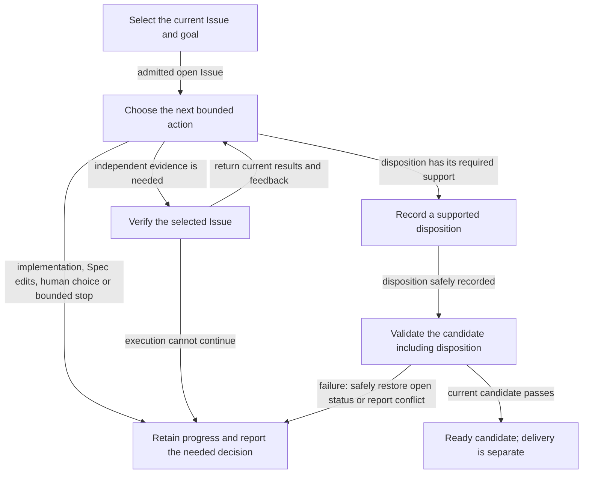
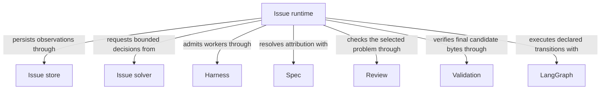

# Issues

## Purpose

Issues keeps a durable record of observed problems and supports their explicit investigation, repair and verification. Recording a problem does not itself stop work or authorize code changes. Developers use it when a concern must remain visible beyond the current conversation.

## Terminology

| Term                                    | Meaning / definition                   |
| --------------------------------------- | -------------------------------------- |
| [Issue](../module.md#terminology)       | Defined in Concorde Framework.         |
| [Blocker](../module.md#terminology)     | Defined in Concorde Framework.         |
| [Candidate](../module.md#terminology)   | Defined in Concorde Framework.         |
| [Ready](../module.md#terminology)       | Defined in Concorde Framework.         |
| [Evidence](../module.md#terminology)    | Defined in Concorde Framework.         |
| [Disposition](lifecycle.md#terminology) | Defined in Solving a recorded problem. |
| [Worker](../module.md#terminology)      | Defined in Concorde Framework.         |
| [Host](../module.md#terminology)        | Defined in Concorde Framework.         |
| [Spec](../module.md#terminology)        | Defined in Concorde Framework.         |
| [Graph](../module.md#terminology)       | Defined in Concorde Framework.         |

## Usage

Workers use `report_issue` during any admitted invocation, including Spec-only assessment or review.
The host returns an immutable receipt and the current record revision before the worker continues.
A final stage blocker or review judgment references that receipt instead of repeating the problem.
A reviewer can collect all independently assessable findings before finishing; an implementer can
repair or work around a problem only within the current task and its existing authority.

Use `concorde-issues` with `action=list|show|report|reopen|solve`. Listing and showing records are
read-only. Reporting is bookkeeping without a managed change requirement. Solve selects one Issue,
returns needed implementation or Spec edits to the caller, or runs independent verification and
disposition checks. It ends at a verified ready candidate, a bounded stop or a precise need for a developer decision. It never delivers or merges.
See [the public interface](interfaces.md), [records and reporting](issues.md) and
[the solving lifecycle](lifecycle.md) for fields, effects and error behavior.

Records under `.concorde/issues/` travel through Git with the branch. Closing an Issue in a candidate
is not a claim about primary. Closed records remain available. Old Reflections are archived
historical material, not active Issues; no old report is silently classified or approved.

## Design

The Issue runtime validates report references, coordinates the solving graph and separates durable
problem content from task-local blocker relations. Its file transactions are host-only and use
exact-byte checks. Individual reports are immutable; a later observation can refine classification
without erasing the report that a review actually considered. Report IDs are never joined by
free-text equality. Candidate blocker records identify a change, Module, phase and Issue, not a
mutable task description. Reassessment can release a dependency without closing the Issue.

The Issue solver is a fresh Spec-only decision worker, invoked only when solve is requested. It
selects intended development, bounded Spec repair, Issue-specific review or a reasoned disposition.
It does not perform intake classification or implementation. Needed implementation and Spec edits return as intended behavior and rationale to the calling agent,
which selects retained Operations and edits contracts directly. Decisions bind the selected record revision and current input identities.

`concorde-issues` runs after target admission binds the owning Module. Local listing, showing,
reporting and reopening call deterministic Host services directly, without compiling a Graph.
Solving and explicit Studio execution retain the
[Issue Graph](execution-reference.md#lifecycle-issue-graph-issue-graph), including its
[target admission adapter](../operations/execution-reference.md#graphs-target-admission-graph-target-graph). Solving is a bounded loop
around the `decide` node, where one Issue solver worker chooses the next action: return needed implementation or Spec edits to the caller, or run Issue-specific reviews as the
[Issue verification Graph](execution-reference.md#lifecycle-issue-verification-graph-issue-verification-graph).
Verification returns to `decide`; needed edits stop the attempt with the Issue open until the caller
returns with current inputs. A supported disposition closes the Issue only after its evidence checks.
LangGraph compiles the declared `issue_graph` nodes and routes before execution. The host retains
attempt counts before model calls, current intended behavior and evidence in candidate bookkeeping.
No autonomous nested repair escapes the selected goal or the declared iteration limit.

### Flow overview

This conceptual view follows an explicitly requested solve, not the runtime's complete node/edge
catalog. Listing, reporting and reopening do not start this repair loop. The solver chooses work
but does not perform implementation or Spec authoring: those return to the outer agent.
Independent review retains its own authority. Resolution needs current Issue-specific evidence; duplicate and not-actionable
outcomes instead need their own supported reasons. Any final readiness claim includes the
written disposition, and never means the primary branch has changed.

For State channels, node inputs/outputs, decision limits and exact disposition conditions, open
the full [Issue Graph Spec](execution-reference.md#lifecycle-issue-graph-issue-graph) and
[Issue verification Graph Spec](execution-reference.md#lifecycle-issue-verification-graph-issue-verification-graph).

## Relationships

This view shows the selected Issue's collaborators, not the inventory of the repaired Module. Each
provider runs under its own contract and context. Using a provider does not acquire its files or
allow the Issue solver to edit a Spec or implementation directly.

## Collaborations

[Harness Module](../harness/module.md) owns typed admission, phase results and candidate progress. Issue operations use its
[execution boundary](../harness/admission.md#operation-execution-boundary), preserving its
configuration, context, permission and failure distinctions. Reporting is a separate limited host
effect, never worker filesystem write authority or permission to advance a failed stage.

[Spec Module](../spec/module.md) resolves Module/scenario ownership and validates paired contracts. Issue attribution uses the
[current registered context](../spec/contracts.md#registry-stable-id-spec-context-queries), not a path guess.
Included definitions retain their owner; unknown ownership remains null. Historical report owners
need not remain in a later registry. Invalid current target selections stop solving.

[Review Module](../review/module.md) supplies [fresh read-only assessments](../review/module.md#usage). Issue-specific verification
checks the selected problem, not just unrelated passing tests. Failed, incomplete or stale reviews
cannot justify resolved disposition. Canonical report references retain their exact observations.

[Validation Module](../validation/module.md) supplies [candidate checks](../validation/module.md#usage). The disposition is written
before final validation so ready evidence includes those bytes. A failed final validation restores
only the runtime's own unchanged disposition write, preserves other work and leaves the Issue open.
If concurrent edits prevent restoration, the host reports the conflict rather than overwriting them.

## Precise specifications

The Issues Module owns the exact obligations and interface details in [requirements](requirements.md).
These companions are part of the same complete Module specification, not separate topic owners.
