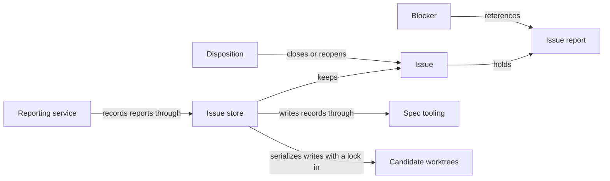

# Issues

## Purpose

Issues keeps a durable record of concrete problems found while working on a project, so that a
problem outlives the conversation or model call that found it. It owns the Issue records and their
store, the reporting service through which Agents, the Host and the developer record problems, the
references by which stage results point at a recorded problem, and dispositions that close or
reopen an Issue. It publishes the canonical shapes of reports, receipts, Blockers and the Issue
material given to later model calls. Recording a problem never stops a worker, never starts a
repair and never grants anyone read or write access. Issues does not solve problems, decide which
stage a Blocker stops, or decide who may close an Issue: the `concorde-issues` capability that
lists, reopens and solves Issues belongs to Issue solving, and Blocker bookkeeping belongs to the
Modules that record stage results.

## Terminology

| Term | Definition |
| --- | --- |
| Issue | A durable, branch-local record of one concrete problem, holding every report made about it and its disposition history. |
| Issue report | One immutable observation inside an Issue: what was seen, why it matters, the basis for the claim, evidence locations and who reported it. |
| Blocker | A task-local reference from a stage result to one Issue report, naming the step of the task that the problem stops. |
| Disposition | A recorded decision that closes an Issue as resolved, duplicate or not actionable, or reopens a closed one, with a note, evidence and the actor. |
| [Developer](../vocabulary.md#concept.concorde.developer) | |
| [Host](../vocabulary.md#concept.concorde.host) | |
| [Worker](../vocabulary.md#concept.concorde.worker) | |
| [Module](../vocabulary.md#concept.concorde.module) | |
| [Evidence](../vocabulary.md#concept.concorde.evidence) | |
| [Registry](../spec/module.md#concept.spec.registry) | |
| [Typed value](../spec/module.md#concept.spec.typed-value) | |
| [File transaction](../spec/module.md#concept.spec.file-transaction) | |
| [Worktree](../harness/worktrees/module.md#concept.worktrees.worktree) | |
| [Primary worktree](../harness/worktrees/module.md#concept.worktrees.primary-worktree) | |
| [Run record](../harness/worktrees/module.md#concept.worktrees.run-record) | |

An Issue is the problem; an Issue report is one observation of it; a Blocker is one task's
statement that the problem stops it; a Disposition is the decision that the problem is settled or
needs attention again. Keeping these four apart is the main idea of the Module.

## Usage

**What an Issue is.** Each Issue is one file, `.concorde/issues/I-<32 hex digits>.md`, committed
with the branch like any other project file. It holds a list of Issue reports and a list of
dispositions, and its status is `open` or `closed`. A reporter classifies each report as a `bug`
(a defect or failure), a `gap` (an implementation/Spec mismatch, a conflict between Specs, or a
missing necessary promise) or a `limitation` (behaviour that is consistent but insufficient). A
report also names the Module that owns the broken promise when the reporter knows it, and `null`
when it does not; the Issue's owner is then the Module that reported it. For example, a worker
planning a payment retry finds that no Spec says how often to retry; it reports a `gap` of subtype
`missing-contract`, owner `module.payments`, and cites the Spec file it read as evidence.

Reports are never edited. A later observation about the same problem is appended as a new report,
and it may classify the problem differently or name another owner; the first report stays exactly
as it was accepted. Because the files travel with Git, every worktree has its own copy: closing an
Issue in a candidate says nothing about the primary branch until the candidate's branch is merged.

**Who reports.** Reports reach the store only through the reporting service, which a caller builds
for one reporter with explicit limits: the Modules the reporter may name as owner, the files it may
cite as evidence, the Issues it may append to, and the provenance of the reporter (invocation,
agent, capability, phase, reporting Module, context identity, change and Git `HEAD`). Three callers
use it:

- Agent execution gives every Agent call a `report_issue` tool whose calls it forwards to a service
  built from that call's frozen context, as the [report](interface.md#contract.issues.report) and
  [receipt](interface.md#contract.issues.receipt) contracts describe;
- the Host reports problems it finds itself, for example missing dependency promises found before
  planning;
- the developer reports through the `report` action of the `concorde-issues` capability.

The service answers with a receipt and the record's current revision only after the record is on
disk. The reporter then keeps working: a report is an observation, not a stop.

**Blockers and review references.** When a problem stops a worker's task, the worker's result lists
a [Blocker](interface.md#contract.issues.blocker): the receipt of the report plus the `blocked_step`
it cannot do. A reviewer's finding refers to reports the same way, with a `severity` of `blocking`
or `advisory` and the affected task; each blocking reference becomes a Blocker. Before a result is
accepted, the reference check confirms that every reference names a report the worker made in this
call or was explicitly given, at most once. How long a Blocker keeps a stage from proceeding is
decided and recorded by the Module that accepted the result. Issues promises only independence:
disposing an Issue never touches a Blocker, and releasing a Blocker never disposes an Issue, so a
workaround can let work continue while the problem stays open.

**Issue material for later calls.** A later model call can be given recorded problems in two
shapes. [Issue context](interface.md#contract.issues.context) gives the description, impact and
basis of each referenced report, never the whole record. An
[Issue selection](interface.md#contract.issues.selection) describes one selected Issue with its
revision, the latest problem and any feedback, verification summary and duplicate candidates; a
reporter given a selection may append to that Issue.

**Closing and reopening.** A disposition has a reason (`resolved`, `duplicate`, `not-actionable`
or `reopened`), a note, at least one evidence reference and the actor. `duplicate` names another
open Issue. Only an open Issue can be closed and only a closed Issue can be reopened. Closed Issues
stay in the directory with all their reports, because reopening needs them. The store checks the
shape, the revision and the transition of a disposition; whether a caller may dispose an Issue at
all is the caller's decision.

**Inspection and the store check.** Outside a Pi session, `python3 scripts/issues.py list`,
`show <id>` and `check` print the records or check them without launching anything. Concorde's
configured check `check.issues.store` runs the `check` action whenever Validation or Delivery runs
this Module's checks: it fails for any record that is malformed, misnamed or has an inconsistent
history.

**When an owner no longer exists.** An Issue whose owner is not a registered Module, typically
because a change removed that Module, is still listed and shown like any other. The store check
reports it as a finding and fails while the Issue is open; a closed Issue with an unknown owner is
reported without failing. The open Issue is repaired by appending a report that names a registered
owner, or by closing it.

**Errors.** A request that names an unknown Issue, supplies an `expected_revision` that no longer
matches the file, appends to a closed Issue, reuses a report key for different content, or names an
owner, evidence path or Issue outside the reporter's limits is refused, and nothing is written.
Repeating an identical report returns the same receipt instead of a second copy.

## Design

**The Issue store** is the only code through which the Host creates, appends to, disposes or
restores an Issue record. Git operations that move committed record files between branches, such as
creating a candidate, delivering or merging, are not store writes, and the store never runs Git.
Every file holds one identity heading and one JSON record, so the JSON is the single source of
content and no prose copy can drift from it. Each write checks the file's current byte digest
against the revision the caller read, publishes through a file transaction and syncs the directory
before acknowledging, so a reply of success means the record is on disk and a concurrent writer is
never silently overwritten.

**One lock for the repository.** All store writes of every worktree take one exclusive lock,
`.concorde/runs/issues.lock` in the primary worktree's run records. Records are per-branch files,
but one Host process may write in a candidate and in the primary, and Issue identities are
allocated without a counter; a single lock keeps allocation and publication from interleaving
anywhere in the repository. The lock is cooperative: it orders the Host's own writers, and a hand
edit bypasses it, which the revision check then detects at the next write.

**Identity without counters.** An Issue's identity is derived from the reporting invocation and the
reporter's key, so two branches never allocate the same identity and a retried report finds its
earlier result.

**The store checks form, not truth.** It checks shapes, digests and legal transitions; it cannot
judge whether evidence is true. That is why deciding who may close or reopen an Issue stays with
the capabilities that do it, not with the store.

**The reporting service** takes its limits from its caller before the reporter starts. Because the
reporter never supplies provenance, a root path or a disposition, reporting cannot become a
file-write grant or a way to forge who said what. Reports are saved the moment they are accepted,
so they survive a reporter that later fails, times out, is cancelled or submits an invalid result;
that survival says nothing about whether the reporter's own task succeeded. The same code holds the
reference check that stage results pass through and builds the Issue context of referenced reports.

**Why reports, Blockers and dispositions are separate.** Reports are cheap and immediate, so
workers can record everything they notice without ending their task. Blockers are task-local
judgments recorded by the stage that made them, so replanning cannot lose a dependency and closing
the Issue cannot silently release it. Dispositions need evidence, so a closed Issue means something
was checked, not merely that someone stopped looking.

**Store validity is a configured check, not part of Spec validation.** Spec tooling validates Specs
and knows nothing of Issues. Checking the records as this Module's configured check keeps that
separation and still runs on every delivery, which runs every configured check. Issue bytes are not
part of any other Module's evidence.

**Typed values.** The report, receipt, Blocker, selection and context shapes are registered with
Spec tooling's typed-value registry by this Module; Spec tooling does not know them. The shapes
live in `src/concorde/spec/issue_shapes.py` and belong in `src/concorde/issues/shapes.py`.

The Issues tests cover the store on temporary directories, concurrent writers, malformed records,
and the reporting service's limits and survival.

## Relationships

A worker never touches the store directly. It holds only the `report_issue` tool, whose calls
Agent execution forwards to a reporting service. Dispositions are written only by the callers that
own that decision, and only in the worktree they run in.

**Consumers of the contracts.** Agent execution requires the [report](interface.md#contract.issues.report)
and [receipt](interface.md#contract.issues.receipt) contracts, because it exposes `report_issue`
to every Agent call. Planning requires the [Blocker](interface.md#contract.issues.blocker) contract
for the Blockers it records. Issue solving requires the [selection](interface.md#contract.issues.selection)
and [context](interface.md#contract.issues.context) contracts for the material it gives the Issue
solver. Issues promises that each shape is closed, versioned and validated before anything is
written or accepted.

**Spec tooling** provides the [typed-value](../spec/module.md#concept.spec.typed-value) machinery
with which Issues registers and checks its shapes, the [file transaction](../spec/module.md#concept.spec.file-transaction)
through which the store publishes a record bound to its previous digest, and the
[registry](../spec/module.md#concept.spec.registry) the store check reads to know which Modules
exist. A transaction refused as stale is reported as `stale_issue`, and nothing is written.

**Candidate worktrees** locates the [primary worktree](../harness/worktrees/module.md#concept.worktrees.primary-worktree)
of any [worktree](../harness/worktrees/module.md#concept.worktrees.worktree) and keeps the
[run records](../harness/worktrees/module.md#concept.worktrees.run-record) directory in it, where
the store keeps its repository-wide lock. When the primary worktree cannot be found, the store
refuses to write rather than lock locally.
