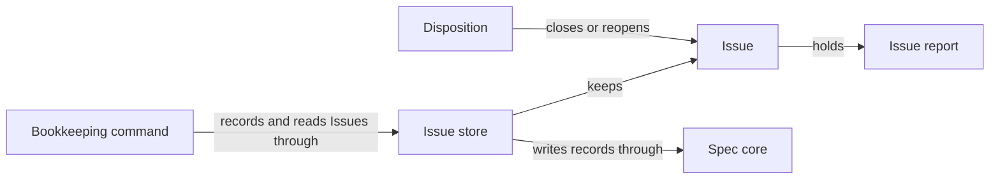

# Issues

## Purpose

Issues keeps a durable record of concrete problems found while working on a project, so that a
problem outlives the conversation, worker or task that found it. It owns the Issue records under
`.concorde/issues/`, the store that is the only code writing them, dispositions that close or
reopen an Issue, and the bookkeeping command through which the main agent records reports, closes
and reopens Issues, and lists, shows and checks the records. Recording a problem never stops
anyone, never starts a repair and never grants read or write access to the project. Issues does
not solve problems and decides nothing about who may close an Issue: the main agent solves an
Issue by running ordinary Operations on the Issue's Module, and whoever disposes an Issue is
responsible for the evidence it cites.

## Terminology

| Term | Definition |
| --- | --- |
| Issue | A durable, branch-local record of one concrete problem, holding every report made about it and its disposition history. |
| Issue report | One immutable observation inside an Issue: what was seen, why it matters, the basis for the claim, evidence locations and who reported it. |
| Disposition | A recorded decision that closes an Issue as resolved, duplicate or not actionable, or reopens a closed one, with a note, evidence and the actor. |
| [Developer](../vocabulary.md#concept.concorde.developer) | |
| [Main agent](../vocabulary.md#concept.concorde.main-agent) | |
| [Module](../vocabulary.md#concept.concorde.module) | |
| [Evidence](../vocabulary.md#concept.concorde.evidence) | |
| [Registry](../spec-tooling/spec/module.md#concept.spec.registry) | |
| [Typed value](../spec-tooling/spec/module.md#concept.spec.typed-value) | |
| [File transaction](../spec-tooling/spec/module.md#concept.spec.file-transaction) | |

An Issue is the problem; an Issue report is one observation of it; a Disposition is the decision
that the problem is settled or needs attention again. Keeping observations and decisions apart is
the main idea of the Module: anyone may observe cheaply, while closing requires evidence.

## Usage

**What an Issue is.** Each Issue is one file, `.concorde/issues/I-<32 hex digits>.md`, committed
with the branch like any other project file. It holds the Issue's reports, its dispositions and a
status of `open` or `closed`. Each report is classified as a `bug`, a `gap` (an
implementation/Spec mismatch, a conflict between Specs or a missing necessary promise) or a
`limitation`, and names the Module that owns the broken promise, or `null` when the reporter does
not know; the Issue's owner is then the reporting Module, which for a report recorded through the
command is the project's root Module. For example, the observation that no
Spec says how often a failed payment is retried is a `gap` of subtype `missing-contract` with
owner `module.payments`, citing the Spec file that shows the omission. Reports are never
edited: a later observation is appended as a new report. Because the files travel with Git, an
Issue closed in a task worktree is still open on the primary branch until the task branch is
merged.

**Recording a report.** The main agent writes the report as a JSON file and runs
`python3 scripts/issues.py report --file <report.json> [--task <task-id>]`. The command refuses an
owner that is not a registered Module and evidence that does not exist in the project, and adds
the provenance itself: who reported (`main-agent`), the reporting Module, a digest of the registry,
the task and the Git `HEAD`, so a report file cannot claim another origin. It answers with a
[receipt](interface.md#contract.issues.receipt) and the record's new revision only after the record
is on disk. A report file that names an Issue and its current revision appends a later observation
to that open Issue instead of creating one. Each run of the command is a separate invocation, so
running it twice with the same file records two Issues. No Operation records Issues on its own in
this version: the main agent decides which problems deserve an Issue, typically a Spec gap or
failure an Operation result reported that the current task will not fix.

**Closing and reopening.** A disposition has a reason (`resolved`, `duplicate`, `not-actionable` or
`reopened`), a note, at least one evidence reference and the actor; `duplicate` names another open
Issue. Only an open Issue can be closed and only a closed one reopened. Closed Issues keep all
their reports, because reopening needs them. The main agent runs `close <id> --reason <reason>
--note <text> --evidence <item>...` or `reopen <id> --note <text> --evidence <item>...`; the
command records the main agent as the actor. The store checks the form of a disposition, not
whether its evidence is true, so the caller that disposes an Issue is accountable for it.

**Solving an Issue.** Solving is ordinary work. The main agent reads the Issue, opens a task for its
owning Module, runs the Operations that fix the problem, such as `understand`, `specify` or
`implement`, and closes the Issue on the task branch with the evidence of the delivered change, so
the closure is merged together with the fix.

**Bookkeeping and the store check.** `python3 scripts/issues.py list` prints a summary row per
Issue, `show <id>` prints one record with its revision, and `check` validates every record; the
command refuses a directory that is not an initialized Concorde project and never launches a model.
The configured check `check.issues.store` runs `check` whenever this Module's checks run. It fails
for a malformed, misnamed or inconsistent record and for an open Issue whose owner is no longer a
registered Module; a closed Issue with an unknown owner is only noted. Such an Issue is still listed
and shown, and is repaired by appending a report naming a registered owner or by closing it.
Requests naming an unknown Issue, a stale revision, a closed Issue to append to or close, an open
Issue to reopen, an unregistered owner or missing evidence are refused and write nothing. Every
refusal prints an error code and a message naming the Issue, file, argument or field concerned,
and exits with status 2 when the request itself is unusable and 1 when the Issue rules refuse it.
The exact shapes, operations and error codes are in the [Issue interface](interface.md).

## Design

**The Issue store** is the only code that creates, appends to or disposes an Issue record; Git moves of committed files between branches are not store writes, and the store never
runs Git. Each file holds one identity heading and one JSON record, so there is no prose copy to
drift. Each write checks the revision its caller read, publishes through a
[file transaction](../spec-tooling/spec/module.md#concept.spec.file-transaction) and syncs before
acknowledging, all under one exclusive lock kept in the worktree's own `.concorde/runs/`. The
record shapes are registered as [typed values](../spec-tooling/spec/module.md#concept.spec.typed-value).
The store checks form, not truth.

**The bookkeeping command** `scripts/issues.py` is the main agent's face of the store: `report`,
`close` and `reopen` write through it, and `list`, `show` and the store check read. It reads the
[registry](../spec-tooling/spec/module.md#concept.spec.registry) to know which Modules exist, which
one is the root, and which digest names the context of a report.

The **Issues tests** cover the store on temporary directories, concurrent writers, malformed
records and failed publications, every action of the bookkeeping command with its refusals, and
the configured store check run as its configured command on a fixture project.

The reasons behind these choices are in [Issues design](design.md).

## Relationships

Nothing outside the store writes a record. The bookkeeping command is how the main agent adds
reports and dispositions, in the worktree it runs in; the main agent usually closes an Issue on the
task branch that fixed the problem. The
[Main session](../main-session/module.md) guidance tells the main agent when to record, solve and
close Issues; Issues itself relies on nobody but Spec core.

**Spec core** provides the [typed-value](../spec-tooling/spec/module.md#concept.spec.typed-value)
machinery with which Issues registers and checks its shapes, the
[file transaction](../spec-tooling/spec/module.md#concept.spec.file-transaction) through which the
store publishes a record bound to its previous digest, and the
[registry](../spec-tooling/spec/module.md#concept.spec.registry) the command reads to know which
Modules exist. A transaction refused as stale is reported as `stale_issue`, and nothing is written.
