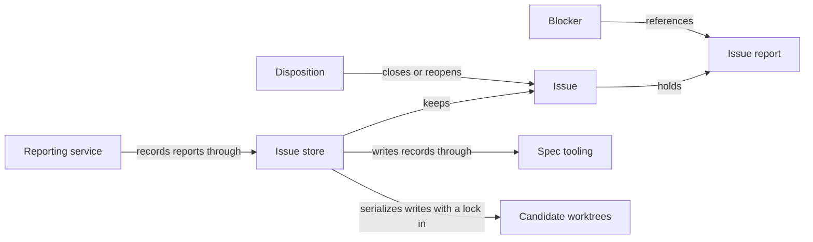

# Issues

## Purpose

Issues keeps a durable record of concrete problems found while working on a project, so that a
problem outlives the conversation or model call that found it. It owns the Issue records and their
store, the reporting service through which Agents, the Host and the developer record problems, the
references by which stage results point at a recorded problem, and dispositions that close or
reopen an Issue. It publishes the canonical shapes of reports, receipts, Blockers and the Issue
material given to later model calls. Recording a problem never stops a worker, never starts a
repair and never grants anyone read or write access. Issues does not solve problems, decide which
stage a Blocker stops, or decide who may close an Issue: the `concorde-issues` capability that
lists, reopens and solves Issues belongs to Issue solving, and Blocker bookkeeping belongs to the
Modules that record stage results.

## Terminology

| Term | Definition |
| --- | --- |
| Issue | A durable, branch-local record of one concrete problem, holding every report made about it and its disposition history. |
| Issue report | One immutable observation inside an Issue: what was seen, why it matters, the basis for the claim, evidence locations and who reported it. |
| Blocker | A task-local reference from a stage result to one Issue report, naming the step of the task that the problem stops. |
| Disposition | A recorded decision that closes an Issue as resolved, duplicate or not actionable, or reopens a closed one, with a note, evidence and the actor. |
| [Developer](../vocabulary.md#concept.concorde.developer) | |
| [Host](../vocabulary.md#concept.concorde.host) | |
| [Worker](../vocabulary.md#concept.concorde.worker) | |
| [Module](../vocabulary.md#concept.concorde.module) | |
| [Evidence](../vocabulary.md#concept.concorde.evidence) | |
| [Registry](../spec/module.md#concept.spec.registry) | |
| [Typed value](../spec/module.md#concept.spec.typed-value) | |
| [File transaction](../spec/module.md#concept.spec.file-transaction) | |
| [Worktree](../harness/worktrees/module.md#concept.worktrees.worktree) | |
| [Primary worktree](../harness/worktrees/module.md#concept.worktrees.primary-worktree) | |
| [Run record](../harness/worktrees/module.md#concept.worktrees.run-record) | |

An Issue is the problem; an Issue report is one observation of it; a Blocker is one task's
statement that the problem stops it; a Disposition is the decision that the problem is settled or
needs attention again. Keeping these four apart is the main idea of the Module.

## Usage

**What an Issue is.** Each Issue is one file, `.concorde/issues/I-<32 hex digits>.md`, committed
with the branch like any other project file, holding its reports and dispositions and a status of
`open` or `closed`. A reporter classifies each report as a `bug`, a `gap` (an implementation/Spec
mismatch, a conflict between Specs or a missing necessary promise) or a `limitation`, and names the
Module that owns the broken promise, or `null` when it does not know; the Issue's owner is then the
reporting Module. For example, a worker planning a payment retry finds that no Spec says how often
to retry; it reports a `gap` of subtype `missing-contract`, owner `module.payments`, citing the Spec
file it read. Reports are never edited: a later observation is appended as a new report. Because
the files travel with Git, closing an Issue in a candidate says nothing about the primary branch
until the candidate's branch is merged.

**Who reports.** Reports reach the store only through the reporting service, which a caller builds
for one reporter with explicit limits: the Modules it may name as owner, the files it may cite, the
Issues it may append to, and its provenance. Agent execution gives every Agent call a `report_issue`
tool backed by such a service, as the [report](interface.md#contract.issues.report) and
[receipt](interface.md#contract.issues.receipt) contracts describe; the Host reports problems it
finds itself; and the developer reports through the `concorde-issues` capability. The service
answers with a receipt only after the record is on disk, and the reporter keeps working.

**Blockers and references.** A result lists a [Blocker](interface.md#contract.issues.blocker), the
receipt of a report plus the `blocked_step` it cannot do, when a problem stops its task; a
reviewer's blocking finding reference becomes one. The reference check accepts only reports the
worker made in this call or was given, each at most once. The Module that accepted the result
decides how long a Blocker holds a stage back; Issues promises only that disposing an Issue never
touches a Blocker and releasing a Blocker never disposes an Issue. Later model calls receive recorded
problems as an [Issue context](interface.md#contract.issues.context) of referenced reports or an
[Issue selection](interface.md#contract.issues.selection) of one Issue.

**Closing and reopening.** A disposition has a reason (`resolved`, `duplicate`, `not-actionable` or
`reopened`), a note, at least one evidence reference and the actor; `duplicate` names another open
Issue. Only an open Issue can be closed and only a closed one reopened. Closed Issues stay with all
their reports, because reopening needs them. Whether a caller may dispose an Issue at all is the
caller's decision.

**Inspection and the store check.** `python3 scripts/issues.py list`, `show <id>` and `check` work
outside a Pi session. The configured check `check.issues.store` runs `check` whenever this Module's
checks run: it fails for a malformed, misnamed or inconsistent record, and for an open Issue whose
owner is no longer a registered Module. Such an Issue is still listed and shown; it is repaired by
appending a report naming a registered owner, or by closing it. Requests naming an unknown Issue, a
stale `expected_revision`, a closed Issue to append to, a reused report key or anything outside the
reporter's limits are refused and write nothing; an identical report repeated returns the same
receipt.

## Design

**The Issue store** is the only code through which the Host creates, appends to, disposes or
restores an Issue record; Git moves of committed files between branches are not store writes. Each
file holds one identity heading and one JSON record. Each write checks the revision its caller read,
publishes through a file transaction and syncs before acknowledging, all under one repository-wide
lock in the primary worktree's run records. The store checks form, not truth, so deciding who may
dispose stays with its callers.

**The reporting service** takes its limits and the provenance from its caller, so reporting cannot
become a write grant or a way to forge who said what, and it saves each report at once, so reports
survive a reporter that later fails. The same code holds the reference check and builds Issue
context. Keeping reports, Blockers and dispositions apart lets workers report freely, keeps a
dependency from being lost by replanning, and makes a closed Issue mean that something was checked.
The reasons are explained in [Issues design](design.md).

The Issues tests cover the store on temporary directories, concurrent writers, malformed records,
and the reporting service's limits and survival.

## Relationships

A worker never touches the store directly. It holds only the `report_issue` tool, whose calls
Agent execution forwards to a reporting service. Dispositions are written only by the callers that
own that decision, and only in the worktree they run in.

**Consumers of the contracts.** Agent execution requires the [report](interface.md#contract.issues.report)
and [receipt](interface.md#contract.issues.receipt) contracts, because it exposes `report_issue`
to every Agent call. Planning requires the [Blocker](interface.md#contract.issues.blocker) contract
for the Blockers it records. Issue solving requires the [selection](interface.md#contract.issues.selection)
and [context](interface.md#contract.issues.context) contracts for the material it gives the Issue
solver. Issues promises that each shape is closed, versioned and validated before anything is
written or accepted.

**Spec tooling** provides the [typed-value](../spec/module.md#concept.spec.typed-value) machinery
with which Issues registers and checks its shapes, the [file transaction](../spec/module.md#concept.spec.file-transaction)
through which the store publishes a record bound to its previous digest, and the
[registry](../spec/module.md#concept.spec.registry) the store check reads to know which Modules
exist. A transaction refused as stale is reported as `stale_issue`, and nothing is written.

**Candidate worktrees** locates the [primary worktree](../harness/worktrees/module.md#concept.worktrees.primary-worktree)
of any [worktree](../harness/worktrees/module.md#concept.worktrees.worktree) and keeps the
[run records](../harness/worktrees/module.md#concept.worktrees.run-record) directory in it, where
the store keeps its repository-wide lock. When the primary worktree cannot be found, the store
refuses to write rather than lock locally.
