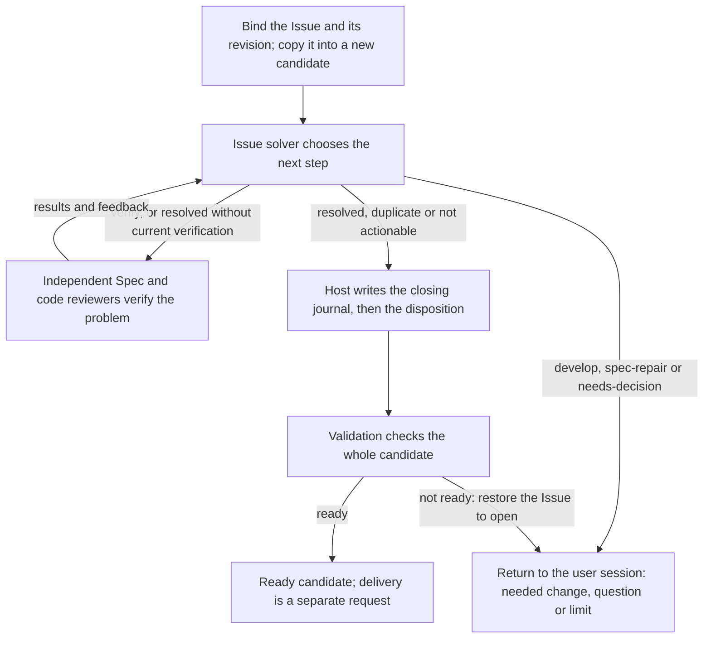

# Solving an Issue

This topic explains what happens after the user session calls `concorde-issues` with
`action=solve`: how one Issue is moved into a candidate, how the Issue solver and independent
reviewers take turns, when the Host is allowed to close the Issue, and how an interrupted close is
recovered. Exact fields and limits are in [Issue interface](interface.md); the obligations are in
[requirements](requirements.md) and [scenarios](scenarios.md).

## Terminology

| Term | Definition |
| --- | --- |
| Solve decision | The Issue solver's choice of the next step for one selected Issue: hand work back, verify, close with a reason, or ask the developer. |
| Closing journal | A write-ahead record in the candidate holding the exact open and closed bytes of an Issue that the solve workflow is about to close. |
| [Candidate](../harness/worktrees/module.md#concept.worktrees.candidate) | |
| [Ready](../validation/module.md#concept.validation.ready) | |
| [Workflow](../harness/execution/module.md#concept.execution.workflow) | |
| [Agent](../agents/module.md#concept.agents.agent) | |
| [User session](../vocabulary.md#concept.concorde.user-session) | |
| [Developer](../vocabulary.md#concept.concorde.developer) | |
| [Host](../vocabulary.md#concept.concorde.host) | |
| [Evidence](../vocabulary.md#concept.concorde.evidence) | |
| [Capability](../vocabulary.md#concept.concorde.capability) | |
| [Module](../vocabulary.md#concept.concorde.module) | |
| [Spec](../vocabulary.md#concept.concorde.spec) | |
| [Finding](../review/module.md#concept.review.finding) | |

## The normal path

Take an open bug report saying that a transfer leaves the balance unchanged. The user session
calls solve from the primary worktree. The Host reads the Issue, records its current revision and
decides which Module it concerns: the owner named in the latest report, or the reporting Module
when no owner is known. It creates a candidate worktree, copies exactly that Issue file into it
(even if the report was never committed), and relays the request there. The rest runs inside the
candidate, and the result comes back to the user session.

The Host then prepares a native Workflow named `concorde.issue.<ticket>` and returns a call for
the user session to start. The Workflow runs the loop in the picture. Each turn begins with a Host
step that counts the attempt and gives the solver its task material: the problem and impact from
the latest report, feedback from the previous turn, a summary of any current verification, the
developer's clarification if one was given, and up to five open Issues of the same Module with the
same title and type as possible duplicates. The solver reads the Module's Specs and answers.

## What the solver can decide {#concept.issues.decision}

A solve decision has an `action`, an `intent`, a `rationale` and, for duplicates, the other Issue's
identity. The Host routes each action differently:

| Action | What the Host does |
| --- | --- |
| `develop` | Stops with outcome `unsupported` and returns the intended implementation work to the user session. Nothing is changed. |
| `spec-repair` | Stops with outcome `unsupported` and returns the missing or conflicting promise and the needed Spec change. Nothing is changed. |
| `needs-decision` | Stops with outcome `conflicting` and returns the precise product or design question. |
| `verify` | Runs independent verification, then asks the solver again. |
| `resolved` | Closes the Issue if the current inputs were verified; otherwise verifies first and asks again. |
| `duplicate` | Closes the Issue as a duplicate of one of the offered open Issues, if that Issue is unchanged. |
| `not-actionable` | Closes the Issue with the solver's contract-grounded reason. |

The solver never edits anything. When the answer is `develop` or `spec-repair`, the user session
does the work itself or calls the planning and implementation capabilities, and then calls solve
again. The Issue stays open throughout, and the decision is kept in the solve history.

## Verification

Verification asks fresh reviewers to check the current candidate. For a Module with implementation
files there are four groups: an Issue-specific Spec review and code review, told to confirm that
this problem is actually resolved and not just worked around, and the ordinary Spec review and code
review of the Module. A Module without implementation files gets the two Spec reviews. Each group
may fan out into several reviewers, one for each Module in that review's scope. Every reviewer is a
separate native child in the same Workflow; no reviewer starts another.

Verification counts only when every review completed, none reports a blocking Finding, and the
Module's Specs and implementation files are byte-for-byte what they were when verification began.
The Host then records the reviews' input identities as the evidence for a later `resolved`. If a
review still reports blocking problems, the solver is asked again with that feedback. If a
reviewer fails to run, the solve stops as `failed`.

## Closing and the journal {#concept.issues.journal}

Closing is two writes that must not be half-done: the Issue file gets a disposition, and the
candidate's change record gets a completed solve. Between them sits final validation, which must
see the disposition so that the ready result covers it. To make that safe, the Host first prepares
the exact closed bytes of the Issue, then saves a closing journal in the candidate's change record
with the open bytes, the closed bytes and their digests, and only then writes the disposition. The
actor is recorded as `concorde-issue-solver`, and the evidence is the solver's context identity
plus any verification identities.

The Host then runs `concorde-validate` on the candidate. If it reports ready, the solve state
becomes `completed`, the journal is removed and the user session receives outcome `ready` with the
disposition and the check results. If it does not, the Host restores the open bytes, removes the
journal, marks the candidate blocked and returns `failed`; the Issue is open again and any other
work in the candidate is untouched.

## Stops, limits and retries

A solve returns to the user session in exactly these ways: ready; a handed-back change
(`develop`, `spec-repair`); a question (`needs-decision`); the attempt limit (`conflicting`); a
failed review, solver run or validation (`failed`); a solver result that is not a decision, such
as `spec_incomplete` with Blockers, returned with its own outcome; or a refusal because something
changed. The solver is asked at most six times for the same inputs. The count resets when the
Module's Specs or implementation files change, or when the user session supplies a new `note` with
a clarification, so the natural way to continue after handing work back is to make the change and
call solve again.

Every Host step re-reads the Issue, the candidate's solve state and the Module's inputs. If the
Issue bytes changed, if the solve state was changed by someone else, or if inputs changed in the
middle of a step, the solve stops with a stale error rather than acting on old evidence. Calling
solve on an Issue that is already closed in this worktree returns the existing disposition without
running anything.

## Recovering an interrupted close

If the process dies between saving the journal and completing, the next solve of the same Issue in
the same candidate finds the journal. It accepts the Issue only if its bytes equal exactly the
journal's open or closed image, so a concurrent edit is never overwritten. It first invalidates any
earlier ready result, then restores the open image (doing nothing if that is already on disk, so a
second interruption is harmless), clears the old verification and continues with a fresh solve and
fresh validation. If the Issue was closed by the solver but there is no journal to prove which
write it was, or the journal is corrupt, the Host refuses and asks for explicit reconciliation
instead of guessing.

Recovery never creates another candidate and never moves to another worktree. The design choice
behind the journal is that every closed Issue in a candidate either passed final validation with
its disposition included or can be proven to be this solve's own unfinished write and undone.
