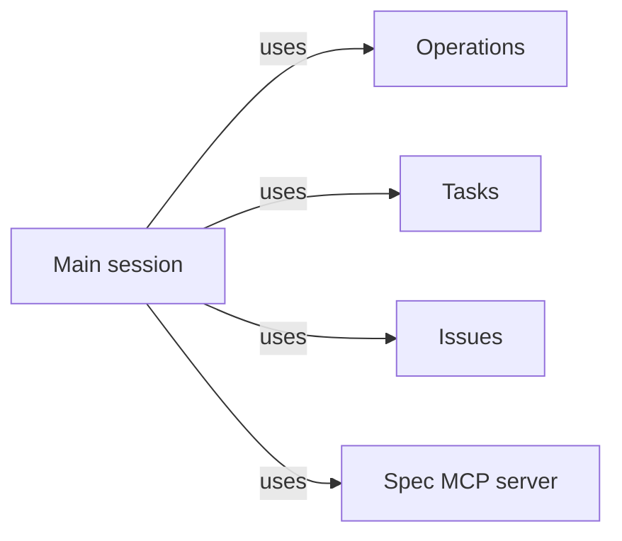

# Main session

## Purpose

Main session is the guidance that makes an ordinary Claude Code session in a project's primary
worktree act as Concorde's main agent. It tells the main agent how to discuss the project with the
developer, split work into tasks and decide which run in parallel, run Operations in task worktrees
and read their results, keep each task's decision log, decide ordinary questions itself and
escalate only decisions with major impact, merge delivered tasks, and handle Issues. The guidance
is advice to a model, not enforcement: Concorde places no permission limits on the main agent, and
nothing here constrains what the developer may do. This Module owns the content of the guidance;
Distribution renders and installs it.

## Terminology

| Term | Definition |
| --- | --- |
| Main-session guidance | The Claude Code instructions, installed as a project skill and a `CLAUDE.md` block, that tell the main agent how to work with Concorde. |
| Escalation policy | The rule by which the main agent decides ordinary questions itself, records and reports them, and asks the developer only for decisions with major impact. |
| [Developer](../vocabulary.md#concept.concorde.developer) | |
| [Main agent](../vocabulary.md#concept.concorde.main-agent) | |
| [Worker](../vocabulary.md#concept.concorde.worker) | |
| [Error chain](../vocabulary.md#concept.concorde.error-chain) | |
| [Task](../tasks/module.md#concept.tasks.task) | |
| [Decision log](../tasks/module.md#concept.tasks.decision-log) | |
| [Operation](../operations/module.md#concept.operations.operation) | |
| [Operation result](../operations/module.md#concept.operations.result) | |
| [Issue](../issues/module.md#concept.issues.issue) | |
| [Spec MCP server](../spec-tooling/spec-mcp/module.md#concept.spec-mcp.server) | |

The guidance is the whole Module; the escalation policy is the part of it that decides when the
developer is interrupted.

## Usage

**What the main agent is told.** The developer opens Claude Code in the primary worktree of a
project where Concorde is installed. The installed guidance tells that session it is the main
agent, and gives it a working method:

- **Discuss first.** Talk with the developer about the state of the project, answer questions from
  the Specs, and agree the direction and the large plan before changing anything.
- **Split into tasks.** Turn agreed work into [tasks](../tasks/module.md#concept.tasks.task), each a
  branch with its own worktree, a goal and the Modules it touches, opened with `concorde task`.
  Parallelism exists only between worktrees: tasks whose Modules and shared files do not overlap
  may run at the same time, and tasks that would write the same Module run one after another.
- **Run Operations, do not edit.** Work happens by running
  [Operations](../operations/module.md#concept.operations.operation) in a task worktree with
  `concorde run <operation> --task <task> …` in background Bash, for instance `understand` to
  assess and plan, `specify` to change Specs, `implement` and `test` for code, `spec_review` and
  `code_review` for review, then `validate` and `delivery`. The session is woken when the command
  exits and reads the [Operation result](../operations/module.md#concept.operations.result). The
  main agent does not edit the project itself, except for trivial housekeeping that changes no
  Spec meaning and no code behaviour, such as regenerating the registry mirror or resolving a
  mechanical merge conflict in it.
- **Keep the decision log.** Record in the task's
  [decision log](../tasks/module.md#concept.tasks.decision-log) every result that is not `ok` and
  every choice made without the developer, with the reason.
- **Merge delivered work.** When `delivery` has committed a task's change with its evidence on the
  task branch, merge that branch into the primary branch without asking the developer for
  authorization, and record the merge. A merge conflict or a failed check after merging is handled
  as new work, never by discarding someone's change.
- **Report.** End each piece of work with a short summary for the developer: what was merged, what
  was decided on the developer's behalf, and what is still open.

For example, the developer asks for a retry limit on payments. The main agent reads the payments
Module with the developer, agrees the limit, opens one task for `module.payments`, runs `specify`
to state the limit, `implement` and `test` to realize it, `code_review`, `validate` and `delivery`,
then merges the branch and reports that it chose exponential back-off because the Spec left the
schedule open.

**Reading an error.** Every Operation result that is not `ok`, and every refusal of a `concorde`
command, carries an [error chain](../vocabulary.md#concept.concorde.error-chain). The guidance tells
the main agent to read the whole chain before deciding: the origin says what went wrong, and each
link's reason says why the level that wrote it could not handle the error, which points at the
level that can.

**When to ask the developer.** The **escalation policy** turns an error chain from an Operation
into either a decision or a question. The main agent decides design uncertainties of ordinary scope itself, such as
naming, internal structure, the order of tasks, re-running an Operation with a clarified brief or
splitting a task, records the decision and reports it at the end. It asks the developer before
acting only when a decision has a major impact: it changes what a Module promises to its users or
the project's direction, contradicts an earlier decision of the developer, discards work or data,
cannot be undone by an ordinary revert, touches security or credentials, or needs resources beyond
what the developer set. When in doubt between the two, the main agent records its reasoning and
asks. When it asks, it never replaces the chain with its own summary: it escalates with
`concorde task escalate`, which adds its own link, with the reason it may not decide, on top of the
chain, records it in the task and prints it rendered for the developer.

**Issues.** A problem that the current task will not fix, such as a Spec gap a worker reported
about another Module, is worth an [Issue](../issues/module.md#concept.issues.issue) so that it
survives the task. Solving an Issue is ordinary work: the main agent opens a task for the Issue's
Module, runs the Operations that fix it, and closes the Issue on the task branch with the evidence,
so the closure is merged with the fix. The main agent records, lists, shows, closes and reopens
Issues with `concorde issues report|list|show|close|reopen`, the Issues bookkeeping command.

**Spec queries.** The main agent may configure the
[Spec MCP server](../spec-tooling/spec-mcp/module.md#concept.spec-mcp.server) for its own session,
for example in the project's MCP configuration, to ask which Modules exist, what a Module's
context is, which Modules a set of paths concerns and what grant a task type would receive. The
server answers from the Specs of the worktree it is rooted in, which for the main agent is the
primary worktree. Workers never receive it.

## Design

The guidance is instructions rather than a program because the main agent's work is judgment:
discussing, choosing tasks and deciding what matters. Everything that must hold regardless of
judgment is enforced elsewhere: workers are bounded by the Harness, Operations check their own
inputs, and `validate` decides readiness. The guidance can therefore stay short and describe a
method, and a main agent that ignores it can waste effort but cannot widen a worker's boundary.

The main agent does not edit the project because its view is the whole project: if it wrote code
or Specs itself, nothing would bound its changes by a Module, audit them against a grant or attach
evidence to them. Routing work through tasks and Operations keeps every change bounded, checked
and recorded, and keeps the primary worktree clean for merging. Merging needs no authorization
because `delivery` only commits what `validate` found ready, and a merge is an ordinary, revertible
Git change; asking every time would make the developer a bottleneck without adding a check.

The escalation policy exists because an agent that asks about everything is as useless as one that
asks about nothing. Deciding ordinary questions keeps work moving; recording them in the decision
log and reporting them keeps them reviewable; reserving questions for major impact protects the
decisions only the developer may make.

The **guidance sources** live under `prompts/main-session/`: `skill.md`, the full method, installed
as the project skill `.claude/skills/concorde/SKILL.md`, and `claude-md.md`, the short block
installed into the project's `CLAUDE.md`. Distribution's build renders them into
`generated/main-session/`. Their tests, under `tests/concorde/main_session/`, check that the
rendered guidance states every rule the [scenarios](scenarios.md) describe. What a main agent then
does is judgment that no deterministic test observes.

## Relationships

The guidance describes how the main agent uses four providers. Distribution renders and installs
it, and the installed skill and `CLAUDE.md` block are the only way it reaches a session.

**Operations** provides the [Operation](../operations/module.md#concept.operations.operation)
catalog and `concorde run`. The guidance relies on every Operation returning an
[Operation result](../operations/module.md#concept.operations.result) whose status, error chain and
evidence the main agent can read without inspecting the worker, and on no Operation starting the
next one: choosing what runs next is the main agent's duty.

**Tasks** provides the [task](../tasks/module.md#concept.tasks.task), with its branch, worktree
and record, and its [decision log](../tasks/module.md#concept.tasks.decision-log). The guidance
relies on each task having its own worktree, so parallel tasks never mix changes, and makes the
main agent responsible for opening, merging and closing tasks and for writing the decision log.

**Issues** provides the durable [Issue](../issues/module.md#concept.issues.issue) records and their
bookkeeping command. The guidance relies on Issues being branch-local, which is why it tells the
main agent to close an Issue on the branch that fixes it.

The **Spec MCP server** provides read-only queries over one worktree's Specs. The guidance relies
on its answers coming from the worktree it is rooted in, and tells the main agent that a question
about a task's Specs needs a server, or a `concorde` command, rooted in that task's worktree.
