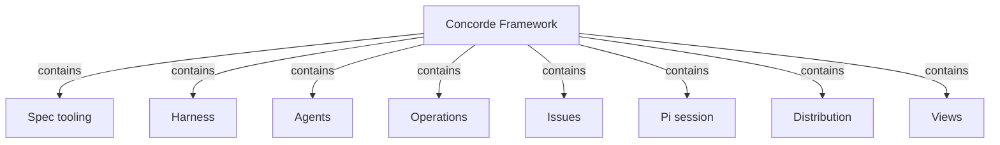
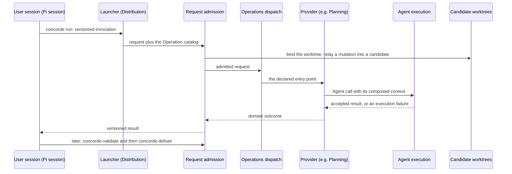

# Concorde Framework

## Purpose

Concorde is a set of Operations that an AI coding session can call, together with the
configuration of the developer's own Pi session that calls them. Each Operation does one bounded
job on a project that describes itself in Specs: it checks whether a Spec says enough, plans a
change, writes tasks, implements them, reviews Specs or code, validates a candidate, delivers it,
or works on a recorded Issue. Every model step inside an Operation receives a context and a
permission derived from the Specs, and its answer counts only after the deterministic Host has
checked it. The developer and the user session stay in charge: Concorde never chooses the next
step, never runs an autonomous development loop, never repairs a Spec on its own, and never merges
into the primary branch without explicit authorization. Development is one use among several;
Concorde is equally meant for understanding a project through its Specs. It does not decide
business behaviour, it does not require an independent review of every change (a review becomes a
gate only when the change records it as required), and it does not confine what a model reads or
runs as strictly as its boundaries describe; the Harness states exactly what is enforced.

## Terminology

| Term | Definition |
| --- | --- |
| [Operation](operations/module.md#concept.operations.operation) | |
| [Operation catalog](operations/module.md#concept.operations.catalog) | |
| [Agent](agents/module.md#concept.agents.agent) | |
| [Capability declaration](harness/admission/module.md#concept.admission.capability-declaration) | |
| [Workflow](harness/execution/module.md#concept.execution.workflow) | |
| [Graph](harness/execution/module.md#concept.execution.graph) | |
| [Candidate](harness/worktrees/module.md#concept.worktrees.candidate) | |
| [Issue](issues/module.md#concept.issues.issue) | |

The words every Module shares, developer, user session, Task subagent, capability, Module, Spec,
the four kinds of context, boundary, Host, worker and evidence, are defined in the
[shared vocabulary](vocabulary.md). Read it first if Concorde is new to you. The imported words
above are the ones this entry needs from its descendants: an Operation is what a capability runs,
the Operation catalog lists them, an Agent is a model role, a capability declaration states the
facts admission needs about a capability, a workflow and a Graph are the two ways control flow is
written down, a candidate is the isolated worktree of a change, and an Issue is a recorded problem.

## Usage

### Setting up

The developer installs Concorde into a project with its installer. The installer places a
Protocol copy under `.concorde/protocol/`, a managed runtime and the Pi integration, and never
writes the project's Specs. The user session then calls `concorde-init` twice: once to propose an
honest first Spec, which describes a root Module whose purpose is not yet specified, and once to
apply that exact proposal. From then on the developer opens the project in Pi. The session
integration adds one tool, `concorde`, with three actions: `describe` explains every public
capability, `run` calls one, and `result` fetches the result of a call that is still running or
already finished.

### Calling a capability

A `run` sends a versioned invocation to the launcher of the installed runtime. Request admission
checks the request against the capability's declaration, binds it to a Module and a worktree, and
answers with a versioned result that keeps three things apart: whether the request was admitted,
whether execution failed, and the domain outcome. A mutating capability called from the primary
worktree is relayed into a candidate worktree that the Host creates, so the primary branch stays
untouched; later calls for the same change name its `change_id`. A preview (the capability's
describe mode) explains the effect without performing it and changes nothing.

### Making a change

A typical change is a sequence of explicit calls, each chosen by the user session:

1. **Agree on the Spec.** The user session and the developer read the owning Module's Spec and edit
   it until it states the intended behaviour. `concorde-spec-review` gives an independent opinion
   when the developer wants one.
2. **Check sufficiency.** `concorde-context-solve` tells whether the Spec says enough for the task.
3. **Plan.** `concorde-plan` writes a plan for one Module; called from the primary worktree, it
   opens the change's candidate.
4. **Write and implement tasks.** `concorde-tasks` turns the accepted plan into acceptance tasks;
   `concorde-implement` lets a programmer change that Module's implementation files.
5. **Review and validate.** `concorde-code-review` reviews the code against the Spec when the
   developer asks for it; `concorde-validate` runs the deterministic checks, records evidence and
   decides whether the candidate is ready.
6. **Deliver.** `concorde-deliver` publishes the ready candidate on its own branch. Merging that
   branch into the primary branch is a further request that states the developer's explicit
   authorization.

For example, adding retries to a network client starts by deciding which failures may be retried,
written into the client Module's Spec. Only then is a plan written, and the programmer receives
tasks that cite that promise.

Independent review is not a gate on every change. A review kind becomes required for a change
only when the change records it, as Review explains; from then on the later stages refuse while
that review is missing or stale. Whether the stages could be chained into one call is an open
question owned by Operations; today the user session sequences them.

### When something goes wrong

If a step finds that a Spec does not state a promise it needs, it stops and reports a Spec gap
against the owning Module instead of guessing from code; dependent stages refuse until the gap is
resolved, while independent work may continue. The developer repairs the Spec and the step is
called again with current inputs. A failed or cancelled Agent call returns an execution failure;
what it changed stays in the candidate to inspect, nothing it proposed is accepted, and the
candidate is not ready. A repeated call is admitted against the current state, never replayed from
stale inputs. A problem worth remembering beyond one conversation is recorded as an Issue.

### Other capabilities

| Capability | Use it to | Provided by |
| --- | --- | --- |
| `concorde-init` | propose and apply the first Spec of a newly installed project | [Spec tooling](spec/module.md) |
| `concorde-configure` | choose the model, thinking level and time limits of Agent calls, or accept a newly installed Protocol | [Request admission](harness/admission/module.md) |
| `concorde-issues` | list, show, report, reopen or solve a recorded Issue | [Issue solving](issue-solving/module.md) |

The Specs can also be checked with `python3 scripts/concorde.py validate` and published as a
documentation site, which is the easiest way to read them.

## Design

### The Spec is the shared truth

Concorde is built around one idea: **the Spec, not the code, is the shared source of truth between
the developer and the agents.** Specs are written under the Spec Protocol, so both humans and tools
can read them. Every other choice follows from making that safe and practical: context and
permission are computed from the Specs, a model's answer is checked against them, and a missing
promise stops work instead of being inferred from code.

### Four kinds of context

Each Agent call receives four kinds of context, defined in the [shared vocabulary](vocabulary.md#concept.concorde.context):
its Spec context (the Specs its Module's declarations select, and the pinned external material
they include), its implementation context (the names of its Module's files, and their contents when
the task may read or change code), its capability context (the tools it may use and the contracts
behind them) and its task context (the task, the admitted stage artifacts and workspace facts).
Each is derived from declarations, so the same request gets the same context, and a change to any
input yields a new one. A planner reasons from Specs and file names only; a programmer additionally
receives the contents of its own Module's files; nobody receives a provider's code in place of its
Spec.

### Permission and what is enforced

A task's write set is the bound Module's own documents or its own implementation files, never both
for a model step, and a code-writing Agent never edits Specs. Enforcement is deliberately partial
and stated plainly by the [Harness](harness/module.md): results are always checked by the Host, but
a native worker's reads are not confined to its context, a programmer's edits and shell are not
confined to its implementation scope, and a Module's Spec scope is not enforced during model steps.
Concorde relies on the Host's acceptance checks and on evidence bound to exact inputs, not on
confinement, for its guarantees.

### Two control-flow mechanisms

Control flow inside an Operation is written down in exactly two sanctioned ways. Simple flows are
**pi workflows**: authored workflow scripts that pi-subagents runs, whose Host steps call back into
the deterministic Host; each is explained by a step table in its owner's Spec. Richer flows are
**LangGraph Graphs** built only with the Graph API (`StateGraph`, with nodes and edges declared
before compilation); the Functional API is forbidden because it hides control flow in ordinary
Python. Every Graph has a Graph Spec in its owner's Spec, kept equal to the compiled Graph by a
check. Either way the flow is inspectable without reading its code.

### Dependency layering {#dependency-layering}

Modules may rely on each other only in one direction, from the outside in. The rules are:

- **Spec tooling** and **Observation** use nothing.
- **Issues** uses only Spec tooling and Candidate worktrees.
- The **Harness** children use only Spec tooling, Issues, Agents, Observation, each other, and
  Distribution's build-manifest contract; never Operations, its providers, the Pi session or Views.
- **Agents** uses only the providers' output contracts and concepts it names exactly, Issues'
  report service and the Harness children.
- **Operations** and its providers may use the Harness, Agents, Spec tooling, Issues and each other.
- The **Pi session**, **Distribution** and **Views** are outer Modules and may use what they need.

Every `uses` names exactly the provider's promises it relies on. Where a lower Module must reach
code of a higher one, the dependency is inverted instead of imported: Request admission defines
the capability declaration that Operations provides, Agent execution defines the hook interfaces
that providers implement, and Spec tooling defines a typed-value registration that each owner uses
for its own record schemas. The reasons are practical. A Module's Spec context contains its
providers' Specs, so an upward dependency makes a foundation's context, and every task on it,
large; and a foundation that imports its users changes whenever any of them does. Mutual `uses`
among Operations' providers is allowed, because each still sees only the exact promises it lists.

### Candidates, evidence and delivery

Every mutating capability runs in a candidate worktree, so the primary branch stays untouched until
the developer decides. Evidence records the exact inputs it examined; when any of them changes, the
evidence stops applying and the candidate stops being ready. Delivery is a separate request, and
merging into the primary branch is yet another.

### How Concorde's own Specs are written

Concorde describes itself under the same Protocol, so this project is also the reference example of
a Concorde project. Each Module has one folder under `specs/concorde/`, Harness children below
`specs/concorde/harness/`, with an entry `module.md`, optional explanatory topics and implementation
documents for requirements, scenarios, contracts, Graph Specs and workflow step tables. Identities
follow `<kind>.<module-short>.<name>`, where the short name is the last segment of the Module
identity. A Module need not be a directory: realizations may bind files anywhere in the checkout.

The root Module binds the **project files** that belong to no single responsibility: the README
and the workflow guide under `docs/`, the agent instructions for this checkout, the licence,
repository configuration such as the ignore list, the submodule list and the pinned Python version,
the top-level Node manifest, and the CI workflow that validates this source checkout.

It also binds the **development environment** every Module's work runs in: the Python project and
its lock file, the pytest entry and test package roots, the shared test-support helpers (paths,
child-process environments and the timing plugin that records test evidence), the script that
initializes the vendored references, and the type check of the documentation site's sources. Its
precise promises are in [Development environment](development.md).

Its **acceptance tests**, under `tests/concorde/acceptance/`, will exercise the root's
[scenarios](scenarios.md): whole flows that cross several Modules, such as installing into a
consumer project or driving a candidate from planning to delivery. They do not exist yet, so the
directory is declared pending; until then the root's scenarios are promises without a verifying
test.

### Open questions

The four context kinds are defined here, but the Harness is still being reorganized to deliver them
as one composed record per call. Whether the public stage capabilities should also be offered as
one chained Operation is open and owned by Operations.

## Relationships

The composition follows the layering above: Spec tooling at the bottom, the Harness and the
Agents that it runs, Issues beside them, Operations and its providers on top, and the Pi session,
Distribution and Views as the outer Modules through which a developer installs, calls and reads
Concorde. Two children are composites. The Harness contains Request admission, Task context, Agent
execution, Check execution, Candidate worktrees and Observation; Operations contains Planning,
Implementation, Review, Validation, Delivery and Issue solving. Each composite explains its own
children.

The main runtime flow of one call crosses most of them. The sequence below is an illustration, not
a declaration; each arrow in it is declared by the calling Module's own `uses`.

**Spec tooling** implements the Spec Protocol: it loads the [registry](spec/module.md#concept.spec.registry)
and the documents, runs every [structural check](spec/module.md#concept.spec.structural-check),
computes each Module's [boundary sets](spec/module.md#concept.spec.boundary-set), and supplies the
[typed values](spec/module.md#concept.spec.typed-value) every capability exchanges. It also
provides `concorde-init`. The collaboration applies to every call, because every capability loads
the Specs first. The Framework relies on it to refuse a project whose structure cannot support a
trustworthy boundary before any model sees it. The root's duty is to keep Spec tooling free of
dependencies, as the layering rules require; when loading fails, no capability runs and the
developer repairs the Specs or the Protocol binding.

The **Harness** explains how an Agent is configured and run: context, control flow, the Agent and
its model, and the permission of each call, together with the table of what is and is not
enforced. Its children admit requests, compose context, run Agent calls and workflows, execute
checks, manage candidate worktrees and observe timing. The collaboration applies to every
capability call. The Framework relies on it to keep a model's answer a proposal until the Host
accepts it, and to keep a failed or cancelled call from counting as a result. The root's duty is to
keep the Harness independent of the Operations built on it; a Harness failure surfaces as an
admission or execution failure in the versioned result, never as a domain outcome.

**Agents** defines the seven domain [Agents](agents/module.md#concept.agents.agent), each by one
[definition](agents/module.md#concept.agents.definition): its identity, tool list, effects,
instructions and output contract. It applies whenever an Operation runs model work. The Framework
relies on each Agent being defined once, so that the tools preflight allows and the tools the
instructions mention cannot drift apart. Task subagents are not Agents and are not defined here.
The root's duty is to keep Agents below Operations: an Agent names providers' output contracts but
never their code.

**Operations** holds the [Operation catalog](operations/module.md#concept.operations.catalog), the
declaration of every [Operation](operations/module.md#concept.operations.operation), and the
generic dispatch that routes an admitted request to its provider's declared entry point. It
contains the providers whose only responsibility is providing Operations: Planning, Implementation,
Review, Validation, Delivery and Issue solving. `concorde-init` and `concorde-configure` are
provided by infrastructure Modules outside it. The collaboration applies to every run. The
Framework relies on no provider calling the next stage, so the user session keeps the sequence. The
root's duty is to keep providers above the Harness; an unknown or non-public Operation is refused
by admission before dispatch.

**Issues** keeps durable [Issue](issues/module.md#concept.issues.issue) records and the
[report](issues/module.md#concept.issues.report) service that Agents use to record a problem they
find. It applies whenever an Agent reports a problem and whenever an Issue is listed or solved. The
Framework relies on a report surviving the failure of the stage that made it. The root's duty is to
keep Issues a record layer, used by the Harness and the providers, while solving an Issue belongs to
the Issue solving provider; an unreadable Issue store is reported by its own configured check.

The **Pi session** configures the developer's user session: the
[session entry](session/module.md#concept.session.session-entry) that adds the `concorde` tool, the
private [selection](session/module.md#concept.session.selection) of one exact installed or candidate
integration, capability guidance, the Task subagents (tester and maintenance worker) and the
[coordinator](session/module.md#concept.session.coordinator) instructions of this source checkout.
It applies from the moment a developer opens a project in Pi. The Framework relies on it to send
every call through the launcher as a versioned invocation, never by importing providers. The
root's duty is to keep the session configuration out of the Harness; a missing or stale selection
blocks the session instead of falling back to another integration.

**Distribution** produces what a developer installs and runs: the built
[package](distribution/module.md#concept.distribution.package), the installer that places the
[Protocol copy](distribution/module.md#concept.distribution.protocol-copy) and the
[managed runtime](distribution/module.md#concept.distribution.managed-runtime), and the
[launcher](distribution/module.md#concept.distribution.launcher) that hands each invocation, with
the Operation catalog, to admission. It applies at installation and at every call. The Framework
relies on a failed installation leaving the previous state intact. The root's duty is to keep
Distribution an outer Module; the Harness may rely only on its build-manifest contract.

**Views** publishes the Specs as a [documentation site](views/module.md#concept.views.published-site).
It applies whenever the developer or a reader wants to browse the Specs instead of the files. The
Framework relies on a published page never granting context or authority. The root's duty is only to
keep Views outside every capability's path; a publishing failure affects no project state.
