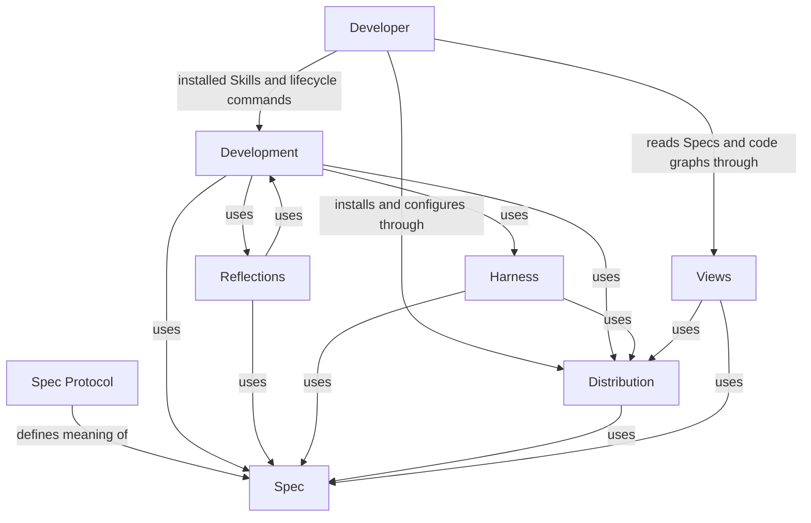

```concorde-document
{
  "id": "document.concorde.module",
  "targets": [
    "module.concorde"
  ],
  "main_visible": true
}
```

# Concorde Framework

## Purpose

Concorde Framework turns a developer's specified intent into inspectable, evidence-backed changes, and distributes the tools and views needed to work with those changes. It is the project's entry Module: a request enters here and is routed to the child Module that owns the relevant contract. Concorde Framework follows Spec Protocol 4.0.0; its complete contract is the Markdown collection explicitly registered for `module.concorde` in `.concorde/specs.json`, and this reading entry is that collection's only document. This root Module owns no implementation files of its own; its promises are realized entirely by its six child Modules.

## Requirements

### req.concorde.routing-no-access — No access beyond frozen context

A routing or target/focus hint SHALL NOT by itself grant file access beyond the selected Module's
frozen context.

### req.concorde.read-no-mutate — No mutation from read operations

A read or preview operation SHALL NOT mutate project state.

### req.concorde.versioned-result — Versioned result per invocation

Every invocation SHALL return a versioned capability result that distinguishes admission failure,
execution failure and the domain outcome.

### req.concorde.preserve-user-content — Preservation of developer-owned content

Installation and configuration changes SHALL preserve content the developer owns.

### req.concorde.no-overwrite-initialized — No overwrite of initialized projects

Initialization SHALL NOT overwrite an already-initialized project.

### req.concorde.delivery-separate — Delivery as a separately authorized step

Delivery to a destination SHALL require a separately authorized transition beyond a ready candidate.

### req.concorde.unsupported-explicit — Explicit failure for unsupported versions

An unsupported capability version or integration SHALL fail explicitly rather than degrading
silently.

### req.concorde.no-stale-replay — No replay of stale effects

A repeated mutation SHALL re-admit current saved state or require a fresh proposal rather than
replaying a stale effect.

## Scenarios

These scenarios state what a developer request accomplishes at the Framework's single entry point. Each routes to the child Module that supplies the underlying behavior, described locally under "Local collaboration agreements" below.

### scenario.concorde.develop-change — Successful development to a ready candidate

- GIVEN a developer supplies intended behavior and constraints
- WHEN the Framework routes the change to its providing Module and coordinates specification, planning, implementation and required evidence
- THEN the request completes with one ready candidate that meets its configured completion conditions
- AND delivery to a destination remains a separate, explicitly authorized transition

### scenario.concorde.develop-gap — Missing promise stops dependent work

- GIVEN a routed change depends on a Module promise that is not specified
- WHEN development reaches that dependency
- THEN the Framework stops the dependent work and reports the gap against its owning Module
- AND independent work in the same candidate continues
- BUT the candidate does not reach ready

### scenario.concorde.develop-failure — Failed step preserves inspectable progress

- GIVEN a routed change fails during specification, planning, implementation or evidence collection
- WHEN the failure occurs
- THEN the candidate's progress remains inspectable and resumable
- BUT the candidate is not represented as a completed delivery

### scenario.concorde.inspect-answer — Answering a Spec-grounded question

- GIVEN a developer asks a question or requests a view
- WHEN the request is routed to Development or Views
- THEN the response is grounded in registered Spec documents and declared relationships, or in an existing raw code graph
- AND answering the question does not mutate any project contract

### scenario.concorde.inspect-gap — Missing Spec promise reported

- GIVEN a requested answer depends on a promise that is not specified
- WHEN the query is answered
- THEN the selected interface reports the missing promise
- BUT does not guess or invent the missing behavior

### scenario.concorde.adopt-initialize — Initializing an uninitialized project

- GIVEN an uninitialized project and a supported integration
- WHEN the developer previews and then applies installation
- THEN the Framework pins the accepted Protocol binding and creates an honest Module stub
- AND unspecified business behavior is recorded as an explicit draft gap

### scenario.concorde.adopt-conflict — Conflicting ownership prevents adoption

- GIVEN an installation target already owns conflicting state, or provisioning fails
- WHEN adoption is attempted
- THEN adoption does not complete
- AND the Framework recovers previously valid owned state
- BUT no partially applied owned state is left in place

### scenario.concorde.configure-apply — Applying integration or enforcement configuration

- GIVEN an initialized project and an explicit, supported integration/enforcement configuration
- WHEN the developer applies it
- THEN the Framework updates the configured integration accordingly
- BUT an unsupported integration or enforcement value fails explicitly

### scenario.concorde.validate-record — Recording current deterministic evidence

- GIVEN a candidate under development
- WHEN the developer checks it
- THEN the Framework records current deterministic Spec and configured code check evidence for that candidate
- BUT a failed or stale check cannot establish readiness

### scenario.concorde.deliver-stage — Staging a verified change for delivery

- GIVEN a ready candidate
- WHEN the developer requests delivery
- THEN the Framework stages the change on an independent branch and removes its worktree by default
- BUT merging into the primary branch requires a further, separately authorized request by the sole primary writer

### scenario.concorde.reflections-triage — Working with recorded feedback

- GIVEN feedback or a persistent gap recorded against a Module or scenario identity
- WHEN the developer selects it through reflections triage
- THEN status reporting is read-only
- AND any mutation follows its declared evidence and disposition conditions

## Ontology

This root Module's Ontology holds the Developer who supplies intent, the external Spec Protocol
that Spec pins, and the six child Modules that realize every Requirement and Scenario above; the
Relationships subsection below traces how a request moves between them.

### Entities

```concorde-entities
[
  {
    "id": "entity.concorde.developer",
    "title": "Developer",
    "kind": "external actor",
    "responsibility": "Supplies intent and constraints, asks Spec-grounded questions, and installs, configures, develops, checks and delivers changes through installed Skills and lifecycle commands."
  },
  {
    "id": "entity.concorde.protocol",
    "title": "Spec Protocol",
    "kind": "external standard",
    "responsibility": "The independent Spec Protocol 4.0.0 that defines what a Module Spec must explain; Spec admits and pins it but does not own its meaning."
  },
  {
    "id": "entity.concorde.spec",
    "title": "Spec",
    "kind": "submodule",
    "target_id": "module.spec",
    "responsibility": "Owns the project Spec model: the pinned Protocol binding, the explicit registry, structural validation, stable-ID file-set queries and honest initialization."
  },
  {
    "id": "entity.concorde.harness",
    "title": "Harness",
    "kind": "submodule",
    "target_id": "module.harness",
    "responsibility": "Configures and runs every Agent invocation: freezes its context kinds, binds its Agent and Harness definition, compiles its effective permissions, executes it natively and coordinates it through LangGraph control flow."
  },
  {
    "id": "entity.concorde.development",
    "title": "Development",
    "kind": "submodule",
    "target_id": "module.development",
    "responsibility": "Provides the installed Skill boundary and the workflows that answer questions, develop one change to a ready candidate, evolve topology, record candidate evidence and deliver an authorized change."
  },
  {
    "id": "entity.concorde.reflections",
    "title": "Reflections",
    "kind": "submodule",
    "target_id": "module.reflections",
    "responsibility": "Retains, investigates and resolves explicitly attributed project feedback and persistent gaps."
  },
  {
    "id": "entity.concorde.distribution",
    "title": "Distribution",
    "kind": "submodule",
    "target_id": "module.distribution",
    "responsibility": "Builds authored projections, installs and configures owned integrations, provisions the managed runtime and keeps a source checkout's own projections bound to the worktree that built them."
  },
  {
    "id": "entity.concorde.views",
    "title": "Views",
    "kind": "submodule",
    "target_id": "module.views",
    "responsibility": "Publishes registered Module Specs as a navigable documentation site, and opens an existing code graph with the verified installed viewer."
  }
]
```

### Relationships

Six Modules have this Module as their sole structural parent, and the arrows below are their registered `uses` relationships. **Spec** owns the project's Spec model: the pinned Protocol binding, the registry, structural validation and initialization. **Harness** owns how an Agent is configured and run: the four context kinds it freezes, Agent and Harness definitions, permissions, native execution and the LangGraph control flow. **Development** owns the business workflows: questions, the development loop, topology evolution, candidate evidence and delivery. **Reflections** retains attributed feedback and gaps and hands approved work back to Development, so the two Modules use each other. **Distribution** builds authored projections, installs them and provisions the managed runtime. **Views** publishes registered Specs and opens an existing code graph.

A developer request carries intent and constraints. Project Specs supply promised behavior; a candidate worktree holds proposed changes and revision-bound evidence. A ready candidate ends development; only a separately authorized delivery updates the destination.



#### Project diagram convention

Every Concorde Module MUST describe its principal entities and directed relationships with an inline Mermaid diagram in the Relationships subsection of its `module.md` Ontology. Labels, titles, descriptions and explanatory prose use English. Include an accessible title and description, and explain the relationships, cardinalities or state rules needed to read the diagram. This is a Concorde project convention under the tool-neutral Spec Protocol, not a change to the independent standard. Rendered SVG/HTML and navigation remain derived views.

## Local collaboration agreements

These entries describe the six children registered for this Module from the Framework's own perspective. Each child's complete contract is its own registered collection; these promises are only what the composition relies on.

```concorde-dependencies
[
  {
    "target_id": "module.spec",
    "responsibility": "Own the project Spec model: Protocol binding, registry, structural validation and initialization.",
    "selection_condition": "When any entry must identify a Module, resolve its documents and entity file bindings, or initialize a project.",
    "relied_upon_promises": [
      "Every registered identity, membership and file binding resolves deterministically and structural inconsistencies are rejected before any Agent runs.",
      "Initialization creates an honest stub with a pinned Protocol binding and never overwrites an existing project."
    ]
  },
  {
    "target_id": "module.harness",
    "responsibility": "Configure and run every Agent invocation: frozen context kinds, Agent and Harness bindings, effective permissions, native execution and LangGraph control flow.",
    "selection_condition": "When an entry needs an Agent to reason or act.",
    "relied_upon_promises": [
      "An invocation receives only its frozen Spec, implementation, capability and task context and acts only within its compiled permissions; process exit alone is never success.",
      "Every control flow is an inspectable LangGraph graph with bounded loops and typed completions."
    ]
  },
  {
    "target_id": "module.development",
    "responsibility": "Provide the installed Skill boundary and the query, development, topology, validation and delivery workflows.",
    "selection_condition": "When a developer asks a question, develops a change, evolves topology, checks or delivers a candidate.",
    "relied_upon_promises": [
      "A request completes with a typed result that distinguishes a ready candidate, an attributed gap, a conflict or a completed answer, and development ends at ready without delivering.",
      "Delivery changes a destination only under its separately authorized request."
    ]
  },
  {
    "target_id": "module.reflections",
    "responsibility": "Retain, investigate and resolve explicitly attributed feedback and persistent gaps.",
    "selection_condition": "When a developer works with recorded feedback.",
    "relied_upon_promises": [
      "Only explicitly selected records change, ordinary feedback never becomes a Reflection automatically, and human disposition controls resolution."
    ]
  },
  {
    "target_id": "module.distribution",
    "responsibility": "Build authored projections, install and configure owned integrations and provision the managed runtime.",
    "selection_condition": "When a project adopts, updates or configures the Framework, or when built assets must be current.",
    "relied_upon_promises": [
      "Installation and provisioning preserve user-owned content and restore previously valid owned state on failure.",
      "Generated assets are derived from authored sources and a stale build is refused rather than executed."
    ]
  },
  {
    "target_id": "module.views",
    "responsibility": "Publish registered Specs as a navigable site and open an existing raw code graph.",
    "selection_condition": "When a developer wants to read Specs or inspect the code graph.",
    "relied_upon_promises": [
      "Published pages derive from registered sources without creating a second authority, and viewing never mutates project contracts."
    ]
  }
]
```

## Developer entry points

| Intent | Entry and completion |
| --- | --- |
| Ask about a Spec or route a task | `concorde-main` takes intent and optional target/focus hints; an answer or attributed limitation completes a query without mutation. |
| Develop a change | `concorde-dev-loop` takes task/constraints and optional authoring/review flags; completion is a ready candidate, with explicit skips where authorized. |
| Initialize a project | `concorde-init` proposes then applies initial configuration and an honest Module stub; an existing project cannot be overwritten. |
| Change integration settings | `concorde-configure` applies an explicit supported integration/enforcement configuration to an initialized project. |
| Check a candidate | `concorde-validate` records current deterministic evidence; a failed or stale check cannot establish readiness. |
| Deliver a candidate | `concorde-deliver` stages the selected change on an independent branch and removes its worktree by default; only a separate explicitly authorized request by the sole primary writer merges it into the primary branch. |
| Work with recorded feedback | `concorde-reflections-triage` selects explicit Module-owned reports/gaps; status is read-only and mutations follow their declared evidence and disposition conditions. |

Installed Skills use a single schema-3 capability invocation with `capability_id`, execute or describe-policy mode, configuration and a version-1 typed request. Unsupported versions, malformed requests and integration mismatch fail admission. The result reports succeeded, blocked, failed or described; domain output still distinguishes a ready candidate, gap, conflict or completed answer. Describe-policy reports the bound grant without launching an Agent. Standard execution can create candidate state and invoke separately bounded Agents; only the admitted action can change files.

Human views are complementary entries: Views presents registered contracts and declared relationships and opens a preexisting raw code graph. A view or feedback comment does not itself authorize code changes, claim Spec/code agreement or create a Reflection. The developer's explicit intent and constraints determine a subsequent task.

## Unresolved information

None beyond what each child Module records in its own Unresolved information: this root Module delegates every unresolved business fact to the child Module that owns the affected contract.
