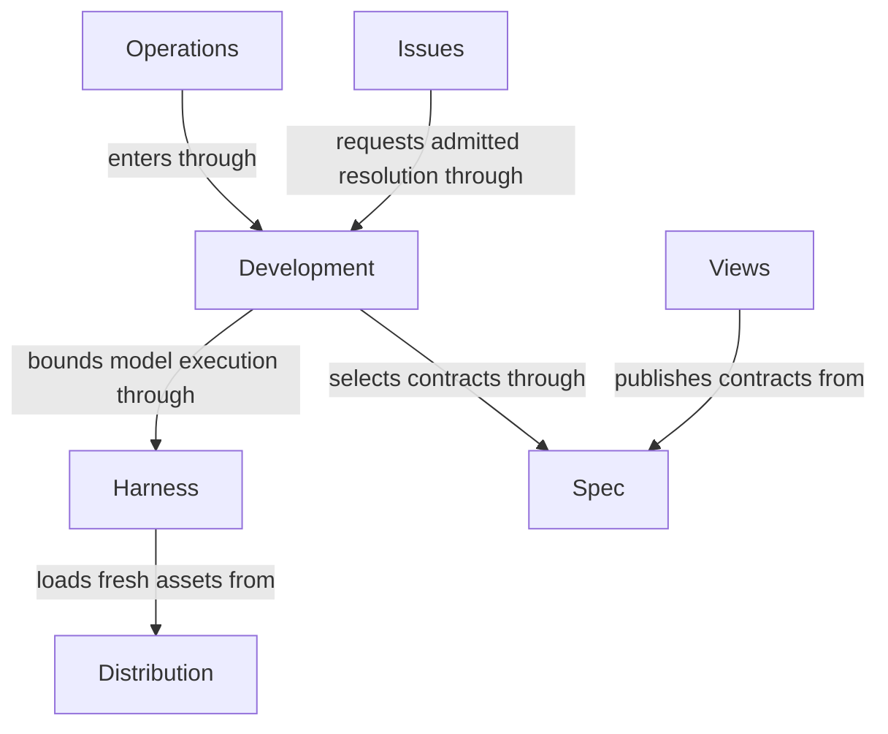

# Concorde Framework

## Purpose

Concorde helps developers agree on what software should do, execute changes within explicit boundaries and check the result before delivery. It provides complete, composable Operations for those tasks, supported by specifications that explain responsibilities, design and precise behavior. Developers can also ask questions, inspect documentation and track problems without starting a code change.

## Terminology

| Term | Meaning / definition |
| --- | --- |
| [Operation](concepts.md#terminology) | Defined in Concepts for reading Concorde. |
| [Module](concepts.md#terminology) | Defined in Concepts for reading Concorde. |
| [Spec](concepts.md#terminology) | Defined in Concepts for reading Concorde. |
| [Graph](concepts.md#terminology) | Defined in Concepts for reading Concorde. |
| [State](concepts.md#terminology) | Defined in Concepts for reading Concorde. |
| [Skill](concepts.md#terminology) | Defined in Concepts for reading Concorde. |
| [Host](concepts.md#terminology) | Defined in Concepts for reading Concorde. |
| [Harness](concepts.md#terminology) | Defined in Concepts for reading Concorde. |
| [Candidate](concepts.md#terminology) | Defined in Concepts for reading Concorde. |
| [Ready](concepts.md#terminology) | Defined in Concepts for reading Concorde. |
| [Delivery](concepts.md#terminology) | Defined in Concepts for reading Concorde. |
| [Issue](concepts.md#terminology) | Defined in Concepts for reading Concorde. |
| [Evidence](concepts.md#terminology) | Defined in Concepts for reading Concorde. |

## Usage

Choose the Operation that matches your goal. After installation and project initialization,
`concorde-main` answers a question or finds an owner. `concorde-specify-loop` prepares a contract;
`concorde-dev-loop` develops a change. Configure the worker model separately. Public Operations
are exposed through Skills and the common launcher; internal Operations are complete building
blocks for admitted compositions, not unrestricted alternative entry points.

For example, adding retries first requires deciding which failures permit them. Concorde prepares
that rule, plans the work, implements it and obtains current checks and independent review. If a
necessary promise is missing, the dependent step pauses rather than guessing from implementation.
A ready result is not a merge. Delivery requires a separate request and normally removes the
candidate worktree; merging into primary requires additional explicit authorization.

### Developer entry points

| Intent | Operation and completion |
| --- | --- |
| Ask about a Spec or route a task | `concorde-main` returns an answer or attributed limitation without editing Specs or code; an explicit worker Issue report is host bookkeeping. |
| Prepare a Spec | `concorde-specify-loop` completes independent authoring and review, before planning or implementation. |
| Review a task | `concorde-review` returns independent Spec/code coverage and findings without creating a development change. |
| Develop a change | `concorde-dev-loop` composes specification, planning, implementation and verification to a ready candidate, recording explicitly authorized skips. |
| Initialize a project | `concorde-init` proposes then applies configuration and an honest Module stub without overwriting an existing project. |
| Configure workers | `concorde-configure` applies explicit supported model, thinking and timeout selections. |
| Check a candidate | `concorde-validate` records current deterministic evidence; failed or stale evidence cannot establish readiness. |
| Deliver a candidate | `concorde-deliver` stages an independent branch and normally removes its source worktree; primary merging is a separate authorization. |
| Work with Issues | `concorde-issues` inspects, reports, reopens or solves an explicit Issue; solving ends at a verified candidate, not delivery. |

[Views](views/module.md) publishes contracts and relationships and opens a preexisting code graph.
Reading a view or supplying feedback does not itself authorize changes or create an Issue.

## Design

**Operation is Concorde's only executable entity.** Each Operation declares input State, output
State updates, effects, use conditions and execution policy. It can be called as a LangGraph node
without its caller reconstructing context selection, permissions, model execution or result checks.
Its implementation may be deterministic code, model execution or a compiled graph; composition
produces another Operation. `dev-loop` and `specify-loop` are examples of composed Operations.

Completeness does not eliminate trusted infrastructure. The common Host and Harness apply an
Operation's declared permission ceiling to the actual task and narrow the effective grant.
Trusted Runtime context supplies execution services; State carries data and cannot carry or expand
authority. Public/internal exposure changes entry availability, not this completeness obligation.

The Developer supplies intent and constraints through installed Skills. The independent Spec
Protocol defines Module ownership, complete context and readable contracts. A **Module owns a
responsibility and its Spec**; it is not a synonym for an Operation. Planning can own several
Operations, and a development Operation composes behavior from several provider Modules.

The Framework has seven direct responsibility owners. [Operations](operations/module.md) groups
ten provider Modules, including the owners of composed development and specification Operations.
[Development](development/module.md) provides the common admission Host; [Harness](harness/module.md)
provides bounded model execution; [Spec](spec/module.md) resolves identities and complete contexts.
[Distribution](distribution/module.md) supplies fresh runnable assets, [Issues](issues/module.md)
retains problems and [Views](views/module.md) publishes contracts.

Framework acceptance tests exercise requests across those responsibilities. Each provider owns
its local behavior; cross-provider tests check that composition preserves the Framework promises.
The [ownership ledger](ownership-migration.md) records historical extraction limits rather than
replacing the current architecture.

## Relationships

This diagram shows responsibility ownership and supporting services, not an executable graph.
The Operations hierarchy includes composed behavior providers; it does not make their called
providers children of the calling Operation. Three relations stay independent: Module ownership,
Operation composition through graph nodes, and explicit references selecting context.

The [collaboration agreements](collaborations.md) state conditions, relied-upon guarantees and local
duties for each direct child. Root context explicitly includes provider collections for reader
understanding; neither hierarchy nor those providers' own references expand that context implicitly.
A relationship grants neither implementation access nor execution authority.

### Project diagram convention

Concorde's own reading diagrams use English labels, accessible titles and descriptions. Conceptual
views explain one collaboration; exact executable graphs live in their owners' Implementation
Specs and are checked against compiled LangGraph topology. A diagram is not another ownership or
permission declaration.

## Compatibility and unresolved information

Protocol 10/Profile 15 uses Operations and graphs consistently. Old executable names and record
formats require the explicit refusal or migration described in the
[Host boundary](development/interfaces.md#wire-contracts); byte-bound evidence must be rebuilt.
The source-maintenance record is `docs/changes/operations-graphs.md`, separate from current Spec
context and execution evidence.
Unresolved behavioral facts remain with their provider owners. Structural validation does not
prove semantic completeness, and direct maintenance creates no lifecycle-ready or delivery evidence.

## Precise specifications

The root owns [requirements](requirements.md) and [scenarios](scenarios.md). Its provider Modules own
their own precise contracts; grouping them under Operations neither copies nor weakens those promises.
