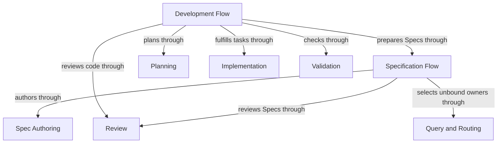
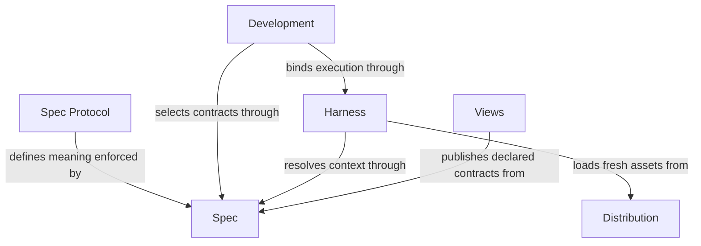

# Concorde Framework

## Purpose

Concorde helps developers agree on what software should do, carry out changes within explicit boundaries, and check the result before delivery. Its specifications explain responsibilities and design as well as precise behavior. Developers can also ask questions, inspect documentation and track problems without starting a code change.

## Terminology

| Term | Meaning / definition |
| --- | --- |
| [Module](concepts.md#terminology) | Defined in Concepts for reading Concorde. |
| [Spec](concepts.md#terminology) | Defined in Concepts for reading Concorde. |
| [Capability](concepts.md#terminology) | Defined in Concepts for reading Concorde. |
| [Candidate](concepts.md#terminology) | Defined in Concepts for reading Concorde. |

## Usage

Choose the operation that matches your goal. Use `concorde-main` to ask about the project or find an
owner, `concorde-specify-loop` to prepare a contract, or `concorde-dev-loop` to develop a change.
Install and initialize the project before these workflows, and configure the worker model separately.

For example, asking to add retries first requires deciding which failures allow them. Concorde can
prepare that rule, then plan and implement the behavior, run checks and obtain independent review.
If a necessary promise is missing, the dependent step pauses rather than guessing from code.

A ready result is not a merge. Delivery is explicit and normally removes the candidate worktree;
primary merging needs separate authorization. Questions, previews and Issue inspection have different
completion boundaries from development. Choose an entry below, then read that Module's explanation.

### Developer entry points

| Intent | Entry and completion |
| --- | --- |
| Ask about a Spec or route a task | `concorde-main` takes intent and optional target/focus hints; an answer or attributed limitation completes a query without editing Specs or code; an explicit worker Issue report is host bookkeeping. |
| Prepare or review a Spec | `concorde-specify-loop` completes independent Spec preparation; Planning and Implementation are separate downstream choices. |
| Review a task | `concorde-review` returns independent Spec/code coverage and findings without creating a development change. |
| Develop a change | `concorde-dev-loop` takes task/constraints and optional authoring/review flags; completion is a ready candidate, with explicit skips where authorized. |
| Initialize a project | `concorde-init` proposes then applies initial configuration and an honest Module stub; an existing project cannot be overwritten. |
| Change worker configuration | `concorde-configure` applies an explicit supported Pi worker model/thinking/timeout selection to an initialized project. |
| Check a candidate | `concorde-validate` records current deterministic evidence; a failed or stale check cannot establish readiness. |
| Deliver a candidate | `concorde-deliver` stages the selected change on an independent branch and removes its worktree by default; only a separate explicitly authorized request by the sole primary writer merges it into the primary branch. |
| Work with Issues | `concorde-issues` lists, shows, reports, reopens or solves an explicit Issue; solving ends at a verified candidate, not delivery. |

Human views are complementary entries: Views presents registered contracts and declared relationships and opens a preexisting raw code graph. A view or feedback comment does not itself authorize code changes, claim Spec/code agreement or create an Issue. The developer's explicit intent and constraints determine a subsequent task.

## Design

The Framework realizes its entry contract almost entirely through sixteen child responsibilities
and owns no product code of its own. The common Development host admits typed requests;
providers own reusable behavior and sibling Flows own sequencing. Spec supplies identities and
complete contexts, Harness bounds worker execution, and Distribution supplies fresh runtime assets.
This separates permission and admission from model decisions. Validation and Review produce
revision-bound evidence; Delivery consumes it only at a separately authorized boundary.

Acceptance tests exercise requests across several child responsibilities. This checks that the
composition works together, not just that each isolated part reports success. The Framework owns
those end-to-end promises while each child owns its local behavior.

The child collaboration declarations below explain which guarantees support each entry. Reference
inclusion preserves their ownership and is not permission to inspect their implementations. The
[ownership ledger](ownership-migration.md) records realization sharing and remaining extraction
limits; logical responsibility boundaries do not imply separate runtime packages.

The Developer supplies intent through installed Skills. The independent Spec Protocol defines complete content and the human-readable subset; the Spec Module enforces the accepted binding rather than inventing software behavior.

## Relationships

The Framework contains sixteen Module responsibilities. The diagrams below answer two questions:
which providers contribute to a change, and which services make that work possible? They show scoped
collaborations, not every field, file or executable node.

Specification Flow settles intended behavior through authoring and review. Development Flow adds
planning, implementation and verification. These providers are reusable siblings: using Planning
does not make Planning a child owned by the workflow.

The foundations serve a different purpose. Spec supplies the agreed contracts, Harness bounds worker
execution, and Development checks and dispatches requests. Distribution prepares runnable assets,
Views makes the contracts readable, and Issues retains problems. Delivery remains a separate decision
after the development result has been checked.

A developer request carries intent and constraints. Project Specs supply promised behavior; a candidate worktree holds proposed changes and revision-bound evidence. A ready candidate ends development; only a separately authorized delivery updates the destination.

### Flow composition

This view shows reusable providers behind development and specification. All depicted Modules are
siblings under Concorde Framework; using a provider does not make it a child of the consuming Flow.
The Usage table selects entry points, and Development admits every capability invocation.

### Runtime foundations

This view separates contract meaning, execution and distribution. Delivery remains a separately
selected transition. Issues hands selected intended behavior to Development Flow; Topology uses Query and
Routing for design context. Their complete local obligations remain in the collaboration agreements
below rather than being compressed into every overview edge.

### Project diagram convention

Every Concorde Module MUST describe its principal entities and directed relationships with an inline Mermaid diagram in the Relationships section of its `module.md`. Labels, titles, descriptions and explanatory prose use English. Include an accessible title and description, and explain the relationships, cardinalities or state rules needed to read the diagram. This is a Concorde project convention under the tool-neutral Spec Protocol, not a change to the independent standard. Rendered SVG/HTML and navigation remain derived views.

## Provider collaboration

Spec and Harness establish the contract and execution boundary. Development admits operations,
while planning, authoring, implementation, review and validation each own a distinct result.
Specification Flow and Development Flow choose their order; Delivery remains a later decision.
Issues preserves problems, Distribution supplies runnable assets, and Views makes the project
understandable without granting additional execution authority.

The Module-owned [collaboration agreements](collaborations.md) state each provider’s conditions,
guarantees and local duties once. A dependency is not another structural parent or code grant.

## Unresolved information

None beyond what each child Module records in its own Unresolved information: this root Module delegates every unresolved business fact to the child Module that owns the affected contract.

## Ownership, context and implementation status

This root owns its reading entry, migration ledger and precise specification companions and explicitly references all sixteen child Modules, so its resolved context includes their owned documents once. Child references do not expand again. Protocol 9/Profile 14/schema 5 is implemented by repository admission, context delivery, authoring and publication. Separately recorded realization-extraction limits remain explicit. This maintenance produces no lifecycle-ready or delivery evidence.

See the [ownership migration ledger](ownership-migration.md) for preserved IDs, transferred definitions and adapter limitations.

## Precise specifications

The Concorde Framework Module owns the exact obligations and interface details in [requirements](requirements.md), [scenarios](scenarios.md).
These companions are part of the same complete Module specification, not separate topic owners.
