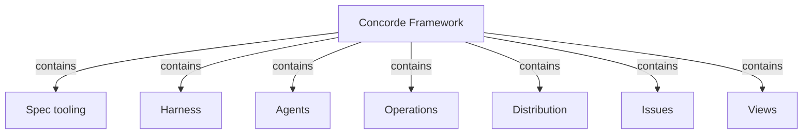

# Concorde Framework

## Purpose

Concorde keeps a project's Specs at the center of AI-assisted development. The Specs explain what
each part of the software is for, how it is designed and what it precisely promises; Concorde's
agents work inside boundaries derived from those Specs; and every code change is made in its own
candidate worktree, checked, independently reviewed and delivered only when the developer asks.
A developer uses Concorde from the Pi coding agent, both to change a project and to understand it.
Concorde does not decide business behaviour, does not run an autonomous development loop, and never
merges into the primary branch without explicit authorization.

## Terminology

| Term | Definition |
| --- | --- |
| [Agent](agents/module.md#concept.agents.agent) | |
| [Workflow](harness/execution/module.md#concept.execution.workflow) | |
| [Operation](operations/module.md#concept.operations.operation) | |
| [Candidate](harness/worktrees/module.md#concept.worktrees.candidate) | |
| [Issue](issues/module.md#concept.issues.issue) | |

The words shared by every Module — developer, user session, capability, Module, Spec, context,
boundary, Host, worker and evidence — are defined in the [shared vocabulary](vocabulary.md). Read it
first if Concorde is new to you.

## Usage

### Setting up

Install Concorde into a project with its installer, then call `concorde-init` to create an honest
starting Spec. From then on, open the project in Pi: the session extension adds one tool,
`concorde`, whose `describe` action explains every capability and whose `run` action calls one.

### Making a change

A typical change runs as a sequence of explicit calls, each chosen by the user session:

1. **Agree on the Spec.** The user session and the developer read the owning Module's Spec and edit
   it until it states the intended behaviour. `concorde-spec-review` gives an independent opinion.
2. **Check sufficiency and plan.** `concorde-context-solve` tells whether the Spec says enough for
   the task; `concorde-plan` writes a plan for one Module in a new candidate worktree.
3. **Derive and implement tasks.** `concorde-tasks` turns the accepted plan into acceptance tasks;
   `concorde-implement` lets a programmer worker change only that Module's implementation files.
4. **Check and review.** `concorde-code-review` reviews the code against the Spec;
   `concorde-validate` runs the deterministic checks and records evidence.
5. **Deliver.** `concorde-deliver` stages the ready candidate on its own branch. Merging it into the
   primary branch is a separate decision.

If a step finds that the Spec does not say something it needs, it stops and reports the gap instead
of guessing from code. The developer fixes the Spec, and the step is repeated with current inputs.

For example, adding retries to a network client starts by deciding which failures may be retried,
written into the client Module's Spec. Only then is a plan written, and the programmer receives
tasks that cite that promise.

### Other capabilities

| Capability | Use it to |
| --- | --- |
| `concorde-issues` | list, show, report, reopen or solve a recorded Issue |
| `concorde-configure` | choose the model, thinking level and time limits of workers |
| `concorde-init` | create the first Spec of an uninitialized project |

The Specs can also be published as a documentation site, which is the easiest way to read them.

## Design

Concorde is built around one idea: **the Spec, not the code, is the shared source of truth between
the developer and the agents.** The rest of the design follows from making that safe and practical.

- **Specs are structured** so that both humans and tools can read them. The [Spec tooling](spec/module.md)
  Module loads and checks every Spec and computes, from the declarations alone, what a task bound to
  a Module may read and write.
- **Agents are bounded.** The [Harness](harness/module.md) admits every capability request, freezes
  the task's context, runs each model step as a fresh worker, and accepts results only after the Host
  has checked them. [Agents](agents/module.md) defines every callable agent once.
- **Capabilities are small and explicit.** [Operations](operations/module.md) lists the public
  capabilities and routes each request to the Module that owns its behaviour: Planning,
  Implementation, Review, Validation or Delivery. None of them calls the next one; the user session
  stays in charge of the sequence.
- **Changes are isolated.** Every mutating task runs in a candidate worktree, so the primary branch
  stays untouched until the developer decides.
- **Problems are remembered.** [Issues](issues/module.md) keeps durable records of gaps and defects
  that outlive one conversation.
- **Concorde ships and explains itself.** [Distribution](distribution/module.md) builds and installs
  the Framework and its Pi integration; [Views](views/module.md) publishes the Specs as a website.

The same Protocol governs Concorde's own Specs, so this project is also the reference example of a
Concorde project.

## Relationships

**Spec tooling** is the foundation: every other Module relies on it to know which documents exist, who owns
them, and what a task may read. Concorde relies on it to reject inconsistent Specs before any agent
sees them.

**Harness** is the execution boundary. Every capability request enters through it, and every model
step runs under it. Concorde relies on it to keep model output a proposal until the Host accepts it.

**Agents** supplies the definitions of the callable agents that the Harness runs and that the
providers under Operations call.

**Operations** turns a capability name into the owning provider's behaviour. Its five providers own
planning, implementation, review, validation and delivery.

**Distribution** produces what a developer installs and runs: the built assets, the installer, the
managed runtime and the Pi session integration.

**Issues** is used by every worker that finds a problem and by the `concorde-issues` capability.

**Views** publishes the Specs for reading; a published page never grants context or authority.

The root Module also owns the project-level files that belong to no single responsibility: the
README and contribution guide, the licence, repository configuration, the CI workflow that validates
this checkout, and the documentation assets.

Its **acceptance tests** exercise whole flows that cross several Modules, such as installing into a
consumer project or driving a candidate from planning to delivery; the promises they verify are the
root's [scenarios](scenarios.md).
