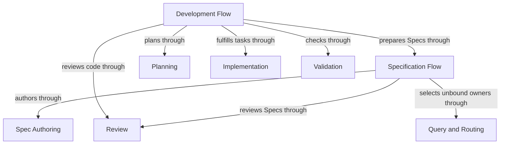
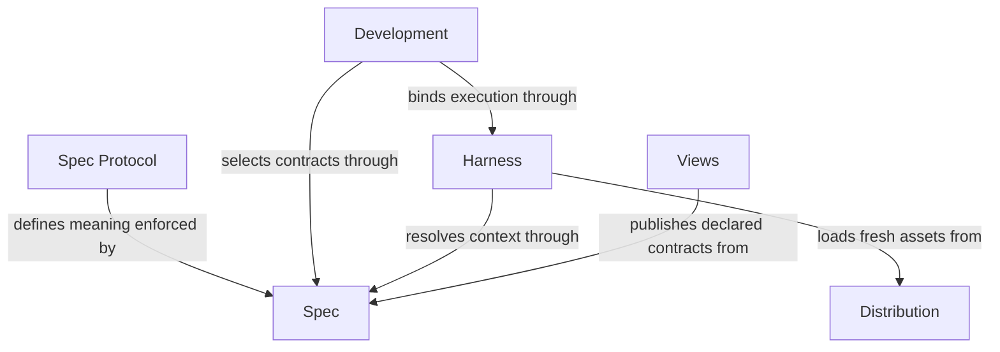

# Concorde Framework

## Purpose

Concorde Framework helps developers author and maintain architecture-aware Module Specs, understand
their projects through a Spec docsite and Understand Anything graph views, and guide agents with
explicit context and permissions. Specs describe software responsibilities, behavior, entities and
relationships together. Twelve built-in Pi worker agents support specification and development.
Agent observability covers their working process and results:
LangGraph Studio exposes execution Flows and live stage and agent-process events, while recorded
context, permission policies, checks and reviews provide inspectable evidence.
The Issue system retains classified bugs, contract gaps and limitations reported during bounded
work. Reporting does not itself stop a worker. Explicit solving composes ordinary development and
verification, permits evidence-grounded autonomous disposition, and asks the developer only for
unsettled choices while preserving file authority and the separate delivery boundary.

## Usage

Start with the responsibility you need, not an implementation package. Ask a question with
`concorde-main`, prepare a contract with `concorde-specify-loop`, or carry an intended change to a
ready candidate with `concorde-dev-loop`. Supply the task and constraints; target and scenario
hints help selection but do not grant access. A Module is a cohesive responsibility, so it may
be used by another Module even when it has no command or package of its own.

Install Concorde before initializing a consumer project. Initialization proposes an honest draft;
it does not infer business behavior from code. Configure the worker model separately. During work,
a missing necessary promise pauses the dependent step, and failed progress remains inspectable.
Validation records evidence, not proof of universal correctness. Delivery is a separate choice:
by default it publishes an independent branch and removes the source worktree, not merges primary.
The entry table below identifies the available actions and their completion boundaries.

### Developer entry points

| Intent | Entry and completion |
| --- | --- |
| Ask about a Spec or route a task | `concorde-main` takes intent and optional target/focus hints; an answer or attributed limitation completes a query without editing Specs or code; an explicit worker Issue report is host bookkeeping. |
| Prepare or review a Spec | `concorde-specify-loop` completes independent Spec preparation; Planning and Implementation are separate downstream choices. |
| Review a task | `concorde-review` returns independent Spec/code coverage and findings without creating a development change. |
| Develop a change | `concorde-dev-loop` takes task/constraints and optional authoring/review flags; completion is a ready candidate, with explicit skips where authorized. |
| Initialize a project | `concorde-init` proposes then applies initial configuration and an honest Module stub; an existing project cannot be overwritten. |
| Change worker configuration | `concorde-configure` applies an explicit supported Pi worker model/thinking/timeout selection to an initialized project. |
| Check a candidate | `concorde-validate` records current deterministic evidence; a failed or stale check cannot establish readiness. |
| Deliver a candidate | `concorde-deliver` stages the selected change on an independent branch and removes its worktree by default; only a separate explicitly authorized request by the sole primary writer merges it into the primary branch. |
| Work with Issues | `concorde-issues` lists, shows, reports, reopens or solves an explicit Issue; solving ends at a verified candidate, not delivery. |

Installed Skills use a single schema-3 capability invocation with `capability_id`, execute or describe-policy mode, configuration and a version-1 typed request. Unsupported versions, malformed requests and configuration mismatch fail admission. The result reports succeeded, blocked, failed or described; domain output still distinguishes a ready candidate, gap, conflict or completed answer. Describe-policy reports the bound grant without launching an Agent. Standard execution can create candidate state and invoke separately bounded Agents; only the admitted action can change files.

Human views are complementary entries: Views presents registered contracts and declared relationships and opens a preexisting raw code graph. A view or feedback comment does not itself authorize code changes, claim Spec/code agreement or create an Issue. The developer's explicit intent and constraints determine a subsequent task.

## Design

The Framework realizes its entry contract almost entirely through sixteen child responsibilities
and owns no product code of its own. The common Development host admits typed requests;
providers own reusable behavior and sibling Flows own sequencing. Spec supplies identities and
complete contexts, Harness bounds worker execution, and Distribution supplies fresh runtime assets.
This separates permission and admission from model decisions. Validation and Review produce
revision-bound evidence; Delivery consumes it only at a separately authorized boundary.

The one realization this Module does bind is its acceptance tests, because its promises are
end-to-end by construction: each entry is kept by a routed request that crosses several children,
so no single child's contract can carry the evidence that the composition works. These tests drive
a request through the real entry point and observe the whole outcome — a routed change reaching a
ready candidate, a gap or failure stopping dependent work while progress stays inspectable, an
answer grounded in registered documents, adoption, worker configuration, recorded check evidence,
a staged delivery, and read-only Issue inspection. They are ordinary implementation files shared
with the children whose behavior they also exercise; binding them here records that this Module is
verified end to end, not that it owns their subjects.

The child collaboration declarations below explain which guarantees support each entry. Reference
inclusion preserves their ownership and is not permission to inspect their implementations. The
[ownership ledger](ownership-migration.md) records realization sharing and remaining extraction
limits; logical responsibility boundaries do not imply separate runtime packages.

The Developer supplies intent through installed Skills. The independent Spec Protocol defines complete content and the human-readable subset; the Spec Module enforces the accepted binding rather than inventing software behavior.

## Relationships

Sixteen Modules have this Module as their sole structural parent. The scoped diagrams show principal responsibility dependencies; each consumer's local contract states all of its registered uses. **Spec** owns the project's Spec model: the pinned Protocol binding, the registry, structural validation and initialization. **Harness** owns how an Agent is configured and run: the four context kinds it freezes, Agent and Harness definitions, permissions, Pi worker execution and the LangGraph control flow. **Development** owns common admission and dispatch. Planning, Implementation, Spec Authoring, Review, Validation, Delivery, Query and Routing, and Topology own cohesive provider contracts. Development Flow and Specification Flow compose them as siblings. **Issues** retains classified observations, admits report references and composes bounded solving through Development providers. **Distribution** builds authored projections, installs them and provisions the managed runtime. **Views** publishes registered Specs and opens an existing code graph.

A developer request carries intent and constraints. Project Specs supply promised behavior; a candidate worktree holds proposed changes and revision-bound evidence. A ready candidate ends development; only a separately authorized delivery updates the destination.

### Flow composition

This view shows reusable providers behind development and specification. All depicted Modules are
siblings under Concorde Framework; using a provider does not make it a child of the consuming Flow.
The Usage table selects entry points, and Development admits every capability invocation.

### Runtime foundations

This view separates contract meaning, execution and distribution. Delivery remains a separately
selected transition. Issues hands selected intended behavior to Development Flow; Topology uses Query and
Routing for design context. Their complete local obligations remain in the collaboration agreements
below rather than being compressed into every overview edge.

### Project diagram convention

Every Concorde Module MUST describe its principal entities and directed relationships with an inline Mermaid diagram in the Relationships section of its `module.md`. Labels, titles, descriptions and explanatory prose use English. Include an accessible title and description, and explain the relationships, cardinalities or state rules needed to read the diagram. This is a Concorde project convention under the tool-neutral Spec Protocol, not a change to the independent standard. Rendered SVG/HTML and navigation remain derived views.

## Requirements

### req.concorde.routing-no-access — No access beyond frozen context

A routing or target/focus hint SHALL NOT by itself grant file access beyond the selected Module's
frozen context.

### req.concorde.read-no-mutate — No mutation from read operations

A read or preview operation SHALL NOT modify project Specs, implementation or topology.

A worker may explicitly report a classified Issue through its host reporting tool; that limited
bookkeeping effect grants no project-file write authority to the worker. Policy previews and
queries of stored issue metadata remain free of issue-creation effects.

### req.concorde.versioned-result — Versioned result per invocation

Every invocation SHALL return a versioned capability result that distinguishes admission failure,
execution failure and the domain outcome.

### req.concorde.preserve-user-content — Preservation of developer-owned content

Installation and configuration changes SHALL preserve content the developer owns.

### req.concorde.no-overwrite-initialized — No overwrite of initialized projects

Initialization SHALL NOT overwrite an already-initialized project.

### req.concorde.delivery-separate — Delivery as a separately authorized step

Delivery to a destination SHALL require a separately authorized transition beyond a ready candidate.

### req.concorde.unsupported-explicit — Explicit failure for unsupported versions

An unsupported capability version or integration SHALL fail explicitly rather than degrading
silently.

### req.concorde.no-stale-replay — No replay of stale effects

A repeated mutation SHALL re-admit current saved state or require a fresh proposal rather than
replaying a stale effect.

## Scenarios

These scenarios state what a developer request accomplishes at the Framework's single entry point. Each routes to the child Module that supplies the underlying behavior, described locally under "Local collaboration agreements" below.

### scenario.concorde.develop-change — Successful development to a ready candidate

- GIVEN a developer supplies intended behavior and constraints
- WHEN the Framework routes the change to its providing Module and coordinates specification, planning, implementation and required evidence
- THEN the request completes with one ready candidate that meets its configured completion conditions
- AND delivery to a destination remains a separate, explicitly authorized transition

### scenario.concorde.develop-gap — Missing promise stops dependent work

- GIVEN a routed change depends on a Module promise that is not specified
- WHEN development reaches that dependency
- THEN the Framework stops the dependent work and reports the gap against its owning Module
- AND independent work in the same candidate continues
- BUT the candidate does not reach ready

### scenario.concorde.develop-failure — Failed step preserves inspectable progress

- GIVEN a routed change fails during specification, planning, implementation or evidence collection
- WHEN the failure occurs
- THEN the candidate's progress remains inspectable and resumable
- BUT the candidate is not represented as a completed delivery

### scenario.concorde.inspect-answer — Answering a Spec-grounded question

- GIVEN a developer asks a Spec-grounded question or requests a Spec or existing code-graph view
- WHEN the request is routed to Query and Routing or Views
- THEN the response is grounded in registered Spec documents and declared relationships, or in an existing raw code graph
- AND answering the question does not mutate any project contract

Project-owned custom documentation is a separate human reading surface outside Spec queries and
agent Spec context; it does not acquire authority as a registered Module contract.

### scenario.concorde.inspect-gap — Missing Spec promise reported

- GIVEN a requested answer depends on a promise that is not specified
- WHEN the query is answered
- THEN the selected interface reports the missing promise
- BUT does not guess or invent the missing behavior

### scenario.concorde.adopt-initialize — Initializing an uninitialized project

- GIVEN an uninitialized project and a supported integration
- WHEN the developer previews and applies installation, then explicitly proposes and applies initialization
- THEN initialization pins the accepted installed Protocol binding and creates an honest Module stub
- AND unspecified business behavior is recorded as an explicit draft gap

### scenario.concorde.adopt-conflict — Conflicting ownership prevents adoption

- GIVEN an installation target already owns conflicting state, or provisioning fails
- WHEN adoption is attempted
- THEN adoption does not complete
- AND the Framework recovers previously valid owned state
- BUT no partially applied owned state is left in place

### scenario.concorde.configure-apply — Applying Pi worker configuration

- GIVEN an initialized project and an explicit, supported Pi worker model/thinking/timeout configuration
- WHEN the developer applies it
- THEN the Framework updates the configured worker selection accordingly
- BUT an unsupported configuration value fails explicitly

### scenario.concorde.validate-record — Recording current deterministic evidence

- GIVEN a candidate under development
- WHEN the developer checks it
- THEN the Framework records current deterministic Spec and configured code check evidence for that candidate
- BUT a failed or stale check cannot establish readiness

### scenario.concorde.deliver-stage — Staging a verified change for delivery

- GIVEN a ready candidate
- WHEN the developer requests delivery
- THEN the Framework stages the change on an independent branch and removes its worktree by default
- BUT merging into the primary branch requires a further, separately authorized request by the sole primary writer

### scenario.concorde.issues — Working with recorded feedback

- GIVEN feedback or a persistent gap recorded against a Module or scenario identity
- WHEN the developer inspects it through concorde-issues
- THEN inspection is read-only
- AND any mutation follows its declared evidence and disposition conditions

## Local collaboration agreements

These entries describe the sixteen children registered for this Module from the Framework's own perspective. Each child's complete contract is its own registered collection; these promises are only what the composition relies on.

### Spec

Owns the project Spec model: the pinned Protocol binding, the explicit registry, structural validation, stable-ID file-set queries and honest initialization.

This collaboration applies when any entry must identify a Module, resolve its documents and entity file bindings, or initialize a project.

- [Use deterministic identity and context resolution for routing](spec/registry.md#stable-id-spec-context-queries)
- [Require structural validation before bounded work](spec/structure.md#scenario.spec.validate-success)
- [Begin with an honest pinned stub when creating a project](spec/initialize.md#scenarios)

### Harness

Configures and runs every Agent invocation: freezes its context kinds, binds its Agent and Harness definition, compiles its effective permissions, launches its Pi worker and coordinates it through LangGraph control flow.

This collaboration applies when an entry needs an Agent to reason or act.

- [Freeze the selected contract before invocation](harness/context.md#contract.context.selection)
- [Keep invocation authority bounded](harness/module.md#req.harness.permission-no-widen)
- [Require typed completion before reporting success](harness/module.md#req.harness.execute-exit-insufficient)
- [Compose inspectable bounded control flow](harness/graphs-and-loops.md)

### Development

Supply common capability admission, dispatch, typed outcomes and host-owned state mechanics.

Whenever a capability enters or resumes through the common boundary.

- [Admit typed requests, preserve current worktree binding and distinct outcomes](development/interfaces.md#capability-execution-boundary)

### Issues

Retains, investigates and resolves explicitly attributed project feedback and persistent gaps.

This collaboration applies when a developer works with recorded feedback.

- [Report and reference classified problems without changing task control](issues/interfaces.md)
- [Solve with bounded authority and evidence-grounded disposition](issues/lifecycle.md)

### Distribution

Owns Skill sources and shared invocation instructions, builds authored projections, installs and configures owned integrations, provisions the managed runtime and keeps a source checkout's own projections bound to the worktree that built them.

This collaboration applies when a project adopts, updates or configures the Framework, or when built assets must be current.

- [Preserve user-owned content during installation](distribution/installation.md)
- [Require valid provisioning evidence](distribution/runtime.md)
- [Reject stale projections before execution](distribution/build.md)

### Views

Publishes registered Module Specs as a navigable documentation site and opens an existing raw code graph with the verified installed viewer.

This collaboration applies when a developer wants to read Specs or inspect the code graph.

- [Publish one canonical definition with owner and inclusion provenance](views/publication.md#scenario.views.publish-reference-link)
- [Keep project contracts unchanged during viewing](views/viewer.md)

### Planning

Planning assesses whether a selected Module contract supports a task, creates a revision-bound plan and derives implementation acceptance tasks. It serves admitted composing capabilities with separate assessment, plan and task contracts; no development-loop history is an implicit source of software meaning.

This collaboration applies when the request concerns Planning.

- [Planning contract](planning/assessment.md); preserve its admission conditions, retain distinct blockers and do not infer wider authority from composition.

### Implementation

Implementation fulfills an admitted task list within the selected Module implementation grant and reports exact task completion. It serves composing capabilities that supply current plans and tasks, and distinguishes local code writing from separately admitted component coordination.

This collaboration applies when the request concerns Implementation.

- [Implementation contract](implementation/implementation.md); preserve its admission conditions, retain distinct blockers and do not infer wider authority from composition.

### Spec Authoring

Spec Authoring proposes complete replacements for the selected Module's owned Spec documents from its complete contract and an explicit task. It serves specification flows and other declared callers; independent review and flow completion belong to their consumers.

This collaboration applies when the request concerns Spec Authoring.

- [Spec Authoring contract](spec-authoring/authoring.md); preserve its admission conditions, retain distinct blockers and do not infer wider authority from composition.

### Review

Review independently evaluates an admitted task against current Module contracts and, in code mode, its separately granted implementation. It serves standalone callers and composing flows with revision-bound coverage, findings and gaps, without repairing or delivering the reviewed work.

This collaboration applies when the request concerns Review.

- [Review contract](review/review.md); preserve its admission conditions, retain distinct blockers and do not infer wider authority from composition.

### Validation

Validation collects deterministic structural and configured implementation-check evidence for the current candidate and evaluates the applicable readiness gates. It serves explicit validation requests and composing flows; neither a development plan nor dev-loop invocation is universally required.

This collaboration applies when the request concerns Validation.

- [Validation contract](validation/validation.md); preserve its admission conditions, retain distinct blockers and do not infer wider authority from composition.

### Delivery

Delivery stages a verified candidate on an independent branch, cleans up its source worktree and separately merges into the primary branch when explicitly authorized. It serves participating outer sessions and consumes current evidence without owning the flow that produced the candidate.

This collaboration applies when the request concerns Delivery.

- [Delivery contract](delivery/delivery.md); preserve its admission conditions, retain distinct blockers and do not infer wider authority from composition.

### Query and Routing

Query and Routing answers questions from explicitly selected complete Module contexts and selects one owning Module for a routed task. It serves the main entry and discovery consumers, preserving caller intent without reading implementation to infer behavior.

This collaboration applies when the request concerns Query and Routing.

- [Query and Routing contract](query-routing/query-and-routing.md); preserve its admission conditions, retain distinct blockers and do not infer wider authority from composition.

### Topology

Topology designs, prepares and atomically applies changes to registered Module structure and owned definitions. It serves developers evolving ownership, references, dependencies and file bindings through the existing accepted design and application boundaries.

This collaboration applies when the request concerns Topology.

- [Topology contract](topology/topology.md); preserve its admission conditions, retain distinct blockers and do not infer wider authority from composition.

### Development Flow

Development Flow composes sibling providers to carry one intended change through Spec preparation, planning, tasks, implementation, validation and independent code review to a ready candidate. It owns that sequence, candidate lifecycle, bounded repair and stop policy, while each provider owns its own reusable contract.

This collaboration applies when the request concerns Development Flow.

- [Development Flow contract](dev-loop/development.md); preserve its admission conditions, retain distinct blockers and do not infer wider authority from composition.

### Specification Flow

Specification Flow composes routing, Spec Authoring and Review to prepare or review one Module contract independently of implementation. It owns Spec-stage ordering, accepted-authoring reuse and Spec-review completion, and returns before planning or readiness.

This collaboration applies when the request concerns Specification Flow.

- [Specification Flow contract](specify-loop/specify-loop.md); preserve its admission conditions, retain distinct blockers and do not infer wider authority from composition.

## Unresolved information

None beyond what each child Module records in its own Unresolved information: this root Module delegates every unresolved business fact to the child Module that owns the affected contract.

## Ownership, context and implementation status

This root owns its reading entry and migration ledger and explicitly references all sixteen child Modules, so its resolved context includes their owned documents once. Child references do not expand again. Protocol 7/Profile 14/schema 5 is implemented by repository admission, context delivery, authoring and publication. Separately recorded realization-extraction limits remain explicit. This maintenance produces no lifecycle-ready or delivery evidence.

See the [ownership migration ledger](ownership-migration.md) for preserved IDs, transferred definitions and adapter limitations.
