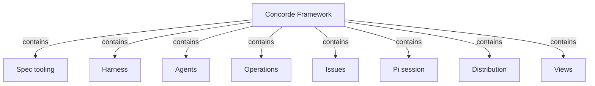

# Concorde Framework

## Purpose

Concorde is a set of Operations that an AI coding session can call, together with the
configuration of the developer's own Pi session that calls them. Each Operation does one bounded
job on a project that describes itself in Specs: checking whether a Spec says enough, planning,
writing tasks, implementing, reviewing, validating, delivering, or working on a recorded Issue.
Every model step receives a context and a permission derived from the Specs, and its answer counts
only after the deterministic Host has checked it. The developer and the user session stay in
charge: Concorde never chooses the next step, never repairs a Spec on its own and never merges into
the primary branch without explicit authorization. It does not decide business behaviour, does not
require independent review of every change, and does not confine what a model reads or runs as
strictly as its boundaries describe; the Harness states what is enforced.

## Terminology

| Term | Definition |
| --- | --- |
| [Operation](operations/module.md#concept.operations.operation) | |
| [Operation catalog](operations/module.md#concept.operations.catalog) | |
| [Agent](agents/module.md#concept.agents.agent) | |
| [Capability declaration](harness/admission/module.md#concept.admission.capability-declaration) | |
| [Workflow](harness/execution/module.md#concept.execution.workflow) | |
| [Graph](harness/execution/module.md#concept.execution.graph) | |
| [Candidate](harness/worktrees/module.md#concept.worktrees.candidate) | |
| [Issue](issues/module.md#concept.issues.issue) | |

The words every Module shares, including the four kinds of context, are defined in the
[shared vocabulary](vocabulary.md); read it first. The imported words above are the ones this entry
needs from its descendants.

## Usage

The developer installs Concorde with its installer, which places a Protocol copy under
`.concorde/protocol/`, a managed runtime and the Pi integration, and never writes the project's
Specs. The user session calls `concorde-init` to propose an honest first Spec and again to apply
that exact proposal. From then on the project is opened in Pi, whose session integration adds one
tool, `concorde`: `describe` explains every public capability, `run` calls one, and `result`
fetches the result of a running or finished call.

Each `run` goes through the launcher to Request admission, which checks the request against the
capability's declaration, binds it to a Module and a worktree, and returns a versioned result that
keeps admission failure, execution failure and domain outcome apart. A mutating call from the
primary worktree is relayed into a new candidate worktree; later calls name its `change_id`. A
preview explains an effect without performing it.

A typical change is a sequence of explicit calls chosen by the user session: agree the owning
Module's Spec with the developer (optionally `concorde-spec-review`), then `concorde-context-solve`,
`concorde-plan` (which opens the candidate), `concorde-tasks`, `concorde-implement`, optionally
`concorde-code-review`, `concorde-validate` (which decides readiness) and `concorde-deliver` (which
publishes the ready candidate on its own branch). Merging into the primary branch is a further
request stating the developer's explicit authorization. Independent review is not a gate on every
change: a review kind becomes required only when the change records it, and then later stages
refuse while it is missing or stale.

When a step needs a promise the Spec does not state, it stops with a Spec gap against the owning
Module; dependent stages refuse until the developer repairs the Spec and the step is called again.
A failed or cancelled Agent call returns an execution failure, keeps its edits in the candidate for
inspection and leaves the candidate not ready. A repeated call is admitted against current state,
never replayed from stale inputs. Problems worth keeping are recorded as Issues.

| Capability | Use it to | Provided by |
| --- | --- | --- |
| `concorde-init` | propose and apply the first Spec of a newly installed project | [Spec tooling](spec/module.md) |
| `concorde-configure` | choose the model, thinking level and time limits of Agent calls, or accept a newly installed Protocol | [Request admission](harness/admission/module.md) |
| `concorde-issues` | list, show, report, reopen or solve a recorded Issue | [Issue solving](issue-solving/module.md) |

`python3 scripts/concorde.py validate` checks the Specs, and Views publishes them as a site.

## Design

The Spec, not the code, is the shared source of truth between the developer and the agents.
Each Agent call receives the four [kinds of context](vocabulary.md#concept.concorde.context), all
derived from declarations; a code-writing Agent never edits Specs. Results are always checked by
the Host, but reads, shell use and Spec scope are not confined during model steps; the
[Harness](harness/module.md) states exactly what is enforced. Control flow is written either as a
pi workflow run by pi-subagents or as a LangGraph Graph using only the Graph API; each is explained
by a step table or a Graph Spec in its owner's Spec. Mutations run in candidate worktrees, evidence
is bound to exact inputs, and delivery and merging are separate requests. The reasons are in the
[design topic](design.md).

### Dependency layering {#dependency-layering}

Modules rely on each other only from the outside in:

- **Spec tooling** and **Observation** use nothing.
- **Issues** uses only Spec tooling and Candidate worktrees.
- The **Harness** children use only Spec tooling, Issues, Agents, Observation, each other, and
  Distribution's build-manifest contract; never Operations, its providers, the Pi session or Views.
- **Agents** uses only the providers' output contracts and concepts it names exactly, Issues'
  report service and the Harness children.
- **Operations** and its providers may use the Harness, Agents, Spec tooling, Issues and each other.
- The **Pi session**, **Distribution** and **Views** are outer Modules and may use what they need.

Every `uses` names exactly the promises it relies on. A lower Module reaches a higher one only by
inversion: admission's capability declaration, Agent execution's hooks and Spec tooling's
typed-value registration.

The root binds the **project files** that belong to no single responsibility: README, workflow
guide, agent instructions, licence, repository configuration and the CI workflow that validates
this checkout.

It binds the **development environment** of this checkout, the Python project, test roots, shared
test support, reference initializer and docsite type check, and the tests of that environment,
whose promises are in [Development environment](development.md).

Its **acceptance tests**, under `tests/concorde/acceptance/`, exercise the root's cross-Module
[scenarios](scenarios.md) through the public capabilities.

## Relationships

The composition follows the [layering rules](#dependency-layering). The Harness contains Request
admission, Task context, Agent execution, Check execution, Candidate worktrees and Observation;
Operations contains Planning, Implementation, Review, Validation, Delivery and Issue solving. Each
composite explains its own children.

How one call crosses these Modules is illustrated in the [design topic](design.md#one-call-through-the-modules).

**Spec tooling** loads the [registry](spec/module.md#concept.spec.registry) and documents, runs
every [structural check](spec/module.md#concept.spec.structural-check), computes each Module's
[boundary sets](spec/module.md#concept.spec.boundary-set), supplies the
[typed values](spec/module.md#concept.spec.typed-value) capabilities exchange, and provides
`concorde-init`. Every capability loads the Specs first, relying on it to refuse a structure that
cannot support a trustworthy boundary. The root keeps it dependency-free; when loading fails, no
capability runs until the Specs or the binding are repaired.

The **Harness** explains how an Agent is configured and run: context, control flow, Agent and
model, and permission per call, with the table of what is enforced. It applies to every call, and
the Framework relies on it to keep a model's answer a proposal until the Host accepts it. The root
keeps it independent of Operations; a Harness failure surfaces as an admission or execution
failure, never as a domain outcome.

**Agents** defines the seven domain [Agents](agents/module.md#concept.agents.agent), each by one
[definition](agents/module.md#concept.agents.definition) of identity, tools, effects, instructions
and output contract. It applies whenever an Operation runs model work, and the Framework relies on
the single definition so that preflight and instructions cannot drift. Task subagents are not
Agents. The root keeps Agents below Operations: they name providers' output contracts, never code.

**Operations** holds the [Operation catalog](operations/module.md#concept.operations.catalog)
declaring every [Operation](operations/module.md#concept.operations.operation) and the generic
dispatch to a provider's declared entry point, and contains the six providers. It applies to every
run; the Framework relies on no provider calling the next stage. `concorde-init` and
`concorde-configure` come from infrastructure Modules outside it. An unknown or non-public
Operation is refused by admission before dispatch.

**Issues** keeps durable [Issue](issues/module.md#concept.issues.issue) records and the
[report](issues/module.md#concept.issues.report) service Agents use. It applies whenever a problem
is reported, listed or solved, and the Framework relies on a report surviving the failure of its
stage. The root keeps it a record layer; solving belongs to Issue solving, and an unreadable store
is reported by its own configured check.

The **Pi session** configures the user session: the
[session entry](session/module.md#concept.session.session-entry) adding the `concorde` tool, the
private [selection](session/module.md#concept.session.selection) of one exact integration,
guidance, the Task subagents and the [coordinator](session/module.md#concept.session.coordinator)
instructions of this checkout. The Framework relies on it to send every call through the launcher
as a versioned invocation. A missing or stale selection blocks the session instead of falling back.

**Distribution** builds the [package](distribution/module.md#concept.distribution.package), installs
the [Protocol copy](distribution/module.md#concept.distribution.protocol-copy) and
[managed runtime](distribution/module.md#concept.distribution.managed-runtime), and provides the
[launcher](distribution/module.md#concept.distribution.launcher) that hands each invocation, with
the Operation catalog, to admission. The Framework relies on a failed installation leaving the
previous state intact. The Harness may rely only on its build-manifest contract.

**Views** publishes the Specs as a [documentation site](views/module.md#concept.views.published-site)
for readers. The Framework relies on a published page never granting context or authority; a
publishing failure affects no project state.
