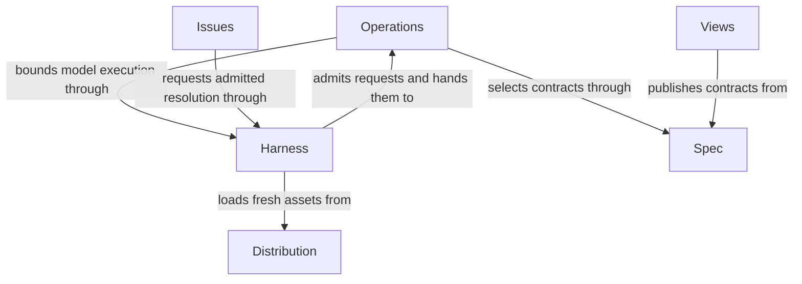

# Concorde Framework

## Purpose

Concorde helps developers agree on what software should do, execute changes within explicit boundaries and check the result before delivery. It provides complete, composable Operations for those tasks, supported by specifications that explain responsibilities, design and precise behavior. Developers can also ask questions, inspect documentation and track problems without starting a code change.

## Terminology

| Term                 | Meaning / definition                                                                                                                                                                                                                  |
| -------------------- | ------------------------------------------------------------------------------------------------------------------------------------------------------------------------------------------------------------------------------------- |
| Module               | One cohesive software responsibility, such as planning a change or publishing documentation. It need not be a separate package.                                                                                                       |
| Spec                 | The agreed description of a Module's intended behavior and design, used to guide work and judge its result.                                                                                                                           |
| Module Specs         | The explanation-first part of a Module's Spec: purpose, concepts, correct use, design and collaborations.                                                                                                                             |
| Implementation Specs | The same Module's precise requirements, acceptance situations and technical contracts. They are specifications, not source code.                                                                                                      |
| Entity               | A named participant, concept or record that matters to a Module's behavior or design. Its role is explained where it participates.                                                                                                    |
| Requirement          | A precise obligation applying across a Module, defined once with a stable identity.                                                                                                                                                   |
| Scenario             | A concrete situation with preconditions, an action and an expected outcome, used as a basis for verification.                                                                                                                         |
| Registry             | The explicit record of Modules, document owners, relationships and implementation-file bindings.                                                                                                                                      |
| Context              | The information explicitly made available for one task. Knowing that another document exists does not make it available.                                                                                                              |
| Grant                | Permission to use particular tools or read/write particular files for one invocation; information and permission are separate.                                                                                                        |
| Snapshot             | A record of exactly which inputs a task received, so later changes can be detected.                                                                                                                                                   |
| Evidence             | A recorded check or review result tied to the inputs it examined, not a permanent guarantee about future revisions.                                                                                                                   |
| State                | The declared data channels an Operation accepts and updates when invoked as a graph node. State carries task information and results, never execution authority.                                                                      |
| Operation            | Concorde's only executable entity: a complete callable with an input State, output State updates, effects, use conditions and execution policy. It can run as a LangGraph node using deterministic code, a model or a compiled graph. |
| Skill                | Instructions installed for a developer's agent client, Claude Code or Codex, to invoke a public Concorde operation. A Pi session reaches the same operations through the `concorde` tool its installed session extension registers.   |
| Worker               | One fresh bounded Operation execution, such as writing a plan or reviewing code; not a complete-task delegate.                                                                                                                        |
| Task subagent        | A fresh one-layer delegate of the user-facing main session, owning one complete task in one fixed worktree without further task delegation.                                                                                           |
| Host                 | The non-model program that checks requests, chooses allowed work, runs workers and records accepted results.                                                                                                                          |
| Harness              | The services that give a worker its inputs, tools, environment and limits, then check its result.                                                                                                                                     |
| Graph                | LangGraph's declared nodes, edges and State channels for executing and composing Operations. A compiled graph can implement another Operation; a loop is a feedback path, not another executable kind.                                |
| Candidate            | An isolated proposed project change together with its progress and verification records. It is not yet an update to the primary branch.                                                                                               |
| Worktree             | A separate working directory of a Git repository, used here to keep candidate changes apart from primary work.                                                                                                                        |
| Ready                | The candidate has met the required current checks and reviews; it has not thereby been delivered or merged.                                                                                                                           |
| Delivery             | A separately requested operation that publishes a verified candidate and normally removes its source worktree; merging primary needs separate authorization.                                                                          |
| Issue                | A durable record of an observed bug, missing/conflicting promise or limitation. Recording it does not itself stop work or authorize repair.                                                                                           |
| Blocker              | A task's recorded dependency on a problem that prevents a particular next step. Releasing it does not automatically close the Issue.                                                                                                  |
| Contract             | A precise agreement about inputs, effects, results, failures or constraints that callers and implementations rely on.                                                                                                                 |

A term explains a concept. It does not declare that a Module owns a file, depends on another
Module or can read another worker's context; the registry records those facts separately, and
the Module concerned explains them.

## Usage

The user-facing main session understands needs and coordinates. It may delegate complete tasks
to one layer of fresh task subagents; simple consumer work may be edited directly in primary.
Task delegation is not Operation composition and never overrides actual harness limits.
Concorde source maintenance uses a fresh Skill-free candidate writer followed by a separate
fresh sibling tester with only explicit candidate-built Skills; ordinary Git integration needs
explicit authorization and does not require Concorde delivery.

The calling agent reads and selects the relevant complete Specs directly, answers questions, and
edits reading, paired metadata and registry within its task authority. It chooses retained public
Operations and their order; there is no automatic discovery, Spec author or development orchestrator.
Each Module-bound entry requires an explicit target and optional local scenario focus.

For example, adding retries may first require the developer to clarify which failures may be retried
and the agent to edit that contract. The agent can request a fresh Spec review, assess sufficiency,
plan, author tasks and implement in separately selected calls. A missing necessary promise stops
dependent work instead of being inferred from code. Validation and selected independent reviews
record current evidence; direct edits never fabricate that evidence. A changed input invalidates
its old plan or review. A ready candidate is not a merge: delivery and primary integration remain
separately authorized.

### Developer entry points

| Intent                      | Operation and completion                                                                                                                                             |
| --------------------------- | -------------------------------------------------------------------------------------------------------------------------------------------------------------------- |
| Assess a selected contract  | `concorde-context-solve` reports task-specific sufficiency or attributed blockers.                                                                                   |
| Plan a change               | `concorde-plan` assesses the explicit target and records a current plan.                                                                                             |
| Author implementation tasks | `concorde-tasks` requires a current accepted plan; repair uses explicitly selected current evidence.                                                                 |
| Implement accepted tasks    | `concorde-implement` writes only the selected Module's bound implementation; component work returns to the caller for separate selection.                            |
| Review a Spec               | `concorde-spec-review` returns independent contract and terminology-consistency findings.                                                                            |
| Review code                 | `concorde-code-review` checks authorized implementation against its Spec.                                                                                            |
| Initialize a project        | `concorde-init` proposes then applies configuration and an honest Module stub without overwriting an existing project.                                               |
| Configure workers           | `concorde-configure` applies explicit supported model, thinking and timeout selections.                                                                              |
| Check a candidate           | `concorde-validate` records current deterministic evidence; failed or stale evidence cannot establish readiness.                                                     |
| Deliver a candidate         | `concorde-deliver` stages an independent branch and normally removes its source worktree; primary merging is a separate authorization.                               |
| Work with Issues            | `concorde-issues` inspects, reports, reopens or solves an explicit Issue; repair decisions return intent to the caller; verification is explicit and never delivery. |

[Views](views/module.md) publishes contracts and relationships.
Reading a view or supplying feedback does not itself authorize changes or create an Issue.

## Design

**Operation is Concorde's only executable entity.** Each Operation declares input State, output
State updates, effects, use conditions and execution policy. It can be called as a LangGraph node
without its caller reconstructing context selection, permissions, model execution or result checks.
Its implementation may be deterministic code, model execution or a compiled graph; composition
produces another Operation. Planning, for example, first assesses the selected Spec and then writes
a plan when sufficient. This local composition does not choose the caller's next Operation or
automatically author contracts or develop child Modules.

Completeness does not eliminate trusted infrastructure. The common Host and Harness apply an
Operation's declared permission ceiling to the actual task and narrow the effective grant.
Trusted Runtime context supplies execution services; State carries data and cannot carry or expand
authority. Public/internal exposure changes entry availability, not this completeness obligation.

The Developer supplies intent and constraints through installed Skills or the Pi session tool. The independent Spec
Protocol defines Module ownership, complete context and readable contracts: a Module's Spec pairs
explanation-first Module Specs with precise Implementation Specs, which define its requirements and
scenarios. A **Module owns a responsibility and its Spec**; it is not a synonym for an Operation.
Three relationships stay independent:

- **Module ownership** identifies who promises behavior and owns its Spec. One Module can provide
  several Operations, as Planning does; one composed Operation can rely on several provider Modules.
- **Operation composition** identifies which Operations call others in a graph. It does not make
  a provider Module a child of the caller's Module.
- **Context references** select knowledge supplied to a task. They neither compose Operations nor
  grant execution permission or transfer ownership.

The Framework has six direct responsibility owners. [Operations](operations/module.md) keeps the
catalog of every Operation, dispatches each admitted request to its provider and groups five
provider Modules: Planning, Implementation, Review, Validation and Delivery.
[Harness](harness/module.md) admits every request at one boundary and provides bounded model
execution; [Spec](spec/module.md) resolves identities and complete contexts.
[Distribution](distribution/module.md) supplies fresh runnable assets, [Issues](issues/module.md)
retains problems and [Views](views/module.md) publishes contracts.

Framework acceptance tests exercise requests across those responsibilities. Each provider owns
its local behavior; cross-provider tests check that composition preserves the Framework promises.
The [ownership ledger](ownership-migration.md) records historical extraction limits rather than
replacing the current architecture.

## Relationships

This diagram shows responsibility ownership and supporting services, not an executable graph.
The Operations hierarchy groups retained behavior providers; it does not make their called
providers children of the calling Operation, because Module ownership, Operation composition and
context references stay independent as described in Design.

The [collaboration agreements](collaborations.md) state conditions, relied-upon guarantees and local
duties for each direct child. Root context explicitly includes provider collections for reader
understanding; neither hierarchy nor those providers' own references expand that context implicitly.
A relationship grants neither implementation access nor execution authority.

### Project diagram convention

Concorde's own reading diagrams use English labels, accessible titles and descriptions. Conceptual
views explain one collaboration; exact executable graphs live in their owners' Implementation
Specs and are checked against compiled LangGraph topology. A diagram is not another ownership or
permission declaration.

## Compatibility and unresolved information

Protocol 10/Profile 15 uses Operations and graphs consistently. Old executable names and record
formats require the explicit refusal or migration described in the
[Host boundary](harness/admission.md#wire-contracts); byte-bound evidence must be rebuilt.
The source-maintenance record is `docs/changes/operations-graphs.md`, separate from current Spec
context and execution evidence.
Unresolved behavioral facts remain with their provider owners. Structural validation does not
prove semantic completeness, and direct maintenance creates no lifecycle-ready or delivery evidence.

## Precise specifications

The root owns [requirements](requirements.md) and [scenarios](scenarios.md). Its provider Modules own
their own precise contracts; grouping them under Operations neither copies nor weakens those promises.
