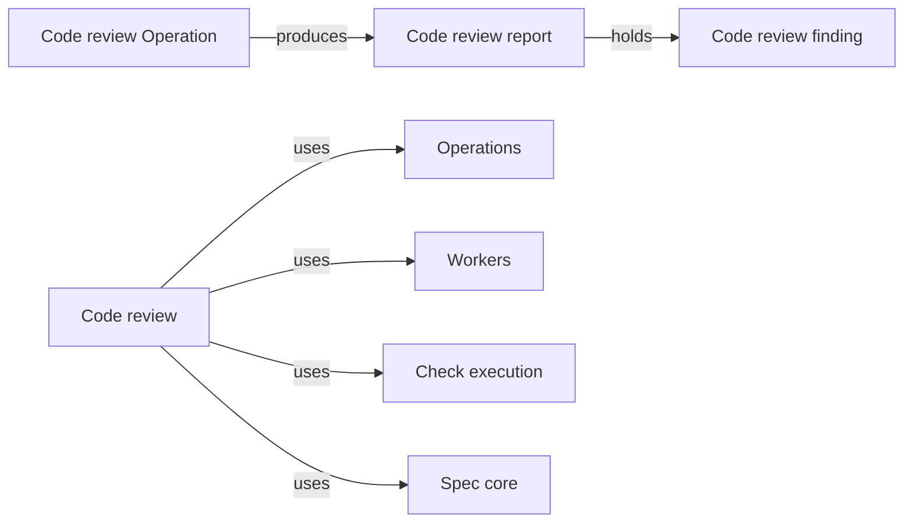

# Code review

## Purpose

Code review gives the main agent an independent judgement of a task's code changes against the
Specs. It provides the `code_review` Operation: a worker that may read the bound Modules' Specs,
code and tests, but change nothing, receives the task's diff and the host's check results and
reports every problem it can establish in one pass, each finding tied to the promise it judges the
code against. The host derives the verdict from those findings. The main agent relies on the
review to decide whether to run `implement` again, repair the Spec first or move on to validation.
Code review never edits a file, never runs a command and never judges code against anything but
the Specs in the bound Modules' context; a clean review is evidence about the reviewed inputs only,
not proof that the code has no other defect.

## Terminology

| Term | Definition |
| --- | --- |
| Code review report | The result of one code review run: the reviewer's findings about the task's code changes, the verdict the host derived from them and the inputs the review examined. |
| Code review finding | One problem the reviewer established in the reviewed code, judged blocking or advisory and tied to the Spec promise or passage it violates or leaves unanswered. |
| [Main agent](../../vocabulary.md#concept.concorde.main-agent) | |
| [Worker](../../vocabulary.md#concept.concorde.worker) | |
| [Task type](../../vocabulary.md#concept.concorde.task-type) | |
| [Spec context](../../vocabulary.md#concept.concorde.spec-context) | |
| [Task context](../../vocabulary.md#concept.concorde.task-context) | |
| [Evidence](../../vocabulary.md#concept.concorde.evidence) | |
| [Operation](../module.md#concept.operations.operation) | |
| [Operation host](../module.md#concept.operations.host) | |
| [Operation result](../module.md#concept.operations.result) | |
| [Grant](../../spec-tooling/spec/module.md#concept.spec.grant) | |
| [Brief](../../harness/workers/module.md#concept.workers.brief) | |
| [Worker result](../../harness/workers/module.md#concept.workers.worker-result) | |
| [Write audit](../../harness/workers/module.md#concept.workers.audit) | |
| [Configured check](../../harness/checks/module.md#concept.checks.configured-check) | |
| [Check result](../../harness/checks/module.md#concept.checks.check-result) | |

A code review report is made of findings; the verdict is not a separate judgement but a
consequence of whether any finding is blocking.

## Usage

The main agent runs the Operation in a task worktree after an `implement` run, usually before
`validate`:

```text
concorde run code_review --task <task-id> --modules <module-id>[,<module-id>…] [--base <ref>] [--focus "<text>"]
```

`--modules` names the Modules whose code is judged (by default the task's Modules), `--base` the
commit the diff starts from (by default the commit the task branch started from), and `--focus` a
concern the reviewer should look at first, such as one scenario; a focus never narrows what the
reviewer may report. For example,
after an `implement` run for `module.issues`, `code_review --modules module.issues` gives the
reviewer the Issues Spec and the Specs it selects, the Issues code and tests, the diff of the task
branch and the result of the Issues checks.

<a id="concept.code-review.review"></a>

The Operation returns an [Operation result](../module.md#concept.operations.result) whose
`output` is a **code review report**, defined exactly by the
[code review report contract](contracts.md#contract.code-review.review). Its verdict is
`changes_required` when at least one finding is blocking and `clean` otherwise. The status is `ok`
whenever the review completed, whatever the verdict; `blocked` when the reviewer could not judge
the change at all, for example because the diff consists of files no bound Module binds; and
`failed` when the host could not run the reviewer, the audit found any change, or a finding cites
a promise that does not exist. Only an `ok` run carries a report; the host evidence of any other
run still names the base, the diff's paths and the check results.

<a id="concept.code-review.finding"></a>

Each **code review finding** is blocking when the task should not be delivered without fixing it,
and advisory otherwise. A finding names its kind: a violation of a stated promise, a defect the
Spec's promises imply, a missing test for a scenario the change touches, a change outside the
bound Modules' code, or a Spec gap, where the code does something the Spec neither requires nor
forbids and the reviewer cannot judge it. A blocking finding always names its basis: the stable
identity of a requirement, scenario, contract or concept, or a Spec passage, from the bound
Modules' [Spec context](../../vocabulary.md#concept.concorde.spec-context). The main agent usually
answers blocking Spec gaps with `specify` and other blocking findings with `implement`, passing the
review as task material.

## Design

The Operation is a worker-backed Operation run by the [Operation host](../module.md#concept.operations.host)
with task type `review-code`. That [task type](../../vocabulary.md#concept.concorde.task-type)
lets the reviewer read the bound Modules' Spec context, external material and the files their
realizations bind, shows other files by name only, and makes nothing writable. The diff is
[task context](../../vocabulary.md#concept.concorde.task-context): it tells the reviewer what
changed but adds no source, so the host cuts it down to what the grant already makes readable.

| # | Step | Actor | Stops the run when |
| --- | --- | --- | --- |
| 1 | Compute the `review-code` [grant](../../spec-tooling/spec/module.md#concept.spec.grant) for the bound Modules from the task worktree's Specs and freeze it with its context identity | Workers, Spec core | the Specs cannot be loaded or a Module is unknown (`failed`) |
| 2 | Compute the diff from the base to the task worktree, including uncommitted and untracked files, keep the contents of paths the grant makes readable and list every other changed path by name only | host, Spec core | the base cannot be resolved (`failed`) |
| 3 | Run the bound Modules' [configured checks](../../harness/checks/module.md#concept.checks.configured-check) outside any worker | host, Check execution | a check cannot be started (`failed`) |
| 4 | Generate the worker settings, the tool list and the [brief](../../harness/workers/module.md#concept.workers.brief) with the focus, the diff, the changed paths listed by name only, the [check results](../../harness/checks/module.md#concept.checks.check-result) with the last part of every log that did not pass, and the grant's read and names lists | Workers | — |
| 5 | Launch the reviewer and wait for its [worker result](../../harness/workers/module.md#concept.workers.worker-result) | Workers, worker | launch error or timeout (`failed`); worker `blocked` (passed on) |
| 6 | [Audit](../../harness/workers/module.md#concept.workers.audit) the task worktree: the grant has no writable path, so any change is a violation, and write the run record | Workers | any change (`failed`) |
| 7 | Check that every basis resolves in the bound Modules' Spec context and that every blocking finding has one, then derive the verdict from the findings | host, Spec core | an unresolved or missing basis (`failed`) |
| 8 | Return the Operation result | host | — |

The reviewer gets Read, Glob and Grep only: no Edit, Write or Bash, no web tools and no MCP
server. It cannot run the tests itself, so the host runs the configured checks first and hands over
their results; a failing check is something the reviewer interprets, not a reason to stop. The
diff runs from the base commit to the task worktree, uncommitted and untracked files included, and
new files appear in full. A very large diff is cut short in the brief with a note; the reviewer
then reads the remaining changed files directly, which its grant already allows.

There is no resume round. The reviewer is instructed to report every blocking finding it can
establish in a single pass rather than the first one it meets, because each extra review round
costs a full reading of the Specs and the code and lets fixes for one finding hide the next. For
the same reason a review is not repeated automatically after `implement`; the main agent decides
when to review again.

The reviewer judges only against the Specs in its context, never against its own taste or against
another Module's code, so a finding the main agent disagrees with can be traced to a written
promise. The host verifies what it can decide, namely that every cited basis exists and which
verdict follows, and otherwise keeps the findings as the reviewer's claims. A basis resolves when it
is a stable identity defined by a document of a bound Module's Spec context, or a path of such a
document, optionally followed by an anchor. The precise obligations
are in the [requirements](requirements.md) and illustrated by the [scenarios](scenarios.md).

<a id="realization.code-review.operation"></a>

The **Code review Operation** realization holds the Operation's host steps, the worker
instructions for task type `review-code`, the result schema and its tests. The reviewer returns
only its findings with its summary; the host adds the base, the paths, the check results and the
verdict.

## Relationships



<a id="uses-operations"></a>

**Operations** lists `code_review` in its catalog, dispatches `concorde run code_review` to this
Module and provides the host step runner and the [Operation result](../module.md#concept.operations.result)
envelope. Code review supplies the steps above and the code review report, relies on the host to
record the run for the task, and never calls another Operation.

<a id="uses-workers"></a>

**Workers** turns the frozen grant into worker settings, launches the reviewer with the brief this
Module writes, collects its [worker result](../../harness/workers/module.md#concept.workers.worker-result),
audits the worktree and writes the run record. Code review relies on the audit to prove that the
reviewer changed nothing and treats any violation as a failed run.

<a id="uses-checks"></a>

**Check execution** runs the bound Modules' [configured checks](../../harness/checks/module.md#concept.checks.configured-check)
in its read-only boundary and returns a [check result](../../harness/checks/module.md#concept.checks.check-result)
for each. Code review passes those results to the reviewer as task material and includes them in
the report unchanged; a check that cannot be started fails the run.

<a id="uses-spec"></a>

**Spec core** computes the `review-code` [grant](../../spec-tooling/spec/module.md#concept.spec.grant)
from the task worktree's Specs, which also decides which changed paths the diff may show in full,
and resolves the basis identities of findings. Code review never computes a boundary itself.
