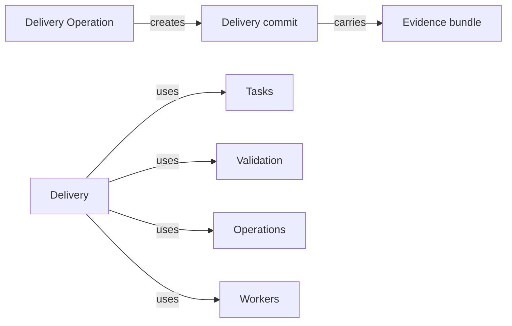

# Delivery

## Purpose

Delivery turns a validated task worktree into a commit. It provides the deterministic `delivery`
Operation: when the task's latest readiness is ready and still current, it commits every change of
the task worktree on the task branch together with an evidence bundle that records what was
validated and which Operation runs produced the change, and it records the delivery in the task
record. The main agent relies on it so that what it merges is exactly what was validated, with its
evidence alongside. Delivery is the only part of Concorde that commits; workers never touch Git.
It never merges, pushes or rewrites history, never validates on its own and never delivers a
worktree that changed after validation; the main agent merges the delivered branch itself.

## Terminology

| Term | Definition |
| --- | --- |
| Delivery commit | The commit Delivery creates on a task branch, holding every change the task's current readiness examined and the evidence bundle for it. |
| Evidence bundle | The JSON file committed with a delivery that records the task, the readiness the delivery consumed and the Operation runs that led to it. |
| [Main agent](../../vocabulary.md#concept.concorde.main-agent) | |
| [Worker](../../vocabulary.md#concept.concorde.worker) | |
| [Evidence](../../vocabulary.md#concept.concorde.evidence) | |
| [Task](../../tasks/module.md#concept.tasks.task) | |
| [Task record](../../tasks/module.md#concept.tasks.task-record) | |
| [Task state](../../tasks/module.md#concept.tasks.task-state) | |
| [Readiness](../validation/module.md#concept.validation.readiness) | |
| [Run record](../../harness/workers/module.md#concept.workers.run-record) | |
| [Operation](../module.md#concept.operations.operation) | |
| [Operation result](../module.md#concept.operations.result) | |

A delivery commit carries one evidence bundle; the bundle points back to the readiness and the runs
that justify the commit.

## Usage

The main agent runs the Operation right after a `validate` run whose readiness was ready:

```text
concorde run delivery --task severity
```

The Operation takes no arguments of its own. It finds the task's latest `validate` run, checks that
its [readiness](../validation/module.md#concept.validation.readiness) is ready, and measures the
task worktree again the way Validation did. If the input digest is unchanged, it clears the pending
markers the readiness listed as confirmations, writes the evidence bundle, commits everything on
the task branch and records the delivery in the [task record](../../tasks/module.md#concept.tasks.task-record),
which makes the [task state](../../tasks/module.md#concept.tasks.task-state) delivered. The
[Operation result](../module.md#concept.operations.result) carries the commit as its output,
defined by the [delivery output contract](contracts.md#contract.delivery.output). The main agent
then merges the task branch into the primary branch with Git, without asking the developer, and
closes the task.

<a id="concept.delivery.delivery-commit"></a>

A **delivery commit** has the subject `concorde: deliver <task-id>`, the task's goal as its body
and three trailers: `Concorde-Task` with the task identity, `Concorde-Evidence` with the path of
its evidence bundle, and `Concorde-Readiness` with the `validate` run it consumed. Its parent is the
branch head that was validated, and it contains every uncommitted change of the worktree, tracked
or new, except what Git ignores. A task may be delivered several times, for example when a code
review after the first delivery leads to another `implement`; each delivery is a new commit on top
of the previous one, and nothing is amended.

<a id="concept.delivery.evidence-bundle"></a>

The **evidence bundle** is committed at `.concorde/evidence/<task-id>/<n>.json`, where `n` counts
the task's deliveries from 1. It records the task, its goal and Modules, the base and parent
commits, the readiness it consumed with its input digest and check results, the confirmations
applied, and each Operation run of the task since the previous delivery with its operation, status,
summary, worker run identities and the digest of its saved result. The full results, the
[run records](../../harness/workers/module.md#concept.workers.run-record) and the worker
transcripts stay in the primary worktree's `.concorde/runs/`, which Git ignores; the bundle
carries their identities and digests so that they can be matched later, not their contents. Its
exact shape is the [evidence bundle contract](contracts.md#contract.delivery.evidence-bundle).

The result status is `blocked` when the main agent has to act first: no `validate` run yet, or a
latest `validate` run that produced no readiness (`no_readiness`), a latest readiness that is not
ready (`not_ready`), a worktree that changed since (`stale_readiness`), or nothing left to commit
(`nothing_to_deliver`). The code is the `ref` of a `readiness` host evidence entry, or of a `git`
entry for `nothing_to_deliver`. In each case Delivery writes nothing, and the usual answer is to fix
the findings or run `validate` again. The status is `failed` when the worktree is not on the task
branch, the confirmations cannot be applied, or Git refuses the commit, for example because of a
hook or a missing author identity; the hook's output is then `git` host evidence and the worktree
is left as it was validated. If a delivery commit was made but could not be recorded in the task
record, the next `delivery` run finds it at the head of the branch and records it instead of
committing again.

## Design

Delivery commits and workers do not, because a commit is the point where a proposal becomes part of
the project's history and must match what was checked. The host can prove that match; a worker
could not. The proof is the input digest: Validation bound the readiness to a measurement of the
worktree, and Delivery repeats the same measurement immediately before committing. Any change in
between, by a worker, by the main agent or by the developer, changes the digest and makes the
readiness stale, so the commit contains exactly what was validated or nothing at all.

The evidence is committed with the change rather than kept only locally, so that it travels with
the branch into the primary branch and stays attached to the history it justifies. It is kept
small, identities and digests rather than transcripts, because it lives in the repository forever.
Clearing the pending markers happens here, as the last step before the commit, because until then
a filled pending file is still a proposal; doing it in the same commit keeps the Spec and the files
it declares consistent in history.

| # | Step | Actor | Stops the run when |
| --- | --- | --- | --- |
| 1 | Resolve the task worktree and require that its head is the task branch | host | the worktree is on another branch or detached (`failed`) |
| 2 | If the head is a delivery commit of this task that the task record lacks, record it | host, Tasks | a recovered delivery was recorded (`ok`) |
| 3 | Load the readiness of the task's latest `validate` run and require it to be ready | host, Tasks | no `validate` run (`blocked`, `no_readiness`); not ready (`blocked`, `not_ready`) |
| 4 | Measure the inputs again through Validation and compare the input digest | Validation | the digest differs (`blocked`, `stale_readiness`) |
| 5 | Require at least one uncommitted change | host, read-only Git | none (`blocked`, `nothing_to_deliver`) |
| 6 | Apply the readiness's confirmations through Validation | Validation | refused (`failed`; nothing changed) |
| 7 | Write the evidence bundle in the task worktree | host | — |
| 8 | Stage every uncommitted change and the bundle, and create the delivery commit on the task branch | host, Git | Git refuses the commit (`failed`; confirmations and bundle undone, index reset) |
| 9 | Verify that the new commit is the branch head, its parent is the validated head and the worktree is clean | host, read-only Git | a mismatch (`failed`) |
| 10 | Record the delivery in the task record | Tasks | the record cannot be written (`failed`; step 2 of the next run recovers it) |
| 11 | Return the delivery commit as the output | host | — |

Every step before 6 only reads, so a blocked delivery never leaves a trace in the worktree. Steps 6
to 8 are undone together when the commit fails: the metadata the confirmations changed is restored
from the bytes read before, the bundle is removed and the index is reset to the head, so the
worktree is again exactly the one the readiness describes. Configured checks are not repeated after
the confirmations, because clearing a pending marker changes no code and Validation revalidates the
Spec structure when it applies them. The precise obligations are in the
[requirements](requirements.md) and shown in the [scenarios](scenarios.md).

<a id="realization.delivery.operation"></a>

The **Delivery Operation** realization holds the Operation's steps, the evidence bundle writer and
their tests. The bundle is staged even where Git would ignore its path, so every delivery commit
carries it.

## Relationships



The Delivery Operation creates one delivery commit per successful run, and each commit carries
exactly one evidence bundle.

<a id="uses-tasks"></a>

**Tasks** resolves the task to its worktree, branch and base commit, lists its Operation runs and
earlier deliveries, and records the new delivery, which moves the task to delivered. Delivery relies
on Tasks' rule of one run per task, so nothing else changes the worktree while it commits, and on
closing as merged being checked against the delivery commits it records.

<a id="uses-validation"></a>

**Validation** provides the readiness, the input measurement and the application of confirmations.
Delivery relies on the measurement being the same one the readiness was bound to, so that an equal
digest proves an unchanged worktree, and on confirmations being applied exactly or not at all. It
never decides readiness itself and treats a missing, not ready or stale readiness as blocking.

<a id="uses-operations"></a>

**Operations** lists `delivery` in its catalog, runs these steps through its host, wraps the output
in the [Operation result](../module.md#concept.operations.result) and saves each run's result in
the primary worktree. Delivery reads those saved results of the task's earlier runs to write the
bundle's run entries and their digests.

<a id="uses-workers"></a>

**Workers** keeps a [run record](../../harness/workers/module.md#concept.workers.run-record) for
every worker launch. Delivery lists the run record identities of each included run in the bundle so
that the committed evidence can be matched with the local records; it relies on those identities
being unique and stable, and never reads a transcript.
