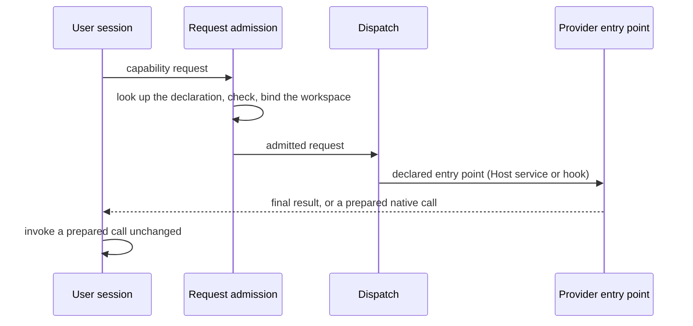

# Operations design notes

These notes extend the [Operations entry](module.md) with a worked request and the reasons behind
the catalog and dispatch. They define nothing; every term is defined in the entry.

## A request from start to end

Take a plan for a billing Module. The user session calls the Pi tool `concorde` with
`operation: "concorde-plan"` and `action: "describe"` to read the capability's guidance and request
schema, then with `action: "run"` and the input
`{"target_id": "module.billing", "task": "Retry failed card charges once"}`.

1. The launcher receives the request and the Operation catalog. Request admission looks the name up
   in the catalog, checks the request against the declared schema, resolves the target the way the
   capability declaration says, binds the workspace (a candidate, because planning writes) and
   checks the configuration.
2. Admission hands the admitted request to dispatch. Dispatch reads the declaration: `concorde-plan`
   is a pi workflow whose workflow hook Planning names. Dispatch hands the request and that hook to
   the native driver of Agent execution.
3. The native driver and Planning's hook freeze the Agents' context and return an exact native
   workflow call. No model has run yet. The user session invokes the call unchanged and polls with
   `action: "result"` until the workflow ends.

A Host service such as `concorde-validate` runs to its end inside step 2, and the result envelope
carries its final result at once. A single Agent call such as `concorde-tasks` returns a prepared
Agent call; the Host accepts or rejects the Agent's answer when the call returns.

## Why Operations is composed this way

The children's behaviour changes with the development workflow, so they sit together under one
parent that explains how they are cataloged and dispatched. `concorde-init` belongs to Spec tooling
because it must produce a Spec in the format Spec tooling owns, and `concorde-configure` belongs to
Request admission because it writes the configuration every request is checked against. Placing
them under Operations would make Operations depend on infrastructure for their behaviour and put
their rules far from the thing they maintain.

## Declarations instead of tables

Each declaration lives in a file bound by its owner, next to the behaviour it declares; the catalog
package lists them. Because every fact about an Operation is a field of its declaration, no Module
keeps a table of which Operations are public, deterministic, model-backed or of which review kind,
and adding an Operation touches only its owner and the catalog list. Registering the request and
response schemas as typed values means that admission, the Pi session and every consumer validate
against one schema.

## Dispatch without provider imports

Dispatch imports no provider, so adding an Operation never changes dispatch, and no provider's
failure can be hidden in a hardcoded branch. Nested composition goes through dispatch for the same
reason: the only way one Operation reaches another is the declared `uses` list, and the child passes
admission again, so composing Operations never skips a check or gains a wider workspace than a
direct request would.

## LangGraph Graphs and pi workflows

Concorde's own control flow is either a pi workflow or a LangGraph Graph built with the Graph API;
simple flows use pi workflows. The Graph catalog builds every Graph without services so that what
is inspected and published is exactly what execution compiles. Its one entry, the Terminal Agent
Operation, is a building block that no cataloged Operation runs today.

## Open questions

- The stage capabilities (`concorde-context-solve`, `concorde-plan`, `concorde-tasks`,
  `concorde-implement`, `concorde-spec-review`, `concorde-code-review`) stay public, and the user
  session sequences them. Whether they should later be chained behind one Operation, and whether
  that Operation would be a pi workflow or a LangGraph Graph, is undecided.
- No cataloged Operation is a LangGraph Graph, so dispatch has no route for that kind and the
  loader refuses such a declaration. The first Operation of that kind will add the route.
