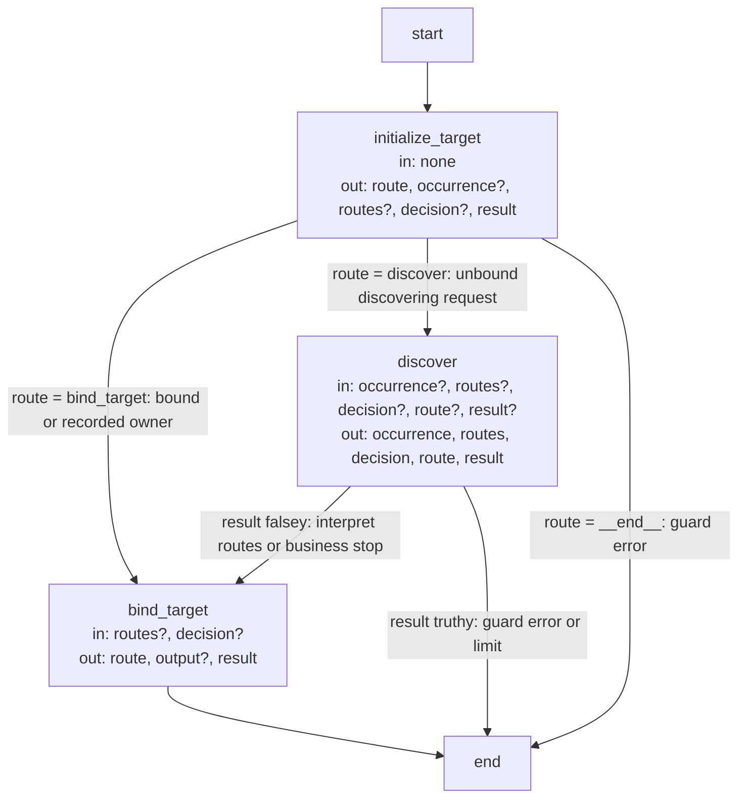

# Operation catalog and dispatch contracts

These are the precise implementation agreements and executable Graph specifications owned by the
[Operations Module](module.md): the catalog of every Operation, the ownership of each Operation's
behavior and the dispatch that routes an admitted request to its provider. Explanatory topics
introduce their purposes; exact identities, limits and transitions are retained here as the single
detailed contract.

## Terminology

| Term | Meaning / definition |
| --- | --- |
| [Operation](../module.md#terminology) | Defined in Concorde Framework. |
| [Public operation](module.md#terminology) | Defined in Operations. |
| [Internal operation](module.md#terminology) | Defined in Operations. |
| [Host](../module.md#terminology) | Defined in Concorde Framework. |
| [Graph](../module.md#terminology) | Defined in Concorde Framework. |
| [Worker](../module.md#terminology) | Defined in Concorde Framework. |
| [Worker profile](../harness/module.md#terminology) | Defined in Harness. |
| [Skill](../module.md#terminology) | Defined in Concorde Framework. |
| [Context](../module.md#terminology) | Defined in Concorde Framework. |
| [Grant](../module.md#terminology) | Defined in Concorde Framework. |
| [Snapshot](../module.md#terminology) | Defined in Concorde Framework. |
| [Spec context](../harness/context.md#terminology) | Defined in What information a worker receives. |
| [Task context](../harness/context.md#terminology) | Defined in What information a worker receives. |
| [Candidate](../module.md#terminology) | Defined in Concorde Framework. |
| [Worktree](../module.md#terminology) | Defined in Concorde Framework. |
| [Ready](../module.md#terminology) | Defined in Concorde Framework. |
| [Evidence](../module.md#terminology) | Defined in Concorde Framework. |
| [Issue](../module.md#terminology) | Defined in Concorde Framework. |
| [Blocker](../module.md#terminology) | Defined in Concorde Framework. |
| [Disposition](../issues/lifecycle.md#terminology) | Defined in Solving a recorded problem. |
| [Review coverage](../review/module.md#terminology) | Defined in Review. |

## Operation registry {#operations-operation-registry}

A **Operation** is an executable entity that can be used as a LangGraph node. It declares its
input State, output State updates, effects and usage conditions. Its implementation can be
ordinary deterministic code, a model invocation or a compiled LangGraph subgraph. These are
implementation choices, not separate entity kinds. A Graph is a graph that composes Operations;
a compiled Graph can itself be used as an Operation node.

**Operation** is the canonical executable identity. The former **Operation** name and the
parallel **Agent** executable registry are retired. A worker is a runtime process executing a
model-backed Operation, not another definition of what the Operation does. A model execution
profile records instructions, tools, context/effect limits, children and timeout on that Operation.
Lowercase *operation* still describes an ordinary action such as a filesystem or Git operation.
A helper function need not be registered merely because Python permits calling it from a node.

#### State and runtime boundaries {#operations-state-and-runtime-boundaries}

Each entry under `operations/` declares `STATE` and `run(state, runtime)`. The State contract
provides LangGraph input and output schemas. Model nodes consume the admitted task-context fields
and return validated result fields. Existing host-backed graph adapters consume request-data
fields and return a `result` channel containing the complete operation envelope, preserving
blocked, failed, cancelled and successful outcomes rather than flattening them into success data.
`REQUEST` and `RESPONSE` remain the versioned transport schemas of those existing host adapters;
they are not a second executable interface for model nodes.

A node receives only its declared input channels and returns only its output update, never a copy
of the entire parent State. Each graph declares reducers when parallel writers need to merge a
shared channel. Compatible compiled graphs can be embedded directly; incompatible channels require
an explicit adapter. Parent State membership is not permission to read files or implementation
contents. Frozen contexts and the executor's independent permission checks still apply.

Hosts, model launchers and project configuration are trusted `Runtime.context`, not writable State
channels or task-controlled callable objects. Model State validation checks both the wire shape and
the profile's phase, admitted artifacts, outcome and populated result fields. The worker executor
also rechecks its byte-bound instructions and effective authority before launching a process.

The existing `agent` record fields, `concorde-agent-stage-*` wire identities, generated instruction
paths under `generated/agents/`, stable Spec anchors and historical event names are compatibility
spellings. They identify the executing model Operation and do not recreate an Agent registry.

#### Current host adapter {#operations-current-host-adapter}

Each public Operation has exactly one Skill invoking `scripts/run-operation.py <skill>`.
Non-public Operations have no Skill or direct launcher entry. [Distribution Module](../distribution/module.md) owns the Skill
sources and projection; [Harness](../harness/admission.md) owns shared admission and this Module owns
dispatch. A Skill is an instruction
artifact for the developer's external runtime, not the worker's task context or a node kind.

| Operation | Public | Context selection | Deterministic | Uses | Behavior |
| --- | --- | --- | --- | --- | --- |
| main | true | discover | false | answerer, router, topology-designer, topology-author | Answer from selected Specs or prepare and apply accepted topology |
| dev-loop | true | discover | false | router, specify-loop, review, plan, tasks, implement, validate | Develop one change to a ready candidate |
| specify-loop | true | discover | false | router, specify, review | Complete Spec authoring and review before implementation |
| issues | true | bound | false | issue-solver, dev-loop, specify, review, validate | Inspect, report, reopen or solve a selected Issue without delivery |
| init | true | none | true | — | Propose and apply explicit initialization |
| configure | true | none | true | — | Apply model settings and explicit Protocol acceptance |
| validate | true | none | true | — | Run deterministic checks and record readiness |
| deliver | true | none | true | — | Stage a candidate and clean up; merge only when explicitly requested |
| specify | false | bound | false | spec-author | Author the bound target's Spec replacements |
| review | true | discover | false | router, spec-reviewer, code-reviewer | Read-only independent review with version-bound findings |
| context-solve | false | bound | false | context-assessor | Assess information sufficiency without context expansion |
| plan | false | bound | false | context-assessor, planner | Assess sufficiency, generate and persist a plan |
| tasks | false | bound | false | task-author | Derive acceptance tasks from the accepted plan |
| implement | false | bound | false | programmer | Fulfil tasks or coordinate participating components |

The twelve model-backed entries named in this table are themselves private, bound Operations
with `DETERMINISTIC=false` and no composed `USES`. Their detailed task State contracts, tools and
effects are defined in [model execution profiles](../harness/execution-reference.md). A bound
model node can consume a host-frozen discovery context without independently selecting more
Modules. Routing is explicit composition, not an implicit dependency added by a naming convention.

#### Operation properties {#operations-operation-properties}

Every Operation declares:

- **PUBLIC**: a boolean; true requires exactly one public Skill and launcher entry.
- **CONTEXT_SELECTION**: `discover`, `bound` or `none`. Discovery selects complete Module contexts;
  bound consumes an already selected/frozen context; none performs host work without model context.
- **DETERMINISTIC**: a boolean; true means no supported path calls a model, including transitive
  `USES`. It does not promise purity, reproducible filesystem observations or absence of effects.
- **USES**: the directly composed Operation identities. It is the sole composition relation,
  including calls to model nodes. It grants no additional context or write authority.
- **STATE**: the input and output State contract. Runtime schema and effect validation remain
  necessary even when LangGraph accepts the Python type declaration.
- **PROFILE**: optional model execution configuration, or `None`; it has the same identity as its
  Operation and never registers a second executable entity.

`AGENTS` and `CLASS` declarations are rejected. `USES` must name registered entries, be duplicate
free and have no definition cycle in this adapter. Bounded runtime loops and per-target recursive
execution remain graph control flow, not cyclic definition dependencies. Actual ordering, branches,
loops and reducers live in LangGraph, not a duplicate metadata graph. Undeclared composition fails
with `undeclared_operation`; host composition never grants a worker another callable tool.

The single `concorde.operations` metadata inventory records exposure, context selection,
determinism, Skill mapping, direct uses, State type identities and optional profile workspace/tools/
children. Validation compares it with code. There is no independent `concorde.agents` inventory.

### Design {#operations-design}

#### Behavioral ownership and composition limits {#operations-behavioral-ownership-and-composition-limits}

Every Operation, including each model-backed worker, has exactly one canonical behavioral owner.
The owner's Specs explain what the Operation is for, what it takes and returns and when it stops;
this table only maps each Operation to that owner and to the Graph it runs. Every public entry first
passes the [admission](../harness/admission.md#graphs-operation-admission-graph-operation-graph) and
[dispatch](#graphs-operation-dispatch-graph-dispatch-graph) Graphs, and every model-backed worker
runs as one [Operation node](../harness/execution-reference.md#host-operation-node-operation-node).

| Operation or action | Canonical behavioral owner | Runs as |
| --- | --- | --- |
| main ask and routing; answerer, router | [Query and Routing](../query-routing/module.md) | The [query Graph](../query-routing/execution-reference.md#query-and-routing-query-graph-query-graph) over the [discovery Graph](../query-routing/execution-reference.md#query-and-routing-discovery-graph-discovery-graph) |
| main topology actions; topology-designer, topology-author | [Topology](../topology/module.md) | The query Graph for design, then the [topology preparation](../topology/execution-reference.md#topology-topology-preparation-graph-topology-graph) and [application](../topology/execution-reference.md#topology-topology-application-graph-topology-apply-graph) Graphs |
| dev-loop | [Development Graph](../dev-loop/module.md) | [Target admission](#graphs-target-admission-graph-target-graph), then the [development Graph](../dev-loop/execution-reference.md#development-development-graph-development-graph) |
| specify-loop | [Specification Graph](../specify-loop/module.md) | Target admission, then the [specification Graph](../specify-loop/execution-reference.md#specify-loop-specification-graph-specify-graph) |
| specify; spec-author | [Spec Authoring](../spec-authoring/module.md) | One spec-author node, whose replacements pass affected-consumer reviews |
| context-solve, plan, tasks; context-assessor, planner, task-author | [Planning](../planning/module.md) | The [planning Graph](../planning/execution-reference.md#plan-planning-graph-plan-graph) for plan; one worker node each for context-solve and tasks |
| implement; programmer | [Implementation](../implementation/module.md) | One programmer node, or the [component coordination Graph](../implementation/execution-reference.md#graphs-component-coordination-graph-coordination-graph) for a composite |
| review; spec-reviewer, code-reviewer | [Review](../review/module.md) | Target admission, then one reviewer node for the owner and each changed-file peer |
| validate | [Validation](../validation/module.md) | One deterministic node |
| deliver | [Delivery](../delivery/module.md) | One deterministic node |
| issues; issue-solver | [Issues](../issues/module.md) | The [Issue Graph](../issues/execution-reference.md#lifecycle-issue-graph-issue-graph) and its [verification Graph](../issues/execution-reference.md#lifecycle-issue-verification-graph-issue-verification-graph) |
| init | [Spec](../spec/initialize.md) | The [project Graph](../spec/contracts.md#graphs-project-graph-project-graph) |
| configure | [Distribution](../distribution/module.md) | The project Graph |

Module ownership is distinct from node composition. `USES` is the executable composition relation;
registry `uses` describes Module responsibility dependencies. Shared model execution support does
not merge provider contracts. Every phase, target and independent review retains a fresh invocation
and its own grant. Only admitted structured artifacts cross node boundaries.

### Precise specifications {#operations-precise-specifications}

The Operations Module owns the exact obligations in [requirements](requirements.md) and
[scenarios](scenarios.md). The request and response types each Operation admits are listed with
[Harness's wire contracts](../harness/admission.md#operation-requests-and-responses).

## Dispatch Graphs {#graphs-dispatch-graphs}

### Design {#graphs-design}

Operations dispatches every admitted request through two LangGraph Graphs: the dispatch Graph and
the target admission Graph it composes. Harness runs its
[admission Graph](../harness/admission.md#graphs-operation-admission-graph-operation-graph) around
them. The composed Graphs a dispatch leaf runs (discovery, query, topology, planning,
specification, development, component coordination, project and Issues) are specified by their
owning Modules. Each Graph Spec follows the
[Graph Spec convention](../harness/execution-reference.md#graphs-and-loops-graph-specs): its State,
Nodes and Edges are stated in turn, and its diagram is bound to its compiled Graph by `%% graph:`
and kept equal to it by the configured Graph Spec check.

The following index maps public entry points to their internal Graphs without duplicating their
executable diagrams. Every entry first uses admission and dispatch; target-bound entries also
use target admission, with discovery only where that Operation declares it.

| Public entry | Internal flow after dispatch |
| --- | --- |
| `concorde-main` (`ask`, `design-topology`) | [Query and discovery](../query-routing/execution-reference.md#query-and-routing-query-graph-query-graph). |
| `concorde-main` (`accept-topology`, `apply-topology`) | [Topology preparation](../topology/execution-reference.md#topology-topology-preparation-graph-topology-graph) and [application](../topology/execution-reference.md#topology-topology-application-graph-topology-apply-graph), separately invoked. |
| `concorde-specify-loop` | [Specification Graph](../specify-loop/execution-reference.md#specify-loop-specification-graph-specify-graph). |
| `concorde-dev-loop` | [Development Graph](../dev-loop/execution-reference.md#development-development-graph-development-graph), calling specification and [planning](../planning/execution-reference.md#plan-planning-graph-plan-graph); composite implementation calls [coordination and stabilization](../implementation/execution-reference.md#graphs-component-coordination-graph-coordination-graph). |
| `concorde-issues` | [Issue Graph](../issues/execution-reference.md#lifecycle-issue-graph-issue-graph); solve may call development, authoring and its [verification Graph](../issues/execution-reference.md#lifecycle-issue-verification-graph-issue-verification-graph). |
| `concorde-spec-review`, `concorde-code-review` | The review leaf scopes independent invocations; sequential scope work uses the [batch Graph](../harness/execution-reference.md#host-sequential-work-items-graph-batch-graph), not a separate repair loop. |
| `concorde-init`, `concorde-configure` | [Project Graph](../spec/contracts.md#graphs-project-graph-project-graph). |
| `concorde-validate`, `concorde-deliver` | Deterministic dispatch leaves; no separate multi-node domain Graph is implied by their internal functions. |

Model-backed leaves use the [Operation node](../harness/execution-reference.md#host-operation-node-operation-node)
contract. Private adapters (`specify`, `plan`, `tasks`, `implement`, `context_solve`) are reached
only through declared composition; appearing in the union dispatch diagram does not expose a
public entry. Studio wraps a public entry with invocation validation and displays these same
operation/subgraph factories, rather than defining another business workflow.

#### Operation dispatch Graph (`dispatch_graph`) {#graphs-operation-dispatch-graph-dispatch-graph}

**State.** `route` (the leaf or subgraph selected for the admitted operation), `output` (the
operation's typed response), `relayed` (the complete result envelope a candidate worktree's
launcher returned for a relayed mutation, which the admission Graph adopts as its own result),
`result` (guard failure or None). These channels use replacement updates. Operation, request,
configuration, bound invocation and relay target are Host-held, not dispatch State. `none` below
means a node reads only those Host inputs. `?` means a conditional channel or update. Guards
write `result` on every guarded step and set `route=__end__` on errors. For registered subgraphs,
`in`/`out` list channels crossing the parent boundary; their own Graph Specs give node-level
reads/writes. Child-only counters, decisions and artifact reducers do not become parent channels.
In particular, development/specification accumulate artifacts internally and export them inside
`output`, not as a dispatch `artifacts` channel.

**Nodes.** Each leaf below is the entry of one Operation, or of one action of `concorde-main`.

| Node | Executes | in | out |
| --- | --- | --- | --- |
| `select_operation` | Selects from the Host-bound operation/action, giving relay precedence when a candidate relay target exists. | none | route, result |
| `relay` | Calls the candidate's launcher with the Host-bound invocation and adopts its full envelope. | none | relayed, result |
| `prepare_target` | Registered target subgraph: discovers/restores owner, stores the bound invocation in the Host and selects the leaf. | route?, output?, result? | route, output?, result |
| `deliver` | Deterministic delivery under the repository lock, using Host-bound change/worktrees. | none | output, result |
| `project` | Registered project subgraph using the Host-bound initialization/configuration request. | route?, output?, result? | route, output?, result |
| `answer` | Registered query subgraph with the answerer and Host-bound question/context. | route?, output?, result? | route, output?, result |
| `design_topology` | Registered query subgraph with topology-designer and Host-bound task/context/registry. | route?, output?, result? | route, output?, result |
| `prepare_topology` | Registered preparation subgraph using the Host-bound accepted design. | route?, output?, result? | route, output?, result |
| `apply_topology` | Registered application subgraph using the Host-bound prepared application. | route?, output?, result? | route, output?, result |
| `review` | Reviews the Host-bound owner and affected peers in separate contexts. | none | output, result |
| `describe_policy` | Describes grants for the bound invocation without launching workers. | none | output, result |
| `issues` | Registered Issue subgraph using the Host-bound action and selection. | route?, output?, result? | route, output?, result |
| `specify` | Calls Spec Authoring and affected-consumer reviews for the bound invocation; applies admitted replacements. | none | output, result |
| `plan` | Registered planning subgraph using the bound task/Spec context and candidate. | route?, output?, result? | route, output?, result |
| `tasks` | Calls task authoring with stored plan, reserved IDs and repair feedback; admits tasks. | none | output, result |
| `implement` | Calls programmer or component coordination with stored tasks and granted files. | none | output, result |
| `validate` | Checks the bound candidate and readiness gates. | none | output, result |
| `development_loop` | Registered development subgraph using the bound target/change; its route channel is not used for its Command transitions. | route?, output?, result? | route?, output?, result |
| `specify_loop` | Registered specification subgraph using the bound target/change; no shared route channel. | output?, result? | output?, result |
| `context_solve` | Calls the context assessor for the bound task and complete Spec. | none | output, result |

**Edges.** `select_operation` writes `route`, and a conditional edge follows it to one entry leaf:
the relay for a mutation admitted in the primary worktree, delivery, the project Graph, one of
main's four actions, or target admission for every target-bound operation; an error ends the
Graph. `prepare_target` writes `route` again once the owner is bound and selects that operation's
leaf, or ends the Graph when binding is blocked. Every leaf ends the Graph with its typed output.
The Studio and CLI compile one dispatch Graph per public operation containing only the leaves that
operation can reach; the diagram shows the complete topology they are drawn from. Both branching
edges read exactly `state["route"]`; edge labels below explain how the source sets that channel.
Review dispatch takes precedence over describe-policy so the review provider describes its own
policy. A target-binding business stop writes `output` and `route=__end__`; a guard failure writes
`result` and the same route. Leaf completion itself is not proof of a successful business outcome.

```mermaid
flowchart TB
    %% graph: dispatch_graph
    accTitle: Operation dispatch Graph
    accDescr: The admitted operation selects one entry leaf, or target admission first and then one bound leaf; every leaf ends the Graph with its typed output.
    __start__["start"]
    select_operation["select_operation<br/>in: none<br/>out: route, result"]
    relay["relay<br/>in: none<br/>out: relayed, result"]
    prepare_target["prepare_target<br/>in: route?, output?, result?<br/>out: route, output?, result"]
    deliver["deliver<br/>in: none<br/>out: output, result"]
    project["project<br/>in: route?, output?, result?<br/>out: route, output?, result"]
    answer["answer<br/>in: route?, output?, result?<br/>out: route, output?, result"]
    design_topology["design_topology<br/>in: route?, output?, result?<br/>out: route, output?, result"]
    prepare_topology["prepare_topology<br/>in: route?, output?, result?<br/>out: route, output?, result"]
    apply_topology["apply_topology<br/>in: route?, output?, result?<br/>out: route, output?, result"]
    review["review<br/>in: none<br/>out: output, result"]
    describe_policy["describe_policy<br/>in: none<br/>out: output, result"]
    issues["issues<br/>in: route?, output?, result?<br/>out: route, output?, result"]
    specify["specify<br/>in: none<br/>out: output, result"]
    plan["plan<br/>in: route?, output?, result?<br/>out: route, output?, result"]
    tasks["tasks<br/>in: none<br/>out: output, result"]
    implement["implement<br/>in: none<br/>out: output, result"]
    validate["validate<br/>in: none<br/>out: output, result"]
    development_loop["development_loop<br/>in: route?, output?, result?<br/>out: route?, output?, result"]
    specify_loop["specify_loop<br/>in: output?, result?<br/>out: output?, result"]
    context_solve["context_solve<br/>in: none<br/>out: output, result"]
    __end__["end"]
    __start__ --> select_operation
    select_operation -->|mutation admitted in the primary worktree| relay
    select_operation -->|concorde-deliver| deliver
    select_operation -->|concorde-init or concorde-configure| project
    select_operation -->|concorde-main ask| answer
    select_operation -->|concorde-main design-topology| design_topology
    select_operation -->|concorde-main accept-topology| prepare_topology
    select_operation -->|concorde-main apply-topology| apply_topology
    select_operation -->|target-bound operation| prepare_target
    select_operation -->|error| __end__
    prepare_target -->|concorde-spec-review or concorde-code-review| review
    prepare_target -->|describe-policy mode, non-review operation| describe_policy
    prepare_target -->|concorde-issues| issues
    prepare_target -->|concorde-specify| specify
    prepare_target -->|concorde-plan| plan
    prepare_target -->|concorde-tasks| tasks
    prepare_target -->|concorde-implement| implement
    prepare_target -->|concorde-validate| validate
    prepare_target -->|concorde-dev-loop| development_loop
    prepare_target -->|concorde-specify-loop| specify_loop
    prepare_target -->|concorde-context-solve| context_solve
    prepare_target -->|blocked or error| __end__
    relay --> __end__
    deliver --> __end__
    project --> __end__
    answer --> __end__
    design_topology --> __end__
    prepare_topology --> __end__
    apply_topology --> __end__
    review --> __end__
    describe_policy --> __end__
    issues --> __end__
    specify --> __end__
    plan --> __end__
    tasks --> __end__
    implement --> __end__
    validate --> __end__
    development_loop --> __end__
    specify_loop --> __end__
    context_solve --> __end__
```

#### Target admission Graph (`target_graph`) {#graphs-target-admission-graph-target-graph}

**State.** `route`, `occurrence`, `routes` and `decision` (the discovery subgraph's counters and
routed selection), `output`, `result`, all with replacement updates. `occurrence` is an integer;
`routes` is a list; `decision` is result data or None. The restored task, bound invocation and
candidate ownership are Host-held effects, not State channels. Initializing discovery writes
`occurrence=0, routes=[], decision=None`; the already-bound path writes only `route` plus the
guard's `result`. The subgraph boundary admits discovery's five shared channels; `output` is
written only when binding turns a discovery business stop into the Operation response.

**Nodes.**

| Node | Executes | in | out |
| --- | --- | --- | --- |
| `initialize_target` | Restores Host-bound owner/intent or checks the trusted route; initializes discovery channels only for an unbound discovering request. | none | route, occurrence?, routes?, decision?, result |
| `discover` | Registered discovery subgraph (router), using the Host-bound task and entry Module context. | occurrence?, routes?, decision?, route?, result? | occurrence, routes, decision, route, result |
| `bind_target` | Reads discovery selection when discovery ran; otherwise uses restored Host owner. Binds the invocation and selects the leaf, or writes a business-stop response. | routes?, decision? | route, output?, result |

**Edges.** `initialize_target` writes `route`: an owner that is already bound or recorded goes
straight to `bind_target`, an unbound discovering request enters `discover`, and an error ends the
Graph. After discovery, the conditional edge tests the truthiness of `result`, not route count
or the business outcome: only a guard failure ends the Graph there. Otherwise `bind_target`
interprets `routes` and `decision`. A non-None decision produces a business-stop `output` and
`route=__end__`; absent a decision, exactly one route is required or binding raises
`ambiguous_route`. Successful binding stores the invocation in the Host and writes the parent's
leaf name to `route`. `bind_target` always ends this child Graph; the dispatch parent then reads
that route. A target-bound operation that never discovers compiles without `discover`.

## Context selection participation

**Interface participation.** This Module has the required role for `contract.context.selection` version 3 with `module.harness`.

**When this applies.** When target admission binds a Module-bound invocation, before assessment,
planning, authoring or review for the selected Module.

**Relied-upon guarantee.** [Selection](../harness/contracts.md#contract.context.selection) determines the complete admitted contract and its original owners.

**Local obligation.** Supply the explicit Module and task; stop dependent transitions on gaps or stale context, and never treat included provider definitions as writable local Specs.
