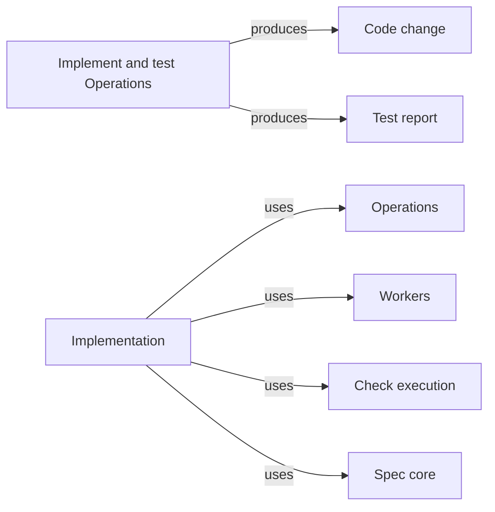

# Implementation

## Purpose

Implementation changes and exercises a Module's code against its Spec. It provides two Operations.
`implement` lets a worker change the bound Modules' code, and nothing else, toward a stated goal;
the host then audits the change, runs the Modules' configured checks outside the worker and, when
checks fail, resumes the same worker with the failures for a limited number of rounds. `test` runs
the configured checks through the host and lets a worker that may read but not write the code
interpret the results into a test report. The main agent relies on these Operations to get code
that matches the Spec and evidence about it. Its workers never change a Spec: a missing or
contradictory promise stops the run with a Spec gap for the main agent, automatic repair rounds
exist only for failed checks, and the only Spec edit an implement run makes is the host clearing
the pending marker of a declared file that now exists. Deciding whether a task is ready or delivering it belongs to
other Operations.

## Terminology

| Term | Definition |
| --- | --- |
| Code change | The result of one implement run: the files the worker changed, created or had deleted, the configured check results of the last round, the rounds used and the worker's account of the change. |
| Test report | The result of one test run: the host's configured check results for the bound Modules together with the worker's interpretation of every failure against their Specs. |
| [Main agent](../../vocabulary.md#concept.concorde.main-agent) | |
| [Worker](../../vocabulary.md#concept.concorde.worker) | |
| [Task type](../../vocabulary.md#concept.concorde.task-type) | |
| [Implementation context](../../vocabulary.md#concept.concorde.implementation-context) | |
| [Evidence](../../vocabulary.md#concept.concorde.evidence) | |
| [Error chain](../../vocabulary.md#concept.concorde.error-chain) | |
| [Operation](../module.md#concept.operations.operation) | |
| [Operation host](../module.md#concept.operations.host) | |
| [Operation result](../module.md#concept.operations.result) | |
| [Grant](../../spec-tooling/spec/module.md#concept.spec.grant) | |
| [Brief](../../harness/workers/module.md#concept.workers.brief) | |
| [Worker result](../../harness/workers/module.md#concept.workers.worker-result) | |
| [Write audit](../../harness/workers/module.md#concept.workers.audit) | |
| [Resume round](../../harness/workers/module.md#concept.workers.resume-round) | |
| [Configured check](../../harness/checks/module.md#concept.checks.configured-check) | |
| [Check result](../../harness/checks/module.md#concept.checks.check-result) | |

A code change is what an `implement` run produced; a test report is what a `test` run found. Both
carry check results the host recorded itself, so neither depends on a worker's word about whether
the checks passed.

## Usage

The main agent runs both Operations in a task worktree, normally after the bound Modules' Specs
state what the code must do and declare any new files as pending entries:

```text
concorde run implement --task <task-id> --modules <module-id>[,<module-id>…] --goal "<text>" [--input <run-id>]… [--rounds <n>]
concorde run test --task <task-id> --modules <module-id>[,<module-id>…] [--focus "<text>"]
```

`--modules` defaults to the task's Modules. For `implement`, `--goal` states the change, each
`--input` admits the output of an earlier `ok` run of the task (an assessment with its plan, a code
review report with blocking findings or a test report) as task material, and `--rounds` overrides the maximum number of resume rounds, zero or more and three by default. For example, after a `specify`
run declared `src/concorde/issues/severity.py` as pending, `implement --modules module.issues
--goal "accept and store the report severity"` lets the worker create that file and change the
other Issues files, and returns once the Issues checks pass or the rounds are used up.

<a id="concept.implementation.code-change"></a>

`implement` returns an [Operation result](../module.md#concept.operations.result) whose
`output` is a **code change**, defined exactly by the
[code change contract](contracts.md#contract.implementation.code-change). The status is `ok` when
the last round's configured checks passed. It is `blocked` when the worker reported a Spec gap or
another problem it cannot solve within its grant, such as a file shared with a Module that was not
bound; the worker's own link ends the result's
[error chain](../../vocabulary.md#concept.concorde.error-chain) unchanged and the run is not
resumed. When checks still fail after the last round, the chain ends in one link per failing check
with its exit code and the end of its log. It is `failed` when checks still fail after the last round, when the write
audit found a change outside the grant, or when the host could not run the worker. A run with no
configured check for its Modules ends `ok` with no check evidence, which the result states, and
the main agent should then run `test` or add checks. Whenever the worker returned a result, the
output holds the code change whatever the status, so a `blocked` or `failed` run still shows what
changed and which checks failed. The worker's edits stay in the task worktree uncommitted whatever
the status.

<a id="concept.implementation.test-report"></a>

`test` returns a **test report**, defined exactly by the
[test report contract](contracts.md#contract.implementation.test-report). `--focus` narrows what
the worker looks at, such as one scenario, but never which checks run. The host's check results
decide whether the checks passed; the worker adds, for each failure, the scenario or requirement it
concerns, its likely cause and whether the defect is in the code, in a test, in the Spec or in the
environment. The status is `ok` whenever the checks ran and the worker interpreted them, passing or
not; `blocked` when the worker could not interpret them; `failed` when the host could not run the
checks or the worker, or the audit found any change. Only an `ok` run carries a test report; the
host evidence of any other run still lists the check results. Running `test` again is safe: it
changes nothing.

## Design

Both Operations are worker-backed Operations run by the [Operation host](../module.md#concept.operations.host).
`implement` uses [task type](../../vocabulary.md#concept.concorde.task-type) `implement`, which
makes the files bound by the bound Modules' realizations writable, pending entries included, keeps
their Specs and external material read-only, and shows other files of their
[implementation context](../../vocabulary.md#concept.concorde.implementation-context) by name only.
`test` uses task type `test`, which makes the same files readable and nothing writable. Neither
worker can change a Spec, so the only way a worker can resolve a disagreement between Spec and code
is to report it.

### The implement Operation

| # | Step | Actor | Stops the run when |
| --- | --- | --- | --- |
| 1 | Compute the `implement` [grant](../../spec-tooling/spec/module.md#concept.spec.grant) for the bound Modules from the task worktree's Specs and freeze it with its context identity | Workers, Spec core | the Specs cannot be loaded or a Module is unknown (`failed`) |
| 2 | Pre-create every pending file and directory the grant makes writable, empty | Workers | a pending file cannot be created (`failed`) |
| 3 | Generate the worker settings, the tool list and the [brief](../../harness/workers/module.md#concept.workers.brief) with the goal, the task material and the grant's write, read and names lists | Workers | — |
| 4 | Launch the worker and wait for its [worker result](../../harness/workers/module.md#concept.workers.worker-result) | Workers, worker | launch error or timeout (`failed`) |
| 5 | [Audit](../../harness/workers/module.md#concept.workers.audit) the task worktree against the grant | Workers | a write outside the grant (`failed`); worker `blocked` or `failed` (passed on) |
| 6 | Run the bound Modules' [configured checks](../../harness/checks/module.md#concept.checks.configured-check) outside the worker | Workers, Check execution | — |
| 7 | While a check fails and rounds remain, [resume](../../harness/workers/module.md#concept.workers.resume-round) the same worker session with the failed [check results](../../harness/checks/module.md#concept.checks.check-result) and repeat steps 5 and 6 | Workers, worker | rounds used up with a check failing (`failed`) |
| 8 | Perform the deletions the worker proposed inside its writable paths when the audit was clean, and write the run record | Workers | — |
| 9 | Remove every pre-created file and directory that is still empty, then clear the pending marker of every pending entry of the bound Modules that now exists | host, Spec core | — |
| 10 | Return the Operation result | host | — |

Once the worker has been launched, steps 8 to 10 run whatever status the run ends with, so the
Specs and the run record are consistent even after a failure. Steps 1 to 8 are the standard worker
sequence that Workers performs; step 9 is this Operation's own, and the host composes the code
change from the worker's run record: the changed and created files from the last audit, compared
with the paths that existed before the run, the deletions Workers performed or refused, the rounds
and the check results of the last round that ran checks.

The worker gets the tools Read, Glob, Grep, Edit, Write and Bash. Bash runs inside Claude Code's
sandbox, which can read the granted files and the configured toolchain and write only the grant's
writable files and the run directory, with no network; the worker may use it to try things, but
its own runs are never evidence. A file the worker creates with Bash outside its writable paths is
silently lost, and the brief says so. The worker cannot delete a file: it names deletions in its
worker result, and the host performs those inside the writable paths after a clean audit and
refuses the rest.

Checks run through Check execution, outside the worker and in a read-only boundary, so a worker
cannot fake a green result and a check cannot change the worktree. Each resume round is the same
worker session continued with the failures, so the worker keeps what it learned; the host keeps
the newest session identity after every round. Rounds are only for failed checks. An audit
violation, a Spec gap or any other problem the worker reports ends the run at once, because more
attempts would not supply a decision only the main agent can take.

Pre-creating pending files is what lets the write hook and the Bash sandbox treat them as ordinary
writable files. Steps 8 and 9 keep the Specs consistent afterwards: an empty file or directory
the worker never used disappears again and its entry stays pending, while a file that now exists
has its pending marker removed from the entry metadata of its Module. That metadata edit is the
only Spec change an implement run makes, it is made by the host rather than the worker, and it
records a fact the host observed rather than a claim. A declared file that is meant to stay empty
is therefore removed and stays pending; in this version it needs some content, such as a comment,
to count as created.

### The test Operation

| # | Step | Actor | Stops the run when |
| --- | --- | --- | --- |
| 1 | Compute the `test` grant for the bound Modules, which Workers freezes with its context identity when it launches the worker | Workers, Spec core | the Specs cannot be loaded or a Module is unknown (`failed`) |
| 2 | Run the bound Modules' configured checks outside any worker and keep their logs in the run directory | host, Check execution | a check cannot be started (`failed`) |
| 3 | Generate the worker settings, the tool list and the brief with the focus, the check results with their log paths and the last part of every log that did not pass, and the grant's read and names lists | Workers | — |
| 4 | Launch the worker and wait for its worker result | Workers, worker | launch error or timeout (`failed`); worker `blocked` (passed on) |
| 5 | Audit the task worktree: the grant has no writable path, so any change is a violation, and write the run record | Workers | any change (`failed`) |
| 6 | Return the Operation result | host | — |

The `test` worker gets Read, Glob and Grep only. It never runs a command: running checks is
evidence produced by the host for the task, and the check logs are task material, so the brief
carries the last part of every log that did not pass and widens nothing. A failing check is not a failed run; the test report records it, and it is up to
the main agent to follow up with `implement`, `specify` or a decision.

The precise obligations of both Operations are in the [requirements](requirements.md) and
illustrated by the [scenarios](scenarios.md).

<a id="realization.implementation.operations"></a>

The **Implement and test Operations** realization holds both Operations' host steps, the worker
instructions for task types `implement` and `test`, their result schemas and their tests. Each
worker returns only its part of the output (`addresses`, or `failures` and `notes`) with its
summary; the host adds everything it observed itself.

## Relationships



<a id="uses-operations"></a>

**Operations** lists `implement` and `test` in its catalog, dispatches `concorde run` to this
Module and provides the host step runner and the [Operation result](../module.md#concept.operations.result)
envelope. Implementation supplies the steps above, the code change and the test report, relies on
the host to record each run for the task, and never calls another Operation.

<a id="uses-workers"></a>

**Workers** turns the frozen grant into worker settings, launches and resumes the worker with the
brief this Module writes, collects its [worker result](../../harness/workers/module.md#concept.workers.worker-result),
audits the worktree and writes the run record. Implementation relies on the audit as the last
line of defence against a write outside the grant and treats any violation as a failed run.

<a id="uses-checks"></a>

**Check execution** runs the bound Modules' [configured checks](../../harness/checks/module.md#concept.checks.configured-check)
in its read-only boundary and returns a [check result](../../harness/checks/module.md#concept.checks.check-result)
for each, with its command, exit status and log. Implementation relies on those results as the only
evidence of whether checks passed and passes failures to the worker unchanged.

<a id="uses-spec"></a>

**Spec core** computes the `implement` and `test` [grants](../../spec-tooling/spec/module.md#concept.spec.grant)
from the task worktree's Specs, including the rule that a file bound by several Modules is writable
only when every binding Module is bound, and loads the realizations whose pending markers step 9
clears. Implementation never computes a boundary itself.
