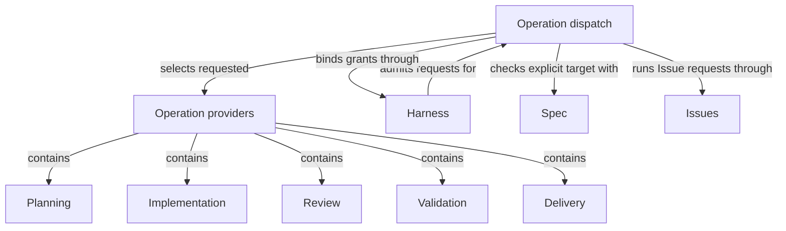

# Operations

## Purpose

Operations owns explicitly selected LangGraph StateGraph composition and its typed boundaries. It also maintains the compatibility public capability adapters and dispatch that connect existing request names to their business providers. These adapters are not a second semantic Operation identity: native Agent calls, native Workflows and finite Host services keep their actual execution kinds. Agents owns callable Agent definitions; the provider children retain their individual business promises.

## Terminology

| Term                                       | Meaning / definition                                                                                |
| ------------------------------------------ | --------------------------------------------------------------------------------------------------- |
| Public operation                           | Compatibility term for a public capability entry, not a claim of StateGraph execution.     |
| Internal operation                         | Compatibility term for a non-public admitted composition entry; it does not define an Agent. |
| [Operation](../module.md#terminology)      | Defined in Concorde Framework.                                                                      |
| [Module](../module.md#terminology)         | Defined in Concorde Framework.                                                                      |
| [Graph](../module.md#terminology)          | Defined in Concorde Framework.                                                                      |
| [Host](../module.md#terminology)           | Defined in Concorde Framework.                                                                      |
| [Harness](../module.md#terminology)        | Defined in Concorde Framework.                                                                      |
| [State](../module.md#terminology)          | Defined in Concorde Framework.                                                                      |
| [Pi integration](../module.md#terminology) | Defined in Concorde Framework.                                                                      |

## Usage

The calling session, the user session or its Task subagent, reads and selects complete Module context, answers questions and edits Specs,
paired metadata and registry directly under its task authority. It chooses which retained capability
to call and in what order. Concorde does not route the user's task, author Specs or run an end-to-end
development workflow.

Select `concorde-context-solve` for sufficiency, `concorde-plan` for a current plan,
`concorde-tasks` for acceptance tasks and `concorde-implement` for bounded code work. Review,
validation, Issues, initialization, configuration and delivery keep their separate contracts.
Each Module-bound request supplies target_id and task; optional focus selects only a local scenario.
Invalid selections fail deterministically rather than causing a router to choose another owner.

For example, an agent can clarify a retry promise by editing its owned Spec and metadata, validate
the consistent registry, obtain independent Spec review and then request a plan. A missing promise
returns to the caller rather than launching an author. Plan and task currentness and every actual
code grant still apply; the choice to invoke Operations manually does not bypass their checks.

## Design

Operations keeps the public compatibility-adapter inventory, separate from Agents-owned Agent definitions. Its five provider children own
Planning, Implementation, Review, Validation and Delivery. Module ownership and Operation USES are
independent of explicit context references. The calling session owns task sequencing; there is no
replacement universal coordinator.

Finite Host admission selects the requested provider and checks the explicit target, focus and
saved intent. It never discovers or substitutes a Module. Native Agent entries and authored native
workflows perform cognition with independently checked results. Only explicitly selected StateGraph
Operations use the optional graph/Studio boundary; the former dispatch/target Graph wrappers are
retired. State carries data, not execution authority.

### Flow overview

A request passes admission, explicit target checking when needed, then its selected capability.
Results preserve failures, blockers and current artifacts. The calling agent chooses a next step;
no provider completion silently invokes a development or Spec-authoring workflow.

### Operation flow guide

Read [Planning](../planning/module.md#flow-overview),
[Implementation](../implementation/module.md#flow-overview),
[Review](../review/module.md#usage), [Validation](../validation/module.md#usage),
[Delivery](../delivery/module.md#usage), [Issues](../issues/module.md#flow-overview) and
[project setup](../spec/module.md#flow-overview) for each retained contract.

## Relationships

This diagram shows responsibility ownership, not execution order. Each provider retains its own
input, authority and evidence contract. Containment never adds context or grants provider files.

Operation providers own distinct results under one completeness model. Their selection conditions,
relied-upon promises and local duties remain in [provider agreements](providers.md).

## Local collaboration agreements

These entries describe the Modules the dispatch uses. Its children's agreements are the
[provider agreements](providers.md).

### Harness

The [Harness Module](../harness/module.md) admits every request before dispatch and binds each Module-bound invocation, freezing its context and launching its workers.

This collaboration applies when finite admission dispatches the requested capability and when target admission binds an invocation to the selected owner.

- [Operation admission](../harness/admission.md#operation-execution-boundary); dispatch only requests admission has accepted, and return each leaf's typed output unchanged for admission to finish.
- [Complete context selection](../harness/contracts.md#contract.context.selection); supply the explicit Module and task, and stop dependent transitions on gaps or stale context.

### Spec

The [Spec Module](../spec/module.md) resolves the registered Modules, their focus scenarios and the candidate's recorded owner.

This collaboration applies when target admission checks a caller-selected owner before its leaf runs.

- [Owner and context resolution](../spec/contracts.md#registry-stable-id-spec-context-queries); refuse an owner that no longer resolves instead of reinterpreting it as another Module.

### Issues

The [Issues Module](../issues/module.md) owns Issue management and solving, whose solve action uses its authored native workflow; other actions are finite Host services.

This collaboration applies when an admitted `concorde-issues` request reaches dispatch.

- [Native Issue lifecycle](../issues/execution-reference.md#lifecycle-issue-graph-issue-graph); prepare the selected Issue workflow and admit its typed response without moving domain decisions into dispatch.

### Agents

[Agents](../agents/module.md) owns callable Agent definitions and interaction. This Module consumes
those definitions rather than maintaining an Agent catalog or behavioral copy. It preserves the
Agent's family, scope and frozen grant and refuses missing or stale bindings; domain artifact
acceptance and execution mechanisms remain with their existing owners.
