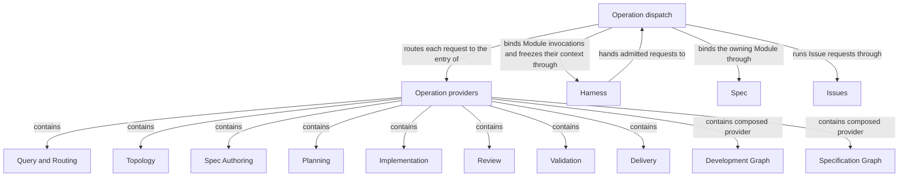

# Operations

## Purpose

Operations provides Concorde's executable behavior, from answering a question to preparing a contract, developing a change and delivering a verified candidate. It keeps the one catalog of every Operation, decides which of them developers may invoke directly, and routes each admitted request to the provider that owns it. Its children own their individual behavioral promises; this Module owns the catalog, the exposure rules and the dispatch that connect a request to them.

## Terminology

| Term | Meaning / definition |
| --- | --- |
| Public operation | An operation developers may invoke directly through a Skill, the Pi session tool or the public launcher. |
| Internal operation | An operation available only to declared composing operations, rather than a direct developer entry. |
| [Operation](../module.md#terminology) | Defined in Concorde Framework. |
| [Module](../module.md#terminology) | Defined in Concorde Framework. |
| [Graph](../module.md#terminology) | Defined in Concorde Framework. |
| [Host](../module.md#terminology) | Defined in Concorde Framework. |
| [Harness](../module.md#terminology) | Defined in Concorde Framework. |
| [State](../module.md#terminology) | Defined in Concorde Framework. |
| [Skill](../module.md#terminology) | Defined in Concorde Framework. |

## Usage

Choose a provider by the result you need. Query and Routing answers a question or selects its owner;
Spec Authoring proposes a contract; Planning produces a plan and tasks; Implementation fulfills the
accepted tasks; Review and Validation produce different kinds of evidence. Topology changes ownership
and registered structure. Delivery publishes a verified candidate only with separate authorization.

For a complete development task, select `concorde-dev-loop`. This composed Operation coordinates
specification, planning, implementation and checks, returning a ready candidate rather than a merge.
For specification work alone, select `concorde-specify-loop`; it returns before implementation.
Both are complete Operations, just as their internal planning or review building blocks are.

Every request reaches its provider along the same path. [Harness admission](../harness/host.md)
checks the request and binds its workspace; this Module's dispatch then selects the operation's
entry. An operation bound to one Module first passes target admission, which restores the recorded
owner of a change or asks the router to discover the owner, and the provider's own step then runs
with that bound invocation. [Choosing and composing operations](composition.md) explains which
operations are public and how composition is declared.

For example, a retry change can first use specification authoring to settle which failures permit
retries. Planning then consumes that agreed contract. If the contract is still insufficient, the
blocked result remains explicit; composition does not authorize guessing or broadening context.
The common launcher exposes only public entries. Internal Operations are available to admitted
compositions, not through an alternative unrestricted launcher.

## Design

The hierarchy groups **providers of behavior**, including providers of composed Operations. Its ten
children are responsibility owners, not ten nodes of one universal graph. Planning owns several
Operations, while a composed development Operation relies on several sibling owners. An Operation's
implementation may be deterministic code, model execution or a compiled graph without changing its
identity or completeness obligation.

A complete Operation declares input State, output State updates, effects, conditions of use and
execution policy. Its caller does not reconstruct context selection, permission boundaries, model
execution or result validation. Harness supplies trusted admission and execution services and
narrows the declared permission ceiling to the actual task. Runtime context carries those services;
State cannot carry or enlarge authority. Public/internal exposure does not change these guarantees.

The [checked inventory](composition.md) and its
[precise node contract](execution-reference.md#operations-operation-registry) connect
these responsibilities to executable declarations. Admission and worker execution live in
Harness; the catalog and the dispatch live here. Neither creates a competing executable category,
and this organization changes no provider's owned Spec identity, result meaning or authorization
boundary.

The Operation dispatch routes each admitted request to the entry of the provider that owns it.
After Harness has admitted a request and bound its workspace, the
[dispatch Graph](execution-reference.md#graphs-operation-dispatch-graph-dispatch-graph) selects the
operation's entry: the relay into a host-created candidate for a mutation admitted in the primary
worktree, delivery, project initialization and configuration, one action of the main entry, or the
[target admission Graph](execution-reference.md#graphs-target-admission-graph-target-graph), which
binds or discovers the owning Module before that provider's own step runs. The dispatch also keeps
the catalog of every compiled Graph that inspection and the Graph Spec check read.

Dispatch lives beside the catalog because the Module that declares every Operation is the one that
knows where each of them runs. Harness admission therefore stays independent of which providers
exist, and a new provider changes the catalog and the dispatch without changing the admission
boundary every request crosses.

Each Operation is explained only in the Specs of the Module that owns it: one of these children,
or Spec, Distribution and Issues for initialization, configuration and Issue handling. When an
Operation runs a Graph, that owner's Implementation Specs also hold the Graph Spec with its State,
Nodes and Edges.
The [ownership table](execution-reference.md#operations-behavioral-ownership-and-composition-limits)
maps every Operation, including each model-backed worker, to its owner and to the Graph it runs.

## Relationships

This view answers which provider responsibilities Operations contains and how an admitted request
reaches them. Containment is Module ownership; the containment edges are not execution order. The
dev-loop and specify-loop Modules own composed Operations and use sibling providers through
declared Operation composition. Explicit context references select provider knowledge separately
and never expand recursively.

The edge from Harness to the dispatch applies to every admitted request. The edge back to Harness
applies only when the selected Operation binds a Module or needs model execution: a deterministic
operation need not start a worker. Harness also provides other services, such as isolated checks,
which these edges do not represent.

Operation providers share one completeness model but own distinct results. Their exact selection
conditions, relied-upon promises and local duties are defined in the Module-owned
[provider agreements](providers.md). The Development Graph and Specification Graph are composed behavior providers,
not owners of the planning, review or authoring Modules they use.

## Local collaboration agreements

These entries describe the Modules the dispatch uses. Its children's agreements are the
[provider agreements](providers.md).

### Harness

The [Harness Module](../harness/module.md) admits every request before dispatch and binds each Module-bound invocation, freezing its context and launching its workers.

This collaboration applies when admission executes the dispatch Graph and when target admission binds an invocation to the selected owner.

- [Operation admission](../harness/admission.md#operation-execution-boundary); dispatch only requests admission has accepted, and return each leaf's typed output unchanged for admission to finish.
- [Complete context selection](../harness/contracts.md#contract.context.selection); supply the explicit Module and task, and stop dependent transitions on gaps or stale context.

### Spec

The [Spec Module](../spec/module.md) resolves the registered Modules, their focus scenarios and the candidate's recorded owner.

This collaboration applies when target admission binds a routed or restored owner before its leaf runs.

- [Owner and context resolution](../spec/contracts.md#registry-stable-id-spec-context-queries); refuse an owner that no longer resolves instead of reinterpreting it as another Module.

### Issues

The [Issues Module](../issues/module.md) owns Issue management and solving, which the `issues` leaf runs as its own Graph.

This collaboration applies when an admitted `concorde-issues` request reaches dispatch.

- [Issue Graph](../issues/execution-reference.md#lifecycle-issue-graph-issue-graph); run the selected Issue's Graph with the bound invocation and return its typed response without resolving the Issue itself.
