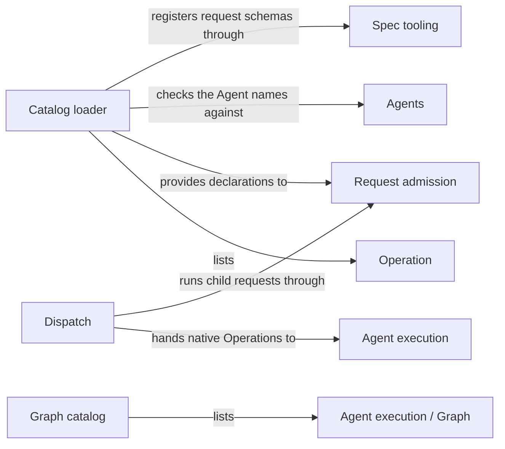

# Operations

## Purpose

Operations is the catalog of everything Concorde can execute and the dispatch that runs an admitted
request. Every Operation is declared once with its request, response, control-flow kind and owning
Module; dispatch calls the entry point the declaration names without knowing any provider in
advance. Operations also keeps the Graph catalog of the LangGraph Graphs Concorde compiles, and it
contains the Modules whose only responsibility is to provide Operations: Planning, Implementation,
Review, Validation, Delivery and Issue solving. It does not admit requests (Request admission does),
owns no stage behaviour (each provider does), and never decides which Operation runs next (the user
session does).

## Terminology

| Term | Definition |
| --- | --- |
| Operation | A cataloged executable entry with a declared request and response and exactly one control-flow kind: a Host service, a single Agent call, a pi workflow or a LangGraph Graph. |
| Operation catalog | The complete set of Operation declarations and the loader that validates them, from which admission, dispatch, the Pi session and distribution all read the same facts. |
| [Capability](../vocabulary.md#concept.concorde.capability) | |
| [User session](../vocabulary.md#concept.concorde.user-session) | |
| [Capability request](../harness/admission/module.md#concept.admission.capability-request) | |
| [Result envelope](../harness/admission/module.md#concept.admission.result-envelope) | |
| [Capability declaration](../harness/admission/module.md#concept.admission.capability-declaration) | |
| [Agent](../agents/module.md#concept.agents.agent) | |
| [Agent call](../harness/execution/module.md#concept.execution.agent-call) | |
| [Workflow](../harness/execution/module.md#concept.execution.workflow) | |
| [LangGraph Graph](../harness/execution/module.md#concept.execution.graph) | |
| [Agent hook](../harness/execution/module.md#concept.execution.agent-hook) | |
| [Workflow hook](../harness/execution/module.md#concept.execution.workflow-hook) | |
| [Phase](../harness/context/module.md#concept.context.phase) | |
| [Typed value](../spec/module.md#concept.spec.typed-value) | |

A capability is a public Operation. The capability declaration is the part of an Operation's
declaration that Request admission reads; dispatch reads the rest.

## Usage

An **Operation** is anything a request can make Concorde execute. Its declaration fixes its public
name, its request and response schemas, and its control-flow kind: a **Host service** runs
deterministic code to its end and returns the final result; a **single Agent call** returns a
prepared native call of one Agent, which the user session invokes unchanged; a **pi workflow**
returns a prepared native workflow of Agents and Host steps, which the user session invokes and then
polls; a **LangGraph Graph** is a sanctioned kind that no cataloged Operation uses today.

The **Operation catalog** holds eleven Operations, all public:

| Capability | Kind | Owner |
| --- | --- | --- |
| `concorde-context-solve`, `concorde-tasks` | single Agent call | [Planning](../planning/module.md) |
| `concorde-plan` | pi workflow | [Planning](../planning/module.md) |
| `concorde-implement` | single Agent call | [Implementation](../implementation/module.md) |
| `concorde-spec-review`, `concorde-code-review` | pi workflow | [Review](../review/module.md) |
| `concorde-validate` | Host service | [Validation](../validation/module.md) |
| `concorde-deliver` | Host service | [Delivery](../delivery/module.md) |
| `concorde-issues` | pi workflow | [Issue solving](../issue-solving/module.md) |
| `concorde-init` | Host service | [Spec tooling](../spec/module.md) |
| `concorde-configure` | Host service | [Request admission](../harness/admission/module.md) |

`concorde-issues` answers its listing, showing, reporting and reopening actions without starting
its workflow. The Operations that act on one Module share a core request: `target_id`, `task`, and
optionally `focus_id`, `constraints` and `change_id`. The exact declarations are in the
[catalog reference](catalog.md); a worked request is in the [design notes](design.md).

A request reaches its provider in three steps. Request admission looks the name up in the catalog,
checks the request, resolves the target and binds the workspace. Dispatch then reads the
declaration and calls the entry point it names: a Host service runs to its end, while an Agent call
or pi workflow is handed with the provider's hook to Agent execution's native driver, which returns
a prepared call without running a model. The user session invokes that call unchanged.

A name the catalog does not hold is refused with `unknown_operation`. An Agent call or pi workflow
reached without the native driver, for example through the bare launcher, is refused with
`native_required`. In `describe-policy` mode the provider or native driver returns a preview and no
Agent starts. An Operation may compose others only through the `uses` list of its declaration
(today only `concorde-issues`); each child request passes admission as a request of its own, and an
undeclared child is refused with `undeclared_operation`. No Operation starts another as a
consequence of finishing: the user session chooses every next step.

## Design

The children of Operations are exactly the Modules whose sole responsibility is to provide
Operations. `concorde-init` and `concorde-configure` are provided by the infrastructure Modules that
own what they maintain (Spec tooling and Request admission) and are cataloged like any other.

The **catalog loader** checks every declaration before anything uses it and registers its request
and response schemas as typed values. Every fact about an Operation (kind, owner, Agents and their
phases, children, schemas and the capability-declaration facts) is a declaration field, so no other
Module keeps a table of Operations. A mirror in this Module's Spec metadata lets Distribution's
package check detect drift.

**Dispatch** chooses a route by kind and calls the declared entry point. It imports no provider and
performs no business check: target and workspace checks happen in admission before it, stage rules
in the provider after it. Being finite and deterministic, it is plain code rather than a Graph.

The **Graph catalog** names every LangGraph Graph Concorde compiles and builds each without
services, so inspection and the Graph Spec check see exactly what execution compiles. Today it holds
only the Terminal Agent Operation, which compiles for inspection only.

The **Operations tests** exercise the catalog, its loader, dispatch by kind and by declared child,
and the Graph catalog.

The reasons behind these choices and the open questions (chaining the stage capabilities behind one
Operation; the first LangGraph Graph Operation) are in the [design notes](design.md).

## Relationships

Each child is reached the same way: dispatch calls the entry point its declaration names, and
Operations relies on each child to declare its Operations completely and correctly in the catalog.
A child whose declaration is invalid stops the whole catalog at load time.

**Planning** provides `concorde-context-solve`, `concorde-plan` and `concorde-tasks`: the
[context assessment](../planning/module.md#concept.planning.assessment), the
[plan](../planning/module.md#concept.planning.plan) and its [tasks](../planning/module.md#concept.planning.task).
Operations relies on Planning to leave earlier accepted plans and tasks intact when it rejects new
ones.

**Implementation** provides `concorde-implement`. Its [component work](../implementation/module.md#concept.implementation.component-work)
comes back to the user session as a typed response field, never as a dispatched request.

**Review** provides the [Spec review](../review/module.md#concept.review.spec-review) and the
[code review](../review/module.md#concept.review.code-review), each a pi workflow with its own
reviewer Agent, and reports [findings](../review/module.md#concept.review.finding) without changing
the reviewed Spec or code.

**Validation** provides `concorde-validate`, a Host service that records
[validation evidence](../validation/module.md#concept.validation.evidence) and decides whether a
candidate is [ready](../validation/module.md#concept.validation.ready), without any model.

**Delivery** provides `concorde-deliver`, a Host service that lands a ready candidate on its
[delivered branch](../delivery/module.md#concept.delivery.delivered-branch).

**Issue solving** provides `concorde-issues`, the one Operation that composes others: its
declaration lists the two reviews and `concorde-validate` in `uses`, and dispatch runs exactly those
as child requests while it reaches a [solve decision](../issue-solving/module.md#concept.issue-solving.decision).

**Request admission** checks every [capability request](../harness/admission/module.md#concept.admission.capability-request)
and wraps every outcome in the [result envelope](../harness/admission/module.md#concept.admission.result-envelope).
It reads each Operation's [capability declaration](../harness/admission/module.md#concept.admission.capability-declaration)
from the catalog, which Operations provides in the form the [capability declaration contract](../harness/admission/contracts.md#contract.admission.capability-declaration)
defines; the loader refuses a declaration that does not satisfy it. Dispatch sees only admitted
requests, reports its errors through admission's envelope, and hands child requests back to
admission as new requests.

**Agent execution** runs every native Operation: dispatch hands an [Agent call](../harness/execution/module.md#concept.execution.agent-call)
or [workflow](../harness/execution/module.md#concept.execution.workflow) to its native driver with
the provider's [Agent hook](../harness/execution/module.md#concept.execution.agent-hook) or
[workflow hook](../harness/execution/module.md#concept.execution.workflow-hook), and refuses with
`native_required` when no driver is supplied. The Graph catalog lists each
[Graph](../harness/execution/module.md#concept.execution.graph) that the [Graph Spec](../harness/execution/module.md#concept.execution.graph-spec)
check inspects, including the [Terminal Agent Operation](../harness/execution/module.md#concept.execution.terminal-agent-operation),
built without services.

**Agents** defines every [Agent](../agents/module.md#concept.agents.agent) in its
[Agent definition](../agents/module.md#concept.agents.definition). The loader refuses a declared
Agent name without a definition, and a single Agent call whose entry point differs from the hook the
definition names. Operations keeps no second list of Agents.

**Task context** defines the [phase](../harness/context/module.md#concept.context.phase) in which an
Agent works. A declaration pairs each Agent with its phase, so the native driver needs no table of
stages; the loader refuses an unknown phase.

**Spec tooling** registers [typed values](../spec/module.md#concept.spec.typed-value). The loader
registers each declared request and response schema and refuses a declaration whose schema does not
register.
