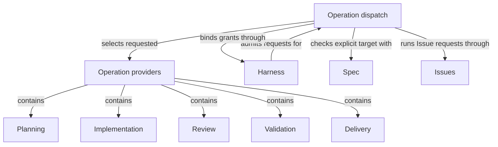

# Operations

## Purpose

Operations provides Concorde's executable behavior, from planning and implementing a selected task to reviewing, checking and delivering a verified candidate. It keeps the one catalog of every Operation, decides which of them developers may invoke directly, and routes each admitted request to the provider that owns it. Its children own their individual behavioral promises; this Module owns the catalog, the exposure rules and the dispatch that connect a request to them.

## Terminology

| Term                                  | Meaning / definition                                                                                     |
| ------------------------------------- | -------------------------------------------------------------------------------------------------------- |
| Public operation                      | An operation developers may invoke directly through a Skill, the Pi session tool or the public launcher. |
| Internal operation                    | An operation available only to declared composing operations, rather than a direct developer entry.      |
| [Operation](../module.md#terminology) | Defined in Concorde Framework.                                                                           |
| [Module](../module.md#terminology)    | Defined in Concorde Framework.                                                                           |
| [Graph](../module.md#terminology)     | Defined in Concorde Framework.                                                                           |
| [Host](../module.md#terminology)      | Defined in Concorde Framework.                                                                           |
| [Harness](../module.md#terminology)   | Defined in Concorde Framework.                                                                           |
| [State](../module.md#terminology)     | Defined in Concorde Framework.                                                                           |
| [Skill](../module.md#terminology)     | Defined in Concorde Framework.                                                                           |

## Usage

The outer agent reads and selects complete Module context, answers questions and edits Specs,
paired metadata and registry directly under its task authority. It chooses which retained Operation
to call and in what order. Concorde does not route the user's task, author Specs or run an end-to-end
development workflow.

Select `concorde-context-solve` for sufficiency, `concorde-plan` for a current plan,
`concorde-tasks` for acceptance tasks and `concorde-implement` for bounded code work. Review,
validation, Issues, initialization, configuration and delivery keep their separate contracts.
Each Module-bound request supplies target_id and task; optional focus selects only a local scenario.
Invalid selections fail deterministically rather than causing a router to choose another owner.

For example, an agent can clarify a retry promise by editing its owned Spec and metadata, validate
the consistent registry, obtain independent Spec review and then request a plan. A missing promise
returns to the caller rather than launching an author. Plan and task currentness and every actual
code grant still apply; the choice to invoke Operations manually does not bypass their checks.

## Design

Operations keeps one inventory of complete executable capabilities. Its five provider children own
Planning, Implementation, Review, Validation and Delivery. Module ownership and Operation USES are
independent of explicit context references. The outer agent owns task sequencing; there is no
replacement universal coordinator.

The [dispatch Graph](execution-reference.md#graphs-operation-dispatch-graph-dispatch-graph)
selects only the requested provider after common Harness admission. Its
[target admission Graph](execution-reference.md#graphs-target-admission-graph-target-graph)
checks explicit target/focus and saved intent; it never discovers or substitutes a Module.
Runtime services narrow each Operation's declared permission ceiling. State carries data, not
execution authority. The same graph factories serve execution and inspection.

### Flow overview

A request passes admission, explicit target checking when needed, then its selected capability.
Results preserve failures, blockers and current artifacts. The calling agent chooses a next step;
no provider completion silently invokes a development or Spec-authoring workflow.

### Operation flow guide

Read [Planning](../planning/module.md#flow-overview),
[Implementation](../implementation/module.md#flow-overview),
[Review](../review/module.md#usage), [Validation](../validation/module.md#usage),
[Delivery](../delivery/module.md#usage), [Issues](../issues/module.md#flow-overview) and
[project setup](../spec/module.md#flow-overview) for each retained contract.

## Relationships

This diagram shows responsibility ownership, not execution order. Each provider retains its own
input, authority and evidence contract. Containment never adds context or grants provider files.

Operation providers own distinct results under one completeness model. Their selection conditions,
relied-upon promises and local duties remain in [provider agreements](providers.md).

## Local collaboration agreements

These entries describe the Modules the dispatch uses. Its children's agreements are the
[provider agreements](providers.md).

### Harness

The [Harness Module](../harness/module.md) admits every request before dispatch and binds each Module-bound invocation, freezing its context and launching its workers.

This collaboration applies when admission executes the dispatch Graph and when target admission binds an invocation to the selected owner.

- [Operation admission](../harness/admission.md#operation-execution-boundary); dispatch only requests admission has accepted, and return each leaf's typed output unchanged for admission to finish.
- [Complete context selection](../harness/contracts.md#contract.context.selection); supply the explicit Module and task, and stop dependent transitions on gaps or stale context.

### Spec

The [Spec Module](../spec/module.md) resolves the registered Modules, their focus scenarios and the candidate's recorded owner.

This collaboration applies when target admission checks a caller-selected owner before its leaf runs.

- [Owner and context resolution](../spec/contracts.md#registry-stable-id-spec-context-queries); refuse an owner that no longer resolves instead of reinterpreting it as another Module.

### Issues

The [Issues Module](../issues/module.md) owns Issue management and solving, which the `issues` leaf runs as its own Graph.

This collaboration applies when an admitted `concorde-issues` request reaches dispatch.

- [Issue Graph](../issues/execution-reference.md#lifecycle-issue-graph-issue-graph); run the selected Issue's Graph with the bound invocation and return its typed response without resolving the Issue itself.
