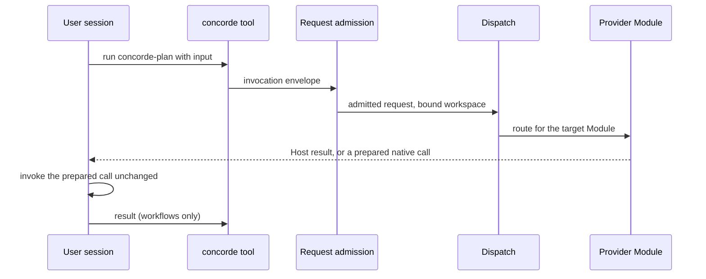
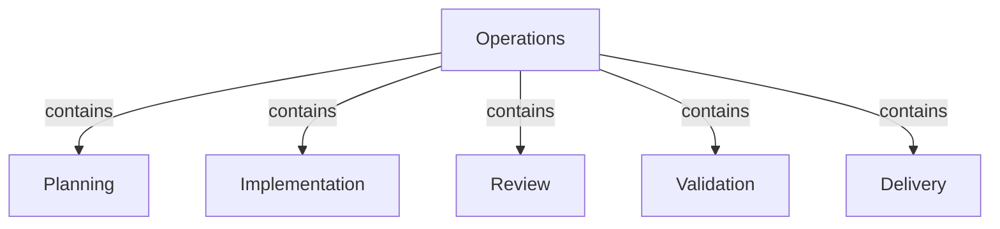
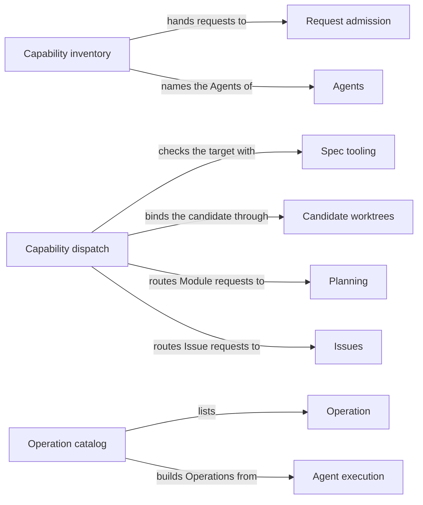

# Operations

## Purpose

Operations is the list of Concorde's public capabilities and the dispatch that sends each admitted
request to the Module that owns its behaviour. It also keeps the catalog of Operations: the control
flows that Concorde writes explicitly as LangGraph StateGraphs. Its five children, Planning,
Implementation, Review, Validation and Delivery, own the behaviour of most capabilities; Issues,
Spec and Distribution own the rest. Operations does not admit requests, which is the job of Request
admission, and it never decides which capability runs next: the user session does. No capability
starts another one when it finishes.

## Terminology

| Term | Definition |
| --- | --- |
| Operation | A Concorde control flow written explicitly as a LangGraph StateGraph with typed input and output State, which a host selects by name and LangGraph Studio can display. |
| Capability declaration | The Python module under `operations/` that declares one capability's kind, request schema, context selection and the Agents it uses. |
| Capability kind | How a capability does its work once admitted: as one direct native Agent call, as a native workflow, or as a finite Host service that calls no model. |
| [Capability](../vocabulary.md#concept.concorde.capability) | |
| [User session](../vocabulary.md#concept.concorde.user-session) | |
| [Host](../vocabulary.md#concept.concorde.host) | |
| [Module](../vocabulary.md#concept.concorde.module) | |
| [Agent](../agents/module.md#concept.agents.agent) | |
| [Workflow](../harness/execution/module.md#concept.execution.workflow) | |
| [Candidate](../harness/worktrees/module.md#concept.worktrees.candidate) | |

A capability is what the user session calls. Its kind says whether a model runs and how. An
Operation is a different thing: a StateGraph that the Host runs, used today by one internal flow.

## Usage

### The public capabilities

There are eleven capabilities. Each has one **capability declaration** in `operations/` and one
public name. The **kind** tells the caller what to expect: an Agent capability returns a prepared
native Agent call, a workflow capability returns a prepared native workflow, and a Host capability
runs to its end and returns the final result.

| Capability | Kind | Behaviour owned by | What it does |
| --- | --- | --- | --- |
| `concorde-context-solve` | Agent | [Planning](../planning/module.md) | Judges whether the Module's Spec says enough to plan the task |
| `concorde-plan` | workflow | [Planning](../planning/module.md) | Assesses the task, then writes a plan in the candidate |
| `concorde-tasks` | Agent | [Planning](../planning/module.md) | Derives acceptance tasks from the accepted plan |
| `concorde-implement` | Agent | [Implementation](../implementation/module.md) | Changes the Module's implementation files to fulfil the tasks |
| `concorde-spec-review` | workflow | [Review](../review/module.md) | Reviews a Module's Spec independently |
| `concorde-code-review` | workflow | [Review](../review/module.md) | Reviews a Module's code against its Spec independently |
| `concorde-validate` | Host | [Validation](../validation/module.md) | Runs the deterministic checks and records readiness evidence |
| `concorde-deliver` | Host | [Delivery](../delivery/module.md) | Stages a verified candidate on its own branch |
| `concorde-issues` | Host; workflow to solve | [Issues](../issues/module.md) | Lists, shows, reports, reopens or solves an Issue |
| `concorde-init` | Host | [Spec](../spec/module.md) | Proposes, then applies, the first Spec of a project |
| `concorde-configure` | Host | [Distribution](../distribution/module.md) | Chooses worker models or accepts the installed Protocol |

The capabilities that act on one Module share a core request: `target_id`, the Module it acts on;
`task`, a plain statement of the work; and optionally `focus_id`, one scenario of that Module, and
`constraints`. The exact fields are in the [declarations and dispatch reference](catalog.md).

### How a request reaches its provider

Take a plan for a billing Module. The user session first calls the Pi tool `concorde` with
`operation: "concorde-plan"` and `action: "describe"` to read the capability's guidance and request
schema. Then it calls `action: "run"` with the input
`{"target_id": "module.billing", "task": "Retry failed card charges once"}`.

1. The session extension, which [Distribution](../distribution/module.md) installs, wraps the input
   in a typed invocation envelope and hands it to the launcher `scripts/run-operation.py`. The
   launcher accepts only the eleven public names. For a Host capability it runs the capability
   declaration; for a native capability such as this one it runs the Host's native preparation.
   Both lead to Request admission.
2. Request admission checks the envelope against the request schema, binds the request to a
   workspace, here a candidate worktree because planning writes, and checks the configuration.
3. Dispatch checks that `module.billing` is a registered Module, binds the candidate to it, and
   routes the request to Planning.
4. Planning runs no model at this point. It freezes the task's context and returns an exact native
   workflow call. The user session invokes that call unchanged; the workflow runs a context assessor
   and, if the Spec is sufficient, a planner. Host steps inside the workflow accept or reject each
   result.
5. The user session polls `concorde` with `action: "result"` until the workflow ends. The result
   says whether the Host accepted a plan, or why it stopped.

A Host capability such as `concorde-validate` finishes inside steps 2 and 3, and the tool returns
its final result at once. An Agent capability such as `concorde-tasks` returns a prepared Agent call;
the Host accepts or rejects the Agent's answer when the call returns.

Every result is a typed envelope whose status is `succeeded`, `described`, `blocked` or `failed`,
with errors that explain a stop. An unknown capability name is refused as `unknown_operation`; a
missing or unknown target stops before any worktree or worker is touched. Running with
`mode: "describe-policy"` previews the context and permissions a real run would use, without
starting an Agent. Calling a native capability through the bare launcher, without the Pi session,
is refused as `native_required`.

### Operations and native calls

An **Operation** is a flow the Host runs as a LangGraph StateGraph: typed State channels, and nodes
and edges declared before the graph is compiled. Because the structure is declared, it can be drawn
in LangGraph Studio and checked against its Graph Spec. The public capabilities are not Operations.
Their model work runs as native Pi [Agents](../agents/module.md#concept.agents.agent) and
[workflows](../harness/execution/module.md#concept.execution.workflow), which the Host prepares and
whose results it accepts, and their Host work is ordinary finite code.

Today the Operation catalog holds one Operation, `terminal_agent_operation`. It wraps one Agent call
with typed input and output State. The Harness uses it on its diagnostic worker path, and Studio
displays it. It needs a trusted Agent service from the host that embeds it; without one it only
compiles for inspection.

The word "operation" also appears in the directory `operations/`, in the request field
`operation_id` and in Python names such as `run_operation`. There it means any capability. In the
Specs, Operation means only a StateGraph.

## Design

The **capability inventory** is the directory `operations/`: its package lists the eleven capability
names and groups them by kind, and each declaration module gives one capability's kind, exposure,
context selection, determinism, the Agents it uses and its request schema. The declarations carry
no behaviour; each one hands its request to Request admission. Keeping them apart from behaviour
lets Distribution render the Pi catalog and the guidance from one place, and lets a package check
compare the declarations with the inventory in this Module's metadata, so the published list cannot
drift from the code. The behaviour stays with the provider Module that owns it.

The **capability dispatch** is plain code, not a graph. Admission calls a fixed list of dispatch
steps in a fixed order: choose a route by capability name, check the explicit target, bind the
candidate, and call the provider. The sequence is finite and deterministic, so a graph would add
nothing to inspect. The routes are listed in the [declarations and dispatch reference](catalog.md).

Dispatch never discovers or substitutes a Module. A request whose target does not resolve fails
instead of being redirected. When a candidate already belongs to another Module, a request for a
component Module is admitted only as component work that the owner's accepted tasks name exactly;
this keeps one candidate from quietly serving two unrelated changes.

The **Operation catalog** names every Operation and builds it without any Agent service, so inspection,
publication and the Graph Spec check all see exactly the topology that execution compiles. New
control flow that Concorde itself orchestrates must be an Operation built with LangGraph's Graph API
(`StateGraph`); the Functional API hides control flow inside ordinary Python and is not allowed.

State carries data, never authority. An Operation receives its trusted services, such as the Agent
launcher, through LangGraph's runtime context supplied by the embedding host, so a request cannot
inject a more powerful launcher or another workspace.

The **Operations tests** exercise the launcher's refusal of unknown names, explicit target
admission, the capability declarations and the Operation catalog.

**Open questions.** The dispatch route table lives in a file named `dispatch_graph.py` and defines a
`DispatchState` type, although no dispatch graph is compiled; only a test-support mirror still
builds one. The package also defines `STATE_OPERATIONS`, which no code reads. Whether these names
should be removed is undecided.

## Relationships

Dispatch routes to every provider child in the same way it routes to Planning; the diagram shows
one.

**Planning** owns `concorde-context-solve`, `concorde-plan` and `concorde-tasks`: judging whether a
Spec is sufficient, writing a plan and deriving tasks. Dispatch routes those three capabilities to it
after binding the target. Operations relies on Planning to return a typed result and to leave
earlier accepted plans and tasks intact when it rejects new ones.

**Implementation** owns `concorde-implement`: changing the Module's implementation files to fulfil
accepted tasks. Dispatch routes to it after binding the target. When the tasks name component
Modules, Implementation returns that work to the caller, and dispatch later admits the component
requests as described in Design.

**Review** owns `concorde-spec-review` and `concorde-code-review`. Dispatch treats both as read-only:
it binds no candidate owner for them. Operations relies on Review to report findings without
changing the reviewed Spec or code.

**Validation** owns `concorde-validate`, a Host capability. Dispatch routes it after binding the
target, and Validation runs the checks and records readiness evidence without any model.

**Delivery** owns `concorde-deliver`, a Host capability. Dispatch sends it straight to Delivery
without a target check, because delivery acts on the candidate as a whole.

**Request admission** checks every [capability request](../harness/admission/module.md#concept.admission.capability-request),
binds its workspace and wraps every outcome in the [result envelope](../harness/admission/module.md#concept.admission.result-envelope).
Each capability declaration hands its request to admission, and admission calls dispatch. When a
mutating request arrives in the primary worktree, admission's [relay](../harness/admission/module.md#concept.admission.relay)
runs it in the candidate worktree, and dispatch passes the relayed result through unchanged, as
[a relay returns the candidate's envelope](../harness/admission/requirements.md#req.admission.relay-result) requires.
Dispatch only ever sees requests that admission accepted; any error it raises is reported through
admission's envelope.

**Spec** resolves the explicit target and its focus scenario from the
[registry](../spec/module.md#concept.spec.registry), and runs the project services behind
`concorde-init`, including its [initial proposal](../spec/module.md#concept.spec.initial-proposal),
and `concorde-configure`. Dispatch refuses a target that does not resolve and never replaces it with
another Module.

**Candidate worktrees** records which Module owns a [candidate](../harness/worktrees/module.md#concept.worktrees.candidate).
Dispatch binds that owner for every mutating capability in execute mode, relying on
[a change keeping its recorded intent](../harness/worktrees/requirements.md#req.worktrees.owner-preserved), and checks
the candidate's recorded tasks before admitting component work for another Module. A binding
conflict stops the request before any provider runs.

**Agent execution** supplies the [Terminal Agent Operation](../harness/execution/module.md#concept.execution.terminal-agent-operation)
boundary that wraps one Agent call, the [workflow](../harness/execution/module.md#concept.execution.workflow) machinery
that native capabilities run in, and the check that every Operation has one matching
[Graph Spec](../harness/execution/module.md#concept.execution.graph-spec). The Operation catalog builds its Operations
from that boundary and relies on [graphs using the Graph API](../harness/execution/requirements.md#req.execution.graph-api-only);
the Graph Specs themselves are kept with the boundary's owner.

**Agents** defines every [Agent](../agents/module.md#concept.agents.agent) once, in its
[Agent definition](../agents/module.md#concept.agents.definition). Capability declarations name the
Agents they use, such as `planner` or `programmer`, and those names must resolve to definitions.
Operations keeps no second list of Agents.

**Issues** owns `concorde-issues` and the durable [Issue](../issues/module.md#concept.issues.issue)
records. Dispatch routes listing, showing, reporting and reopening to Issues' Host services, and
routes solving to its native workflow. Dispatch makes no Issue decision itself.
