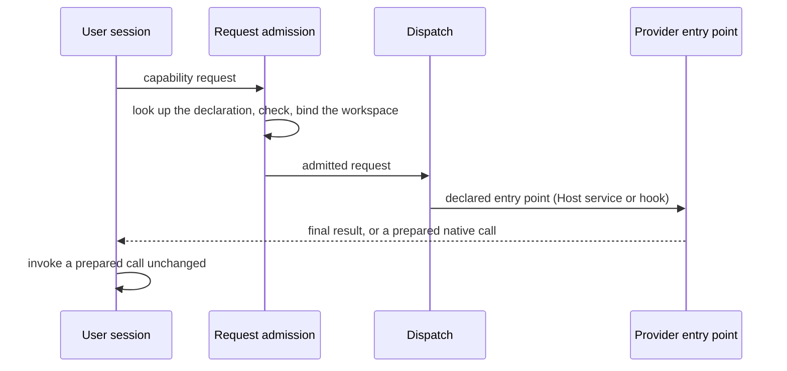
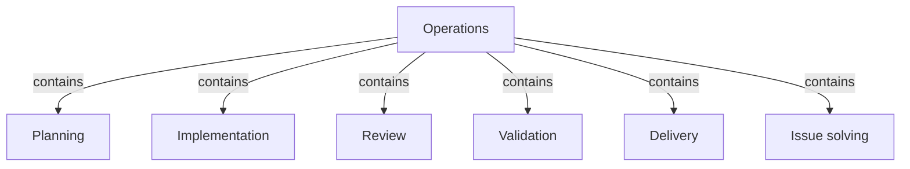
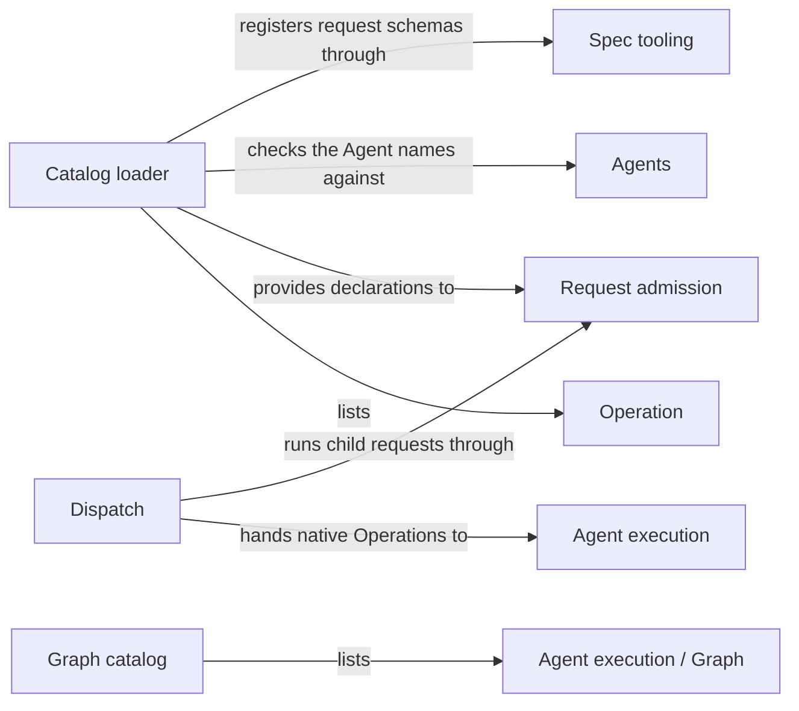

# Operations

## Purpose

Operations is the catalog of everything Concorde can execute and the dispatch that runs an admitted
request. Every Operation, public or not, is declared once in the catalog with its request, its
response, the one control flow it uses and the Module that owns its behaviour; dispatch reads that
declaration and calls the entry point it names, without knowing any provider in advance. Operations
also keeps the Graph catalog, the list of LangGraph Graphs that Concorde runs. It contains the
Modules whose only responsibility is to provide Operations: Planning, Implementation, Review,
Validation, Delivery and Issue solving. Operations does not admit requests, which Request admission
does before dispatch; it owns no stage behaviour, which stays with each provider; and it never
decides which Operation runs next, which the user session does.

## Terminology

| Term | Definition |
| --- | --- |
| Operation | A cataloged executable entry with a declared request and response and exactly one control-flow kind: a Host service, a single Agent call, a pi workflow or a LangGraph Graph. |
| Operation catalog | The complete set of Operation declarations and the loader that validates them, from which admission, dispatch, the Pi session and distribution all read the same facts. |
| [Capability](../vocabulary.md#concept.concorde.capability) | |
| [User session](../vocabulary.md#concept.concorde.user-session) | |
| [Host](../vocabulary.md#concept.concorde.host) | |
| [Module](../vocabulary.md#concept.concorde.module) | |
| [Capability request](../harness/admission/module.md#concept.admission.capability-request) | |
| [Result envelope](../harness/admission/module.md#concept.admission.result-envelope) | |
| [Capability declaration](../harness/admission/module.md#concept.admission.capability-declaration) | |
| [Agent](../agents/module.md#concept.agents.agent) | |
| [Agent call](../harness/execution/module.md#concept.execution.agent-call) | |
| [Workflow](../harness/execution/module.md#concept.execution.workflow) | |
| [LangGraph Graph](../harness/execution/module.md#concept.execution.graph) | |
| [Agent hook](../harness/execution/module.md#concept.execution.agent-hook) | |
| [Workflow hook](../harness/execution/module.md#concept.execution.workflow-hook) | |
| [Phase](../harness/context/module.md#concept.context.phase) | |
| [Typed value](../spec/module.md#concept.spec.typed-value) | |

A capability is a public Operation: the user session can call it through the Pi `concorde` tool.
Every capability is an Operation, but the catalog may also hold Operations that only other
Operations call. The capability declaration is the part of an Operation's declaration that Request
admission reads; the rest of the declaration is read by dispatch.

## Usage

### The catalog

An **Operation** is anything a request can make Concorde execute. Its declaration fixes its public
name, its request and response schemas, and its control-flow kind, which tells a caller what to
expect:

- a **Host service** runs deterministic code to its end and returns the final result;
- a **single Agent call** returns a prepared native call of one Agent, which the user session
  invokes unchanged; the Host accepts the Agent's answer when the call returns;
- a **pi workflow** returns a prepared native workflow, an authored script that runs Agents and
  Host steps; the user session invokes it and then polls for the result;
- a **LangGraph Graph** is a control flow the Host runs as a `StateGraph`. The kind is sanctioned,
  but no cataloged Operation uses it today.

The **Operation catalog** holds eleven Operations, all public:

| Capability | Kind | Owner | What it does |
| --- | --- | --- | --- |
| `concorde-context-solve` | single Agent call | [Planning](../planning/module.md) | Judges whether a Module's Spec says enough for a task |
| `concorde-plan` | pi workflow | [Planning](../planning/module.md) | Assesses the task, then writes a plan in the candidate |
| `concorde-tasks` | single Agent call | [Planning](../planning/module.md) | Derives acceptance tasks from the accepted plan |
| `concorde-implement` | single Agent call | [Implementation](../implementation/module.md) | Changes the Module's files to fulfil its tasks |
| `concorde-spec-review` | pi workflow | [Review](../review/module.md) | Reviews a Module's Spec independently |
| `concorde-code-review` | pi workflow | [Review](../review/module.md) | Reviews a Module's code against its Spec independently |
| `concorde-validate` | Host service | [Validation](../validation/module.md) | Runs deterministic checks and records readiness evidence |
| `concorde-deliver` | Host service | [Delivery](../delivery/module.md) | Lands a validated candidate on its branch, and merges it on request |
| `concorde-issues` | pi workflow | [Issue solving](../issue-solving/module.md) | Lists, shows, reports, reopens or solves an Issue |
| `concorde-init` | Host service | [Spec tooling](../spec/module.md) | Proposes, then applies, the first Spec of a project |
| `concorde-configure` | Host service | [Request admission](../harness/admission/module.md) | Proposes, then applies, the project's Operation configuration |

`concorde-issues` is declared as a pi workflow because solving runs one; its listing, showing,
reporting and reopening actions are answered by the same entry point without starting the workflow.
The exact declaration of each Operation is in the [catalog reference](catalog.md).

The Operations that act on one Module share a core request: `target_id`, the Module; `task`, a plain
statement of the work; and optionally `focus_id` (one scenario of that Module), `constraints` and
`change_id`. Each Operation's own request extends or replaces it, as its owner explains.

### How a request reaches its provider

Take a plan for a billing Module. The user session calls the Pi tool `concorde` with
`operation: "concorde-plan"` and `action: "describe"` to read the capability's guidance and request
schema, then with `action: "run"` and the input
`{"target_id": "module.billing", "task": "Retry failed card charges once"}`.

1. The launcher receives the request and the Operation catalog. Request admission looks the name up
   in the catalog, checks the request against the declared schema, resolves the target the way the
   capability declaration says, binds the workspace (a candidate, because planning writes) and
   checks the configuration.
2. Admission hands the admitted request to dispatch. Dispatch reads the declaration: `concorde-plan`
   is a pi workflow whose workflow hook Planning names. Dispatch hands the request and that hook to
   the native driver of Agent execution.
3. The native driver and Planning's hook freeze the Agents' context and return an exact native
   workflow call. No model has run yet. The user session invokes the call unchanged and polls with
   `action: "result"` until the workflow ends.

A Host service such as `concorde-validate` runs to its end inside step 2, and the result envelope
carries its final result at once. A single Agent call such as `concorde-tasks` returns a prepared
Agent call; the Host accepts or rejects the Agent's answer when the call returns.

### Errors and previews

A name the catalog does not hold is refused with `unknown_operation` before anything else runs.
A single Agent call or pi workflow reached without the native driver, for example through the bare
launcher outside the Pi session, is refused with `native_required`; no model runs. A request whose
mode is `describe-policy` is dispatched like any other, and the provider or native driver answers
with a preview instead of running: no Agent starts and no project file changes.

### Operations that call Operations

An Operation may compose others: `concorde-issues` runs `concorde-spec-review`,
`concorde-code-review` and `concorde-validate` as steps of solving an Issue. The parent's
declaration lists them in `uses`, and dispatch runs a child only through that list: the child
request goes through Request admission as a request of its own, with its own checks and envelope.
A child the parent did not declare is refused with `undeclared_operation`. No Operation ever starts
another as a consequence of finishing: the user session chooses every next step.

## Design

### Why Operations is composed this way

The children of Operations are exactly the Modules whose sole responsibility is to provide
Operations: the four change stages (Planning, Implementation, Review, Validation), Delivery, and
Issue solving. Their behaviour changes with the development workflow, so they sit together under
one parent that explains how they are cataloged and dispatched. Two capabilities are provided by
infrastructure Modules outside it, because each belongs to the thing it maintains:
`concorde-init` by Spec tooling, which owns the Spec format the first proposal must satisfy, and
`concorde-configure` by Request admission, which owns the configuration every request is checked
against. The catalog lists them like any other Operation.

### Declarations instead of tables

The **catalog loader** reads every Operation declaration and checks it before anything uses it:
each declaration names one control-flow kind that dispatch routes, an owning Module, the Agents it
runs with the phase of each, the child Operations it composes, its request and response schemas,
and the facts of the [capability declaration](../harness/admission/module.md#concept.admission.capability-declaration)
contract. The loader registers the request and response schemas as
[typed values](../spec/module.md#concept.spec.typed-value), so every consumer validates against the
same schema. Each declaration lives in a file bound by its owner, next to the behaviour it declares;
the catalog package lists them. Because every fact about an Operation is a field of its declaration,
no other Module keeps a table of which Operations are public, deterministic, model-backed or
review-kind; they read the declaration. A mirror of the catalog in this Module's Spec metadata lets
the package check of Distribution detect a declaration that drifted from the Spec.

### Dispatch by declared entry point

**Dispatch** is small on purpose. It chooses a route by the declaration's kind and calls the entry
point the declaration names: a Host service's function, or the provider's
[Agent hook](../harness/execution/module.md#concept.execution.agent-hook) or
[workflow hook](../harness/execution/module.md#concept.execution.workflow-hook), which it hands to
the native driver. It imports no provider, so adding an Operation never changes dispatch, and no
provider's failure can be hidden in a hardcoded branch. Dispatch also performs no business check:
target resolution and workspace binding happen in admission before it, and every stage rule
(prerequisites, change scope, acceptance) happens in the provider after it. The sequence is finite
and deterministic, so it is plain code rather than a Graph.

Nested composition goes through dispatch for the same reason: the only way one Operation reaches
another is the declared `uses` list, and the child passes admission again, so composing Operations
never skips a check or gains a wider workspace than a direct request would.

### LangGraph Graphs

The **Graph catalog** names every LangGraph Graph that Concorde runs and builds each one without
any service, so inspection, publication and the Graph Spec check of Agent execution all see exactly
the topology that execution compiles. Concorde's own control flow is either a pi workflow or a
[LangGraph Graph](../harness/execution/module.md#concept.execution.graph) built with the Graph API;
simple flows use pi workflows. Today the Graph catalog holds one Graph, the Terminal Agent
Operation that Agent execution provides as a building block; no cataloged Operation runs it, so it
compiles for inspection only.

The **Operations tests** exercise the catalog's refusal of unknown names, the declarations and
their loader, dispatch by kind and by declared child, and the Graph catalog.

### Open questions

- The stage capabilities (`concorde-context-solve`, `concorde-plan`, `concorde-tasks`,
  `concorde-implement`, `concorde-spec-review`, `concorde-code-review`) stay public, and the user
  session sequences them. Whether they should later be chained behind one Operation, and whether
  that Operation would be a pi workflow or a LangGraph Graph, is undecided.
- No cataloged Operation is a LangGraph Graph, so dispatch has no route for that kind and the
  loader refuses such a declaration. The first Operation of that kind will add the route.

## Relationships

Every provider child is reached the same way: dispatch calls the entry point its declaration names.

**Planning** provides `concorde-context-solve`, `concorde-plan` and `concorde-tasks`: judging
whether a Spec is sufficient, writing a plan and deriving tasks. Operations relies on Planning to
declare each of them in the catalog with a workflow or Agent hook, and to leave earlier accepted
plans and tasks intact when it rejects new ones.

**Implementation** provides `concorde-implement`: changing a Module's files to fulfil accepted
tasks. Component work for other Modules comes back to the user session as a typed field of the
response, never as a dispatched request.

**Review** provides `concorde-spec-review` and `concorde-code-review`, each a pi workflow with its
own reviewer Agent. Operations relies on Review to report findings without changing the reviewed
Spec or code.

**Validation** provides `concorde-validate`, a Host service that runs deterministic checks and
records readiness evidence without any model.

**Delivery** provides `concorde-deliver`, a Host service that lands a validated candidate.

**Issue solving** provides `concorde-issues`. It is the one Operation that composes others: its
declaration lists `concorde-spec-review`, `concorde-code-review` and `concorde-validate` in `uses`,
and dispatch runs exactly those as child requests.

**Request admission** checks every [capability request](../harness/admission/module.md#concept.admission.capability-request),
binds its workspace and wraps every outcome in the [result envelope](../harness/admission/module.md#concept.admission.result-envelope).
It reads each Operation's [capability declaration](../harness/admission/module.md#concept.admission.capability-declaration)
from the catalog instead of hardcoding what an Operation needs, and Operations provides that
declaration in the exact form the [capability declaration contract](../harness/admission/contracts.md#contract.admission.capability-declaration)
defines. The loader refuses a declaration that does not satisfy it, so admission never meets one.
Dispatch only ever sees admitted requests; any error it raises is reported through admission's
envelope. A child request of a composed Operation is handed back to admission as a new request.

**Agent execution** runs every native Operation. Dispatch hands a single
[Agent call](../harness/execution/module.md#concept.execution.agent-call) or a
[workflow](../harness/execution/module.md#concept.execution.workflow) to its native driver
together with the provider's [Agent hook](../harness/execution/module.md#concept.execution.agent-hook)
or [workflow hook](../harness/execution/module.md#concept.execution.workflow-hook), and refuses the
request with `native_required` when the host supplies no native driver. The Graph catalog lists
each [LangGraph Graph](../harness/execution/module.md#concept.execution.graph) that Agent execution's
[Graph Spec](../harness/execution/module.md#concept.execution.graph-spec) check inspects, and builds
the [Terminal Agent Operation](../harness/execution/module.md#concept.execution.terminal-agent-operation)
without services for that inspection.

**Agents** defines every [Agent](../agents/module.md#concept.agents.agent) once, in its
[Agent definition](../agents/module.md#concept.agents.definition). A declaration names the Agents
its Operation runs, and the loader refuses a name without a definition. For a single Agent call the
declared entry point must be the Agent hook that the Agent's definition names. Operations keeps no
second list of Agents.

**Task context** defines the [phase](../harness/context/module.md#concept.context.phase) in which an
Agent works. A declaration pairs each Agent it runs with the phase of that step, which is how the
native driver knows which context to freeze without a table of stages.

**Spec tooling** keeps the registration of [typed values](../spec/module.md#concept.spec.typed-value).
The loader registers each declared request and response schema under the Operation's name, and
refuses a declaration whose schema does not register.
