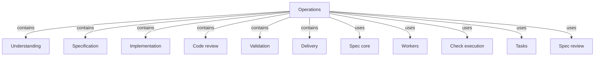
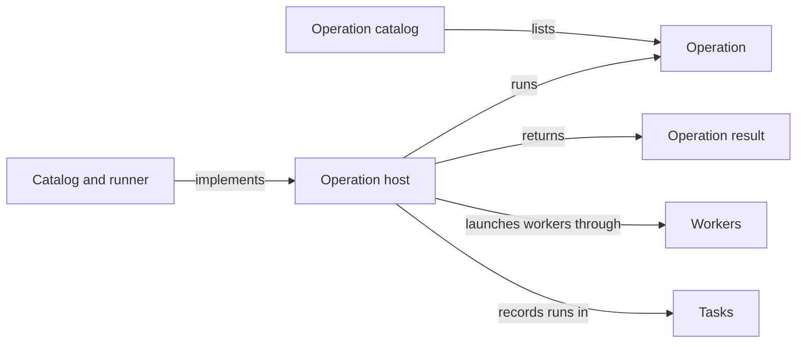

# Operations

## Purpose

Operations is how the main agent gets bounded work done in a task. It holds the Operation catalog,
the `concorde run` command and the Operation host that executes one Operation for one task, and it
contains the Modules that provide the Operations: Understanding, Specification, Implementation,
Code review, Validation and Delivery; Spec review provides one more from Spec tooling. Every
Operation combines deterministic host steps with zero or more workers and always ends with one
Operation result the main agent can read and trust: what the host established itself is kept apart
from what a worker claims. Operations never chooses what runs next, never runs one Operation from
another, never asks the developer anything and never changes a Spec on its own initiative; the
main agent decides, and each provider defines what its own Operation does.

## Terminology

| Term | Definition |
| --- | --- |
| Operation | A named job the main agent runs for one task, made of deterministic host steps and zero or more workers, that ends with exactly one Operation result. |
| Operation catalog | The fixed list of Operations that gives, for each, its providing Module, its task type, whether it launches workers, whether it may change the task worktree and the contract of its output. |
| Operation host | The deterministic process started by `concorde run` that executes one Operation's step table for one task and alone launches its workers, checks their work and writes its result. |
| Operation result | The structured envelope an Operation returns to the main agent, holding its status, identities, summary, output, the worker result kept as claims, the host's own evidence and, when it is not ok, an escalation. |
| [Main agent](../vocabulary.md#concept.concorde.main-agent) | |
| [Worker](../vocabulary.md#concept.concorde.worker) | |
| [Task type](../vocabulary.md#concept.concorde.task-type) | |
| [Module](../vocabulary.md#concept.concorde.module) | |
| [Evidence](../vocabulary.md#concept.concorde.evidence) | |
| [Escalation](../vocabulary.md#concept.concorde.escalation) | |
| [Grant](../spec-tooling/spec/module.md#concept.spec.grant) | |
| [Context identity](../spec-tooling/spec/module.md#concept.spec.context-identity) | |
| [Worker result](../harness/workers/module.md#concept.workers.worker-result) | |
| [Brief](../harness/workers/module.md#concept.workers.brief) | |
| [Write audit](../harness/workers/module.md#concept.workers.audit) | |
| [Resume round](../harness/workers/module.md#concept.workers.resume-round) | |
| [Run record](../harness/workers/module.md#concept.workers.run-record) | |
| [Configured check](../harness/checks/module.md#concept.checks.configured-check) | |
| [Task](../tasks/module.md#concept.tasks.task) | |
| [Task record](../tasks/module.md#concept.tasks.task-record) | |

The catalog lists Operations; the host runs one of them and returns its Operation result. Read
Operation and Operation result first; the imported worker terms matter only for worker-backed
Operations.

## Usage

<a id="concept.operations.operation"></a>

The main agent runs an **Operation** from the primary worktree, for a [task](../tasks/module.md#concept.tasks.task)
it opened, as a background Bash command so that it can keep working while the Operation runs:

```text
concorde run <operation> --task <task-id> [--modules <id>[,<id>…]] [--input <run-id>]… [operation arguments]
```

`--modules` names the Modules the Operation is bound to and defaults to the task's Modules;
Modules named here are added to the task. `--input` admits the output of an earlier run of the same
task that ended `ok`, such as an assessment with a plan, as task material for this run. Each
provider adds its own arguments, for example `--goal` for `understand`. The command returns when
the Operation ends; the main agent is woken by its exit and reads the Operation result it printed,
which is also saved in the run's directory under `.concorde/runs/` of the primary worktree. No
Operation needs the developer's consent to run.

<a id="concept.operations.catalog"></a>

The **Operation catalog** of this version:

| Operation | Provider | Task type | Worker | May write | Output |
| --- | --- | --- | --- | --- | --- |
| `understand` | [Understanding](understanding/module.md) | `understand` | yes | no | an assessment, with a plan when asked |
| `specify` | [Specification](specification/module.md) | `specify` | yes | Specs of the bound Modules | a Spec change |
| `implement` | [Implementation](implementation/module.md) | `implement` | yes | code of the bound Modules | a code change |
| `test` | [Implementation](implementation/module.md) | `test` | yes | no | a test report |
| `spec_review` | [Spec review](../spec-tooling/spec-review/module.md) | `review-spec` | yes | no | review findings and a verdict |
| `code_review` | [Code review](code-review/module.md) | `review-code` | yes | no | review findings and a verdict |
| `validate` | [Validation](validation/module.md) | none | no | no | [readiness](validation/module.md#concept.validation.readiness) |
| `delivery` | [Delivery](delivery/module.md) | none | no | commits on the task branch | a [delivery commit](delivery/module.md#concept.delivery.delivery-commit) |

A typical task runs `understand`, then `specify` if the Spec lacks a promise, then `implement`,
`test` and the reviews, then `validate` and `delivery`; the main agent may repeat or skip steps as
the results tell it. Creating a project's first Spec, Issue bookkeeping and the task commands are
not Operations: they are ordinary commands of [Spec core](../spec-tooling/spec/module.md),
[Issues](../issues/module.md) and [Tasks](../tasks/module.md), bound to no task and launching no
worker. There is no separate planning Operation; a plan is one answer `understand` gives.

<a id="concept.operations.result"></a>

Every run ends with one **Operation result**. Its `status` is `ok` when the Operation did what it
promises, `blocked` when it cannot go on without a decision of the main agent, such as a worker
reporting that the Spec lacks a promise or Delivery finding its readiness stale, and `failed` when
something went wrong, such as a launch error, a write outside the grant, checks still failing
after the last resume round or a host error. It names the Operation, the task, the Modules and the
run, gives a summary, and carries the Operation's `output` as its provider defines it. For a
worker-backed Operation it also carries the worker's own [worker result](../harness/workers/module.md#concept.workers.worker-result)
unchanged, and next to it the host's evidence: the grant and its context identity, the write
audit, each check command with its exit code and log, the resume rounds used, the transcript path
and the worker's standard error. When the status is not `ok`, an escalation states the problem,
what was tried, the options and a recommendation, and whether it came from the worker or from the
host. The exact envelope is the [result contract](contracts.md#contract.operations.result).

For example, an `implement` run whose worker edited the right files but left one test failing
after three resume rounds returns `failed`, the worker's result claiming the work is done, host
evidence with the failing check's exit code and log path, and an escalation from the host. The main
agent reads the claim as a claim and the evidence as fact, records its decision in the task's
decision log and chooses the next step: another `implement` with a sharper goal, an `understand`, or an
escalation to the developer.

`concorde run` exits with status 0 for an `ok` result and 1 for `blocked` or `failed`. A command
line that names no known Operation or no task is refused with status 2 and no result. A run the
task cannot accept, because the task is unknown, closed or already running an Operation, still
writes a `failed` result naming the refusal. Running an Operation again is always a new run with a
new run identity; what a repeat changes is defined by its provider.

## Design

<a id="concept.operations.host"></a>

Between the main agent and the workers stands the **Operation host**, a plain Python process that
executes one Operation's step table. The main agent has the global view but should not have to
check a worker's every step, and a worker has a narrow view and cannot be trusted to judge its own
work. The host is the deterministic part in between: it computes and freezes the grant, launches
workers under settings derived from it, audits what they changed, runs the checks itself, and turns
the outcome into a result whose facts it produced. A worker's answer is therefore always a
proposal until the host has checked it, and the envelope keeps the two apart, so a worker's claim
can never pass as host evidence.

Each Operation's control flow is a step table written in its provider's Spec and implemented as an
ordered list of Python steps. The runner executes the steps in order until one stops the run;
nothing is hidden in a graph library or in model decisions, so the Spec's table is the whole
control flow and can be tested step by step. A worker-backed Operation uses the standard worker
sequence: compute the [grant](../spec-tooling/spec/module.md#concept.spec.grant) for the task type
and Modules from the **task worktree's** Specs and freeze it with its
[context identity](../spec-tooling/spec/module.md#concept.spec.context-identity), pre-create the
pending files it makes writable, generate the worker's settings, tools and
[brief](../harness/workers/module.md#concept.workers.brief), launch the worker, run the
[write audit](../harness/workers/module.md#concept.workers.audit), run the bound Modules'
[configured checks](../harness/checks/module.md#concept.checks.configured-check) outside the
worker, give the failures back to the same worker in a [resume round](../harness/workers/module.md#concept.workers.resume-round)
until they pass or the rounds run out, and write the [run record](../harness/workers/module.md#concept.workers.run-record).
Workers performs that sequence; the host decides what its outcome means for the result. The exact
runner and sequence are in [How the host runs an Operation](host.md).

The grant always comes from the task worktree, never from the primary: a task that changes a Spec
must be bounded by the Spec as that task sees it, and two tasks with different Specs must get
different grants. Run records and results are written to the primary worktree's `.concorde/runs/`
instead, so that the main agent finds every run in one place and nothing the host writes for
itself ends up in a task's diff. One task runs at most one Operation at a time, because two hosts in
one worktree would audit each other's writes as their own; parallelism comes from running tasks
side by side.

The host writes a result in every case it can, including its own failures, and records the run in
the [task record](../tasks/module.md#concept.tasks.task-record) when it starts and when it ends.
The main agent is woken only by the process exit, so a run that ended without a result would leave
it guessing; with the result always present, every problem travels up as an
[escalation](../vocabulary.md#concept.concorde.escalation) with evidence. No provider calls another
Operation, because deciding the next step needs the global view only the main agent has. The
precise obligations are in the [requirements](requirements.md) and shown in the
[scenarios](scenarios.md).

<a id="realization.operations.runner"></a>

The **Catalog and runner** realization holds the catalog, the `concorde run` dispatch, the step
runner and the result envelope, and their tests. It is pending: the files do not exist yet. The
`concorde` command itself belongs to [Distribution](../distribution/module.md), which hands `run`
to this Module.

## Relationships





The catalog names each Operation's provider, and the runner loads that provider's steps; a
provider never loads the catalog. The host runs one Operation per process, launches its workers
only through Workers, records the run through Tasks and returns exactly one Operation result.

<a id="contains-understanding"></a>

**Understanding** provides `understand`: a worker reads the bound Modules' Specs and the names of
their files and returns an assessment, with Spec gaps or a plan. Operations relies on it to change
nothing; its output is advice to the main agent, never an instruction to the host.

<a id="contains-specification"></a>

**Specification** provides `specify`: a worker changes the bound Modules' own Spec documents,
including declaring pending files, and the host validates the result. It is the only Operation that
writes Specs, so the main agent routes every Spec repair through it or does it itself.

<a id="contains-implementation"></a>

**Implementation** provides `implement`, where a worker changes the bound Modules' code and the host
runs their configured checks with resume rounds, and `test`, where a worker reads the code and
tests and the host runs the checks and reports. Operations relies on it to keep every write inside
the implementation grant, which the write audit confirms.

<a id="contains-code-review"></a>

**Code review** provides `code_review`: a worker judges the task's code change against the bound
Modules' Specs and returns findings and a verdict without changing anything.

<a id="contains-validation"></a>

**Validation** provides `validate`, the deterministic Operation that decides whether the task
worktree is ready to deliver and binds that readiness to the exact inputs it examined. It launches
no worker. Delivery relies on its readiness.

<a id="contains-delivery"></a>

**Delivery** provides `delivery`, the deterministic Operation that commits the task worktree's
changes on the task branch with their evidence bundle, provided the readiness is current. It is the
only Operation that runs Git commands that change the repository.

<a id="uses-spec"></a>

**Spec core** loads the task worktree's Specs, resolves the named Modules, and computes each
worker's [grant](../spec-tooling/spec/module.md#concept.spec.grant) and its
[context identity](../spec-tooling/spec/module.md#concept.spec.context-identity) for a task type
and a set of Modules. Operations relies on the grant being computed exactly from the Protocol's
task-type table, and on a Spec that cannot be loaded being refused rather than partially read. A
refusal ends the run as `failed` with the loader's findings as host evidence.

<a id="uses-workers"></a>

**Workers** performs the standard worker sequence for a worker-backed step: it generates the worker
settings, tools and brief from the frozen grant, launches the worker, audits its writes, runs the
checks with resume rounds and writes the run record, and returns the
[worker result](../harness/workers/module.md#concept.workers.worker-result) with the host evidence
it gathered. Operations relies on the audit catching any write outside the grant and on each
launch having its own run record. A launch error, a timeout or an audit violation ends the run as
`failed`.

<a id="uses-checks"></a>

**Check execution** runs [configured checks](../harness/checks/module.md#concept.checks.configured-check)
in its read-only boundary, for the resume rounds Workers drives and for the deterministic steps of
providers such as Validation. Operations relies on each check result naming its command, exit code
and log, and passes them into the result as host evidence without interpreting them further.

<a id="uses-tasks"></a>

**Tasks** resolves a task to its worktree and records each run in the task record: it begins the
run before any step, refusing an unknown, closed or busy task, and finishes it with the result's
status. Operations relies on at most one run per task at a time; a refusal becomes a `failed`
result that is not recorded in the task.

<a id="uses-spec-review"></a>

**Spec review** provides `spec_review` from Spec tooling: reviewers read the bound Modules' Specs and
return findings and a verdict. It is listed in the catalog like a contained provider and follows
the same step-table and result rules; it lives in Spec tooling because it maintains Specs rather
than changing a project.
