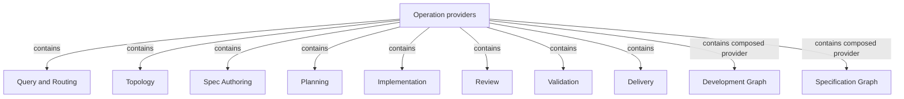

# Operations

## Purpose

Operations organizes the responsibilities that provide Concorde's executable behavior, from answering a question to preparing a contract, developing a change and delivering a verified candidate. It lets callers choose complete building blocks and composed behavior without rebuilding the execution safeguards for each use. This Module owns that organization; its children own their individual behavioral promises.

## Terminology

| Term | Meaning / definition |
| --- | --- |
| [Operation](../module.md#terminology) | Defined in Concorde Framework. |
| [Module](../module.md#terminology) | Defined in Concorde Framework. |
| [Graph](../module.md#terminology) | Defined in Concorde Framework. |
| [Host](../module.md#terminology) | Defined in Concorde Framework. |
| [Harness](../module.md#terminology) | Defined in Concorde Framework. |
| [State](../module.md#terminology) | Defined in Concorde Framework. |

## Usage

Choose a provider by the result you need. Query and Routing answers a question or selects its owner;
Spec Authoring proposes a contract; Planning produces a plan and tasks; Implementation fulfills the
accepted tasks; Review and Validation produce different kinds of evidence. Topology changes ownership
and registered structure. Delivery publishes a verified candidate only with separate authorization.

For a complete development task, select `concorde-dev-loop`. This composed Operation coordinates
specification, planning, implementation and checks, returning a ready candidate rather than a merge.
For specification work alone, select `concorde-specify-loop`; it returns before implementation.
Both are complete Operations, just as their internal planning or review building blocks are.

For example, a retry change can first use specification authoring to settle which failures permit
retries. Planning then consumes that agreed contract. If the contract is still insufficient, the
blocked result remains explicit; composition does not authorize guessing or broadening context.
The common launcher exposes only public entries. Internal Operations are available to admitted
compositions, not through an alternative unrestricted launcher.

## Design

The hierarchy groups **providers of behavior**, including providers of composed Operations. Its ten
children are responsibility owners, not ten nodes of one universal graph. Planning owns several
Operations, while a composed development Operation relies on several sibling owners. An Operation's
implementation may be deterministic code, model execution or a compiled graph without changing its
identity or completeness obligation.

A complete Operation declares input State, output State updates, effects, conditions of use and
execution policy. Its caller does not reconstruct context selection, permission boundaries, model
execution or result validation. The common Host and Harness supply trusted execution services and
narrow the declared permission ceiling to the actual task. Runtime context carries those services;
State cannot carry or enlarge authority. Public/internal exposure does not change these guarantees.

The [checked inventory](../development/operations.md) and its
[precise node contract](../development/execution-reference.md#operations-operation-registry) connect
these responsibilities to executable declarations. Shared admission lives in Development and worker
execution in Harness. Neither service creates a competing executable category. This organization
changes no provider's owned Spec identity, result meaning or authorization boundary.

Each Operation is explained only in the Specs of the Module that owns it: one of these children,
or Spec, Distribution and Issues for initialization, configuration and Issue handling. When an
Operation runs a Graph, that owner's Implementation Specs also hold the Graph Spec with its State,
Nodes and Edges.
The [ownership table](../development/execution-reference.md#operations-behavioral-ownership-and-composition-limits)
maps every Operation, including each model-backed worker, to its owner and to the Graph it runs.

## Relationships

This view answers which provider responsibilities Operations contains. Containment is Module
ownership; the edges below are not execution order. The dev-loop and specify-loop Modules own
composed Operations and use sibling providers through declared Operation composition. Explicit
context references select provider knowledge separately and never expand recursively.

Operation providers share one completeness model but own distinct results. Their exact selection
conditions, relied-upon promises and local duties are defined in the Module-owned
[provider agreements](providers.md). Development and specification are composed behavior providers,
not owners of the planning, review or authoring Modules they use.
