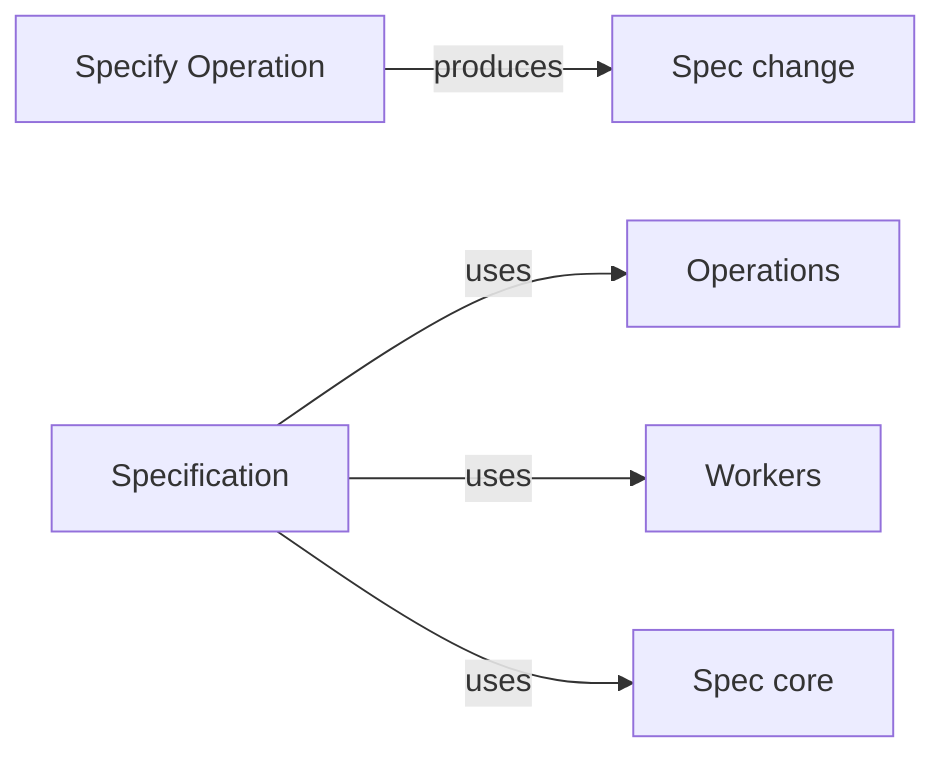

# Specification

## Purpose

Specification changes Specs on the main agent's behalf. It provides the `specify` Operation: a
worker bound to one or more Modules edits those Modules' own Spec documents to a stated intent,
including declaring pending realization entries for files a later `implement` run will create. The
host then reconciles the registry mirror, validates the structure of the task worktree's Specs and
returns the Spec change it observed. The main agent relies on it to close Spec gaps and to fix
where code may go before anyone writes it. Specification never touches code, never creates the
files it declares and never changes another Module's documents. When the changed Specs fail
structural validation it stops and escalates instead of letting a worker try again, because a Spec
problem needs a decision, not another guess.

## Terminology

| Term | Definition |
| --- | --- |
| Spec change | The result of one specify run: the documents the worker changed, the pending entries declared, the worker's account of the promises it changed, the Modules affected and the validation outcome. |
| [Main agent](../../vocabulary.md#concept.concorde.main-agent) | |
| [Worker](../../vocabulary.md#concept.concorde.worker) | |
| [Spec](../../vocabulary.md#concept.concorde.spec) | |
| [Task type](../../vocabulary.md#concept.concorde.task-type) | |
| [Escalation](../../vocabulary.md#concept.concorde.escalation) | |
| [Operation](../module.md#concept.operations.operation) | |
| [Operation host](../module.md#concept.operations.host) | |
| [Operation result](../module.md#concept.operations.result) | |
| [Grant](../../spec-tooling/spec/module.md#concept.spec.grant) | |
| [Structural check](../../spec-tooling/spec/module.md#concept.spec.structural-check) | |
| [Impact index](../../spec-tooling/spec/module.md#concept.spec.impact-index) | |
| [Project registry](../../spec-tooling/spec/module.md#concept.spec.registry) | |
| [Brief](../../harness/workers/module.md#concept.workers.brief) | |
| [Worker result](../../harness/workers/module.md#concept.workers.worker-result) | |
| [Write audit](../../harness/workers/module.md#concept.workers.audit) | |

A Spec change is the observed outcome of a run; the intent is what the main agent asked for. The
two may differ, which is why the result reports what changed rather than repeating the intent.

## Usage

The main agent runs the Operation in a task worktree, typically after an `understand` run reported
Spec gaps or produced a plan that starts with a Spec change:

```text
concorde run specify --task <task-id> --modules <module-id>[,<module-id>…] --intent "<text>" [--input <run-id>]…
```

`--modules` names the Modules whose documents may change (by default the task's Modules),
`--intent` states the change in plain words, and each `--input` admits the output of an earlier
`ok` run of the task, such as an assessment with its plan, as task material. For example,
`--modules module.issues --intent "add an optional severity to Issue reports; declare src/concorde/issues/severity.py as pending"`
lets the worker edit the Issues entry, its contract and scenario documents and its entry metadata,
where it adds the new file as a pending entry of an existing realization.

<a id="concept.specification.spec-change"></a>

The Operation returns an [Operation result](../module.md#concept.operations.result) whose
`output` is a **Spec change**, defined exactly by the
[Spec change contract](contracts.md#contract.specification.spec-change). The host fills in what it
can observe: the changed and deleted documents, the pending entries that were added, the Modules
whose Spec context contains a changed document, and the validation findings. The worker adds its
summary of the promises it added, changed or removed, and the new documents it would need.

The status is `ok` when the change was made and validation reports no new error. It is `blocked`
when the worker could not make the change, for example because the intent contradicts a promise
another Module relies on or needs a document of a Module that was not bound, or when validation
reports a new error; the result then carries an [escalation](../../vocabulary.md#concept.concorde.escalation)
with the worker's options or the validation findings. It is `failed` when the host could not run
the worker or the write audit found a change outside the grant. In every case the worker's edits
stay in the task worktree uncommitted: the main agent inspects them, runs `specify` again with a
corrected intent, repairs them itself or discards them. Whenever the host observed the worktree
after the worker, a `blocked` or `failed` result still carries the Spec change as its `output`, so
the main agent sees what was left behind; after an audit violation or a failure before the worker
ran it carries none.

Two limits apply in this version. The worker can write only documents its Modules already own,
so it cannot create a new document: it returns the documents it would need as proposals, and the
main agent registers them before running `specify` again. It can have an owned document deleted
by proposing the deletion in its worker result, which the host performs after a clean audit. And
a change that must move several Modules together, such as a contract version increment, needs all
of them bound in the same run.

## Design

The Operation is a worker-backed Operation run by the [Operation host](../module.md#concept.operations.host)
with task type `specify`. That [task type](../../vocabulary.md#concept.concorde.task-type) makes
the bound Modules' own documents writable, both the reading files and their metadata, keeps every
selected document of other Modules read-only, and shows the bound Modules' implementation files by
name only. Declaring a pending entry is therefore the one way a `specify` worker decides where code
goes, and the separate `implement` run is the only one that may create it.

| # | Step | Actor | Stops the run when |
| --- | --- | --- | --- |
| 1 | Validate the task worktree's Specs as a baseline | host, Spec core | the Specs cannot be loaded (`failed`) |
| 2 | Compute the `specify` [grant](../../spec-tooling/spec/module.md#concept.spec.grant) for the bound Modules from the task worktree's Specs and freeze it with its context identity | Workers, Spec core | a Module is unknown (`failed`) |
| 3 | Generate the worker settings, the tool list and the [brief](../../harness/workers/module.md#concept.workers.brief) with the intent, the task's goal, the admitted inputs and the grant's write, read and names lists | Workers | — |
| 4 | Launch the worker and wait for its [worker result](../../harness/workers/module.md#concept.workers.worker-result) | Workers, worker | launch error or timeout (`failed`); worker `blocked` or `failed` (passed on) |
| 5 | [Audit](../../harness/workers/module.md#concept.workers.audit) the task worktree against the grant, perform the proposed deletions inside it and write the run record | Workers | a write outside the grant (`failed`) |
| 6 | Regenerate the mirrored fields of the [project registry](../../spec-tooling/spec/module.md#concept.spec.registry) from the changed entries | host, Spec core | — |
| 7 | Validate the task worktree's Specs again and compare with the baseline | host, Spec core | a new error (`blocked`) |
| 8 | Compute the changed documents, the added pending entries and the affected Modules with the [impact index](../../spec-tooling/spec/module.md#concept.spec.impact-index) | host, Spec core | — |
| 9 | Return the Operation result | host | — |

When the worker ends `blocked` or `failed` after editing documents, steps 6 to 8 still run, so
the result shows the state it left behind; the status stays the worker's. Only an audit violation
skips them.

The worker has one round and the host runs no configured checks. It gets the tools Read, Glob,
Grep, Edit and Write: no Bash, because nothing in a Spec change needs a command, no web tools and
no MCP server. Pending files are never pre-created, because the grant contains no implementation
path.

Validation is structural: the host runs the [structural checks](../../spec-tooling/spec/module.md#concept.spec.structural-check)
of Spec core, the same ones `concorde validate` runs, on the whole task worktree. Comparing with
the baseline lets a `specify` run repair a worktree whose Specs were already broken: errors that
were present before are reported as pre-existing and do not stop the run, while any error the
change introduced does. There is no resume round. An automatic repair loop is kept for code
defects found by checks; a Spec that fails validation needs the main agent to decide what the Spec
should say, so the run stops with the findings as evidence.

The registry is outside every Module's write sets, so a worker that edits its entry's `module`
block leaves the mirror stale. Step 6 is the project-level reconciliation the Protocol provides
for: it regenerates only the mirrored fields of existing Modules and never adds or removes a
Module, which stays a deliberate change of the main agent. The facts in the result come from the
host's own diff and computations; the worker's account of changed promises is kept as its claim.
The precise obligations are in the [requirements](requirements.md) and illustrated by the
[scenarios](scenarios.md).

<a id="realization.specification.operation"></a>

The **Specify Operation** realization holds the Operation's host steps, the worker instructions for
task type `specify` and the result schema, and its tests: the package
`src/concorde/specification/`, whose `operation.py` declares the `SPECIFY` provider the catalog
names, the prompt `prompts/workers/specify.md` rendered to `generated/workers/specify.md`, and
`tests/concorde/specification/`, which run the Operation end to end against a fake worker.

## Relationships



<a id="uses-operations"></a>

**Operations** lists `specify` in its catalog, dispatches `concorde run specify` to this Module and
provides the host step runner and the [Operation result](../module.md#concept.operations.result)
envelope. Specification supplies the steps above and the Spec change, relies on the host to record
the run for the task, and never calls another Operation, including `validate`: its own validation
is a host step.

<a id="uses-workers"></a>

**Workers** turns the frozen grant into worker settings, launches the worker with the brief this
Module writes, collects its [worker result](../../harness/workers/module.md#concept.workers.worker-result),
audits the worktree and writes the run record. Specification relies on the audit to prove that
only the bound Modules' own documents changed, and treats any violation as a failed run.

<a id="uses-spec"></a>

**Spec core** computes the `specify` [grant](../../spec-tooling/spec/module.md#concept.spec.grant),
runs the structural checks, regenerates the registry mirror and answers impact questions, always
from the task worktree's Specs. Specification relies on its checks as the definition of a
structurally valid Spec and never adds checks of its own.
