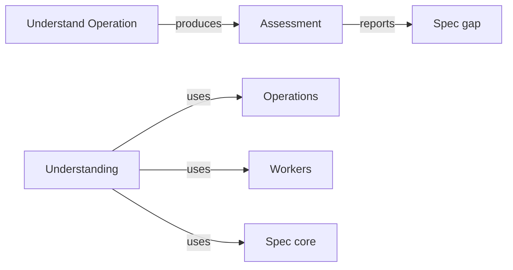

# Understanding

## Purpose

Understanding lets the main agent learn what one or more Modules promise before anything changes.
It provides the `understand` Operation: a worker reads the bound Modules' Specs and only the names
of their code files, and answers a stated goal with an assessment of what the Modules promise,
whether their Spec says enough for that goal, the Spec gaps that stop it, and, when asked, a plan
of which Modules to change, which files to declare and which Operations to run next. The main agent
relies on it to plan work and to check that a Spec repair closed a gap. Understanding never
changes a file, never reads code contents and never fills a missing promise by guessing from code
or file names; a missing promise is reported as a Spec gap. It does not decide what happens next:
the plan is a proposal the main agent may follow, change or reject.

## Terminology

| Term | Definition |
| --- | --- |
| Assessment | The result of one understand run: what the bound Modules promise, whether their Spec is sufficient for the stated goal, the Spec gaps found and, when requested and sufficient, a plan. |
| Spec gap | A promise that the stated goal needs and that the Spec of a bound Module does not state, reported with where it belongs instead of being inferred. |
| [Main agent](../../vocabulary.md#concept.concorde.main-agent) | |
| [Worker](../../vocabulary.md#concept.concorde.worker) | |
| [Task type](../../vocabulary.md#concept.concorde.task-type) | |
| [Spec context](../../vocabulary.md#concept.concorde.spec-context) | |
| [Implementation context](../../vocabulary.md#concept.concorde.implementation-context) | |
| [Error chain](../../vocabulary.md#concept.concorde.error-chain) | |
| [Operation](../module.md#concept.operations.operation) | |
| [Operation host](../module.md#concept.operations.host) | |
| [Operation result](../module.md#concept.operations.result) | |
| [Grant](../../spec-tooling/spec/module.md#concept.spec.grant) | |
| [Brief](../../harness/workers/module.md#concept.workers.brief) | |
| [Worker result](../../harness/workers/module.md#concept.workers.worker-result) | |
| [Write audit](../../harness/workers/module.md#concept.workers.audit) | |

An assessment is the answer; Spec gaps are the part of it that says why the goal cannot proceed
yet. The plan is optional and exists only inside a sufficient assessment.

## Usage

The main agent runs the Operation in a task worktree, usually before specifying or implementing:

```text
concorde run understand --task <task-id> --modules <module-id>[,<module-id>…] --goal "<text>" [--plan] [--input <run-id>]…
```

`--modules` names the Modules the worker is bound to (by default the task's Modules), `--goal`
states in plain words what the main agent wants to know or do, `--plan` asks for a plan in
addition to the assessment, and each `--input` admits the output of an earlier `ok` run of the
task, such as the assessment a Spec repair followed, as task material in the brief. For example,
with `--modules module.issues --goal "let reports carry a severity" --plan`, the worker reads the
Issues Spec and the Specs it selects, sees that the Issues code lives in files such as
`src/concorde/issues/store.py` without reading them, and answers either with a plan (change the
Issues Spec with `specify`, then `implement`, `test` and `code_review` for `module.issues`) or with
the Spec gaps that must be closed first.

<a id="concept.understanding.assessment"></a>

The Operation returns an [Operation result](../module.md#concept.operations.result) whose
`output` is an **assessment**, defined exactly by the
[assessment contract](contracts.md#contract.understanding.assessment). For each bound Module it
summarizes what the Module promises that matters for the goal. It then states whether the Spec is
**sufficient** for the goal. When it is and a plan was requested, the plan names the Modules to
change, the files to declare as pending realization entries and in which Module and realization,
the ordered next Operations with their Modules, and the open decisions the main agent has to take. The plan has no
separate Operation: breaking work into steps is one use of understanding.

<a id="concept.understanding.spec-gap"></a>

When the Spec is not sufficient, the assessment lists each **Spec gap**: the Module and document
where the promise belongs, what is missing, why the goal needs it and a suggested repair. It then
carries no plan. The usual next step is a `specify` run that closes the gaps, followed by another
`understand` run to confirm it.

The result status is `ok` whenever the worker completed an assessment, sufficient or not; the
`sufficient` field tells whether work may proceed. It is `blocked` when the worker could not assess
the goal at all, for example because the goal is ambiguous or concerns Modules that were not bound,
and the result's [error chain](../../vocabulary.md#concept.concorde.error-chain) then ends in the
worker's own link, with what it tried, why it could not assess and the Modules it would need.
It is `failed` when the host could not run the worker, the worker changed a file, or the assessment
names a Module that does not exist or is inconsistent: gaps listed although it is sufficient or
missing although it is not, a plan that was not requested or follows an insufficient Spec, no plan
although one was requested for a sufficient Spec, or no entry for a bound Module. The Operation's
own link then has the code `unknown_modules` or `inconsistent_assessment`, lists every unknown
Module or every inconsistency, and gives `capability` as its reason: the host checks the
assessment but never corrects it or relaunches the worker. A failed or blocked result carries no
`output`; the worker's own answer stays in the `worker` field. Running the Operation again with the same inputs is safe: it
changes nothing and produces a fresh assessment.

## Design

The Operation is a worker-backed Operation run by the [Operation host](../module.md#concept.operations.host)
with task type `understand`. That [task type](../../vocabulary.md#concept.concorde.task-type)
gives the worker the bound Modules' [Spec context](../../vocabulary.md#concept.concorde.spec-context)
and external material to read, the names of the files in their
[implementation context](../../vocabulary.md#concept.concorde.implementation-context), and nothing
to write. Reading names but not contents is the point of the design: the worker can tell where
code lives and where a new file should go, but the only promises it can report are the ones the
Spec states, so a thin Spec shows up as a Spec gap instead of being papered over with what the code
happens to do.

| # | Step | Actor | Stops the run when |
| --- | --- | --- | --- |
| 1 | Compute the `understand` [grant](../../spec-tooling/spec/module.md#concept.spec.grant) for the bound Modules from the task worktree's Specs and freeze it with its context identity | Workers, Spec core | the Specs cannot be loaded or a Module is unknown (`failed`) |
| 2 | Generate the worker settings, the tool list and the [brief](../../harness/workers/module.md#concept.workers.brief) with the goal, the plan request, the task's goal, the admitted inputs and the grant's read and names lists | Workers | — |
| 3 | Launch the worker and wait for its [worker result](../../harness/workers/module.md#concept.workers.worker-result) | Workers, worker | launch error or timeout (`failed`) |
| 4 | [Audit](../../harness/workers/module.md#concept.workers.audit) the task worktree: the grant has no writable path, so any change is a violation, and write the run record | Workers | any change (`failed`) |
| 5 | Check that every Module named in the assessment exists in the task worktree's Specs and that the assessment is consistent | host | an unknown Module or an inconsistent assessment (`failed`) |
| 6 | Return the Operation result | host | — |

The worker gets the tools Read, Glob and Grep only: no Edit, Write or Bash, no web tools and no
MCP server. Pending files are not pre-created, configured checks are not run and there are no
resume rounds, because the grant makes nothing writable and nothing is executed. A malformed or
inconsistent assessment is not repaired by a second round either; the run fails and the main agent
decides, which keeps every accepted assessment the product of one reading of one frozen grant.

The host treats the assessment as the worker's claim. It verifies only what it can decide from
declarations and from the assessment's own shape, namely that the named Modules exist and that
gaps, sufficiency, plan and `--plan` agree, sets `goal` to its own `--goal` argument, and adds its
own evidence: the grant, the context identity, the audit and the transcript path. Whether a plan
is good is for the main agent and for later Operations to find out. The precise obligations are in
the [requirements](requirements.md) and illustrated by the [scenarios](scenarios.md).

<a id="realization.understanding.operation"></a>

The **Understand Operation** realization holds the Operation's host steps, the worker instructions
for task type `understand` and the result schema, and its tests: the package
`src/concorde/understanding/`, whose `operation.py` declares the `UNDERSTAND` provider the catalog
names, the prompt `prompts/workers/understand.md` rendered to `generated/workers/understand.md`,
and `tests/concorde/understanding/`, which run the Operation end to end against a fake worker.

## Relationships



<a id="uses-operations"></a>

**Operations** lists `understand` in its catalog, dispatches `concorde run understand` to this
Module and provides the host step runner and the [Operation result](../module.md#concept.operations.result)
envelope. Understanding supplies the Operation-specific steps above and the assessment that goes
into the envelope; it relies on the host to record the run for the task and never calls another
Operation itself.

<a id="uses-workers"></a>

**Workers** turns the frozen grant into worker settings, launches the worker with the brief this
Module writes, collects its [worker result](../../harness/workers/module.md#concept.workers.worker-result),
audits the worktree and writes the run record. Understanding relies on the audit to prove that the
worker changed nothing and treats any audit violation as a failed run.

<a id="uses-spec"></a>

**Spec core** computes the `understand` [grant](../../spec-tooling/spec/module.md#concept.spec.grant)
from the task worktree's Specs and resolves Module identities for step 5. Understanding never
computes a boundary itself and never reads Specs from the primary worktree, so an assessment always
describes the Specs of the task it was run for.
