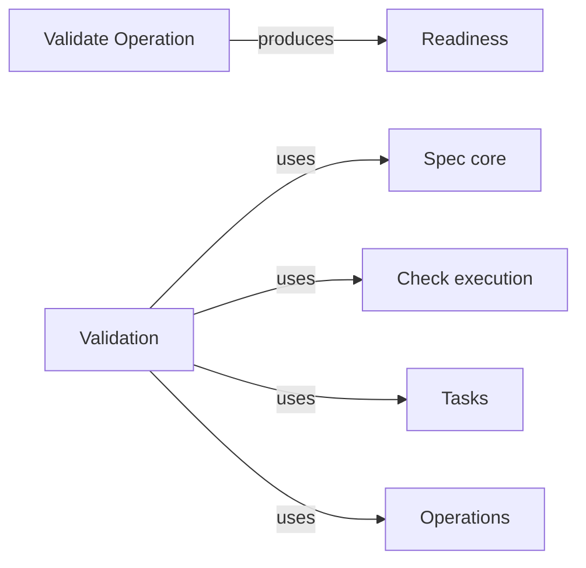

# Validation

## Purpose

Validation decides whether a task worktree is ready to be delivered. It provides the deterministic
`validate` Operation: it checks the structure of the task worktree's Specs, finds the Modules the
task changed and runs their configured checks, and returns a readiness that is either ready or not
ready with every blocking finding, bound to the exact state of the worktree it examined. The main
agent relies on it before delivering, and Delivery relies on it to refuse a worktree that changed
since. Validation launches no worker, changes no file of the task worktree and makes no judgement
a deterministic check cannot make: whether the code keeps its promises beyond what the checks test,
or whether a Spec explains enough, is for the reviews and the main agent.

## Terminology

| Term | Definition |
| --- | --- |
| Readiness | The outcome of one `validate` run: whether the task worktree may be delivered, with its blocking findings, the checks run and the pending entries to confirm, bound to a digest of the exact inputs examined. |
| [Main agent](../../vocabulary.md#concept.concorde.main-agent) | |
| [Module](../../vocabulary.md#concept.concorde.module) | |
| [Evidence](../../vocabulary.md#concept.concorde.evidence) | |
| [Structural check](../../spec-tooling/spec/module.md#concept.spec.structural-check) | |
| [Impact index](../../spec-tooling/spec/module.md#concept.spec.impact-index) | |
| [File transaction](../../spec-tooling/spec/module.md#concept.spec.file-transaction) | |
| [Configured check](../../harness/checks/module.md#concept.checks.configured-check) | |
| [Check result](../../harness/checks/module.md#concept.checks.check-result) | |
| [Task](../../tasks/module.md#concept.tasks.task) | |
| [Operation](../module.md#concept.operations.operation) | |
| [Operation result](../module.md#concept.operations.result) | |

Readiness is the only word of its own; it is a piece of [evidence](../../vocabulary.md#concept.concorde.evidence)
and, like all evidence, stops applying when its inputs change.

## Usage

The main agent runs the Operation when it believes a task's work is complete, usually after
`implement`, `test` and the reviews, and always right before `delivery`:

```text
concorde run validate --task severity
```

The Operation takes no arguments of its own. Its bound Modules, by default the task's Modules,
never narrow what is validated, because readiness concerns the whole task worktree; their
configured checks run in addition to those of the changed Modules. It returns an
[Operation result](../module.md#concept.operations.result) whose `output` is the readiness,
defined exactly by the [readiness contract](contracts.md#contract.validation.readiness).

<a id="concept.validation.readiness"></a>

A **readiness** is `ready` when the task worktree's Specs have no structural error, every changed
path is accounted for, and every configured check it ran passed. Otherwise it is
not ready and lists every blocking finding it established in the run, not only the first:

- a [structural check](../../spec-tooling/spec/module.md#concept.spec.structural-check) error,
  such as a broken link or a stale registry mirror, or the Specs failing to load at all;
- a changed or new path that is neither a Spec document, a control record under `.concorde/`,
  generated or build output, external material, nor bound by any Module;
- a [configured check](../../harness/checks/module.md#concept.checks.configured-check) of a changed
  or bound Module that failed, timed out or could not be run, for example because its input is
  missing.

Warnings, such as missing scenario coverage, are reported but do not block. A pending realization
entry whose file now exists, for example one an `implement` run filled in, is not an error here: it
is listed as a **confirmation**, which Delivery applies when it commits, clearing the pending
marker. The changed Modules are those that bind a changed file or own a changed Spec document,
found through the [impact indexes](../../spec-tooling/spec/module.md#concept.spec.impact-index); a
change to a file shared by several Modules runs the checks of all of them.

The readiness records its inputs: the head commit, the base commit, every path changed since the
base commit, committed or not, with the digest of its content, and the digest of the project
configuration, all combined into one input digest. Any later change to the worktree changes that
digest, and Delivery then refuses the readiness as stale; the main agent runs `validate` again.

The result status is `ok` when the task is ready. When it is not, the status is `blocked`: the
summary starts with `Not deliverable:` and the count of blocking findings, and the summary and one
`blocking` host evidence entry per finding name every finding by its kind, location and message.
The result's [error chain](../../vocabulary.md#concept.concorde.error-chain) is the Operation's
`not_deliverable` link, with the reason `decision` because validate only diagnoses, and one cause
per blocking finding: a `check` link with the check's exit code and the end of its log for a
failing check, and a `component` link naming the rule, the location and the message for a load,
structural or unbound finding. So the main agent learns everything that stands between the task
and delivery from the result itself. The readiness is the output in both cases; the main agent fixes
the findings, typically with another `implement`, a `specify`, or by regenerating a stale registry
mirror in the task worktree. The status is `failed` when no trustworthy readiness exists, and the error's code names the
reason: `wrong_branch` (reason `permission`, since Operations never switch branches) when the
worktree is not on the task branch, `measurement_failed` with the Git error as its cause when Git
cannot report the changes, `checks_unavailable` with Check execution's error as its cause when the
check sandbox is unavailable, and `inputs_changed` when the worktree changed while the checks ran;
a host evidence entry with the same code accompanies each. Running `validate` again on an
unchanged worktree gives the same readiness with fresh check results.

## Design

Readiness is decided by deterministic code alone because Delivery must be able to trust it
without asking anyone: a model's opinion that the work is complete is exactly what the host must
not take on faith. It is bound to an input digest because evidence about a worktree that has since
changed proves nothing about it; binding it to the digest lets Delivery detect staleness by
measuring again instead of trusting a timestamp.

The measurement covers everything Delivery will commit: tracked changes since the base commit and
untracked files that Git does not ignore. Checks run only for the Modules the task changed,
because running every check of a large project for a one-Module task would make validation too
slow to repeat. This is a known limit: a Module that did not change can still be broken through a
Module it uses, and its checks run only when it is one of the task's Modules or the main agent
names it with `--modules`. Structural validation, by contrast, always covers the whole worktree,
because a Spec change can break a link or a selection anywhere.

| # | Step | Actor | Stops the run when |
| --- | --- | --- | --- |
| 1 | Resolve the task worktree and require that its head is the task branch | host | the worktree is on another branch or detached (`failed`) |
| 2 | Measure the inputs: head and base commits, every changed path with its content digest, the configuration digest, and the input digest over all of them | host, read-only Git | Git cannot report the changes (`failed`) |
| 3 | Validate the structure of the task worktree's Specs | Spec core | — |
| 4 | Sort the findings: errors block, pending entries whose files exist become confirmations, warnings are kept | host | — |
| 5 | Require every changed path to be a Spec document member, a control record or bound by a Module | host, Spec core | — |
| 6 | Derive the changed Modules through the impact indexes | Spec core | — |
| 7 | Run the configured checks of the changed and the bound Modules in the task worktree | Check execution | the check boundary cannot be established (`failed`) |
| 8 | Measure the inputs again and compare the input digest | host | the digest changed (`failed`, `inputs_changed`) |
| 9 | Save the readiness in the run directory and return it as the output | host | — |

Steps 3 to 7 never stop the run on a finding: they collect every blocking finding, so one run tells
the main agent everything that stands between the task and delivery. Step 3 validates the Specs as
they will read once Delivery has applied the confirmations, so a filled pending entry is no error
and the readiness speaks for the Specs that will be committed; an unbound-file error of the
structural check on a changed path is reported once, as the unbound finding of step 5. If the Specs
cannot be loaded, steps 5 to 7 are skipped, because without the Specs no path can be attributed to
a Module; the load failure is itself blocking and names the file and the loader's error. The
Operation host begins a `validate` run without loading the task worktree's Specs, unlike other
Operations, precisely so that this diagnosis reaches the main agent; a bound Module the loaded
registry does not register is a structural blocking finding. Step 8 exists because a
check can take minutes and nothing stops the main agent from changing the worktree meanwhile; a
readiness is only issued for inputs that held still for the whole run.

A `validate` run writes nothing in the task worktree. Its check logs and the readiness go to the run
directory in the primary worktree, and the run is recorded in the task record by the Operation
host. For Delivery it also offers the same input measurement, so both sides compute the digest the
same way, and the application of confirmations: it clears the pending markers of exactly the listed
entries in one [file transaction](../../spec-tooling/spec/module.md#concept.spec.file-transaction)
bound to the metadata digests it measured, and validates the structure again, rolling back if any
error remains. The precise obligations are in the [requirements](requirements.md) and shown in the
[scenarios](scenarios.md).

<a id="realization.validation.operation"></a>

The **Validate Operation** realization holds the Operation's steps, the input measurement, the
confirmation service Delivery calls, and their tests, together with the task fixture the Delivery
tests share.

## Relationships



The Validate Operation produces one readiness per run; Delivery consumes the latest one of a task.

<a id="uses-spec"></a>

**Spec core** validates the task worktree's Specs with every structural check and reports all
findings with their rule identities, answers through its impact indexes which Modules bind a path
or own a document, and applies the confirmations as a file transaction. Validation relies on the
validator being deterministic and on loading refusing, rather than partially reading, a Spec that
cannot support a boundary. It always roots Spec core at the task worktree, never at the primary.

<a id="uses-checks"></a>

**Check execution** runs each changed Module's [configured checks](../../harness/checks/module.md#concept.checks.configured-check)
in its read-only boundary with the task worktree as the project, and returns one
[check result](../../harness/checks/module.md#concept.checks.check-result) per check with its
status, exit code, measured digest and log. Validation copies those results into the readiness
without reinterpreting them. When the boundary cannot be established, the run fails rather than
running checks without it.

<a id="uses-tasks"></a>

**Tasks** resolves the task to its worktree, branch and base commit. Validation reads the record
and changes nothing in it itself; the Operation host records the run.

<a id="uses-operations"></a>

**Operations** lists `validate` in its catalog, runs these steps through its host and wraps the
readiness in the [Operation result](../module.md#concept.operations.result). Validation relies on
the host to allow no other run of the task meanwhile, which keeps workers from changing the
worktree during validation.
