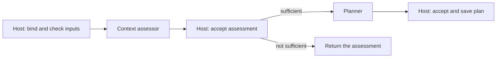

# Planning design notes

These notes extend the [Planning entry](module.md) with a worked example and the reasons behind its
design. They define nothing; every term is defined in the entry, and the exact records and rules
are in the [planning reference](workflow.md).

## A worked run

Suppose a billing Module's Spec now says that a declined card charge is retried once after a
network timeout, and the user session asks for `"Retry failed card charges once"`.

`concorde-plan` returns a prepared native workflow call. The user session invokes it unchanged and
polls the `concorde` tool with `action: "result"`. Inside the workflow a fresh context assessor reads
the billing Module's Spec context and answers `sufficient`; the Host accepts that assessment; a fresh
planner then writes the plan, and the Host saves it in the candidate, bound to the current Spec
revision and the task as stated.

`concorde-tasks` then returns a prepared Agent call. A fresh task author reads the plan and the
Spec and proposes a list such as:

```json
[{"id": "retry-timeout", "target_id": "module.billing",
  "description": "Retry a charge once after a network timeout",
  "acceptance": "A test shows one retry after a timeout and none after a card decline",
  "complete": false}]
```

The Host saves the accepted list in the candidate's change record, where `concorde-implement` finds
it.



## Why assess before planning

Each answer can fail for a different reason, so each is its own Operation. Assessing first keeps a
planner from inventing behaviour that the Spec does not state: a missing promise becomes a visible
gap that the developer resolves in the Spec, not an assumption hidden in a plan. Keeping
implementation contents away from these Agents serves the same end: existing code cannot quietly
become the Spec. Before the assessor starts, the Host also checks the Module's own collaborations
with Spec tooling's structural checks, so an unexplained or inconsistent collaboration stops the
assessment without any model.

## Why plans and task identities are bound

A plan is bound to the Spec revision and the task statement it was written for: if either changes,
the plan might solve the wrong problem even though its text still looks right. Each new plan moves
the previous task list into the target's task history. Task identities are never reused: every task
author receives the identities already used, a colliding answer is rejected, and the Host never
rewrites an Agent's answer to make it fit. This keeps every earlier task, review and completion
record pointing at exactly one task. Preparing a plan or tasks also clears the candidate's recorded
validation, so readiness evidence never outlives new work.

## Why the change scope is derived

Some changes are only valid when other Modules change with them: raising a contract's version
requires every participant to move, retiring a concept requires its importers to follow, and a file
several Modules bind carries all their promises. A billing Module whose payment contract a checkout
Module requires may therefore plan a task for checkout, even though billing does not use checkout.
The scope is computed one level deep from the Protocol's derived indexes rather than from a list
anyone maintains, so it widens exactly when a declaration makes another Module depend on this one,
and every stage that must know the extent of a change (task acceptance, component requests,
component work and review scopes) reads the same definition. Each task is still carried out for its
own Module in the same candidate, and the owner's validation and delivery land the whole change at
once.

## Why pending gaps are bound to a revision

A pending gap keeps a Spec problem from being worked around. Binding it to the revision it was
recorded against, rather than to a time or a count, means the only way past it is to change what it
was recorded against. Gaps are recorded only inside a candidate and only for work the candidate
records, so a standalone context assessment for an unrelated task records nothing. Context
assessment and the reviews are never blocked by pending gaps, because they are how a repair is
checked.
