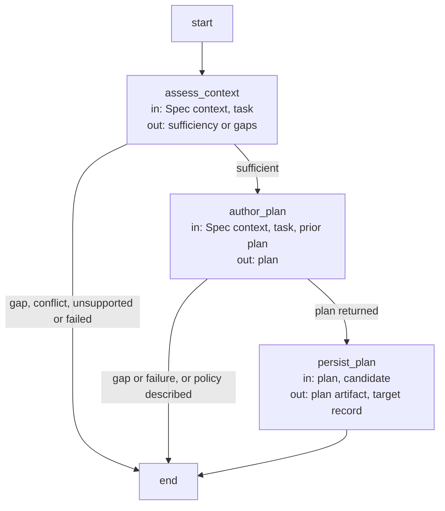

# Planning execution and record contracts

These are the precise implementation agreements and executable Graph specifications owned by the
[Planning Module](module.md). Explanatory topics introduce their purposes; exact identities, limits
and transitions are retained here as the single detailed contract.

## Terminology

| Term | Meaning / definition |
| --- | --- |
| [Spec](../concepts.md#terminology) | Defined in Concepts for reading Concorde. |
| [Module](../concepts.md#terminology) | Defined in Concepts for reading Concorde. |
| [Worker](../concepts.md#terminology) | Defined in Concepts for reading Concorde. |
| [Host](../concepts.md#terminology) | Defined in Concepts for reading Concorde. |
| [Candidate](../concepts.md#terminology) | Defined in Concepts for reading Concorde. |
| [Ready](../concepts.md#terminology) | Defined in Concepts for reading Concorde. |
| [Grant](../concepts.md#terminology) | Defined in Concepts for reading Concorde. |
| [Spec context](../harness/context.md#terminology) | Defined in What information a worker receives. |
| [Internal operation](../development/module.md#terminology) | Defined in Development operation host. |
| [Skill](../concepts.md#terminology) | Defined in Concepts for reading Concorde. |
| [Graph](../concepts.md#terminology) | Defined in Concepts for reading Concorde. |
| [Task sufficiency](assessment.md#terminology) | Defined in Is the specification sufficient for this task? |
| [Acceptance task](tasks.md#terminology) | Defined in Making work verifiable. |
| [Reserved task ID](tasks.md#terminology) | Defined in Making work verifiable. |
| [Evidence](../concepts.md#terminology) | Defined in Concepts for reading Concorde. |
| [Delivery](../concepts.md#terminology) | Defined in Concepts for reading Concorde. |

## Context assessment {#assessment-context-assessment}

The [Development Module](../development/module.md) owns admission. Its [common invocation envelope](../development/interfaces.md#operation-execution-boundary),
[typed handoffs](../development/interfaces.md#stage-handoffs) and
[gap rules](../development/execution-reference.md) apply. Artifact references are host-issued paths
and exact digests; a valid shape alone does not establish currentness or authority.
This is a private, bound operation in the [current adapter inventory](../development/execution-reference.md).
Only a declared in-process composition can call it; direct Skill/CLI invocation is rejected.
A caller supplies the selected Module, task, constraints, focus and current candidate identity
where required. It cannot reselect context or forge saved artifacts. Spec context is complete,
file names are visible and implementation contents remain excluded from non-code phases.

`context-solve` returns a task-specific sufficiency assessment without authored artifacts.
Before its fresh context assessor invocation, the host compares local dependency
declarations to registered relationships: a missing direct promise is an owned Spec gap;
malformed, duplicate, unknown or unrelated entries are conflicting. Neither injects an undeclared
relationship inventory into the worker. The assessor uses only the admitted Spec and never fetches
code or another context to fill a gap.

Outcomes are sufficient, spec_incomplete, unsupported, conflicting or failed. A prohibition is
unsupported, a contradiction conflicting, a known missing runtime field invalid input, and an
execution failure failed. Gaps identify question, blocked_step and needed_contract, with host-bound
target/context provenance. The caller pauses the dependent step and may continue independent work.
Reassessment after an explicit contract repair uses fresh inputs; an unchanged blocked step stays
blocked. Successful assessment resolves historical phase gaps only after any associated authored
output has passed host acceptance. It proves no universal completeness.

### Precise specifications {#assessment-precise-specifications}

The Planning Module owns the exact obligations and interface details in [requirements](requirements.md), [scenarios](scenarios.md).
These companions are part of the same complete Module specification, not separate topic owners.

## Planning operation {#plan-planning-operation}

The [common invocation envelope](../development/interfaces.md#operation-execution-boundary),
[typed handoffs](../development/interfaces.md#stage-handoffs) and
[gap rules](../development/execution-reference.md) apply. Artifact references are host-issued paths
and exact digests; a valid shape alone does not establish currentness or authority.
This is a private, bound operation in the [current adapter inventory](../development/execution-reference.md).
Only a declared in-process composition can call it; direct Skill/CLI invocation is rejected.
A caller supplies the selected Module, task, constraints, focus and current candidate identity
where required. It cannot reselect context or forge saved artifacts. Spec context is complete,
file names are visible and implementation contents remain excluded from non-code phases.

`plan` first obtains the separate [assessment](execution-reference.md). Only a sufficient result admits a
fresh planner invocation. Its optional concorde-plan-artifact is an explicitly admitted
prior plan, not a predecessor conversation. The accepted output is a nonempty plan bound to the
selected contract revision and intent. The host stores the target plan and returns artifact references
in concorde-plan-response@3; the worker has no direct project writes. No task list, implementation,
review or readiness is produced by planning.

A coordinating plan identifies local work and exact direct child/used-Module IDs from its local
dependency declarations. It states their required behavior without pretending to read their code;
separately selected component work needs each component's complete contract and its own grant.
Empty or invalid plans are rejected without replacing accepted state. Gaps, conflicting contracts,
unsupported work, stale context and failed execution stop dependent planning. Relevant Spec or
intent changes invalidate reuse; a repeated consumer invocation may reuse only current accepted
artifacts. Planning can be consumed by any declared caller satisfying these preconditions, without
having to explain its purpose by reference to dev-loop.

### Design {#plan-design}

#### Planning Graph (`plan_graph`) {#plan-planning-graph-plan-graph}

State: `route`, `output` (the planning response), `result`; the candidate record receives the
accepted plan, its Spec digest and intent.

| Node | Executes | in | out |
| --- | --- | --- | --- |
| `assess_context` | The deterministic dependency-declaration check, then one context-assessor invocation. | Spec context, task | sufficiency or gaps |
| `author_plan` | One planner invocation with an optional prior plan artifact. | Spec context, task, prior plan | plan |
| `persist_plan` | Deterministic: a nonempty plan replaces the target's plan and clears dependent tasks and coordination. | plan, candidate | plan artifact, target record |

### Precise specifications {#plan-precise-specifications}

The Planning Module owns the exact obligations and interface details in [requirements](requirements.md), [scenarios](scenarios.md).
These companions are part of the same complete Module specification, not separate topic owners.

## Task authoring operation {#tasks-task-authoring-operation}

The [common invocation envelope](../development/interfaces.md#operation-execution-boundary),
[typed handoffs](../development/interfaces.md#stage-handoffs) and
[gap rules](../development/execution-reference.md) apply. Artifact references are host-issued paths
and exact digests; a valid shape alone does not establish currentness or authority.
This is a private, bound operation in the [current adapter inventory](../development/execution-reference.md).
Only a declared in-process composition can call it; direct Skill/CLI invocation is rejected.
A caller supplies the selected Module, task, constraints, focus and current candidate identity
where required. It cannot reselect context or forge saved artifacts. Spec context is complete,
file names are visible and implementation contents remain excluded from non-code phases.

`tasks` requires a current managed change and accepted nonempty plan. Missing state is
missing_change; an absent plan is missing_plan. A fresh task author invocation receives
concorde-plan-artifact@1 and concorde-task-identity-constraints@1, even when the reservation list
is empty. Optional prior tasks and semantic scope/review feedback require explicit repair admission.
The [transport shapes](../spec/contracts.md#values-task-authoring-transport-values) are canonical there.

Task acceptance describes software behavior and implementation evidence within the programmer's
granted files and runtime. Host production/scaffold/export validation, independent reviews,
readiness, commit and delivery remain later responsibilities. Tasks support those checks through
implementation and tests; they never require the later steps to have finished first. Full software
acceptance stays in the plan and tasks, and all configured validation and required reviews still run.

Every fresh task author receives `concorde-task-identity-constraints@1` with a sorted, unique
`reserved_task_ids` list: all IDs from that target's retained task history, plus the current list
when scope or code-review repair replaces it. This input is required even when empty and survives
replanning through the retained history. It reserves identities without adding historical software
obligations. The Host rejects a collision with the specific IDs before accepting the new list;
it never rewrites author output or clears history to admit it.

The result is a nonempty list of internally unique, initially incomplete tasks, disjoint from
reserved IDs, each carrying id, target_id, description, acceptance and complete. The host accepts
and persists the list as a concorde-implementation-task@1 with its plan; it returns artifact
references through concorde-tasks-response@3. The author cannot complete tasks or mutate project files.

For scope recovery it receives the plan, prior list, reserved IDs and the fixed
implementation_boundary feedback, preserving software acceptance. A semantic change requiring a
new plan returns conflicting or a gap. Failed, malformed or colliding output never replaces the
old list or discards history. For review repair, only verified current blocking code feedback may
be supplied. The current adapter admits that feedback through dev-loop's bounded repair policy;
this is an adapter restriction, not permission for a new caller to invent a repair transition.
The caller owns ordering and invalidation, while this provider owns admissible input and new tasks.

### Precise specifications {#tasks-precise-specifications}

The Planning Module owns the exact obligations and interface details in [requirements](requirements.md), [scenarios](scenarios.md).
These companions are part of the same complete Module specification, not separate topic owners.

## Realization and reuse limits

This Module and its consumers are siblings under Concorde Framework. Declared files explicitly
share the existing adapter realization with Development; no new runtime package, public Skill,
Agent grant or configurable arbitrary graph is created by this Spec boundary. Host admission,
phase artifacts and permissions remain mandatory. A new graph requires declared composition and
an implementation of its sequencing, artifact admission, recovery and completion policies before
it can execute. The existing host package still realizes common dispatch and provider internals.
