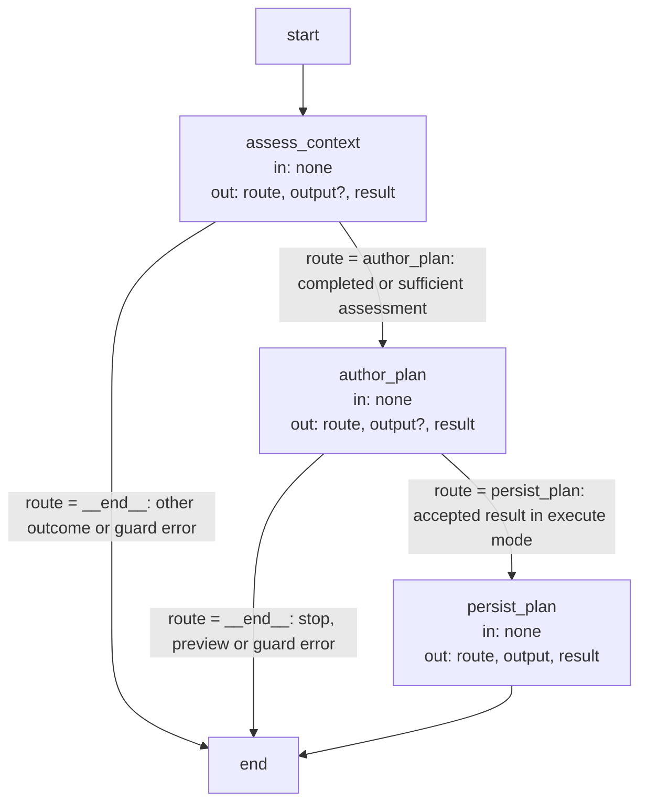

# Planning execution and record contracts

These are the precise implementation agreements and executable Graph specifications owned by the
[Planning Module](module.md). Explanatory topics introduce their purposes; exact identities, limits
and transitions are retained here as the single detailed contract.

## Terminology

| Term                                                      | Meaning / definition                                      |
| --------------------------------------------------------- | --------------------------------------------------------- |
| [Spec](../module.md#terminology)                          | Defined in Concorde Framework.                            |
| [Module](../module.md#terminology)                        | Defined in Concorde Framework.                            |
| [Worker](../module.md#terminology)                        | Defined in Concorde Framework.                            |
| [Host](../module.md#terminology)                          | Defined in Concorde Framework.                            |
| [Candidate](../module.md#terminology)                     | Defined in Concorde Framework.                            |
| [Ready](../module.md#terminology)                         | Defined in Concorde Framework.                            |
| [Grant](../module.md#terminology)                         | Defined in Concorde Framework.                            |
| [Spec context](../harness/context.md#terminology)         | Defined in What information a worker receives.            |
| [Internal operation](../operations/module.md#terminology) | Defined in Operations.                                    |
| [Skill](../module.md#terminology)                         | Defined in Concorde Framework.                            |
| [Graph](../module.md#terminology)                         | Defined in Concorde Framework.                            |
| [Task sufficiency](assessment.md#terminology)             | Defined in Is the specification sufficient for this task? |
| [Acceptance task](tasks.md#terminology)                   | Defined in Making work verifiable.                        |
| [Reserved task ID](tasks.md#terminology)                  | Defined in Making work verifiable.                        |
| [Evidence](../module.md#terminology)                      | Defined in Concorde Framework.                            |
| [Delivery](../module.md#terminology)                      | Defined in Concorde Framework.                            |

## Context assessment {#assessment-context-assessment}

[Harness admission](../harness/admission.md) owns the entry. Its [common invocation envelope](../harness/admission.md#operation-execution-boundary),
[typed handoffs](../harness/admission.md#stage-handoffs) and
[gap rules](../issues/execution-reference.md#review-and-gaps-attributed-issue-blockers-and-host-history) apply. Artifact references are host-issued paths
and exact digests; a valid shape alone does not establish currentness or authority.
This is a public, explicitly target-bound operation in the [current adapter inventory](../operations/execution-reference.md#operations-current-host-adapter).
The calling agent invokes it through its Skill, Pi projection or common launcher.
A caller supplies the selected Module, task, constraints, focus and current candidate identity
where required. It cannot reselect context or forge saved artifacts. Spec context is complete,
file names are visible and implementation contents remain excluded from non-code phases.

`context-solve` returns a task-specific sufficiency assessment without authored artifacts.
Before its fresh context assessor invocation, the host compares local dependency
declarations to registered relationships: a missing direct promise is an owned Spec gap;
malformed, duplicate, unknown or unrelated entries are conflicting. Neither injects an undeclared
relationship inventory into the worker. The assessor uses only the admitted Spec and never fetches
code or another context to fill a gap.

Outcomes are sufficient, spec_incomplete, unsupported, conflicting or failed. A prohibition is
unsupported, a contradiction conflicting, a known missing runtime field invalid input, and an
execution failure failed. Gaps identify question, blocked_step and needed_contract, with host-bound
target/context provenance. The caller pauses the dependent step and may continue independent work.
Reassessment of retained phases uses fresh accepted phase output; an unchanged blocked step stays blocked.
A fresh accepted sufficient assessment for the exact accepted target, task, focus and constraints
may supersede a correctly attributed historical `specify` task relation because that author
prerequisite has been removed. This includes unknown original revisions and non-contract failures
of that obsolete execution; it does not infer a historical byte change or successful repair.
The host retains the original relation, receipt, contexts, source evidence and failed outcome,
marks only its prerequisite status `superseded`, and records the current assessment context,
Spec revision and reason `retired_author_prerequisite`. The assessment proves current task
sufficiency, not that the old author succeeded or its Issue was fixed. An edit alone, unrelated
intent, malformed attribution, stale, failed, insufficient or gap-reporting assessment cannot
supersede it. A current contract gap remains blocking. This neither closes its Issue nor refreshes
required review, checks or retained plan/tasks/implementation/review relations, which need their
own accepted current output. Current integrity and permission failures remain failures.
Assessment proves no universal completeness.

### Precise specifications {#assessment-precise-specifications}

The Planning Module owns the exact obligations and interface details in [requirements](requirements.md), [scenarios](scenarios.md).
These companions are part of the same complete Module specification, not separate topic owners.

## Planning operation {#plan-planning-operation}

The [common invocation envelope](../harness/admission.md#operation-execution-boundary),
[typed handoffs](../harness/admission.md#stage-handoffs) and
[gap rules](../issues/execution-reference.md#review-and-gaps-attributed-issue-blockers-and-host-history) apply. Artifact references are host-issued paths
and exact digests; a valid shape alone does not establish currentness or authority.
This is a public, explicitly target-bound operation in the [current adapter inventory](../operations/execution-reference.md#operations-current-host-adapter).
The calling agent invokes it through its Skill, Pi projection or common launcher.
A caller supplies the selected Module, task, constraints, focus and current candidate identity
where required. It cannot reselect context or forge saved artifacts. Spec context is complete,
file names are visible and implementation contents remain excluded from non-code phases.

`plan` first obtains the separate [assessment](execution-reference.md). Only a sufficient result admits a
fresh planner invocation. Its optional concorde-plan-artifact is an explicitly admitted
prior plan, not a predecessor conversation. The accepted output is a nonempty plan bound to the
selected contract revision and intent. The host stores the target plan and returns artifact references
in concorde-plan-response@3; the worker has no direct project writes. No task list, implementation,
review or readiness is produced by planning.

A coordinating plan identifies local work and exact direct child/used-Module IDs from its local
dependency declarations. It states their required behavior without pretending to read their code;
separately selected component work needs each component's complete contract and its own grant.
Empty or invalid plans are rejected without replacing accepted state. Gaps, conflicting contracts,
unsupported work, stale context and failed execution stop dependent planning. Relevant Spec or
intent changes invalidate reuse; a repeated consumer invocation may reuse only current accepted
artifacts. Planning can be consumed by any declared caller satisfying these preconditions, without
depending on a development workflow.

### Design {#plan-design}

#### Planning Graph (`plan_graph`) {#plan-planning-graph-plan-graph}

**State.** `route`, `output` (the planning response), `result`; the candidate record receives the
accepted plan, its Spec digest and intent. All three Graph channels use replacement updates.
The admitted `run`, prior artifacts and planner result are Host/closure-held inputs, not channels:
`author_plan` stores its result in the closure, and `persist_plan` reads that result rather than
`output`. `output` carries a typed stop/preview response or the final plan response. `none` below
means no Graph-channel read; `?` marks an update present only on a stop path. The admission guard
writes `result=None` on success, or a failure envelope and `route=__end__` on exception.

**Nodes.** Both model-backed nodes run their worker as an [Operation node](../harness/execution-reference.md#host-operation-node-operation-node).

| Node             | Executes                                                                                                                                        | in   | out                    |
| ---------------- | ----------------------------------------------------------------------------------------------------------------------------------------------- | ---- | ---------------------- |
| `assess_context` | Checks required Spec review and dependency declarations, then assesses the Host-bound task/Spec; chooses author_plan or writes a stop response. | none | route, output?, result |
| `author_plan`    | Invokes the planner with Host-bound context/prior artifact; retains result outside State and chooses persistence or a stop/preview response.    | none | route, output?, result |
| `persist_plan`   | Reads the closure-held nonempty plan, writes its artifact and candidate revision/intent, and clears dependent tasks/coordination.               | none | route, output, result  |

**Edges.** `assess_context` and `author_plan` each write `route`, and a conditional edge follows it.
Only a sufficient assessment continues to `author_plan`, and only a returned plan continues to
`persist_plan`; a gap, conflict, unsupported task, failure or policy preview ends the Graph with
the response already written. The two advancing predicates accept worker `outcome` in
`{completed, sufficient}`; authoring also requires execution rather than describe-policy to
select persistence. The conditional edges read `state["route"]`, not `output.outcome`.
`persist_plan` writes `route=__end__` but has an unconditional edge to the end.

### Precise specifications {#plan-precise-specifications}

The Planning Module owns the exact obligations and interface details in [requirements](requirements.md), [scenarios](scenarios.md).
These companions are part of the same complete Module specification, not separate topic owners.

## Task authoring operation {#tasks-task-authoring-operation}

The [common invocation envelope](../harness/admission.md#operation-execution-boundary),
[typed handoffs](../harness/admission.md#stage-handoffs) and
[gap rules](../issues/execution-reference.md#review-and-gaps-attributed-issue-blockers-and-host-history) apply. Artifact references are host-issued paths
and exact digests; a valid shape alone does not establish currentness or authority.
This is a public, explicitly target-bound operation in the [current adapter inventory](../operations/execution-reference.md#operations-current-host-adapter).
The calling agent invokes it through its Skill, Pi projection or common launcher.
A caller supplies the selected Module, task, constraints, focus and current candidate identity
where required. It cannot reselect context or forge saved artifacts. Spec context is complete,
file names are visible and implementation contents remain excluded from non-code phases.

`tasks` requires a current managed change and accepted nonempty plan. Missing state is
missing_change; an absent plan is missing_plan. A fresh task author invocation receives
concorde-plan-artifact@1 and concorde-task-identity-constraints@1, even when the reservation list
is empty. Optional prior tasks and semantic scope/review feedback require explicit repair admission.
The [transport shapes](../spec/contracts.md#values-task-authoring-transport-values) are canonical there.

Task acceptance describes software behavior and implementation evidence within the programmer's
granted files and runtime. Host production/scaffold/export validation, independent reviews,
readiness, commit and delivery remain later responsibilities. Tasks support those checks through
implementation and tests; they never require the later steps to have finished first. Full software
acceptance stays in the plan and tasks, and all configured validation and required reviews still run.

Every fresh task author receives `concorde-task-identity-constraints@1` with a sorted, unique
`reserved_task_ids` list: all IDs from that target's retained task history, plus the current list
when scope or code-review repair replaces it. This input is required even when empty and survives
replanning through the retained history. It reserves identities without adding historical software
obligations. The Host rejects a collision with the specific IDs before accepting the new list;
it never rewrites author output or clears history to admit it.

The result is a nonempty list of internally unique, initially incomplete tasks, disjoint from
reserved IDs, each carrying id, target_id, description, acceptance and complete. The host accepts
and persists the list as a concorde-implementation-task@1 with its plan; it returns artifact
references through concorde-tasks-response@3. The author cannot complete tasks or mutate project files.

For scope recovery the explicit `repair_task_scope` request selects the exact current incomplete
task list by digest. It requires a current accepted plan, including its Spec revision and intent;
even a meaning-preserving Spec or metadata edit requires explicit replanning first. Repair cannot
silently rebind the old plan to new contract bytes. The task author receives the plan, prior list,
reserved IDs and the fixed implementation_boundary feedback, preserving software acceptance. A semantic change requiring a
new plan returns conflicting or a gap. Failed, malformed or colliding output never replaces the
old list or discards history. For review repair, only verified current blocking code feedback may
be supplied. The caller explicitly supplies repair_review as an ArtifactRef. The host verifies its digest,
current same-target/task input identity, blocking code findings and nonempty coverage before admission.
The caller owns ordering and invalidation, while this provider owns admissible input and new tasks.

### Precise specifications {#tasks-precise-specifications}

The Planning Module owns the exact obligations and interface details in [requirements](requirements.md), [scenarios](scenarios.md).
These companions are part of the same complete Module specification, not separate topic owners.

## Realization and reuse limits

This Module and its consumers are siblings under Concorde Framework. Its behavior is realized in
its own package `src/concorde/planning/`, bound by its adapter entity together with its `operations/` declaration; this Spec boundary
does not itself create an Agent grant or configurable arbitrary graph; public exposure is explicit in the catalog. Host admission, phase
artifacts and permissions remain mandatory. A new graph requires declared composition and an
implementation of its sequencing, artifact admission, recovery and completion policies before it
can execute. [Harness admission](../harness/admission.md) realizes the common entry and invocation
host, and [Operations](../operations/execution-reference.md#graphs-dispatch-graphs) the dispatch
that reaches this provider.
