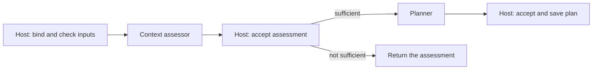
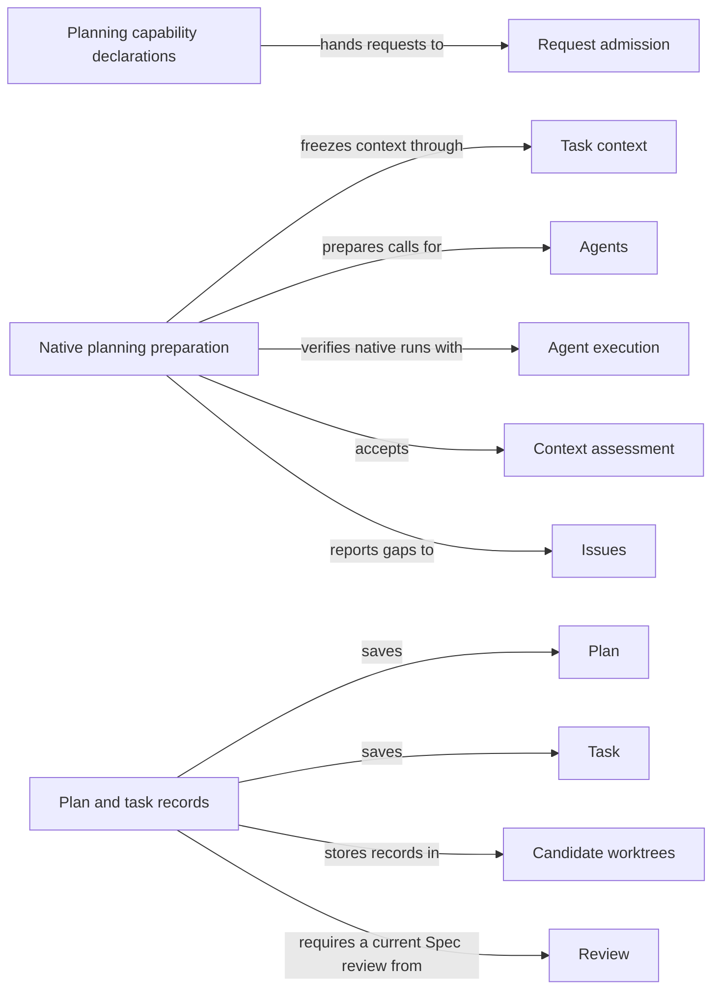

# Planning

## Purpose

Planning is the step before code changes. It judges whether a Module's Spec says enough for a
task, writes a plan for that task, and turns the accepted plan into acceptance tasks for a
programmer. It owns the capabilities `concorde-context-solve`, `concorde-plan` and `concorde-tasks`.
Its Agents work from Specs: they see the names of implementation files but never their contents.
Planning does not change code, does not review, and does not decide whether a change is ready. It
never starts implementation; the user session decides what happens next.

## Terminology

| Term | Definition |
| --- | --- |
| Context assessment | A worker's judgement, accepted by the Host, of whether the selected Module's Spec says enough to plan one particular task. |
| Plan | The accepted prose description of how to carry out one task for one Module, bound to that Module's Spec revision and to the task as stated. |
| Task | One item of implementation work derived from an accepted plan, with an identity, a target Module, a description, an acceptance condition and a completion flag. |
| [Capability](../vocabulary.md#concept.concorde.capability) | |
| [User session](../vocabulary.md#concept.concorde.user-session) | |
| [Host](../vocabulary.md#concept.concorde.host) | |
| [Worker](../vocabulary.md#concept.concorde.worker) | |
| [Module](../vocabulary.md#concept.concorde.module) | |
| [Spec](../vocabulary.md#concept.concorde.spec) | |
| [Agent](../agents/module.md#concept.agents.agent) | |
| [Workflow](../harness/execution/module.md#concept.execution.workflow) | |
| [Candidate](../harness/worktrees/module.md#concept.worktrees.candidate) | |
| [Issue](../issues/module.md#concept.issues.issue) | |
| [Blocker](../issues/module.md#concept.issues.blocker) | |
| [Finding](../review/module.md#concept.review.finding) | |

The three Planning words follow each other: a sufficient context assessment admits a plan, and an
accepted plan admits tasks. The word "task" has a second, everyday use in requests: the `task`
field is the plain statement of the work the user session wants done. A Task in the sense above is
one item of the list derived from a plan.

## Usage

### Which capability to call

All three capabilities take the same request: `target_id`, the Module; `task`, the statement of the
work; and optionally `focus_id`, one scenario of that Module, and `constraints`.

- Call `concorde-context-solve` to find out whether the Spec is good enough for the task, without
  writing anything. It is also the way to check that a Spec edit closed a reported gap.
- Call `concorde-plan` to get a plan. It runs a context assessment first and a planner only if the
  assessment is sufficient.
- Call `concorde-tasks` after a plan is accepted, to get the acceptance tasks that
  `concorde-implement` will work on.

Plan and tasks write into a [candidate](../harness/worktrees/module.md#concept.worktrees.candidate)
worktree. Context assessment only reads.

### A normal run

<a id="concept.planning.assessment"></a><a id="concept.planning.plan"></a><a id="concept.planning.task"></a>

Suppose a billing Module's Spec now says that a declined card charge is retried once after a
network timeout, and the user session asks for `"Retry failed card charges once"`.

`concorde-plan` returns a prepared native workflow call. The user session invokes it unchanged and
polls the `concorde` tool with `action: "result"`. Inside the workflow a fresh context assessor reads
the billing Spec and answers **sufficient**; the Host accepts that **context assessment**; a fresh
planner then writes the **plan**, and the Host saves it in the candidate as
`.concorde/work/module.billing/plan.md`, bound to the current Spec revision and the task as stated.

`concorde-tasks` then returns a prepared Agent call. A fresh task author reads the plan and the Spec
and proposes a list such as:

```json
[{"id": "retry-timeout", "target_id": "module.billing",
  "description": "Retry a charge once after a network timeout",
  "acceptance": "A test shows one retry after a timeout and none after a card decline",
  "complete": false}]
```

The Host accepts the list only if it is nonempty, every **task** is new and incomplete, and every
target is the Module itself, a Module it uses or one of its direct children. The list is saved in
the candidate's change record, where `concorde-implement` finds it.

### When planning stops

A context assessment ends with one of four answers. **sufficient** admits planning.
**spec_incomplete** means a promise the task needs is missing: the assessor reports it as an
[Issue](../issues/module.md#concept.issues.issue) and returns a
[blocker](../issues/module.md#concept.issues.blocker) naming that Issue and the step it blocks.
**unsupported** means the Spec forbids the task. **conflicting** means the Spec contradicts itself or
its declared collaborations do not agree. A failed or cancelled run is reported as an execution
failure, not as a Spec problem.

A recorded gap keeps blocking the same step until the Spec changes; repeating the call does not
clear it. Edit the Spec, then call `concorde-context-solve` or `concorde-plan` again.

The Host also refuses to start, before any Agent runs, when:

- the candidate records that this Module needs a Spec review and there is no current, non-blocking
  one (`review_required`);
- `concorde-tasks` finds no managed candidate (`missing_change`) or no accepted plan
  (`missing_plan`);
- the Module's Spec changed since the plan was accepted (`stale_context`: plan again), or the
  request's task or constraints differ from the plan's (`incompatible_handoff`).

When the Host rejects a returned plan or task list, because it is empty, invalid, reuses a reserved
task identity or was produced from inputs that changed meanwhile, the previously accepted plan and
tasks stay as they were. Stopping the Pi session stops a running planning workflow, and nothing
from it is accepted afterwards.

### Repairing tasks

Two optional request fields of `concorde-tasks` replace an accepted task list without losing its
history:

- `repair_review` passes a reference to a code review with blocking
  [findings](../review/module.md#concept.review.finding). The Host checks that it is the current
  review of this target and task, and the task author writes new tasks that address the findings.
- `repair_task_scope` passes the digest of the current incomplete task list, when its acceptance
  conditions ask for something the programmer cannot do, such as an independent review having
  already passed. The plan must still be current; a Spec edit means planning again first.

## Design

Planning is split into three capabilities because each answer is useful on its own and each can
fail for a different reason. Assessing first keeps a planner from inventing behaviour that the Spec
does not state: a missing promise becomes a visible gap that the developer resolves in the Spec,
not an assumption hidden in a plan. Keeping implementation contents away from these Agents serves
the same end: existing code cannot quietly become the Spec.

Every model step runs in a fresh Agent that sees only the frozen context of the target Module, and
its answer is only a proposal. The Host accepts it only after checking that it belongs to this
invocation and context, that its outcome agrees with its blockers, that the Spec, registry,
configuration, Agent instructions and candidate state have not changed since the context was
frozen, and that it passes the business rules above. Only then does the Host write the plan or task
list. Preparing a plan or tasks also clears the candidate's recorded validation, so readiness
evidence never outlives new work.

A plan is bound to the Spec revision and the task statement it was written for. If either changes,
the plan might solve the wrong problem even though its text still looks right, so it must be
written again. Each new plan moves the previous task list into the target's task history.

Task identities are never reused. Every task author receives the sorted list of reserved identities:
every identity in the target's task history, plus the current list's when it is being replaced. A
colliding answer is rejected with the colliding identities, and the Host never rewrites an Agent's
answer to make it fit. This keeps every earlier task, review and completion record pointing at
exactly one task.



The planning workflow alternates model steps with fixed Host steps. The model steps cannot run
commands of their own choosing, and each Host step independently checks the native run's record
before it advances. The exact steps and records are in the
[planning workflow](workflow.md) document.

<a id="realization.planning.capabilities"></a>

The **Planning capability declarations** are the three modules in `operations/` that declare
`concorde-context-solve`, `concorde-plan` and `concorde-tasks` for the capability catalog.

<a id="realization.planning.native"></a>

The **native planning preparation** freezes each Agent's context into a capsule directory, writes
the native Agent definition and the exact call, and later accepts or rejects the returned proposal.
The same preparation service also prepares the programmer, the reviewers and the Issue solver for
their own Modules. It includes the authored workflow `pi/workflows/plan.js` and its fixed Host steps.

<a id="realization.planning.records"></a>

The **plan and task records** code checks task requests, validates proposed tasks and writes
accepted plans and tasks into the candidate's change record.

<a id="realization.planning.tests"></a>

The **Planning tests** cover context assessment, planning and task authoring, both with scripted
native runs and with test doubles for the business rules.

Before launching the assessor, the Host checks the Module's own collaborations with the Spec
tooling's relation and reconciliation checks. A `contains`, `uses` or `participates` whose
explanation does not resolve is reported as a gap (a missing promise); a `relies_on` naming nodes
the provider does not own, a repeated or self `uses`, or an unreconciled context requirement is
reported as a conflict. Either stops the assessment before any model runs.

## Relationships



<a id="uses-admission"></a>

**Request admission** checks each planning [capability request](../harness/admission/module.md#concept.admission.capability-request),
binds its workspace and wraps the outcome in the [result envelope](../harness/admission/module.md#concept.admission.result-envelope).
Planning's native preparation runs inside admission, so the same checks apply whether a request
arrives from the Pi session or through admission's [relay](../harness/admission/module.md#concept.admission.relay) into the
candidate. Planning relies on admission to reject malformed requests before any context is frozen,
and returns every refusal through its envelope.

<a id="uses-context"></a>

**Task context** freezes a [context snapshot](../harness/context/module.md#concept.context.snapshot) of the target
Module for each Agent: the Module's Spec documents, the names of its implementation files, as
[implementation names reach every phase](../harness/context/requirements.md#req.context.names-every-phase), and, for
roles that read them, its declared external references. Planning writes exactly that context into
the Agent's [capsule](../harness/context/module.md#concept.context.capsule) and, before accepting a proposal, relies
on [recheck rejecting changed inputs](../harness/context/requirements.md#req.context.recheck).

<a id="uses-execution"></a>

**Agent execution** runs the native Agents and the planning
[workflow](../harness/execution/module.md#concept.execution.workflow) with its fixed [Host steps](../harness/execution/module.md#concept.execution.host-step),
and provides the [result gate](../harness/execution/module.md#concept.execution.result-gate) and the checks that a
native run completed and was not tampered with. Planning treats every Agent answer as a
[proposal](../harness/execution/module.md#concept.execution.proposal), because
[a proposal is not a result](../harness/execution/requirements.md#req.execution.proposal-not-completion): it accepts
nothing until those checks pass, and treats a failed, stopped or unverifiable run as an execution
failure.

<a id="uses-agents"></a>

**Agents** defines the context assessor, the planner and the task author. Planning prepares each
[Agent](../agents/module.md#concept.agents.agent) from its
[Agent definition](../agents/module.md#concept.agents.definition) and never adds tools or delegation
to it.

<a id="uses-worktrees"></a>

**Candidate worktrees** holds the [change status](../harness/worktrees/module.md#concept.worktrees.change-status) of the
[candidate](../harness/worktrees/module.md#concept.worktrees.candidate), in which Planning stores the target's plan, tasks, task
history and recorded gaps, and the [run records](../harness/worktrees/module.md#concept.worktrees.run-record) in which it keeps
the evidence of accepted native runs. Planning writes there only through the candidate's record
functions, under its lock, and refuses work when no managed candidate exists.

<a id="uses-spec"></a>

**Spec** resolves the target Module and its revision from the
[registry](../spec/module.md#concept.spec.registry). Planning binds plans to that revision and treats
any change of it as a reason to plan again.

<a id="uses-issues"></a>

**Issues** records every gap an assessor reports as an
[Issue](../issues/module.md#concept.issues.issue), and Planning keeps a
[blocker](../issues/module.md#concept.issues.blocker) on the blocked step until a fresh accepted
result shows it no longer applies. Planning accepts a proposal only if every Issue it cites was
recorded during that run, as [results reference only known reports](../issues/requirements.md#req.issues.references)
requires.

<a id="uses-review"></a>

**Review** tells Planning whether a [required review](../review/module.md#concept.review.required-review)
of the Module's Spec is current, and supplies the blocking
[findings](../review/module.md#concept.review.finding) that a task repair addresses. Planning refuses
to plan or author tasks while a required review is missing, blocking or stale, and admits repair
feedback only as [repair feedback comes only from the current blocking code review](../review/requirements.md#req.review.repair-feedback)
allows.

<a id="uses-distribution"></a>

**Distribution** builds the Agent instructions that Planning's native preparation loads for each
role. Planning relies on [model work never using a stale build](../distribution/requirements.md#req.distribution.fresh-instructions),
and a changed instruction digest makes a prepared proposal stale.
