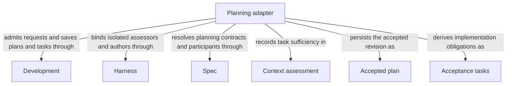

# Planning

## Purpose

Planning checks whether a task is sufficiently specified, produces a plan and turns an accepted plan into implementation tasks. It helps a workflow decide what should be done before code work starts. It neither implements the plan nor declares the whole change ready.

## Terminology

| Term | Meaning / definition |
| --- | --- |
| [Spec](../module.md#terminology) | Defined in Concorde Framework. |
| [Worker](../module.md#terminology) | Defined in Concorde Framework. |
| [Candidate](../module.md#terminology) | Defined in Concorde Framework. |
| [Ready](../module.md#terminology) | Defined in Concorde Framework. |
| [Host](../module.md#terminology) | Defined in Concorde Framework. |
| [Skill](../module.md#terminology) | Defined in Concorde Framework. |
| [Graph](../module.md#terminology) | Defined in Concorde Framework. |
| [Task sufficiency](assessment.md#terminology) | Defined in Is the specification sufficient for this task? |
| [Acceptance task](tasks.md#terminology) | Defined in Making work verifiable. |
| [Reserved task ID](tasks.md#terminology) | Defined in Making work verifiable. |
| [Spec context](../harness/context.md#terminology) | Defined in What information a worker receives. |
| [Grant](../module.md#terminology) | Defined in Concorde Framework. |

## Usage

Consume Planning from a declared in-process operation, not a public Skill. First use
[context assessment](assessment.md) with the selected complete Module contract and explicit task.
A sufficient result permits [planning](plan.md); an accepted current nonempty plan permits
[task authoring](tasks.md). Supply current candidate identity and admitted artifact references where
required. Assessment produces no authored artifact, planning produces a revision-bound plan, and
task authoring produces a nonempty list of new, initially incomplete acceptance tasks.

Non-code phases see implementation names, not file contents, and do not infer missing software
meaning from code. A gap pauses the dependent step; a prohibition, contradiction or failed execution
has a distinct outcome. Empty plans, stale artifacts and reserved task-ID collisions preserve
previous accepted state without making it current. Tasks express implementation acceptance, not a
requirement that later host checks, review or delivery have already completed. Planning itself
neither implements work nor marks a candidate ready.

## Design

The [planning Graph](execution-reference.md#plan-planning-graph-plan-graph) checks local dependency declarations before
context assessment, admits a planner only after sufficiency, and persists a nonempty revision-bound
plan before tasks can be authored. The host then supplies reserved historical IDs and validates new
incomplete tasks before replacing accepted state. Separate artifacts prevent planning from being
mistaken for implementation completion or a later readiness decision.

The three Operations run differently. `plan` is that Graph: its `assess_context` node runs the
context-assessor worker, its `author_plan` node runs the planner worker, and its deterministic
`persist_plan` node stores the plan; each worker runs as an
[Operation node](../harness/execution-reference.md#host-operation-node-operation-node). `tasks` is
a single node: one task-author worker followed by the host's admission of the returned list.
`context-solve` is also a single node: the same context-assessor assessment, returned on its own
without a plan.

Each non-code worker has a fresh complete Spec context without source contents. Dependency tasks
name declared children or used Modules; separately admitted component work, not a wider planner
grant, supplies their implementations. Existing host repair admission remains an adapter limit.

## Relationships

The diagram separates Planning's reusable outputs from the providers that admit and produce them.
[Spec Module](../spec/module.md) resolves the contract and declared participants; [Harness Module](../harness/module.md) isolates each non-code worker;
[Development Module](../development/module.md) accepts and persists the returned state. Context assessment, Accepted plan and
Acceptance tasks are successive, distinct records, not three names for completed implementation.
A provider dependency does not make that provider a child of Planning or grant its code to a planner.

### Development

Admit bound assessment, plan and task requests, save accepted current plans and task artifacts, and preserve prior state on rejected output.

This collaboration applies when an assessment enters or a returned plan or task list is accepted or rejected.

- [Host admission](../development/interfaces.md#operation-execution-boundary); Recheck admitted intent and returned identities before accepting host state; a rejected result cannot advance the dependent step.

### Harness

Freeze Spec-only inputs and run separate isolated context assessors, planners and task authors without implementation contents or project writes.

This collaboration applies before invoking the context assessor, planner or task author, including admitted repair task authoring.

- [Complete context selection](../harness/contracts.md#contract.context.selection); Supply only mode-admitted inputs and require a matching completion; unavailable enforcement stops execution without a wider grant.

### Spec

Resolve the selected complete Module contract, declared participant relationships and file names used to assess and plan the task.

This collaboration applies when selecting planning inputs, checking local dependency declarations or rechecking the plan revision.

- [Owner and context resolution](../spec/contracts.md#registry-stable-id-spec-context-queries); Reconstruct current resolutions after input changes; unresolved ownership, missing required definitions or stale revisions block dependent use.

## Precise specifications

The Planning Module owns the exact obligations and interface details in [requirements](requirements.md), [scenarios](scenarios.md).
These companions are part of the same complete Module specification, not separate topic owners.
