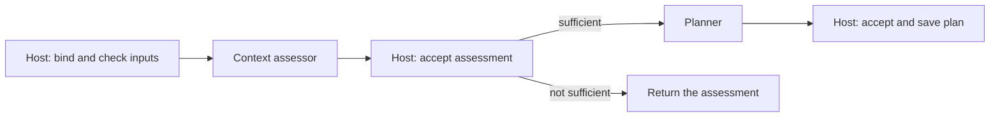
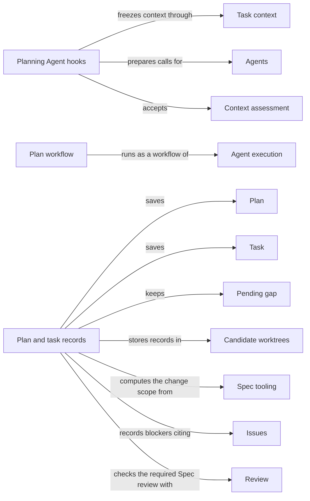

# Planning

## Purpose

Planning is the step before code changes. It judges whether a Module's Spec says enough for a
task, writes a plan for that task, and turns the accepted plan into acceptance tasks for a
programmer. It provides the Operations `concorde-context-solve`, `concorde-plan` and
`concorde-tasks`, and it owns two policies other stages rely on: the change scope, which says which
Modules one change may edit, and the pending gaps, which keep work from continuing past a Spec
problem that has not been repaired. Its Agents work from Specs: they see the names of
implementation files but never their contents. Planning does not change code, does not review, and
does not decide whether a change is ready. It never starts implementation; the user session decides
what happens next.

## Terminology

| Term | Definition |
| --- | --- |
| Context assessment | A worker's judgement, accepted by the Host, of whether the selected Module's Spec says enough to plan one particular task. |
| Plan | The accepted prose description of how to carry out one task for one Module, bound to that Module's Spec revision and to the task as stated. |
| Task | One item of implementation work derived from an accepted plan, with an identity, a target Module, a description, an acceptance condition and a completion flag. |
| Change scope | The Modules that one change owned by a Module may edit, because changing that Module can require them to change with it. |
| Pending gap | A blocker recorded in a candidate for one Module, work scope and step, which stops that step and the later planning and implementation steps until the revision it was recorded against changes. |
| [User session](../vocabulary.md#concept.concorde.user-session) | |
| [Host](../vocabulary.md#concept.concorde.host) | |
| [Worker](../vocabulary.md#concept.concorde.worker) | |
| [Module](../vocabulary.md#concept.concorde.module) | |
| [Spec](../vocabulary.md#concept.concorde.spec) | |
| [Spec context](../vocabulary.md#concept.concorde.spec-context) | |
| [Implementation context](../vocabulary.md#concept.concorde.implementation-context) | |
| [Task context](../vocabulary.md#concept.concorde.task-context) | |
| [Operation](../operations/module.md#concept.operations.operation) | |
| [Agent](../agents/module.md#concept.agents.agent) | |
| [Workflow](../harness/execution/module.md#concept.execution.workflow) | |
| [Host step](../harness/execution/module.md#concept.execution.host-step) | |
| [Proposal](../harness/execution/module.md#concept.execution.proposal) | |
| [Candidate](../harness/worktrees/module.md#concept.worktrees.candidate) | |
| [Issue](../issues/module.md#concept.issues.issue) | |
| [Blocker](../issues/module.md#concept.issues.blocker) | |
| [Required review](../review/module.md#concept.review.required-review) | |
| [Finding](../review/module.md#concept.review.finding) | |

The three stage words follow each other: a sufficient context assessment admits a plan, and an
accepted plan admits tasks. The word "task" has a second, everyday use in requests: the `task`
field is the plain statement of the work the user session wants done. A Task in the sense above is
one item of the list derived from a plan.

## Usage

### Which Operation to call

All three Operations take the same request: `target_id`, the Module; `task`, the statement of the
work; and optionally `focus_id` (one scenario of that Module), `constraints` and `change_id`.

- Call `concorde-context-solve` to find out whether the Spec is good enough for the task, without
  writing anything. It is also the way to check that a Spec edit closed a reported gap.
- Call `concorde-plan` to get a plan. It runs a context assessment first and a planner only if the
  assessment is sufficient.
- Call `concorde-tasks` after a plan is accepted, to get the acceptance tasks that
  `concorde-implement` will work on.

Plan and tasks write into a [candidate](../harness/worktrees/module.md#concept.worktrees.candidate).
Context assessment only reads.

### A normal run

<a id="concept.planning.assessment"></a><a id="concept.planning.plan"></a><a id="concept.planning.task"></a>

Suppose a billing Module's Spec now says that a declined card charge is retried once after a
network timeout, and the user session asks for `"Retry failed card charges once"`.

`concorde-plan` returns a prepared native workflow call. The user session invokes it unchanged and
polls the `concorde` tool with `action: "result"`. Inside the workflow a fresh context assessor reads
the billing Module's [Spec context](../vocabulary.md#concept.concorde.spec-context) and answers
**sufficient**; the Host accepts that **context assessment**; a fresh planner then writes the
**plan**, and the Host saves it in the candidate, bound to the current Spec revision and the task as
stated.

`concorde-tasks` then returns a prepared Agent call. A fresh task author reads the plan and the
Spec and proposes a list such as:

```json
[{"id": "retry-timeout", "target_id": "module.billing",
  "description": "Retry a charge once after a network timeout",
  "acceptance": "A test shows one retry after a timeout and none after a card decline",
  "complete": false}]
```

The Host accepts the list only if it is nonempty, every **task** is new and incomplete, and every
target lies in the Module's change scope. The list is saved in the candidate's change record, where
`concorde-implement` finds it.

Every Agent in these steps receives the Module's Spec context, the names of its implementation
files (its [implementation context](../vocabulary.md#concept.concorde.implementation-context)
without contents), and a [task context](../vocabulary.md#concept.concorde.task-context) of the
request, the plan when there is one, and the task identities already used.

### The change scope

<a id="concept.planning.change-scope"></a>

Some changes are only valid when other Modules change with them: raising a contract's version
requires every participant to move to the new version, retiring a concept requires its importers
to follow, and changing a file several Modules bind concerns all of them. The **change scope** of a
Module is therefore wider than its own boundary. It holds the Module itself; the Modules it
contains or uses; every Module whose Spec context selects one of its documents; every Module that
participates in a contract it defines or participates in, and that contract's owner; every Module
whose declarations import, narrow, supersede, relate to, rely on or participate in a node it
defines; and every Module that binds one of its files. It is one level deep and computed from
declarations alone.

A billing Module whose payment contract a checkout Module requires may therefore plan a task for
checkout, even though billing does not use checkout. Each such task is still carried out for its
own Module, in the same candidate, and the Module that owns the change remains the one whose
validation and delivery land the whole change at once. Implementation and Review use this scope as
defined here.

### Component requests

A task for another Module of the change scope is carried out for that Module: the user session
plans, derives tasks for and implements it by calling the same Operations with that Module as
target, in the owner's candidate. Planning admits such a request only as a component request: some Module
already working in the candidate has a current accepted plan whose tasks name the requested Module,
the requested Module lies in that owner's change scope, the request has no focus, and its task and
constraints equal the component task derived from those tasks and the owner's constraints. Any other
request for a Module that does not own the candidate is refused before an Agent starts.

### When planning stops

A context assessment ends with one of four answers. **sufficient** admits planning.
**spec_incomplete** means a promise the task needs is missing: the assessor reports it as an
[Issue](../issues/module.md#concept.issues.issue) and returns a
[blocker](../issues/module.md#concept.issues.blocker) naming that Issue and the step it blocks.
**unsupported** means the Spec forbids the task. **conflicting** means the Spec contradicts itself
or its declared collaborations do not agree. A failed or cancelled run is reported as an execution
failure, not as a Spec problem.

<a id="concept.planning.pending-gap"></a>

A blocker that the Host accepts inside a candidate becomes a **pending gap**: it keeps blocking the
same step, and the later steps of planning and implementation, until the Spec (or, for code steps,
the code) it was recorded against changes. Repeating the call does not clear it. Edit the Spec, then
call `concorde-context-solve` or `concorde-plan` again; an accepted result without blockers for the
changed revision clears the gap. The Issue itself stays open until it is solved.

The Host also refuses to start, before any Agent runs, when:

- the candidate records a [required review](../review/module.md#concept.review.required-review) of
  the Module's Spec and it is not current (`review_required`);
- a pending gap blocks the step (`spec_incomplete`);
- `concorde-tasks` finds no managed candidate (`missing_change`) or no accepted plan
  (`missing_plan`);
- the Module's Spec changed since the plan was accepted (`stale_context`: plan again), or the
  request's task or constraints differ from the plan's (`incompatible_handoff`).

When the Host rejects a returned plan or task list, because it is empty, invalid, reuses a reserved
task identity or was produced from inputs that changed meanwhile, the previously accepted plan and
tasks stay as they were. Stopping the Pi session stops a running planning workflow, and nothing
from it is accepted afterwards.

### Repairing tasks

Two optional request fields of `concorde-tasks` replace an accepted task list without losing its
history:

- `repair_review` passes a reference to a code review with blocking
  [findings](../review/module.md#concept.review.finding). The Host checks that it is the current
  code review of this target and task, and the task author writes new tasks that address the
  findings.
- `repair_task_scope` passes the digest of the current incomplete task list, when its acceptance
  conditions ask for something the programmer cannot do, such as an independent review having
  already passed. The plan must still be current; a Spec edit means planning again first.

## Design

Planning is split into three Operations because each answer is useful on its own and each can fail
for a different reason. Assessing first keeps a planner from inventing behaviour that the Spec does
not state: a missing promise becomes a visible gap that the developer resolves in the Spec, not an
assumption hidden in a plan. Keeping implementation contents away from these Agents serves the same
end: existing code cannot quietly become the Spec. The Agents have no write, edit, shell or
delegation tools. Which files they open is limited by their instructions and by the capsule they
start in, not by the operating system: Concorde deliberately does not confine a native Agent's
reads.

Every model step runs in a fresh Agent, and its answer is only a
[proposal](../harness/execution/module.md#concept.execution.proposal). Planning implements the
Agent hooks of the context assessor, the planner and the task author, and the workflow hook of the
plan workflow. The native driver of Agent execution prepares, stages and verifies each call; the
hook supplies the stage inputs, checks the business rules and writes the accepted result. The Host
accepts a proposal only after the driver's checks (the run completed, it belongs to this invocation
and context, and the frozen inputs are unchanged) and the hook's rules pass. Preparing a plan or
tasks also clears the candidate's recorded validation, so readiness evidence never outlives new
work.



The plan workflow alternates Agent steps with fixed [Host steps](../harness/execution/module.md#concept.execution.host-step).
The Agent steps cannot run commands of their own choosing, and each Host step independently checks
the native run's records before it advances. The exact steps are in the
[planning reference](workflow.md#the-plan-workflow).

A plan is bound to the Spec revision and the task statement it was written for. If either changes,
the plan might solve the wrong problem even though its text still looks right, so it must be
written again. Each new plan moves the previous task list into the target's task history. Task
identities are never reused: every task author receives the identities already used, a colliding
answer is rejected, and the Host never rewrites an Agent's answer to make it fit. This keeps every
earlier task, review and completion record pointing at exactly one task.

The change scope is computed one level deep from the Protocol's derived indexes, not from a list
anyone maintains, so it widens exactly when a declaration makes another Module depend on this one.
Every stage that must know which Modules one change may touch (task acceptance, component requests,
Implementation's component work and Review's scopes) reads this one definition, so the stages cannot
disagree about the extent of a change.

Pending gaps keep a Spec problem from being worked around. They are bound to a revision rather than
to a time or a count, so the only way past one is to change what it was recorded against. They are
recorded only inside a candidate and only for work the candidate records: a standalone context
assessment for an unrelated task records nothing.

Before launching the assessor, the Host checks the Module's own collaborations with the Spec
tooling's structural checks. A `contains`, `uses` or `participates` whose explanation does not
resolve is reported as a gap; a `relies_on` naming nodes the provider does not own, a repeated or
self `uses`, or an unreconciled context requirement is reported as a conflict. Either stops the
assessment before any model runs.

<a id="realization.planning.declarations"></a>

The **Planning declarations** are the catalog entries of `concorde-context-solve`, `concorde-plan`
and `concorde-tasks`, and the guidance the Pi session shows for each.

<a id="realization.planning.hooks"></a>

The **Planning Agent hooks** implement the hooks of the context assessor, the planner, the task
author and the plan workflow.

<a id="realization.planning.workflow"></a>

The **plan workflow** is the authored pi workflow script, the Host-step script it calls, and the
Host services behind those steps. The Host services are moving from the Harness package into
Planning's own package.

<a id="realization.planning.records"></a>

The **plan and task records** code checks prerequisites, validates proposed tasks, writes accepted
plans and tasks into the candidate's change record, computes the change scope, admits component
requests and keeps the pending gaps.

<a id="realization.planning.tests"></a>

The **Planning tests** cover context assessment, planning and task authoring,
both with scripted native runs and with test doubles for the business rules.

## Relationships



<a id="uses-operations"></a>

**Operations** catalogs every [Operation](../operations/module.md#concept.operations.operation).
Planning declares its three Operations in the [Operation catalog](../operations/module.md#concept.operations.catalog)
with their Agents, phases and hooks, and relies on dispatch to reach its behaviour only through
those declared entry points.

<a id="uses-admission"></a>

**Request admission** checks each planning [capability request](../harness/admission/module.md#concept.admission.capability-request),
resolves the target, binds the workspace and wraps the outcome in the
[result envelope](../harness/admission/module.md#concept.admission.result-envelope). Planning relies
on admission to reject malformed requests before any context is frozen, and returns every refusal
through its envelope.

<a id="uses-context"></a>

**Task context** freezes a [context snapshot](../harness/context/module.md#concept.context.snapshot)
of the target Module for each Agent in its [phase](../harness/context/module.md#concept.context.phase),
delivers it as the Agent's [capsule](../harness/context/module.md#concept.context.capsule), and
rechecks it before acceptance. Planning adds its records as [stage inputs](../harness/context/module.md#concept.context.stage-input),
never as extra sources, and treats a changed snapshot as a reason to reject the proposal.

<a id="uses-execution"></a>

**Agent execution** runs each [Agent call](../harness/execution/module.md#concept.execution.agent-call)
and the plan [workflow](../harness/execution/module.md#concept.execution.workflow) with its
[Host steps](../harness/execution/module.md#concept.execution.host-step), speaking the
[Host-step protocol](../harness/execution/interfaces.md#contract.execution.host-step). Planning
implements the [Agent hook](../harness/execution/module.md#concept.execution.agent-hook) and
[workflow hook](../harness/execution/module.md#concept.execution.workflow-hook) interfaces, and
treats every answer as a [proposal](../harness/execution/module.md#concept.execution.proposal) that
passes the [result gate](../harness/execution/module.md#concept.execution.result-gate) before its
hook writes anything. A failed, stopped or unverifiable run is an execution failure and records
nothing.

<a id="uses-agents"></a>

**Agents** defines the context assessor, the planner and the task author. Planning's hooks prepare
each [Agent](../agents/module.md#concept.agents.agent) from its
[Agent definition](../agents/module.md#concept.agents.definition), and never add tools or
delegation to it.

<a id="uses-worktrees"></a>

**Candidate worktrees** holds the [change status](../harness/worktrees/module.md#concept.worktrees.change-status)
of the [candidate](../harness/worktrees/module.md#concept.worktrees.candidate), in which Planning
stores the target's plan, tasks, task history and pending gaps, and the
[run records](../harness/worktrees/module.md#concept.worktrees.run-record) that keep the evidence of
accepted native runs. Planning writes the change status only through Candidate worktrees, under its
lock, and refuses work that needs a candidate when none is managed.

<a id="uses-spec"></a>

**Spec tooling** resolves the target Module and its revision from the
[registry](../spec/module.md#concept.spec.registry), provides the
[impact indexes](../spec/module.md#concept.spec.impact-index) from which Planning computes the
change scope, runs the [structural checks](../spec/module.md#concept.spec.structural-check) behind
the collaboration pre-check, and registers Planning's record shapes as
[typed values](../spec/module.md#concept.spec.typed-value). Planning treats an unresolved target or
a structurally invalid project as a refusal, never as an empty scope.

<a id="uses-issues"></a>

**Issues** records every gap an assessor reports as an [Issue](../issues/module.md#concept.issues.issue)
through the [report](../issues/module.md#concept.issues.report) service. Planning keeps each
[blocker](../issues/module.md#concept.issues.blocker), in the form the
[blocker contract](../issues/interface.md#contract.issues.blocker) defines, as a pending gap, and
accepts a proposal only if every blocker it cites resolves to a report recorded during that run.

<a id="uses-review"></a>

**Review** decides whether a [required review](../review/module.md#concept.review.required-review)
is current. Planning refuses to prepare the plan workflow or a task author while the Module's
required Spec review is not current, as [the required Spec review gates planning and implementation](../review/requirements.md#req.review.spec-gate)
states. A task repair admits a [review result](../review/module.md#concept.review.result) in the
[review result contract](../review/contracts.md#contract.review.result) only as
[repair feedback comes only from the current blocking code review](../review/requirements.md#req.review.repair-feedback)
allows, and passes its blocking [findings](../review/module.md#concept.review.finding) to the task
author.

<a id="provides-implementation-task"></a>

Planning provides the [implementation task contract](workflow.md#contract.planning.implementation-task)
to Implementation: the accepted plan and task list in the exact form the programmer receives, and
the rule that derives each component's task text.
