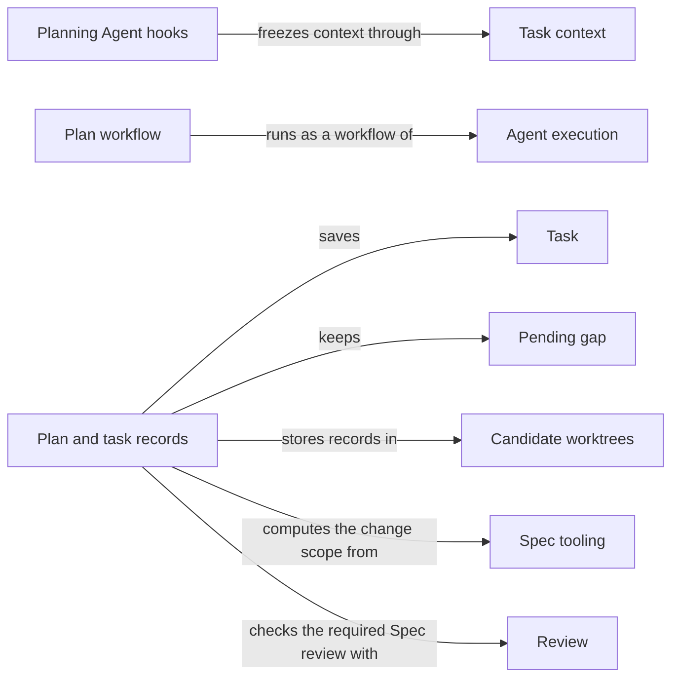

# Planning

## Purpose

Planning is the step before code changes. It judges whether a Module's Spec says enough for a
task, writes a plan for that task, and turns the accepted plan into acceptance tasks for a
programmer. It provides the Operations `concorde-context-solve`, `concorde-plan` and
`concorde-tasks`, and it owns two policies other stages rely on: the change scope, which says which
Modules one change may edit, and the pending gaps, which keep work from continuing past a Spec
problem that has not been repaired. Planning does not change code, review, decide readiness or start
implementation; the user session decides what happens next.

## Terminology

| Term | Definition |
| --- | --- |
| Context assessment | The Host-accepted judgement of whether the selected Module's Spec says enough to plan one particular task. |
| Plan | The accepted prose description of how to carry out one task for one Module, bound to that Module's Spec revision and to the task as stated. |
| Task | One item of implementation work derived from an accepted plan, with an identity, a target Module, a description, an acceptance condition and a completion flag. |
| Change scope | The Modules that one change owned by a Module may edit, because changing that Module can require them to change with it. |
| Pending gap | A blocker recorded in a candidate for one Module, work scope and step, which stops that step and the later planning and implementation steps until the revision it was recorded against changes. |
| [Host](../vocabulary.md#concept.concorde.host) | |
| [Spec context](../vocabulary.md#concept.concorde.spec-context) | |
| [Implementation context](../vocabulary.md#concept.concorde.implementation-context) | |
| [Task context](../vocabulary.md#concept.concorde.task-context) | |
| [Agent](../agents/module.md#concept.agents.agent) | |
| [Candidate](../harness/worktrees/module.md#concept.worktrees.candidate) | |
| [Issue](../issues/module.md#concept.issues.issue) | |
| [Blocker](../issues/module.md#concept.issues.blocker) | |
| [Required review](../review/module.md#concept.review.required-review) | |

The three stage words follow each other: a sufficient context assessment admits a plan, and an
accepted plan admits tasks. The word "task" has a second, everyday use in requests: the `task`
field is the plain statement of the work the user session wants done. A Task in the sense above is
one item of the list derived from a plan.

## Usage

All three Operations take `target_id`, `task`, and optionally `focus_id`, `constraints` and
`change_id`. Call `concorde-context-solve` to learn whether the Spec is good enough for the task
without writing anything (also the way to check that a Spec edit closed a gap); `concorde-plan` to
get a plan, which runs an assessment first and a planner only if it is sufficient; and
`concorde-tasks` after a plan is accepted. Plan and tasks write into a
[candidate](../harness/worktrees/module.md#concept.worktrees.candidate); assessment only reads.

`concorde-plan` returns a prepared workflow call that the user session invokes and polls. A fresh
context assessor reads the Module's [Spec context](../vocabulary.md#concept.concorde.spec-context)
and answers; when the Host accepts a **sufficient** **context assessment**, a fresh planner writes
the **plan**, which the Host saves in the candidate bound to the current Spec revision and the task
as stated. `concorde-tasks` returns a prepared Agent call; the task author proposes a list of
**tasks**, each with an identity, a target, a description, an acceptance condition and
`complete: false`. The Host accepts only a nonempty list of new, incomplete tasks whose
targets lie in the change scope. Every Agent receives the Spec context, its
[implementation context](../vocabulary.md#concept.concorde.implementation-context) as names only,
and a [task context](../vocabulary.md#concept.concorde.task-context) of the request, the plan and the
used task identities. A worked example is in the [design notes](design.md).

The **change scope** of a Module holds the Module itself; the Modules it contains or uses; every
Module whose Spec context selects one of its documents; the owner and participants of every
contract it defines or participates in; every Module whose declarations reference a node it defines;
and every Module that binds one of its files. It is one level deep and derived from declarations,
because such Modules may have to change together; the exact rule is in the
[planning reference](workflow.md#change-scope-computation).

A task for another Module of the change scope is planned and implemented for that Module in the
owner's candidate. Such a request is admitted only as a component request, whose task and
constraints equal the component task derived from the owner's current tasks; any other request for
a Module that does not own the candidate is refused.

An assessment ends `sufficient`, `spec_incomplete` (the assessor reports the missing promise as an
[Issue](../issues/module.md#concept.issues.issue) and returns a [blocker](../issues/module.md#concept.issues.blocker)
naming the blocked step), `unsupported` or `conflicting`; a failed run is an execution failure.

A blocker accepted inside a candidate becomes a **pending gap**: it blocks the same step and the
later planning and implementation steps until the Spec (for code steps, also the code) it was
recorded against changes and an accepted result without blockers clears it. Repeating the call does
not clear it, and clearing it never closes the Issue.

Before any Agent starts, the Host refuses with `review_required` (a
[required review](../review/module.md#concept.review.required-review) of the Spec is not current),
`spec_incomplete` (a pending gap), `missing_change`, `missing_plan`, `stale_context` (the Spec
changed since the plan) or `incompatible_handoff` (the task differs from the plan's). A rejected
plan or task list leaves the accepted ones unchanged. `concorde-tasks` can replace an accepted list
from the current blocking code review (`repair_review`) or when the programmer cannot meet its
acceptance conditions (`repair_task_scope`); see the [planning reference](workflow.md#task-record).

## Design

Each of the three answers is useful alone. Assessing first turns a missing promise into a visible gap instead of an assumption hidden in a
plan, and keeping implementation contents away from these Agents stops existing code from quietly
becoming the Spec. The Agents have no write, shell or delegation tools; their reads are limited by
instruction and by the capsule they start in, not by the operating system.

Agent execution's native driver prepares and verifies each call; Planning's hooks supply the stage
inputs, check the business rules and write the accepted result. The plan workflow's step table is in
the [planning reference](workflow.md#the-plan-workflow). A plan is bound to the Spec
revision and task it was written for, task identities are never reused, and pending gaps are bound
to a revision rather than a time or count, so the only way past one is to change what it was
recorded against. The reasons are in the [design notes](design.md).

The **Planning declarations** are the catalog entries and guidance of the three Operations.

The **Planning Agent hooks** implement the hooks of the context assessor, the planner, the task
author and the plan workflow.

The **plan workflow** is the authored pi workflow script, its Host-step script and the Host services
behind those steps, which are moving from the Harness package into Planning's own package.

The **plan and task records** code checks prerequisites, validates tasks, writes plans and tasks
into the change record, computes the change scope, admits component requests and keeps pending gaps.

The **Planning tests** cover assessment, planning and task authoring with scripted native runs and
test doubles.

## Relationships

**Operations** catalogs every [Operation](../operations/module.md#concept.operations.operation).
Planning declares its three in the [Operation catalog](../operations/module.md#concept.operations.catalog)
and is reached only through their declared hooks.

**Request admission** checks each [capability request](../harness/admission/module.md#concept.admission.capability-request),
resolves the target, binds the workspace and wraps the outcome in the
[result envelope](../harness/admission/module.md#concept.admission.result-envelope). Planning returns every refusal through that envelope.

**Task context** freezes a [context snapshot](../harness/context/module.md#concept.context.snapshot)
of the target for each Agent in its [phase](../harness/context/module.md#concept.context.phase),
delivers it as a [capsule](../harness/context/module.md#concept.context.capsule) and rechecks it
before acceptance. Planning adds its records only as [stage inputs](../harness/context/module.md#concept.context.stage-input),
and rejects a proposal whose snapshot changed.

**Agent execution** runs each [Agent call](../harness/execution/module.md#concept.execution.agent-call)
and the plan [workflow](../harness/execution/module.md#concept.execution.workflow) with its
[Host steps](../harness/execution/module.md#concept.execution.host-step) under the
[Host-step protocol](../harness/execution/interfaces.md#contract.execution.host-step). Planning
implements the [Agent hook](../harness/execution/module.md#concept.execution.agent-hook) and
[workflow hook](../harness/execution/module.md#concept.execution.workflow-hook) and writes nothing
until a [proposal](../harness/execution/module.md#concept.execution.proposal) passes the
[result gate](../harness/execution/module.md#concept.execution.result-gate).

**Agents** defines the assessor, planner and task author; Planning prepares each
[Agent](../agents/module.md#concept.agents.agent) from its [Agent definition](../agents/module.md#concept.agents.definition)
and never adds tools.

**Candidate worktrees** holds the [change status](../harness/worktrees/module.md#concept.worktrees.change-status)
of the [candidate](../harness/worktrees/module.md#concept.worktrees.candidate), where Planning stores
plans, tasks and pending gaps under its lock, and the [run records](../harness/worktrees/module.md#concept.worktrees.run-record)
of accepted runs; without a managed candidate, plan and tasks are refused.

**Spec tooling** resolves the target and its revision from the [registry](../spec/module.md#concept.spec.registry),
provides the [impact indexes](../spec/module.md#concept.spec.impact-index) behind the change scope
and the [structural checks](../spec/module.md#concept.spec.structural-check) behind the
collaboration pre-check, and registers Planning's record shapes as [typed values](../spec/module.md#concept.spec.typed-value).
An unresolved target or invalid project is a refusal, never an empty scope.

**Issues** records every gap an assessor reports as an [Issue](../issues/module.md#concept.issues.issue)
through its [report](../issues/module.md#concept.issues.report) service. Planning keeps each
[blocker](../issues/module.md#concept.issues.blocker), in the form of the [blocker contract](../issues/interface.md#contract.issues.blocker),
as a pending gap, and refuses a proposal citing a report not recorded during its run.

**Review** decides whether a [required review](../review/module.md#concept.review.required-review)
is current: Planning refuses the plan workflow and task author while the Module's required Spec
review is not, as [the Spec gate](../review/requirements.md#req.review.spec-gate) states. A repair
admits a [review result](../review/module.md#concept.review.result) in the [review result contract](../review/contracts.md#contract.review.result)
only as [repair feedback](../review/requirements.md#req.review.repair-feedback) allows, and passes
its blocking [findings](../review/module.md#concept.review.finding) to the task author.

Planning provides the [implementation task contract](workflow.md#contract.planning.implementation-task)
to Implementation: the accepted plan and tasks as the programmer receives them, and the rule that
derives each component's task.
