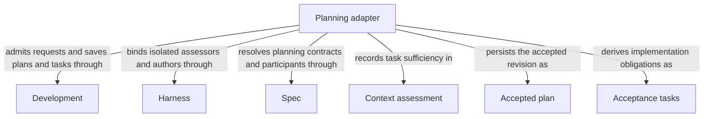

```concorde-document
{
  "id": "document.planning.module",
  "owner": "module.planning",
  "main_visible": true
}
```

# Planning

## Purpose

Planning assesses whether a selected Module contract supports a task, creates a revision-bound plan and derives implementation acceptance tasks. It serves admitted composing capabilities with separate assessment, plan and task contracts; no development-loop history is an implicit source of software meaning.

## Requirements

### req.planning.admitted-contract — Assess sufficiency before saving a plan

Planning SHALL persist a plan only after sufficient assessment of the selected current Module contract.

## Scenarios

### scenario.development.task-history-identities — Task authors receive reserved identities

- GIVEN a target may retain task lists from earlier repair rounds
- WHEN the Host invokes a fresh task author, including after replanning
- THEN its typed stage inputs include every retained historical task ID and, for a scope or code-review repair, every ID in the list being replaced
- AND those reserved IDs constrain identity only and add no software obligations or implementation contents
- AND returned tasks must be nonempty, internally unique, initially incomplete and disjoint from the reserved IDs
- AND a collision reports the conflicting IDs without rewriting the result, replacing tasks or discarding history

The independent contracts are [Assessment](assessment.md), [Plan](plan.md) and [Tasks](tasks.md).

## Ontology

### Entities

```concorde-entities
[
  {
    "id": "entity.planning.adapter",
    "title": "Planning adapter",
    "kind": "shared program",
    "responsibility": "Planning assesses whether a selected Module contract supports a task, creates a revision-bound plan and derives implementation acceptance tasks. It serves admitted composing capabilities with separate assessment, plan and task contracts; no development-loop history is an implicit source of software meaning.",
    "files": [
      "capabilities/context_solve.py",
      "capabilities/plan.py",
      "capabilities/tasks.py",
      "tests/concorde/development/test_review.py"
    ]
  },
  {
    "id": "entity.planning.development",
    "title": "Development",
    "kind": "used module",
    "target_id": "module.development",
    "responsibility": "Admit bound assessment, plan and task requests, save accepted current plans and task artifacts, and preserve prior state on rejected output."
  },
  {
    "id": "entity.planning.harness",
    "title": "Harness",
    "kind": "used module",
    "target_id": "module.harness",
    "responsibility": "Freeze Spec-only inputs and run separate isolated context assessors, planners and task authors without implementation contents or project writes."
  },
  {
    "id": "entity.planning.spec",
    "title": "Spec",
    "kind": "used module",
    "target_id": "module.spec",
    "responsibility": "Resolve the selected complete Module contract, declared participant relationships and file names used to assess and plan the task."
  },
  {
    "id": "entity.planning.assessment",
    "title": "Context assessment",
    "kind": "record",
    "responsibility": "Task-specific sufficiency or attributed limitation."
  },
  {
    "id": "entity.planning.plan",
    "title": "Accepted plan",
    "kind": "record",
    "responsibility": "Nonempty intent and Spec-revision-bound plan persisted by the host."
  },
  {
    "id": "entity.planning.tasks",
    "title": "Acceptance tasks",
    "kind": "record",
    "responsibility": "Current implementation obligations with unique reserved-history-safe IDs."
  }
]
```

### Relationships



## Dependencies and composition

```concorde-dependencies
[
  {
    "target_id": "module.development",
    "responsibility": "Admit bound assessment, plan and task requests, save accepted current plans and task artifacts, and preserve prior state on rejected output.",
    "selection_condition": "When an assessment enters or a returned plan or task list is accepted or rejected.",
    "relied_upon_promises": [
      "[Host admission](../development/interfaces.md#capability-execution-boundary); Recheck admitted intent and returned identities before accepting host state; a rejected result cannot advance the dependent step."
    ]
  },
  {
    "target_id": "module.harness",
    "responsibility": "Freeze Spec-only inputs and run separate isolated context assessors, planners and task authors without implementation contents or project writes.",
    "selection_condition": "Before invoking the context assessor, planner or task author, including admitted repair task authoring.",
    "relied_upon_promises": [
      "[Complete context selection](../harness/context.md#contract.context.selection); Supply only mode-admitted inputs and require a matching completion; unavailable enforcement stops execution without a wider grant."
    ]
  },
  {
    "target_id": "module.spec",
    "responsibility": "Resolve the selected complete Module contract, declared participant relationships and file names used to assess and plan the task.",
    "selection_condition": "When selecting planning inputs, checking local dependency declarations or rechecking the plan revision.",
    "relied_upon_promises": [
      "[Owner and context resolution](../spec/registry.md#stable-id-spec-context-queries); Reconstruct current resolutions after input changes; unresolved ownership, missing required definitions or stale revisions block dependent use."
    ]
  }
]
```

## Realization and reuse limits

This Module and its consumers are siblings under Concorde Framework. Declared files explicitly
share the existing adapter realization with Development; no new runtime package, public Skill,
Agent grant or configurable arbitrary flow is created by this Spec boundary. Host admission,
phase artifacts and permissions remain mandatory. A new flow requires declared composition and
an implementation of its sequencing, artifact admission, recovery and completion policies before
it can execute. The existing host package still realizes common dispatch and provider internals.
