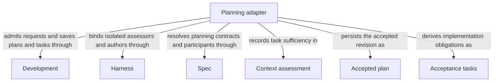

# Planning

## Purpose

Planning assesses whether a selected Module contract supports a task, creates a revision-bound plan and derives implementation acceptance tasks. It serves admitted composing capabilities with separate assessment, plan and task contracts; no development-loop history is an implicit source of software meaning.

## Usage

Consume Planning from a declared in-process capability, not a public Skill. First use
[context assessment](assessment.md) with the selected complete Module contract and explicit task.
A sufficient result permits [planning](plan.md); an accepted current nonempty plan permits
[task authoring](tasks.md). Supply current candidate identity and admitted artifact references where
required. Assessment produces no authored artifact, planning produces a revision-bound plan, and
task authoring produces a nonempty list of new, initially incomplete acceptance tasks.

Non-code phases see implementation names, not file contents, and do not infer missing software
meaning from code. A gap pauses the dependent step; a prohibition, contradiction or failed execution
has a distinct outcome. Empty plans, stale artifacts and reserved task-ID collisions preserve
previous accepted state without making it current. Tasks express implementation acceptance, not a
requirement that later host checks, review or delivery have already completed. Planning itself
neither implements work nor marks a candidate ready.

## Design

The [planning Flow](plan.md#design) checks local dependency declarations before
context assessment, admits a planner only after sufficiency, and persists a nonempty revision-bound
plan before tasks can be authored. The host then supplies reserved historical IDs and validates new
incomplete tasks before replacing accepted state. Separate artifacts prevent planning from being
mistaken for implementation completion or a later readiness decision.

Each non-code worker has a fresh complete Spec context without source contents. Dependency tasks
name declared children or used Modules; separately admitted component work, not a wider planner
grant, supplies their implementations. Existing host repair admission remains an adapter limit.

## Relationships

The diagram separates Planning's reusable outputs from the providers that admit and produce them.
Spec resolves the contract and declared participants; Harness isolates each non-code worker;
Development accepts and persists the returned state. Context assessment, Accepted plan and
Acceptance tasks are successive, distinct records, not three names for completed implementation.
A provider dependency does not make that provider a child of Planning or grant its code to a planner.

## Requirements

### req.planning.admitted-contract — Assess sufficiency before saving a plan

Planning SHALL persist a plan only after sufficient assessment of the selected current Module contract.

## Scenarios

### scenario.development.task-history-identities — Task authors receive reserved identities

- GIVEN a target may retain task lists from earlier repair rounds
- WHEN the Host invokes a fresh task author, including after replanning
- THEN its typed stage inputs include every retained historical task ID and, for a scope or code-review repair, every ID in the list being replaced
- AND those reserved IDs constrain identity only and add no software obligations or implementation contents
- AND returned tasks must be nonempty, internally unique, initially incomplete and disjoint from the reserved IDs
- AND a collision reports the conflicting IDs without rewriting the result, replacing tasks or discarding history

The independent contracts are [Assessment](assessment.md), [Plan](plan.md) and [Tasks](tasks.md).

## Dependencies and composition

### Development

Admit bound assessment, plan and task requests, save accepted current plans and task artifacts, and preserve prior state on rejected output.

This collaboration applies when an assessment enters or a returned plan or task list is accepted or rejected.

- [Host admission](../development/interfaces.md#capability-execution-boundary); Recheck admitted intent and returned identities before accepting host state; a rejected result cannot advance the dependent step.

### Harness

Freeze Spec-only inputs and run separate isolated context assessors, planners and task authors without implementation contents or project writes.

This collaboration applies before invoking the context assessor, planner or task author, including admitted repair task authoring.

- [Complete context selection](../harness/context.md#contract.context.selection); Supply only mode-admitted inputs and require a matching completion; unavailable enforcement stops execution without a wider grant.

### Spec

Resolve the selected complete Module contract, declared participant relationships and file names used to assess and plan the task.

This collaboration applies when selecting planning inputs, checking local dependency declarations or rechecking the plan revision.

- [Owner and context resolution](../spec/registry.md#stable-id-spec-context-queries); Reconstruct current resolutions after input changes; unresolved ownership, missing required definitions or stale revisions block dependent use.

## Realization and reuse limits

This Module and its consumers are siblings under Concorde Framework. Declared files explicitly
share the existing adapter realization with Development; no new runtime package, public Skill,
Agent grant or configurable arbitrary flow is created by this Spec boundary. Host admission,
phase artifacts and permissions remain mandatory. A new flow requires declared composition and
an implementation of its sequencing, artifact admission, recovery and completion policies before
it can execute. The existing host package still realizes common dispatch and provider internals.
