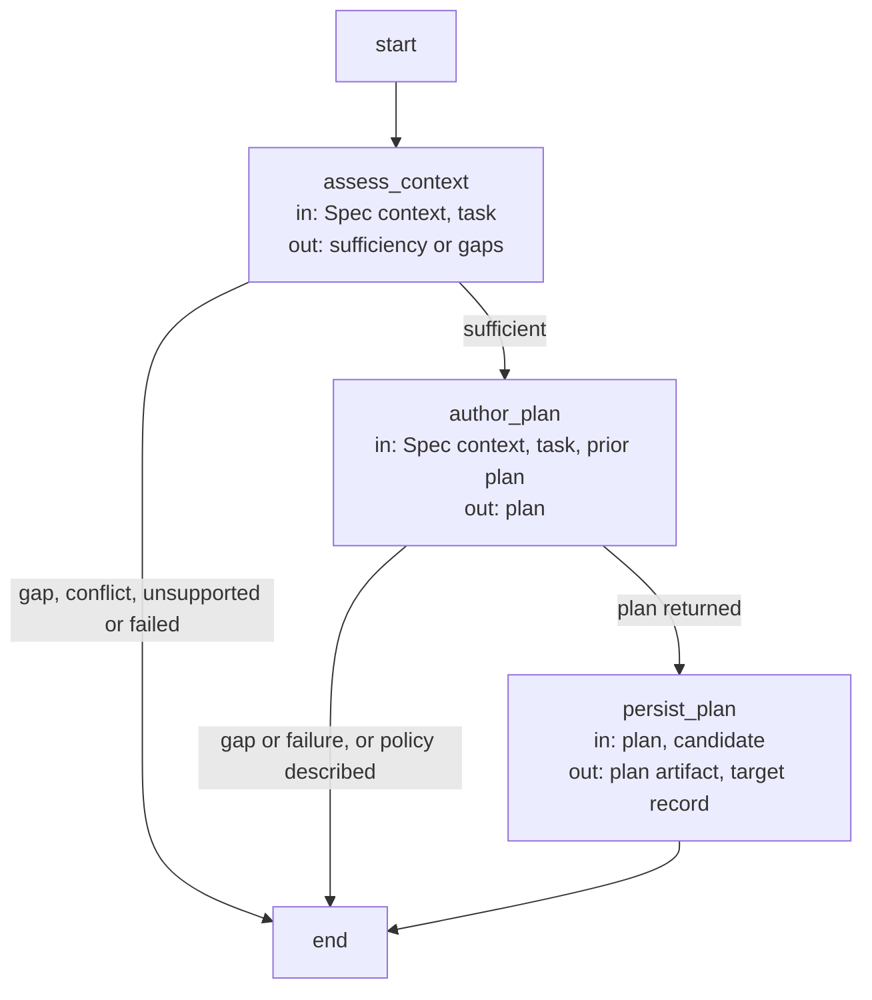

# Planning capability

The [common invocation envelope](../development/interfaces.md#capability-execution-boundary),
[typed handoffs](../development/interfaces.md#stage-handoffs) and
[gap rules](../development/review-and-gaps.md) apply. Artifact references are host-issued paths
and exact digests; a valid shape alone does not establish currentness or authority.
This is a private, bound capability in the [current adapter inventory](../development/capabilities.md).
Only a declared in-process composition can call it; direct Skill/CLI invocation is rejected.
A caller supplies the selected Module, task, constraints, focus and current candidate identity
where required. It cannot reselect context or forge saved artifacts. Spec context is complete,
file names are visible and implementation contents remain excluded from non-code phases.

`plan` first obtains the separate [assessment](assessment.md). Only a sufficient result admits a
fresh planner invocation. Its optional concorde-plan-artifact is an explicitly admitted
prior plan, not a predecessor conversation. The accepted output is a nonempty plan bound to the
selected contract revision and intent. The host stores the target plan and returns artifact references
in concorde-plan-response@2; the worker has no direct project writes. No task list, implementation,
review or readiness is produced by planning.

A coordinating plan identifies local work and exact direct child/used-Module IDs from its local
dependency declarations. It states their required behavior without pretending to read their code;
separately selected component work needs each component's complete contract and its own grant.
Empty or invalid plans are rejected without replacing accepted state. Gaps, conflicting contracts,
unsupported work, stale context and failed execution stop dependent planning. Relevant Spec or
intent changes invalidate reuse; a repeated consumer invocation may reuse only current accepted
artifacts. Planning can be consumed by any declared caller satisfying these preconditions, without
having to explain its purpose by reference to dev-loop.

## Design

### Planning Flow (`plan_flow`)

State: `route`, `output` (the planning response), `result`; the candidate record receives the
accepted plan, its Spec digest and intent.

| Node | Executes | in | out |
| --- | --- | --- | --- |
| `assess_context` | The deterministic dependency-declaration check, then one context-assessor invocation. | Spec context, task | sufficiency or gaps |
| `author_plan` | One planner invocation with an optional prior plan artifact. | Spec context, task, prior plan | plan |
| `persist_plan` | Deterministic: a nonempty plan replaces the target's plan and clears dependent tasks and coordination. | plan, candidate | plan artifact, target record |

## Precise specifications

The Planning Module owns the exact obligations and interface details in [requirements](requirements.md), [scenarios](scenarios.md).
These companions are part of the same complete Module specification, not separate topic owners.
