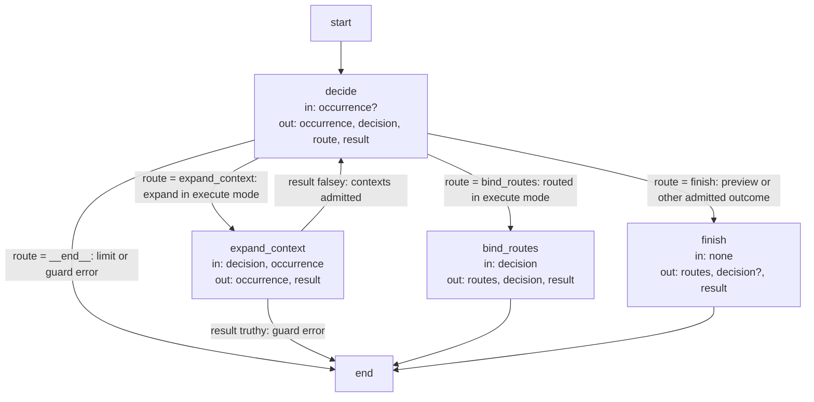
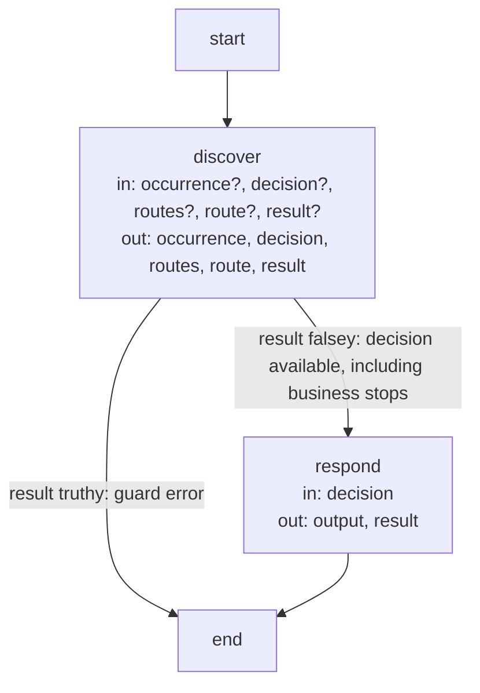

# Query and Routing execution and record contracts

These are the precise implementation agreements and executable Graph specifications owned by the
[Query and Routing Module](module.md). Explanatory topics introduce their purposes; exact identities, limits
and transitions are retained here as the single detailed contract.

## Terminology

| Term | Meaning / definition |
| --- | --- |
| [Module](../module.md#terminology) | Defined in Concorde Framework. |
| [Spec](../module.md#terminology) | Defined in Concorde Framework. |
| [Spec context](../harness/context.md#terminology) | Defined in What information a worker receives. |
| [Context](../module.md#terminology) | Defined in Concorde Framework. |
| [Host](../module.md#terminology) | Defined in Concorde Framework. |
| [Worker](../module.md#terminology) | Defined in Concorde Framework. |
| [Operation](../module.md#terminology) | Defined in Concorde Framework. |
| [Grant](../module.md#terminology) | Defined in Concorde Framework. |
| [Graph](../module.md#terminology) | Defined in Concorde Framework. |
| [Reference](../spec/registry.md#terminology) | Defined in Registry. |
| [Skill](../module.md#terminology) | Defined in Concorde Framework. |

## Query and routing Graphs {#query-and-routing-query-and-routing-graphs}

`concorde-main` accepts a question or task with optional routing hints. Main starts with the entry
Module's complete collection, then explicitly expands other Module collections
when needed. It identifies the owning target from admitted responsibilities and selection conditions.
It never reads implementation files or searches code to fill missing Module semantics.

For a query, Python resolves each explicitly selected Module's complete Spec context: every
owned or explicitly referenced document, including its inline diagrams. The discovery worker receives the original
source bodies directly and may reason across all selected Modules. Shared sources are included
once, with unique owners and per-Module inclusion reasons retained. Non-main documents stay complete.
Registered references expand once; included Modules' references and ordinary links do not expand further. Additional contexts require explicit
selection and deterministic host resolution. An operation that owns a mutation or lifecycle result
has one main route and preserves the task and constraints unchanged. For single-target review and
development requests the router returns only `target_id` and nullable `focus_id`; the host
copies the original task and ordered constraints into the admitted worker request. Legacy route
echoes remain accepted only when exactly equal. An explicit mismatch fails with
`incompatible_handoff` naming each mismatched `routes[index].task` or `.constraints` field, before
any worker starts. This binding does not relax target discovery, focus validation, context freshness
or read-only review authority.

A necessary missing promise returns a Spec gap with its target, context identity and blocked
question. A prohibition, contradictory requirements or execution error remains distinguishable
from a gap. Query completion returns an answer and limitations without authoring project files.
The concrete Concorde project routing tables belong to each Module's registered routing document.

The query Graph runs discovery-worker reasoning and direct answering without reading workers or a
separate synthesis stage. Discovery requests are AI control feedback: admitted target references
or an explicit target hint can select another complete context; when the sources suffice, the
answerer returns completed with its direct answer and no worker routes. A missing fact is
reported with its owning Module and current context identity rather than causing
unbounded context expansion. The loop records its configured limits and returns an explicit limit
outcome if additional discovery cannot be admitted. Human clarification creates a revised task or
context and starts fresh invocations under the Graph and Loop contract.

### Design {#query-and-routing-design}

#### Discovery Graph (`discovery_graph`) {#query-and-routing-discovery-graph-discovery-graph}

**State.** `occurrence` (the bounded number of discovery decisions so far), `decision` (the
discovery worker's last typed result), `routes` (the bound single-target routes), `route`, `result`.
All channels use replacement updates: `occurrence` is an integer, `decision` is worker-result
data or None, `routes` is a list, `route` is a node name and `result` is the guard envelope or None.
`decide` defaults a missing occurrence to zero. The admitted Module collection, task, registry and
context snapshots are Host-held; the collection grows only through `expand_context`, not by a
State reducer. The node table shows Graph-channel reads/updates, with `none` for Host-only inputs
and `?` for conditional updates. Admitted dispatch guards also write `result` and set `route` to
`__end__` on error. Standalone helper calls without those guards propagate exceptions.

**Nodes.**

| Node | Executes | in | out |
| --- | --- | --- | --- |
| `decide` | Invokes router, answerer or topology-designer over Host-admitted contexts; checks the decision bound before launch and selects route from the outcome/mode. | occurrence? | occurrence, decision, route, result |
| `expand_context` | Validates decision.expand_targets against Host-admitted text/hints and registry; adds contexts to the Host collection and increments occurrence. | decision, occurrence | occurrence, result |
| `bind_routes` | Validates decision.routes and binds original task/constraints from the Host; clears decision after binding. | decision | routes, decision, result |
| `finish` | Records completion outside State and writes empty routes; a non-ask policy preview with a target hint instead binds that hinted route and clears decision. | none | routes, decision?, result |

**Edges.** `decide` writes `route` from the worker's decision, and a conditional edge follows it: a
request for more Modules goes to `expand_context`, a routing decision to `bind_routes`, every other
outcome to `finish`, and an exhausted decision limit or an error ends the Graph. `expand_context`
returns to `decide` unless it recorded a failure in `result`, which ends the Graph. `bind_routes`
and `finish` always end the Graph. The pre-launch bound is `occurrence > number_of_modules`;
successful expansion increments it by one. Describe-policy selects `finish` regardless of the
worker outcome. Otherwise `expand` selects `expand_context`, `routed` selects `bind_routes`, and
all other admitted outcomes select `finish`. A business gap is still a `decision`, not a guard
`result`; the caller interprets it after discovery. `finish` normally preserves that decision.

#### Query Graph (`query_graph`) {#query-and-routing-query-graph-query-graph}

`concorde-main` runs this Graph for `ask` and `design-topology`.

**State.** The discovery state above plus `output` (the typed main response), all with replacement
updates. The registered `discover` subgraph shares `occurrence`, `decision`, `routes`, `route`
and `result`; its own table explains their reads/writes. Task/context inputs and any topology
proposal persistence belong to the Host. Neither a business gap nor a design proposal is a
new Graph channel.

**Nodes.**

| Node | Executes | in | out |
| --- | --- | --- | --- |
| `discover` | Registered discovery subgraph over the Host-bound question/design task and entry context; input lists the shared boundary channels. | occurrence?, decision?, routes?, route?, result? | occurrence, decision, routes, route, result |
| `respond` | Wraps decision as the main answer/stop response or typed topology proposal; the Host supplies task and context identity. | decision | output, result |

**Edges.** When the discovery subgraph finishes, a conditional edge reads `result`: a recorded
failure ends the Graph, otherwise `respond` turns the last decision into the main response and the
Graph ends.

## Main routing view {#query-and-routing-main-routing-view}

Select `module.harness` for context resolution, permission compilation, typed-value admission,
worker binding and Pi worker execution. Select `module.spec` for registry selection, structural
validation and initialization. Select `module.distribution` for build, installation and runtime
provisioning. Select `module.operations` for the Operation catalog and dispatch, and `module.issues` for recorded
feedback and gaps. The main router may use
these stable IDs to route a worker but may not expand their Module targets.

## Realization and reuse limits

This Module and its consumers are siblings under Concorde Framework. Its behavior is realized in
its own package `src/concorde/query_routing/`, bound by its adapter entity together with its `operations/` declaration; this Spec boundary
creates no public Skill, Agent grant or configurable arbitrary graph. Host admission, phase
artifacts and permissions remain mandatory. A new graph requires declared composition and an
implementation of its sequencing, artifact admission, recovery and completion policies before it
can execute. [Harness admission](../harness/admission.md) realizes the common entry and invocation
host, and [Operations](../operations/execution-reference.md#graphs-dispatch-graphs) the dispatch
that reaches this provider.
