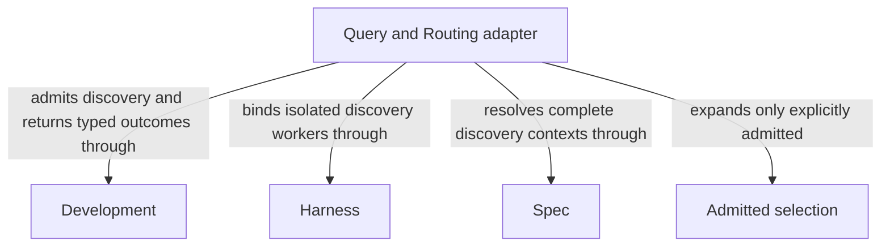

# Query and Routing

## Purpose

Query and Routing answers questions from explicitly selected complete Module contexts and selects one owning Module for a routed task. It serves the main entry and discovery consumers, preserving caller intent without reading implementation to infer behavior.

## Usage

Use `concorde-main` to ask a Spec-grounded question; composing discovery callers can request one
owning Module route for an unchanged task and constraints. Target/focus hints guide selection but
supply no additional reading authority. Discovery begins with the entry Module's complete context
and explicitly selects additional complete contexts only when needed. It does not inspect code to
invent missing behavior. Topology actions sharing the main entry have their own provider contract.

An answer includes limitations; a route retains the caller's task rather than rewriting it.
Missing necessary promises produce attributed gaps, contradictions and prohibitions remain
distinct, and exhausted discovery returns an explicit limit outcome. Queries author no files and
create no candidate. Human clarification requires fresh admitted input, not unbounded expansion.
See [query and routing](query-and-routing.md) for exact selection and outcome behavior.

## Design

The [discovery Flow](query-and-routing.md#discovery-flow-discovery_flow) alternates a fresh
discovery decision with deterministic admission of explicitly selected complete contexts. A router
returns identities; the host binds the original task and constraints rather than trusting rewritten
intent. An answerer can complete directly from the indexed/granted originals without reader-worker
summaries or a synthesis stage.

The [query Flow](query-and-routing.md#query-flow-query_flow) returns the last admitted decision.
Expansion limits and stop edges bound missing-context reasoning. Provider references expand once;
links and implementation files never become implicit discovery routes.

## Relationships

The diagram shows how an Admitted selection reaches a discovery worker. Spec resolves complete
Module contexts and their provenance, Harness binds the fresh worker to that selection, and
Development admits expansion and returns its typed outcome. Dependency arrows describe provider
use, not extra context: links, hints and provider implementation files are not implicit expansion
routes. The selected originals remain the source of the answer rather than generated summaries.

### Development

Admit question and routing requests, bound discovery expansion and return answers, routes or attributed stopping outcomes.

This collaboration applies when main answers a question or a discovery consumer requests owner selection.

- [Host admission](../development/interfaces.md#capability-execution-boundary); Recheck admitted intent and returned identities before accepting host state; a rejected result cannot advance the dependent step.

### Harness

Freeze explicitly selected complete contexts and run fresh isolated discovery-worker (answerer, router or topology-designer) invocations without code contents.

This collaboration applies at the initial discovery-worker call and each admitted discovery expansion.

- [Explicit complete-context discovery](../harness/contracts.md#context-global-spec-context-assembly); Supply only mode-admitted inputs and require a matching completion; unavailable enforcement stops execution without a wider grant.

### Spec

Resolve entry and explicitly selected Module contexts with unique document ownership, inclusion provenance and byte digests.

This collaboration applies when selecting discovery inputs, validating target/focus hints or resolving an additional admitted context.

- [Owner and context resolution](../spec/contracts.md#registry-stable-id-spec-context-queries); Reconstruct current resolutions after input changes; unresolved ownership, missing required definitions or stale revisions block dependent use.

## Realization and reuse limits

This Module and its consumers are siblings under Concorde Framework. Declared files explicitly
share the existing adapter realization with Development; no new runtime package, public Skill,
Agent grant or configurable arbitrary flow is created by this Spec boundary. Host admission,
phase artifacts and permissions remain mandatory. A new flow requires declared composition and
an implementation of its sequencing, artifact admission, recovery and completion policies before
it can execute. The existing host package still realizes common dispatch and provider internals.

## Precise specifications

The Query and Routing Module owns the exact obligations and interface details in [requirements](requirements.md), [scenarios](scenarios.md).
These companions are part of the same complete Module specification, not separate topic owners.
