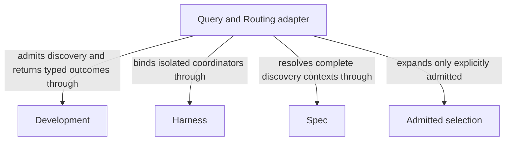

```concorde-document
{
  "id": "document.query-routing.module",
  "owner": "module.query-routing",
  "main_visible": true
}
```

# Query and Routing

## Purpose

Query and Routing answers questions from explicitly selected complete Module contexts and selects one owning Module for a routed task. It serves the main entry and discovery consumers, preserving caller intent without reading implementation to infer behavior.

## Requirements

### req.development.global-discovery — Coordinator discovers complete Module contexts

A Capability with discover context selection SHALL use its coordinator to discover complete Module Spec contexts.

### req.development.routing-hint-not-context — Routing hints only steer selection

A target or focus hint SHALL only steer selection.

### req.development.routing-hint-no-grant — Routing hints never grant context

A target or focus hint SHALL NOT itself grant context or replace explicit resolution.

## Scenarios

### scenario.development.answer-question — Direct answer from selected Module contexts

- GIVEN a question with an optional target or focus routing hint
- WHEN `concorde-main` runs with `action: ask`
- THEN the host deterministically resolves the explicitly selected Modules' complete Spec contexts, indexes each selected Module's original documents once and grants them read-only to the coordinator, and the coordinator opens them on demand and returns a direct answer
- AND the response contains no authored project file changes

See [routing hints only steer selection](#req.development.routing-hint-not-context) and
[routing hints never grant context](#req.development.routing-hint-no-grant).

### scenario.development.answer-gap — Missing promise reported as a Spec gap

- GIVEN the coordinator's selected complete Module contexts do not contain a promise the question needs
- WHEN the coordinator would otherwise have to guess or consult an unselected source
- THEN the response reports a Spec gap naming the blocked question, the owning Module and the current context identity
- AND the coordinator does not read implementation files or search code to supply the missing meaning

### scenario.development.discovery-limit — Discovery stops at its declared limit

- GIVEN repeated context expansion has not resolved the question
- WHEN the coordinator's bounded expansion-step limit is reached
- THEN the host returns the `context_limit` outcome instead of expanding context further


The detailed contract is [Complete-context question and route](query-and-routing.md).

## Ontology

### Entities

```concorde-entities
[
  {
    "id": "entity.query-routing.adapter",
    "title": "Query and Routing adapter",
    "kind": "shared program",
    "responsibility": "Query and Routing answers questions from explicitly selected complete Module contexts and selects one owning Module for a routed task. It serves the main entry and discovery consumers, preserving caller intent without reading implementation to infer behavior.",
    "files": [
      "capabilities/main.py",
      "tests/concorde/harness/test_scoped_protocol.py",
      "tests/concorde/harness/test_worktree_lifecycle.py"
    ]
  },
  {
    "id": "entity.query-routing.development",
    "title": "Development",
    "kind": "used module",
    "target_id": "module.development",
    "responsibility": "Admit question and routing requests, bound discovery expansion and return answers, routes or attributed stopping outcomes."
  },
  {
    "id": "entity.query-routing.harness",
    "title": "Harness",
    "kind": "used module",
    "target_id": "module.harness",
    "responsibility": "Freeze explicitly selected complete contexts and run fresh isolated coordinator ask or route invocations without code contents."
  },
  {
    "id": "entity.query-routing.spec",
    "title": "Spec",
    "kind": "used module",
    "target_id": "module.spec",
    "responsibility": "Resolve entry and explicitly selected Module contexts with unique document ownership, inclusion provenance and byte digests."
  },
  {
    "id": "entity.query-routing.selection",
    "title": "Admitted selection",
    "kind": "record",
    "responsibility": "Explicit complete Module contexts with unique source ownership and provenance."
  }
]
```

### Relationships



## Dependencies and composition

```concorde-dependencies
[
  {
    "target_id": "module.development",
    "responsibility": "Admit question and routing requests, bound discovery expansion and return answers, routes or attributed stopping outcomes.",
    "selection_condition": "When main answers a question or a discovery consumer requests owner selection.",
    "relied_upon_promises": [
      "[Host admission](../development/interfaces.md#capability-execution-boundary); Recheck admitted intent and returned identities before accepting host state; a rejected result cannot advance the dependent step."
    ]
  },
  {
    "target_id": "module.harness",
    "responsibility": "Freeze explicitly selected complete contexts and run fresh isolated coordinator ask or route invocations without code contents.",
    "selection_condition": "At the initial coordinator call and each admitted discovery expansion.",
    "relied_upon_promises": [
      "[Explicit complete-context discovery](../harness/context.md#global-spec-context-assembly); Supply only mode-admitted inputs and require a matching completion; unavailable enforcement stops execution without a wider grant."
    ]
  },
  {
    "target_id": "module.spec",
    "responsibility": "Resolve entry and explicitly selected Module contexts with unique document ownership, inclusion provenance and byte digests.",
    "selection_condition": "When selecting discovery inputs, validating target/focus hints or resolving an additional admitted context.",
    "relied_upon_promises": [
      "[Owner and context resolution](../spec/registry.md#stable-id-spec-context-queries); Reconstruct current resolutions after input changes; unresolved ownership, missing required definitions or stale revisions block dependent use."
    ]
  }
]
```

## Realization and reuse limits

This Module and its consumers are siblings under Concorde Framework. Declared files explicitly
share the existing adapter realization with Development; no new runtime package, public Skill,
Agent grant or configurable arbitrary flow is created by this Spec boundary. Host admission,
phase artifacts and permissions remain mandatory. A new flow requires declared composition and
an implementation of its sequencing, artifact admission, recovery and completion policies before
it can execute. The existing host package still realizes common dispatch and provider internals.
