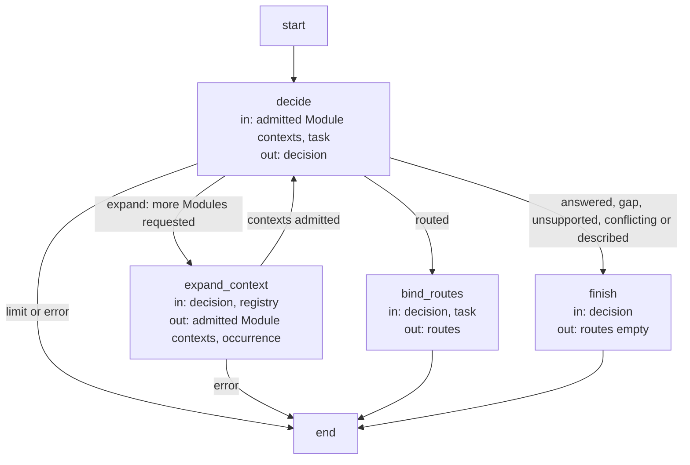
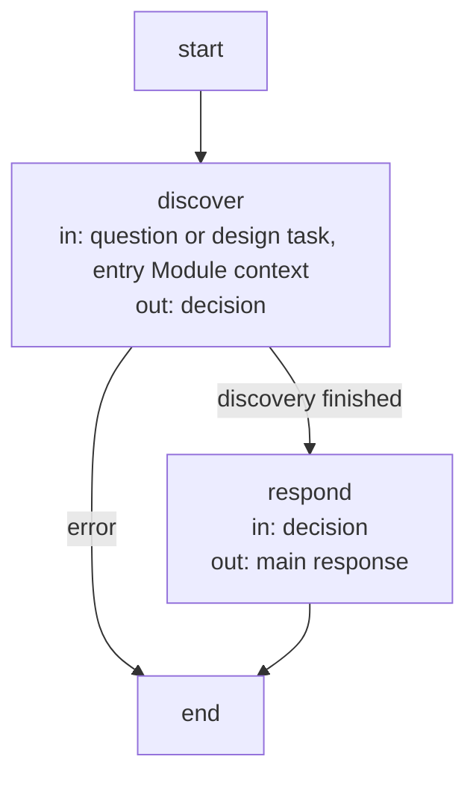

```concorde-document
{
  "id": "document.development.query-and-routing",
  "owner": "module.query-routing",
  "main_visible": true
}
```
# Query and routing Agent Flow

`concorde-main` accepts a question or task with optional routing hints. Main starts with the entry
Module's complete collection, then explicitly expands other Module collections
when needed. It identifies the owning target from admitted responsibilities and selection conditions.
It never reads implementation files or searches code to fill missing Module semantics.

For a query, Python resolves each explicitly selected Module's complete Spec context: every
owned or explicitly referenced document, including its inline diagrams. The discovery worker receives the original
source bodies directly and may reason across all selected Modules. Shared sources are included
once, with unique owners and per-Module inclusion reasons retained. Non-main documents stay complete.
Registered references expand once; included Modules' references and ordinary links do not expand further. Additional contexts require explicit
selection and deterministic host resolution. A capability that owns a mutation or lifecycle result
has one main route and preserves the task and constraints unchanged. For single-target review and
development requests the router returns only `target_id` and nullable `focus_id`; the host
copies the original task and ordered constraints into the admitted worker request. Legacy route
echoes remain accepted only when exactly equal. An explicit mismatch fails with
`incompatible_handoff` naming each mismatched `routes[index].task` or `.constraints` field, before
any worker starts. This binding does not relax target discovery, focus validation, context freshness
or read-only review authority.

A necessary missing promise returns a Spec gap with its target, context identity and blocked
question. A prohibition, contradictory requirements or execution error remains distinguishable
from a gap. Query completion returns an answer and limitations without authoring project files.
The concrete Concorde project routing tables belong to each Module's registered routing document.

The query Flow runs discovery-worker reasoning and direct answering without reading workers or a
separate synthesis stage. Discovery requests are AI control feedback: admitted target references
or an explicit target hint can select another complete context; when the sources suffice, the
answerer returns completed with its direct answer and no worker routes. A missing fact is
reported with its owning Module and current context identity rather than causing
unbounded context expansion. The loop records its configured limits and returns an explicit limit
outcome if additional discovery cannot be admitted. Human clarification creates a revised task or
context and starts fresh invocations under the Flow and Loop contract.

## Discovery Flow (`discovery_flow`)

State: `occurrence` (the bounded number of discovery decisions so far), `decision` (the
discovery worker's last typed result), `routes` (the bound single-target routes), `route`, `result`.
The admitted Module collection grows only through `expand_context`.

| Node | Executes | in | out |
| --- | --- | --- | --- |
| `decide` | One discovery-worker invocation (the router, answerer or topology-designer) over the admitted complete Module contexts; the decision limit is the number of Modules. | admitted Module contexts, task | decision |
| `expand_context` | Deterministic: admits the requested Modules named in the admitted Specs and counts the occurrence. | decision, registry | admitted Module contexts, occurrence |
| `bind_routes` | Deterministic: validates each route's target and focus and binds the original task and constraints to it. | decision, task | routes |
| `finish` | Deterministic: records completion for an answer, gap, unsupported or conflicting outcome, or the policy preview. | decision | routes (empty) |



## Query Flow (`query_flow`)

State: the discovery state above plus `output` (the main response). `concorde-main` runs this
Flow for `ask` and `design-topology`.

| Node | Executes | in | out |
| --- | --- | --- | --- |
| `discover` | The discovery Flow as a subflow. | question or design task, entry Module context | decision |
| `respond` | Deterministic: the answer, gap, unsupported or conflicting response, or the typed topology design, from the last decision. | decision | main response |


