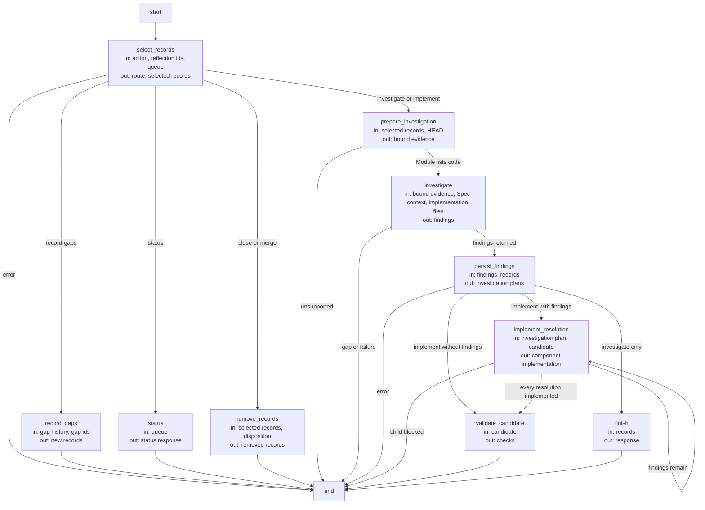

# Reflection investigation, implementation and disposition

A Reflection retains a problem, its observed effects, evidence, investigation and developer
comments. Investigation runs as read-only implementation with selected record bytes and HEAD; it
receives the selected Module's Spec context and the files its entities' listing entries bind, and no
write permission for those files. Code-writing tasks separately receive write permission for the
same entity-bound roots. The independent Spec Protocol standard is outside the registered Module
ownership available to a reflection investigation; a result that requires changing that standard
cannot be applied through this Module-bound investigation.

Reflection coordination executes as a [Flow](../harness/graphs-and-loops.md): record selection,
investigation, findings persistence, implementation handoffs and final validation have explicit
LangGraph nodes and transitions. Each selected resolution advances through a bounded iteration;
a blocked child prevents dependent work. Deterministic status and disposition operations remain
leaf nodes, and the Flow preserves the existing evidence, ownership and approval requirements.

### Investigation

#### scenario.reflections.investigate-reproduces — Investigation binds evidence and writes a plan

- GIVEN an existing Reflection report and the project's current HEAD
- WHEN investigate is invoked for that report
- THEN the host binds the exact selected record bytes and HEAD before reading them
- AND it preserves the original report and human comments
- AND it writes findings, a reproduction verdict, a route, an effort estimate and an evidence-bound resolution as a plan under the configured `plans_dir`
- AND the record moves into the bucket matching its completed triage sections in one deterministic action

Bucket-triage agreement, the non-reproduction disposition, the fast-loop effort limit, the
no-heading-injection rule and the investigation file boundary are Module requirements; see
[bucket-triage agreement](module.md#req.reflections.bucket-triage-agreement),
[non-reproduction disposition](module.md#req.reflections.non-reproduced-disposition),
[fast-loop effort limit](module.md#req.reflections.fast-loop-effort),
[no-heading-injection rule](module.md#req.reflections.no-heading-injection) and
[investigation file boundary](module.md#req.reflections.investigation-file-boundary).

#### scenario.reflections.investigate-stale-evidence — Stale evidence blocks investigation

- GIVEN a report whose selected record bytes or HEAD have changed since selection
- WHEN investigate is invoked
- THEN the call is rejected as stale
- AND the report and its existing progress remain available for a later attempt

A Module with no entity file listings is an unsupported code-investigation target. If a Module's
ownership of the needed code is unclear, a separately bound context-solving task can identify the
missing facts before investigation is retried.

### Implementation

#### scenario.reflections.implement-approved-plan — Implementation composes a fresh development task

- GIVEN a reproduced investigation, no outstanding human intervention and an approved route or plan
- WHEN implement is invoked
- THEN the host composes a fresh concorde-dev-loop using only the approved intended behavior
- AND investigation text, code and logs are excluded from its Spec-stage inputs
- AND a successful result marks the plan implemented while leaving the report's human disposition independent

#### scenario.reflections.implement-requires-current-approval — A changed resolution needs fresh approval

- GIVEN configuration requires approval and the resolution is new or has changed since it was last approved
- WHEN implement is invoked without a fresh approval
- THEN the call is rejected
- AND the previous approval is not reused for the changed resolution

### Disposition and merge

#### scenario.reflections.close-sets-disposition — An explicit human decision resolves or dismisses a report

- GIVEN a report with investigation findings recorded
- WHEN a developer invokes close with an explicit disposition and a `resolution_note`
- THEN the record's status becomes resolved or dismissed as decided
- AND the original observation and user comments remain preserved

#### scenario.reflections.close-rejects-mere-nonreproduction — Non-reproduction alone does not close a report

- GIVEN an investigation that reports a problem as not reproduced
- WHEN no explicit human disposition has been given
- THEN the report remains open

#### scenario.reflections.merge-after-checks — Merge removes disposed records after existing Git checks

- GIVEN resolved or dismissed records with a `resolution_note`
- AND the existing Git merge checks for the change pass
- WHEN merge is invoked
- THEN the deterministic removal deletes the records from their bucket
- AND Git history continues to preserve their content
- BUT the action performs no Git merge itself

Reflection record selection, status, investigation coordination, approval and disposition remain on
`module.reflections`; this Module has no separately registered child Module. When an approved
resolution becomes ordinary product work, its typed route selects the responsible target named by
the Reflection.

Approved implementation consumes [Development Flow](../dev-loop/development.md), a sibling provider; it supplies only approved intended behavior, requires current approval and retains ready-only completion without automatic delivery.

## Design

### Triage Flow (`triage_flow`)

State: `route`, `index` (the resolution being implemented), `output`, `result`. The reflection
queue records and the candidate's target record carry the durable state.

| Node | Executes | in | out |
| --- | --- | --- | --- |
| `select_records` | Deterministic: the action selects its operation; selected records must belong to the bound Module or its scenarios. | action, reflection ids, queue | route, selected records |
| `record_gaps` | Deterministic: promotes selected open gaps of the current change into pending records. | gap history, gap ids | new records |
| `status` | Deterministic: typed queue metadata for the Module. | queue | status response |
| `remove_records` | Deterministic: close or merge disposition removes eligible records. | selected records, disposition | removed records |
| `prepare_investigation` | Deterministic: binds the selected records and HEAD; a Module without code is unsupported. | selected records, HEAD | bound evidence |
| `investigate` | One investigator invocation over the bound evidence, read-only. | bound evidence, Spec context, implementation files | findings |
| `persist_findings` | Deterministic: writes the investigation result into the records; an implement action requires one consistent route. | findings, records | investigation plans |
| `implement_resolution` | One development Flow per finding in this candidate. | investigation plan, candidate | component implementation |
| `validate_candidate` | Deterministic validation of the candidate after every resolution. | candidate | checks |
| `finish` | Deterministic: the investigation response. | records | response |

