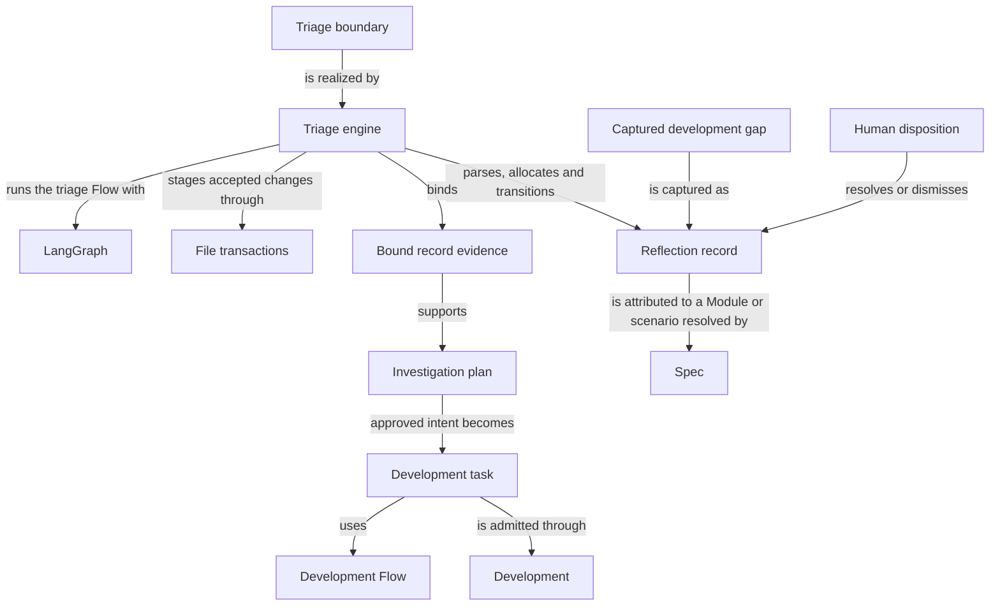

# Reflections

## Purpose

Reflections retains, investigates and resolves project feedback and persistent development gaps
that are explicitly attributed to one Module or scenario. Developers triaging a problem and the
automated development loop that turns an approved finding into a fresh task are its users. Its
promises stop at attribution, evidence-bound investigation and human disposition: it never decides
product behavior on a target Module's behalf, and an approved resolution runs as ordinary work on
that target rather than granting Reflections access to the target's Spec. A record survives
independently of whether any repair is ever attempted, and closing it always remains an explicit
human decision rather than an automatic consequence of investigation.

## Usage

Use `concorde-reflections-triage` to inspect or act on explicitly selected feedback attributed to
a Module or one of its scenarios. A Reflection retains a report and human comments independently
of any repair. Begin with status to obtain record metadata and, for a managed change, the host's
open gap IDs. Use record-gaps with an explicit nonempty gap selection to capture them; repeating
capture reuses the link, and capture neither resolves the gap nor approves implementation.

Investigation reads only the selected Module's granted code and binds its findings to current
record bytes and HEAD. Implementation requires a reproduced, current, approved resolution and
starts fresh development with the approved intent, not the investigation transcript. Closing a
report requires a human disposition; non-reproduction alone is not closure. Stale evidence or
foreign selection stops the action without borrowing another Module's access. Read
[selection and capture](interfaces.md) and [investigation and disposition](lifecycle.md) for the
request fields and outcomes. A code-free Module is not a supported code-investigation target.

## Design

The Triage boundary admits explicit record selections and actions to the Triage engine. Its
LangGraph [triage Flow](lifecycle.md#design) separates parsing, investigation, approved development
and disposition; File transactions applies accepted record changes with before-digest checks and
recovery. Status requests do not create records or begin repairs.

A Captured development gap links a blocked task to a persistent Reflection record without
resolving either one. Bound record evidence identifies the selected record bytes and HEAD for an
Investigation plan; changed evidence makes that plan stale. Attribution remains with the original
Module or scenario, and the record survives whether or not a repair is attempted.

Only approved intended behavior becomes a fresh Development task. The investigation transcript
and another Module's code access are not inherited. Human disposition independently resolves or
dismisses the Reflection record: capture, non-reproduction and successful implementation cannot
silently close it. Repeated capture reuses its explicit gap link instead of creating duplicate
reports.

## Relationships

The triage boundary is the only entry point; it is realized by the triage engine, which owns every
deterministic parsing, allocation and bucket transition. A captured development gap and an
investigation plan are the two ways a Reflection record gains new content, and a human disposition
is the only way its status changes to resolved or dismissed — observing that a problem stops
reproducing is not itself a disposition. Evidence binding happens once per investigation attempt;
stale bytes or a moved HEAD invalidate that attempt rather than being silently reused.

## Requirements

### req.reflections.no-implicit-capture — No mutation from read-only requests

A status or other read-only assessment request SHALL NOT create or modify a Reflection record.

### req.reflections.mutation-attribution — Explicit id attribution required for mutations

A report or gap mutation request SHALL require an explicit nonempty `reflection_ids` or `gap_ids`
list, with every id attributed to the selected target or one of its local scenario ids.

### req.reflections.stable-gap-ids — Gap record ids stay stable across retries

A `gap_records` id SHALL remain stable across context-only retries.

### req.reflections.host-assigned-gap-ids — Gap ids are host-assigned, not caller-supplied

A `gap_records` id SHALL NOT be calculated by the caller.

The id is allocated and returned by the host; a caller that computes its own id and expects it to
match is relying on an implementation detail, not a promise.

### req.reflections.no-borrowed-access — Resolution routing grants no target Spec access

Routing an approved resolution to its named target SHALL NOT grant this Module access to that
target's Spec.

### req.reflections.explicit-gap-selection — Gap capture requires an explicit nonempty selection

record-gaps SHALL require a nonempty explicit `gap_ids` list and `reflection_ids=[]`.

See the [gap-capture scenario](interfaces.md#scenario.reflections.capture-gap).

### req.reflections.no-implicit-gap-selection — No implicit select-all for gap capture

record-gaps SHALL NOT treat an omitted or empty `gap_ids` list as selecting every gap.

See the [rejection scenario](interfaces.md#scenario.reflections.reject-invalid-gap-selection).

### req.reflections.bucket-triage-agreement — Bucket assignment must match triage state

A record whose triage sections contradict its bucket, or that lies outside every bucket, SHALL be
rejected.

### req.reflections.non-reproduced-disposition — Non-reproduction requires human intervention

A non-reproduced investigation outcome SHALL recommend dismissal and require human intervention.

### req.reflections.fast-loop-effort — Fast-loop route requires small effort

A fast-loop route SHALL only be recommended together with small effort.

### req.reflections.no-heading-injection — No document heading injection in section values

An investigation section value SHALL NOT inject a document-level Markdown heading.

### req.reflections.investigation-file-boundary — Investigation reads only the target Module's files

Investigation SHALL read only the files listed by the selected Module's own entities.

## Scenarios

Scenario definitions for the public triage boundary — status, gap capture and their rejection
paths — are registered in [interfaces](interfaces.md). Scenario definitions for investigation,
implementation and disposition are registered in [lifecycle](lifecycle.md).

## Dependencies and composition

Development supplies common admission and gap history; Development Flow executes approved intended behavior as a fresh task. Investigation remains this Module's separately bound read-only invocation.

### Development

Supply common admission, investigation dispatch and explicit gap-history linkage.

Supply common admission, investigation dispatch and gap-history linkage.

This collaboration applies when admitting investigation or selecting recorded gaps.

- [Preserve invocation scope and typed results](../development/interfaces.md#capability-execution-boundary)
- [Capture only explicit attributed gaps](../development/review-and-gaps.md)

### Spec

Owns the project Spec model: the pinned Protocol binding, the explicit registry, structural validation, stable-ID file-set queries and honest initialization, and resolves Module and scenario identities for attribution.

Resolve Module and scenario identities for attribution.

This collaboration applies when admitting a record's owner or a selected local scenario identity.

- [Resolve the record to its unique scenario owner and reject foreign selection](../spec/registry.md#stable-id-spec-context-queries)

### Development Flow

Development Flow composes sibling providers to carry one intended change through Spec preparation, planning, tasks, implementation, validation and independent code review to a ready candidate. It owns that sequence, candidate lifecycle, bounded repair and stop policy, while each provider owns its own reusable contract.

Only after reproduction, no outstanding human intervention and current configured approval for the selected resolution.

- [Development Flow contract](../dev-loop/development.md); preserve its admission conditions, retain distinct blockers and do not infer wider authority from composition.

## Ownership, context and implementation status

Reference inclusion does not change a Reflection's definition owner or grant provider write/code access. An included provider defect retains the provider identity while evidence records the affected consumer and snapshot. Repair routes to the sole owner; dependent consumer gaps remain open until fresh assessment. Gap history and capture retain the complete source ownership and inclusion evidence for the consumer snapshot.
